## บทที่ 1

## บทนำ

ในบทนี้จะอธิบายถึงภาพรวมของระบบการบันทึกข้อมูลของอุปกรณ์ฮาร์ดดิสก์ไดรฟ์ (hard disk drive) เพื่อ เป็นการเตรียมความพร้อมให้ ผู้อ่านเข้าใจถึง พื้นฐานต่างๆ ที่เกี่ยวข้องกับระบบการบันทึก ข้อมูล แบบดิจิทัล รวมทั้งหลักการทำงานของกระบวนการเขียนและการอ่านข้อมูลในฮาร์ดดิสก์ไดรฟ์ ก่อน ที่อธิบายเกี่ยวกับการวิเคราะห์ระบบการประมวลผลสัญญาณและ การออกแบบวงจร ภาครับของฮาร์ด ดิสก์ไดรฟ์ในบทต่อไป

## 1.1 พื้นฐานของการบันทึกระบบแม่เหล็กแบบดิจิทัล

การบันทึกระบบแม่เหล็ก (magnetic recording) คือ การจัดเก็บข้อมูลบิตให้อยูในรูปของการเปลี่ยน แปลงระดับสภาพความเป็นแม่เหล็ก (mลgทetization) ในสื่อบันทึก ซึ่งสามารถแบ่งออกเป็น 2 แบบ [1] คือ แบบแอนะ ล็อก (analog) และ แบบดิจิทัล (digital) ในหนังสือเล่มนี้จะ พิจารณาเฉพาะ การ บันทึกระบบแม่เหล็กแบบดิจิทัลที่ใช้สำหรับฮาร์ดดิสก์ไดรฟ์เท่านั้น โดยที่ การบันทึกระบบแม่เหล็ก แบบติจิทัลจะใช้ประโยชน์จากสมบัติของความเป็นแม่เหล็กของวัสดุบางชนิด ที่เมื่ออยูในสถานะอิ่มตัว (saturated) แล้ว จะทำให้สภาพความเป็นแม่เหล็กในสื่อบันทึกมีทิศทางชี้ไปในทิศทางใดทิศทางหนึ่ง หรือในทิศทางตรงกันข้าม ซึ่งลักษณะการบันทึกข้อมูลแบบนี้ จะเหมาะสำหรับการเก็บข้อมูลดิจิทัลที มี 2 สถานะ คือ บิต "1" และบิต "0" หรือที่เรียกกันว่า "ข้อมูลไบนารี (binary data)" เพราะฉะนัน วัสดุเหล่านี้จึงถูกนำมาทำเป็นสื่อบันทึกเพื่อ เก็บข้อมูลไบนารี เนื่องจาก ข้อมูลในปัจจุบันส่วนมากจะ อยู่ในรูปของข้อมูลดิจิทัล เช่น ข้อมูลในเครื่องคอมพิวเตอร์ และ ข้อมูลที่รับส่งผ่านเครือข่ายอินเทอร์ เน็ต เป็นต้น นอกจากนี้ ข้อมูลแอนะล็อกก็สามารถที่จะถูกแปลงให้อยู่ในรูปของข้อมูลดิจิทัลได้เพื่อให้ ง่ายต่อการ จัดเก็บข้อมูล โดยผ่านขั้นตอนการกล้ำรหัส พัลส์ (PCM: pulse code modulation)[2] เพราะฉะนัน การบันทึกระบบแม่เหล็กแบบดิจิทัลจึงเหมาะสมกับการเก็บข้อมูลในปัจจุบัน

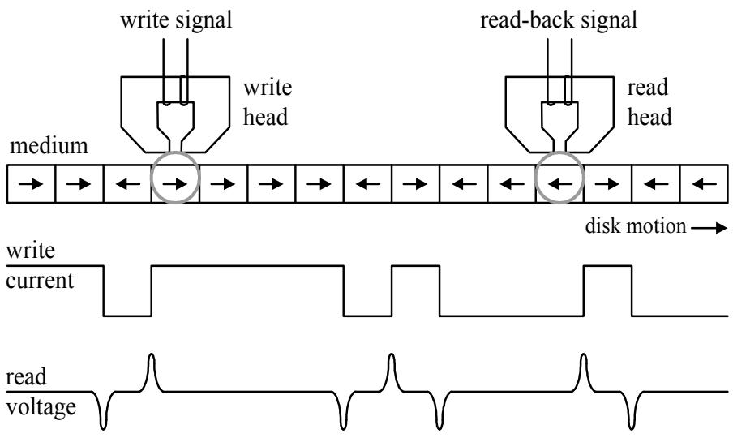  
รูปที่ 1.1: หลักการพื้นฐานของการบันทึ่กระบบแม่เหล็ก

ในปัจจุบันนี้ ความต้องการเนื้อที่ในการจัดเก็บข้อมูลของอุปกรณ์อิเล็กทรอนิกส์ต่างๆ ได้แก่ คอม พิวเตอร์, โทรศัพท์เคลื่อนที่, เครื่องเล่นเพลงแบบพกพา, และกล้องถ่ายรูปดิจิทัล เป็นต้น มีมากขึ้น เรื่อยๆ เทคโนโลยีการบันทึกระบบแม่เหล็ก แบบดิจิทัล ถือได้ว่าเป็น วิธีการหลักที่ใช้ในการจัดเก็บ ข้อมูลของงานประ ยุกต์ (application) ต่างๆ รวมไปถึง แผ่นบันทึกแม่เหล็ก (magnetic floppy disk), แถบบันทึกแม่เหล็ก (magnetic tape), ฮาร์ดดิสก์ไดรฟ์, แผ่นซีดี (CD: compact disc), และแผ่น ดีวีดี (DvD: digital versatile disc) เป็นต้น อย่างไรก็ตาม ทุกงานประยุกต์จะตั้งอยู่บนพืนฐานของ หลักการทำงานเดียวกันซึ่งเกี่ยวข้องกับ หัวอ่าน (read head), หัวเขียน (write head), และสื่อบันทึก แม่เหล็ก (magnetic media) ดังแสดงในรูปที่1.1 เมื่อ หัวอ่านและหัวเขียนแบบอินดักทีฟ (inductive head) จะทำมาจากสารแม่เหล็กรูปเกือกม้าที่มีค่าสภาพลบล้างแม่เหล็ก (cอะrcivity) ตำ และค่าสภาพ ให้ซึมผ่านได้ (permeability) สูง [1, 3] โดยจะมีขดลวดพันอยู่รอบๆ และสื่อบันทึกจะทำมาจากสาร แม่เหล็กที่มีค่าสภาพลบล้างแม่เหล็กสูง

ในหนังสือเล่มนี้ จะ กล่าวถึงเฉพาะ เทคโนโลยีการบันทึกข้อมูล 2 แบบ คือ การบันทึก แบบแนว นอน (longitudinal recording) และการบันทึกแบบแuวตัง (perpendicular recording) โดยที เทคโน โลยีการบันทึกแบบแนวนอนเป็นเทคโนโลยีที่ใช้ในการบันทึกข้อมูลของฮาร์ดดิสก์ไดรฟ์ตั้งแต่อดีตจน ถึงปัจจุบัน นั้นคือ สภาพความเป็นแม่เหล็กของสื่อบันทึกจะขนานกับระนาบของจานบันทึกแม่เหล็ก (magnetic disk) ดังที่แสดงในรูปที่1.1 ในขณะที่ เทคโนโลยีการบันทึกแบบแนวตั้งได้เริ่มที่จะนำมาใช้ สำหรับการบันทึกข้อมูลของฮาร์ดดิสก์ไดรฟ์ในปัจจุบัน โดยสภาพความเป็นแม่เหล็กของสื่อบันทึกจะ ตั้งฉากกับระนาบของจานบันทึกแม่เหล็ก ซึ่งในปัจจุบันนี้ งานวิจัยทางด้านเทคโนโลยีการบันทึกข้อมูล แบบแนวตั้งได้ดำเนินไปอย่างรวดเร็ว เพราะว่า เทคโนโลยีการบันทึกแบบแนวนอนเข้าใกล้ "ขีดจำกัด ซูเปอร์พาราแมกเนติก (superparamagnetic limit)" [1, 3, 4, 10] ทำให้ไม่สามารถเพิ่มความจุข้อมูล ของฮาร์ดดิสก์ไดรฟ์ได้มากกว่า 1 เทระไบต์ (TB: terabyte) นอกจากนี้เทคโนโลยีการบันทึกข้อมูล แบบแนวตั้งสามารถช่วย เพิ่มขนาดความจุข้อมูลของฮาร์ดดิสก์ไดรฟ์ได้หลายสิบเท่า เมื่อเทียบกับการ ใช้เทคโนโลยีการบันทึกข้อมูลแบบแนวนอน [3, 5]

## 1.2 แบบจำลองของระบบการจัดเก็บข้อมูลดิจิทัลในฮาร์ดดิสก์ไดรฟ์

ระบบการจัดเก็บข้อมูลดิจิทัล (digital data storage system) ในฮาร์ดดิสก์ไดรฟ์สามารถที่จะจำลองเป็น แผนภาพทั่วไปได้ ตามรูปที่ 1.2 เมื่อ บิตข่าวสาร (meรรage bits) จะ ถูกทำการเข้ารหัสโดย "วงจรเข้า รหัสแก้ไขข้อผิดพลาด (error-correction code (ECC) encoder)" โดยที่ รหัส RS (Reed Solomon code) [7, 8] เป็นรหัสที่นิยมนำมาใช้ในการเข้ารหัส แก้ไขข้อผิดพลาดของฮาร์ดดิสก์ไดรฟ์ในปัจจุบัน จากนั้น ข้อมูลที่เข้ารหัสแล้วก็จะถูกทำการเข้ารหัสอีกครั้งหนึ่งด้วย "วงจรเข้ารหัสมอดูเลชัน (modulation eทcoder)" เพื่อทำหน้าที่ในการปรับคุณสมบัติของข้อมูลให้เหมาะสมกับช่องสัญญาณของฮาร์ด ดิสก์ไดรฟ์ เช่น ทำให้ลำดับข้อมูล (data sequence) มีรูปแบบตามที่ต้องการ หรือทำให้ลำดับข้อมูลไม่ มีส่วนประกอบไฟฟ้ากระแสตรง (d.c. component) เป็นต้น รหัสที่นิยมใช้ในวงจรเข้ารหัสมอดูเลชัน คือ รหัส RLL (run-length limited code) [9] ข้อ มูลเอาต์พุตที่ได้จากวงจรเข้ารหัส มอดูเลชันจะถือ ว่าเป็นข้อมูลที่ จะ ถูกเขียนเข้าไปในสื่อบันทึก ซึ่งจะ เรียกกันว่า "บิตที่จะ ถูกบันทึก (recorded bit)"

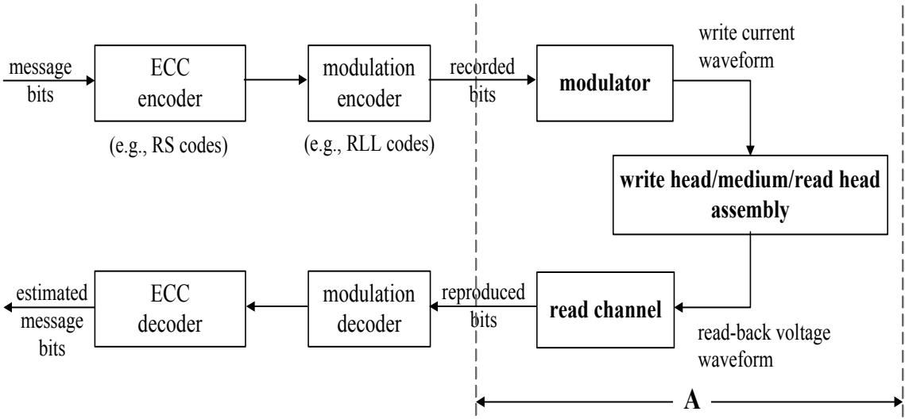  
รูปที่ 1.2: แบบจำลองั่วไปของระบบการจัดเก็บข้อมูลดิจิทัลในฮาร์ดคิสก์ไดรฟ์ [6]

หลังจากนั้น บิตที่จะ ถูกบันทึกก็จะถูกส่งไปยัง "วงจรมอดูเลเตอร์ (mอdนator)" เพื่อแปลงข้อมูลบิต ให้อยู่ในรูปคลื่นกระแสไฟฟ้าเขียน (พrite current waveform) จากนั้น รูปคลื่นกระแสไฟฟ้าเขียนก็ จะถูกป้อนไปยังหัวเขียน เพื่อทำการเขียนข้อมูลลงไปในสื่อบันทึก

สำหรับขั้นตอนในการอ่านข้อมูล หัวอ่านจะทำการอ่านข้อมูลจากสื่อบันทึก เมื่อหัวอ่านเคลื่อนที่ มาถึงบริเวณที่มีการเปลี่ยนแปลงสภาพความเป็นแม่เหล็ก1 (ดูรูปที่ 1.1) จะได้ผลลัพธ์ ออกมาเป็น สัญญาณรูปคลื่นแรงดันไฟฟ้า ที่เรียกกันว่า "สัญญาณ read-back" จากนั้น สัญญาณ read-back ก็จะ ถูกส่งเข้าไปทำการประมวลผลในช่องสัญญาณอ่าน (read chลททel) ซึ่งประกอบไปด้วยส่วนประกอบ ต่างๆ ได้แก่วงจรกรองผ่านต่ำ (LPF: low-pass filter), วงจรชักตัวอย่าง (sampler หรือ analogto-digital converter), อีควอไลเซอร์ (equalizer), และ วงจรตรวจหา (detector) เป็นต้น โดย ข้อมูล์ เอาต์พุตที่ได้ก็จะ ถูกทำการถอดรหัสด้วย วงจรถอดรหัส มอดูเลชัน (modulation decoder) และ วงจร ถอดรหัสแก้ไขข้อผิดพลาด (ECC decอder) เพือหาค่าประมาณของบิตข่าวสารทีส่งมาจากต้นทาง

## 1.3กระบวนการเขียน

ในระหว่างกระบวนการเขียนข้อมูล [10] ข้อมูลบิตจะถูกแปลงให้อยู่ในรูปคลื่นกระแสไฟฟ้ารูปสี่เหลี่ยม (rectangular current waveform) ที่เรียกกันว่า "กระ แสไฟฟ้าเขียน (write current)" (ดูรูปที่1.1) โดยวงจรมอดูเลเตอร์ (modนโator) [1, 4] จากนั้น กระแสไฟฟ้าเขียนจะ ถูกป้อนไปยังขดลวดของหัว เขียน (write head) ทำให้เกิดเป็นสนามเขียนแม่เหล็ก (magnetic write feld) บริเวณช่องว่าง (gap) ระหว่างสื่อบันทึกกับหัวเขียน โดยทั่วไป สนามเขียน แม่เหล็กจะต้องมีขนาดหรือ ความเข้มมากกว่า สภาพลบล้างแม่เหล็กของสื่อบันทึก เพื่อที่จะได้สามารถทำให้สื่อบันทึก ณ บริเวณนั้นมีสภาพความ เป็นแม่เหล็กตามทิศทางของสนามเขียนแม่เหล็กที่ป้อนเข้าไป นอกจากนี้ การเปลี่ยนสถานะสภาพ ความเป็นแม่เหล็ก (magnetization transition)ของสื่อ บันทึก สามารถทำได้โดยการเปลี่ยนแปลง ทิศทางของสนามแม่เหล็กสำหรับเขียน (หรือทิศทางของกระแสไฟฟ้าเขียน) เพื่อให้สอดคล้องกับการ เขียนข้อมูลบิด 0 และบิต 1

ในทางปฏิบัติ ระบบการจัดเก็บข้อมูลดิจิทัลในฮาร์ดดิสก์ไดรฟ์จะใช้ "การบันทึกแบบไบนารี (binary recording)" นั่นคือ สภาพความเป็นแม่เหล็กที่อยูในสื่อบันทึกจะมีเพียง 2 ทิศทางเท่านั้น2 หรือ กล่าวอีกน้ยหนึ่งคือ ระบบสามารถบันทึกข้อมูลได้เพียง 2 ระดับ (หรือ 2 ค่า) เท่านัน ซึ่งต่างจาก การบันทึกข้อมูลของดีวีดี (DVD) ที่สามารถบันทึกข้อมูลได้หลายๆ ระดับ ทั้งนี้เป็นเพราะว่า โดยปกติ กระบวนการเขียนข้อมูลมีความไม่เป็นเชิงเส้น (กoกliทearity) อยู่พอสมควร ดังนั้น ถ้าทำการบันทึก ข้อมูลมากกว่า 2 ระดับลงไปในสื่อบันทึกของฮาร์ดดิสก์ไดรฟ์ ผลกระทบที่เกิดจากความไม่เป็นเชิงเส้น ก็จะยิ่งมีความรุนแรงมากขึ้น ซึ่งจะส่งผลทำให้ประสิทธิภาพรวมของระบบแย่ลงมาก [4]

## 1.4กระบวนการอ่าน

ในระหว่างกระบวนการอ่านข้อมูล [10] หัวอ่านจะทำการตรวจจับการเปลี่ยนแปลงฟลักซ์แม่เหล็ก (magnetic ปนx) ณ ตำแหน่งที่มีการเปลี่ยนสถานะสภาพความเป็นแม่เหล็ก ซึ่งเป็นผลทำให้เกิดเป็นสัญญาณ พัลส์แรงดันไฟฟ้าเหนี่ยวนำในขดลวด ตามกฎของฟาราเดย์ (Faraday'ร laพ) สำหรับบริเวณที่มีการ

เปลี่ยนสถานะ เอกเทศ (iรolated tranรition)หัวอ่านจะให้สัญญาณ พัลส์ แรงดันไฟฟ้า ที่เรียกกันว่า "สัญญาณ พัลส์ เปลี่ ยนสถานะ (transition pulse)" $g ( t )$ หรือ $- g ( t )$ โดยจะ ขึ้นอยู่กับทิศทางของ สภาพความเป็นแม่เหล็กในสื่อบันทึก (ดูรูปที่ 1.1)

สำหรับระบบการบันทึกแบบแนวนอน สัญญาณพัลส์เปลี่ยนสถานะ (หรือ สัญญาณพัลส์ Lorent zian) สามารถเขียนให้อยู่ในรูปของสมการทางคณิตศาสตร์ได้ คือ [4]

$$
g ( t ) = \frac { 1 } { 1 + \left( \frac { 2 t } { \mathrm { P W } _ { 5 0 } } \right) ^ { 2 } }\tag{1.1}
$$

เมื่อ $\mathrm { P W _ { 5 0 } }$ คือ ความกว้างของสัญญาณ พัลส์ $g ( t )$ วัด ณ ตำแหน่งที่สัญญาณพัลส์มีความสูงเป็น ครึ่งหนึ่งของความสูงสูงสุด และ สำหรับการบันทึก แบบแนวตั้ง สัญญาณพัลส์ เปลี่ยนสถานะจะมีรูป สมการ คือ [11]

$$
g ( t ) = \mathrm { { e r f } \left( \frac { 2 t \sqrt { l n 2 } } { P W _ { 5 0 } } \right) }\tag{1.2}
$$

เมื่อ $\ln ( \cdot )$ คือ ลอการิทึมธรรมชาติ (natural logarithm), erf() คือ ฟังก์ชันข้อผิดพลาด (error function) ซึ่งนิยามโดย er $\textstyle \mathrm { f } ( x ) = { \frac { 2 } { \sqrt { \pi } } } \int _ { 0 } ^ { x } e ^ { - t ^ { 2 } } d t$ , และ $\mathrm { P W _ { 5 0 } }$ คือ ความกว้างของพัลส์ $g ^ { \prime } ( t )$ หรือ อนุพันธ์ ของ $g ( t )$ วัด ณ ตำแหน่งที่สัญญาณพัลส์มีความสูงเป็นครึ่งหนึ่งของความสูงสูงสุด

ในระบบการบันทึก ข้อมูลของฮาร์ดดิสก์ไดรฟ์ ความหนาแน่นของการบันทึก แบบนอร์มอลไลซ์ (ND: normalized recording density) หรือ ความหนาแน่นของการบันทึกข้อมูล [4] จะนิยามโดย

$$
\mathrm { N D } = { \frac { \mathrm { P W } _ { 5 0 } } { T } }\tag{1.3}
$$

เมือ $T$ คือ คาบเวลาของข้อมูลหนึ่งบิต หรือที่เรียกกันว่า "บิตเซลล์ (bit cell)" ซึ่งจะเป็นตัวบ่งบอก ว่า บริเวณ $\mathrm { P W _ { 5 0 } }$ สามารถที่จะจัดเก็บข้อมูลได้จำนวนกี่บิด ดังนั้น ถ้ากำหนดให้ $T$ เป็นค่าคงที่เมื่อ ค่า $\mathrm { P W _ { 5 0 } }$ หรือ ND เพิ่มขึ้น ก็หมายความว่า ฮาร์ดดิสก์ไดรฟสามารถจุข้อมูลได้มากขึ้น รูปที่ 1.3 แสดงผลตอบสนองการเปลี่ยนสถานะสำหรับการบันทึกแบบแนวนอนและแบบแนวตั้ง ณ ระดับ ND ต่างๆ จะเห็นได้ว่า สัญญาณพัลส์เปลี่ยนสถานะของทั้ง 2 ระบบจะครอบคลุ่มช่วงเวลาหลายๆ บิตเซลล์ โดยเฉพาะอย่างยิ่ง เมื่อ ND มีค่าเพิ่มขึ้น หรืออาจจะกล่าวได้ว่า การแทรกสอดระหว่างสัญลักษณ์ e (ISI: intersymbol interference) ในสัญญาณ read-back จะ มีความรุนแรงมากขึ้น เมือ ND มีค่า สุทธิที่ได้ จะ รียกกันว่า "สัญญาณ พัลส์ไดบิต (dibit pulse)" หรือ "ผลตอบสนองไดบิต (dibit response)" [4] ซึ่งมีค่าเท่ากับ

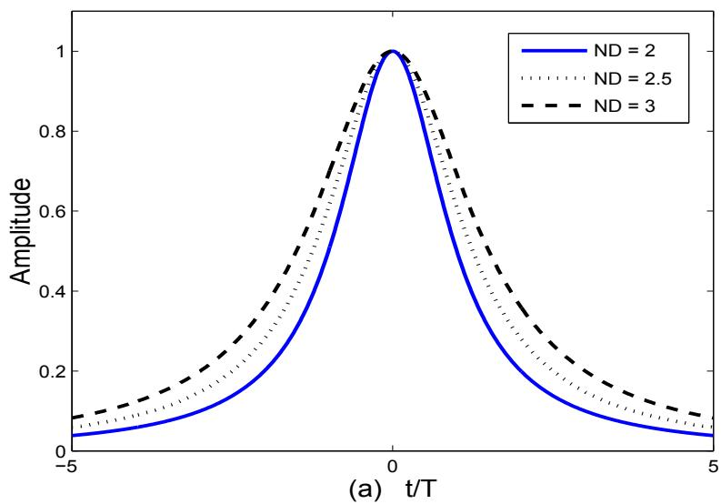

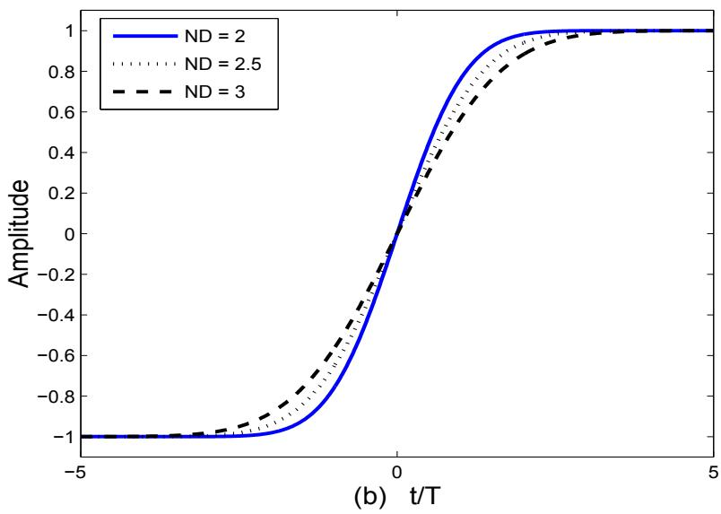  
รูปที่ 1.3: สัญญาณพัลส์เปลี่ยนสถานะ สำหรับการบันทึก (a) แบบแนวนอน และ (b) แบบแนวตั้ง  
เพิ่มขึ้น เนื่องจาก โอกาสที่สัญญาณพัลส์เปลี่ยนสถานะที่อยู่ไกล้กันจะมาซ้อนเหลื่อม (Overlap) กันมี ความเป็นไปได้สูง  
ในกรณีที่หัวอ่านเคลื่อนที่มาถึงบริเวณที่มีตำแหน่งการเปลี่ยนสถานะติดกัน $2 \oplus \tilde { \mathfrak { A } } \vartheta$ สัญญาณพัลส์

$$
m ( t ) = g ( t ) - g ( t - T )\tag{1.4}
$$

## ดังแสดงในรูปที่ 1.4

ถ้าใช้การแปลงฟูเรียร์ที่ต่อเนื่องทางเวลา (continuous-time Fourier transform) [12] กับสัญญาณ m(t) จะได้ว่า ผลตอบสนองเชิงความถี่(frequency response) ของ $m ( t )$ สำหรับระบบการบันทึก แบบแนวนอน คือ

$$
M ( \Omega ) = \exp \{ - \pi | \Omega | \mathrm { N D } \} ( 1 - \exp \{ - j 2 \pi \Omega \} )\tag{1.5}
$$

เมื่อ $\exp \{ \cdot \}$ คือ ฟังก์ชันเลขี้กำลัง (exponential function) ในขณะที่ ผลตอบสนองเชิงความถี่ของ m(t) สำหรับระบบการบันทึกแบบแนวตั้ง คือ

$$
M ( \Omega ) = \frac { T } { j \pi \Omega } \exp \left\{ - \frac { \pi ^ { 2 } \Omega ^ { 2 } \mathrm { N D } ^ { 2 } } { \ln ( 1 6 ) } \right\} ( 1 - \exp \{ - j 2 \pi \Omega \} )\tag{1.6}
$$

เมื่อ $\Omega = f T$ คือ ความถี่แบบนอร์มอลไลซ์ (normalized frequency), f คือ ความถี่ มีหน่วยเป็น เฮิรตซ์ (Hertz), xคือ ค่าสัมบูรณ์ (absolute value) ของ x, และ $j = \sqrt { - 1 }$ คือ หน่วยจินตภาพ (imadiทลry นnit) รูปที่ 1.5 แสดงผลตอบสนองเชิงความถี่ของสัญญาณพัลส์ไดบิต จะเห็นได้ว่า เมื่อ ND เพิ่มขึ้น รูปร่างของผลตอบสนองเชิงความถี่ของสัญญาณพัลส์ไดบิตทั้ง 2 แบบจะ ถูกบีบให้มา อยู่ณ บริเวณความถี่ต่ำ นอกจากนี้ ช่องสัญญาณของการบันทึกแบบแนวนอนจะมีสเปกตรัมค่าศูนย์ (spectral null) ณ ตำแหน่งที่ความถี $f = 0$ ซึ่งหมายถึง ไม่มีส่วนประกอบไฟฟ้ากระแสตรงในขณะที่ ช่องสัญญาณของการบันทึกแบบแนวตั้งจะมีส่วนประกอบไฟฟ้ากระแสตรง

หมายเหตุ ในหนังสือเล่มนี้ จะใช้โปรแกรม SCILAB3 [14] ในการวาดรูปกราฟของสัญญาณต่างๆ รวมทังผลการทดลองทีได้จากการทำการจำลอง (รimนโatioก)ระบบ ผู้อ่านควรที่จะ พยายามทดลอง วาดรูปกราฟต่างๆ ในหนังสือเล่มนี้ เพื่อที่จะได้ช่วยทำให้เข้าใจในบทเรียนมากยิ่งขึ้น

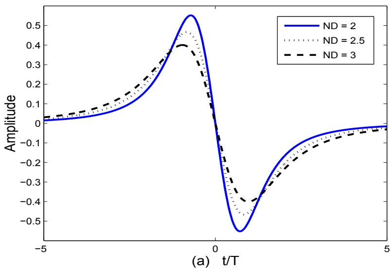

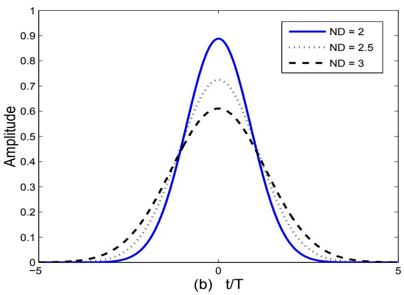  
รูปที่ 1.4: ผลตอบสนองไดบิต สำหรับการบันทึก (a) แบบแนวนอน และ (b) แบบแนวตั้ง

## 1.5 แบบจำลองช่องสัญญาณการบันทึกระบบแม่เหล็ก

โดยทั่วไป ช่องสัญญาณของระบบการบันทึกแม่เหล็กสามารถจำลองได้เป็น 2 แบบ คือ แบบจำลอง ช่องสัญญาณ เสมือน จริง (realistic channel model) และ แบบจำลอง ช่องสัญญาณ อุดมคติ (ideal channel model) โดยที่ แบบจำลองช่องสัญญาณเสมือนจริง [10] จะมีลักษณะการทำงานใกล้เคียงกับ ระบบจริง เนื่องจากประกอบไปด้วยทุกส่วนประกอบที่สำคัญที่มีอ ยู่ใน "สถาปัตยกรรมช่องสัญญาณ อ่าน (read-channel architecture)" [8, 10] ของฮาร์ดดิสก์ไดรฟ์ ในขณะที่ แบบจำลองช่องสัญญาณ อุดมคติมักจะนิยมใช้ในการศึกษา และวิเคราะห์พื้นฐานการทำงานของระบบการประมวลผลสัญญาณ ของฮาร์ดดิสก์ไดรฟ์ เนื่องจาก เป็นแบบจำลองที่ไม่ซับซ้อนและง่ายต่อการทำความเข้าใจ

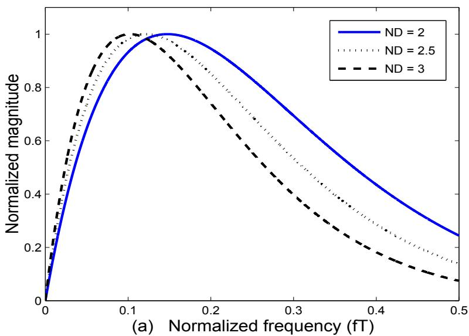

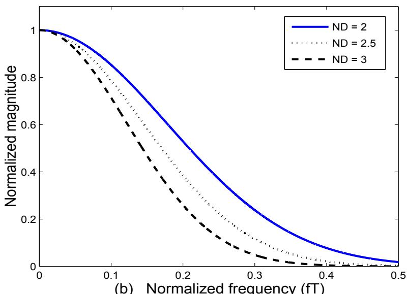  
(b) Normalized frequency (fT)  
รูปที่ 1.5: ผลตอบสนองเชิงความถี่ของสัญญาณพัลส์ไดบิต สำหรับการบันทึก (a) แบบแนวนอน และ

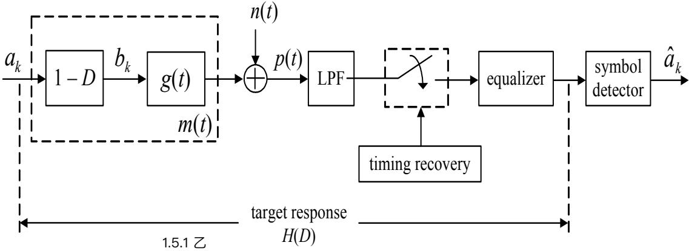  
รูปที่ 1.6: แบบจำลองช่องสัญญาณเสมือนจริง

## 1.5.1 แบบจำลองช่องสัญญาณเสมือนจริง

ส่วน A ในรูปที่ 1.2 สามารถที่จะแสดงให้อยู่ในรูปของแบบจำลองทางคณิตศาสตร์ได้ ตามรูปที่ 1.6 กล่าวคือ ลำดับข้อมูลอินพุตแบบไบนารี $a _ { k } \in \{ 0 , 1 \}$ ที่มีคาบเวลาของบิต (bit period) เท่ากับ T จะถูกส่งผ่านไปยังวงจรหาอ นุพันธ์อุดมคติ (ideal differentiator) $1 - D$ เมื่อ D คือ ตัวดำเนินการ หน่วงเวลา T หน่วย ทำให้ได้เป็นลำดับข้อมูลเปลี่ยนสถานะ $b _ { k } \in \{ - 1 , 0 , 1 \}$ เมื่อ $b _ { k } = \pm 1$ หมายถึง การเปลียนสถานะแบบบวก (positive transition)หรือแบบลบ (negative transition) และ $b _ { k } = 0$ หมายถึง ไม่มีการเปลี่ยนสถานะ ลำดับข้อมูลเปลี่ยนสถานะ $b _ { k }$ จะถูกส่งผ่านไปยังช่องสัญญาณที่ถูก แทนด้วยผลตอบสนองการเปลี่ยนสถานะ $g ( t )$ และถูกรบกวนด้วยสัญญาณรบกวน $n ( t )$ สัญญาณ read-back, $p ( t )$ , จะถูกกรองด้วยวงจรกรองผ่านตำ (LPF) เพื่อกำจัดสัญญาณรบกวนที่อยู่นอกแถบ ความถี (out-of-band noise) จากนั้น ก็จะ ถูก ทำการชักตัวอย่าง (sampling) ณ เวลาที่ถูก ควบคุม โดยระบบไทมม่งริดัฟเวอรี (timing recovery) ข้อมูลเอาต์พุตของวงจรชักตัวอย่างจะ ถูกส่งผ่านไปยัง อีควอไลเซอร์ และวงจรตรวจหาสัญลักษณ์ (symbol detector) เพื่อหาลำดับข้อมูลอินพุตที่เป็นไปได้ มากทีสุด (most likely input sequence) นันคือ หาค่าประมาณของ $a _ { k }$ หรือ $\hat { a } _ { k }$

วงจรตรวจหาสัญลักษณ์ที่นิยมใช้ในระบบการบันทึกแม่เหล็ก คือ “วงจรตรวจหาวีเทอร์บิ (Viterbi detector)" [15] อย่างไรก็ตาม เนื่องจาก ความซับซ้อน (complexity) ของวงจรตรวจหาวีเทอร์บิ จะ เพิ่มขึ้นแบบเลขชี้กำลัง ตามจำนวนหน่วยความจำของ ช่องสัญญาณ (channel memory) ดังนั้น อีควอไลเซอร์จึงเป็นสิ่งจำเป็นที่จะต้องถูกนำมาใช้งาน เพื่อ ทำหน้าที่ในการปรับรูปร่างผลตอบสนอง รวมของทั้งระบบให้เป็นผลตอบสนองที่ต้องการ ที่เรียกกันว่า "ผลตอบสนองทาร์เก็ต4 (target re-รponรe)" H(D) [4] และช่วยทำให้ความซับซ้อนของวงจรตรวจหาวีเทอร์บิลดลงได้ (ศึกษารายละเอียด เพิ่มเติมได้ในบทที่ 3)

## 1.5.2 แบบจำลองช่องสัญญาณอุดมคติ

ถ้าสมมุติให้ ระบบมีกระบวนศซรอิซันแบบสมบูรณ์ (perfect equalization) แบบจำลองในรูป ที่1.6 จะสามารถลดรูปได้เป็น แบบจำลองช่องสัญญาณอุดมคติ ดังแสดงในรูปที่ 1.7 โดยที่ ลำดับ ข้อมูลอินพุตแบบไบนารี $a _ { k }$ ที่มีคาบเวลาของ บิตเท่ากับ T จะ ถูกกล้ำสัญญาณ (modulate) กับ สัญญาณ พัลส์ในควิตส์ อุดมคติ (ideal Nyquist pulse) $q ( t ) = \sin ( \pi t / T ) / ( \pi t / T )$ [16] และถูก รบกวนด้วยสัญญาณรบกวน $n ( t )$ สัญญาณที่วงจรภาครับได้รับ $p ( t )$ จะถูกส่งผ่านไปยังวงจรกรอง ผ่านตำ เพื่อกำจัดสัญญาณรบกวนที่อยู่นอกแถบความถี จากนั้น ก็จะถูกทำการชักตัวอย่าง ณ เวลาที ถูกควบคุมโดยระบบไทมมิ่งริคัฟเวอรี จากนั้น ข้อมูลเอาต์พุตของวงจรชักตัวอย่างก็จะถูกส่งผ่านไปยัง วงจรตรวจหาสัญลักษณ์ เพื่อทำการหาลำดับข้อมูลอินพุตที่เป็นไปได้มากที่สุด

ทาร์เก็ตแบบผลตอบสนองบางส่วน หรือที่เรียกว่า "ทาร์เก็ตแบบ PR (partial response)" [17] ที่เป็นที่ยอมรับในการบันทึกแบบแนวนอน จะมีรูปสมการเป็น [4]

$$
H ( D ) = ( 1 - D ) ( 1 + D ) ^ { n }\tag{1.7}
$$

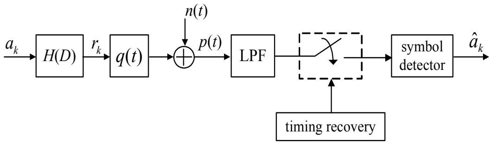  
รูปที่ 1.7: แบบจำลองช่องสัญญาณอุดมคติ

$$
H ( D ) = ( 1 + D ) ^ { n }\tag{1.8}
$$

เมื่อ ท คือ เลขจำนวนเต็มบวก จากสมการ (1.8) จะพบว่า ระบบการบันทึกแบบแนวตั้งจะไม่มีพจน์ (1 - D) ทั้งนี้เป็นเพราะว่า ช่องสัญญาณการบันทึกแบบแนวตั้งมีส่วนประกอบไฟฟ้ากระแสตรง (ดู รูปที่ 1.5) รูปที่1.8 เปรียบเทียบผลตอบสนองเชิงความถี่ของทาร์เก็ตแบบต่างๆ โดยที่ ตัวเลขที่อยู ในเครื่องหมายวงเล็บสี่เหลี่ยม [...] แสดงค่าสัมประสิทธิ์แต่ละแท็ปของทาร์เก็ต ตัวอย่างเช่น "PR4 [10 - 1]" หมายถึง ทาร์เก็ตแบบ PR4 (PR class-IV) ที่มีฟังก์ชันถ่ายโอนในโดเมน D [10] คือ $H ( D ) = 1 - D ^ { 2 }$ หรือ "EEPR2 [1 4 6 4 1]" หมายถึง ทาร์เก็ตแบบ EEPR2 ที่มีฟังก์ชันถ่ายโอน ในโดเมน D คือ $H ( D ) = 1 + 4 D + 6 D ^ { 2 } + 4 D ^ { 3 } + D ^ { 4 }$ เป็นต้น

จากรูปที่1.8 จะพบว่า เมื่อช่องสัญญาณมีค่า ND เพิ่มขึ้น ทาร์เก็ตที่ใช้ก็ควรที่จะมีจำนวนแท็ป มากขึ้น (มีค่า n มากขึ้น) เพื่อที่จะทำให้ผลตอบสนองทาร์เก็ตมีลักษณะไใกล้เคียงกับผลตอบสนอง ของ ช่องสัญญาณให้มาก ที่สุด ซึ่งจะ ส่งผลทำให้วงจรตรวจหาวีเทอร์บิทำงานได้อย่างมีประสิทธิภาพ มากขึ้น (ศึกษารายละเอียดเพิ่มเติมได้ในบทที่ 3) นอกจากนี้ จากสมการ (1.7) และ (1.8) จะ พบ ว่า ค่าสัมประสิทธิ์ ของทาร์เก็ตแบบ PR ทุกตัวจะเป็นเลขจำนวนเต็ม อย่างไรก็ตาม ถ้าใช้ทาร์เก็ตที่มี ค่าสัมประสิทธิ์เป็นเลขจำนวนจริง ซึ่งจะเรียกว่า "ทาร์เก็ตแบบ GPR (generalized partial response target)" ประสิทธิภาพรวมของระบบที่ได้จะมีมากกว่าการใช้ทาร์เก็ตแบบ PR [18, 19]

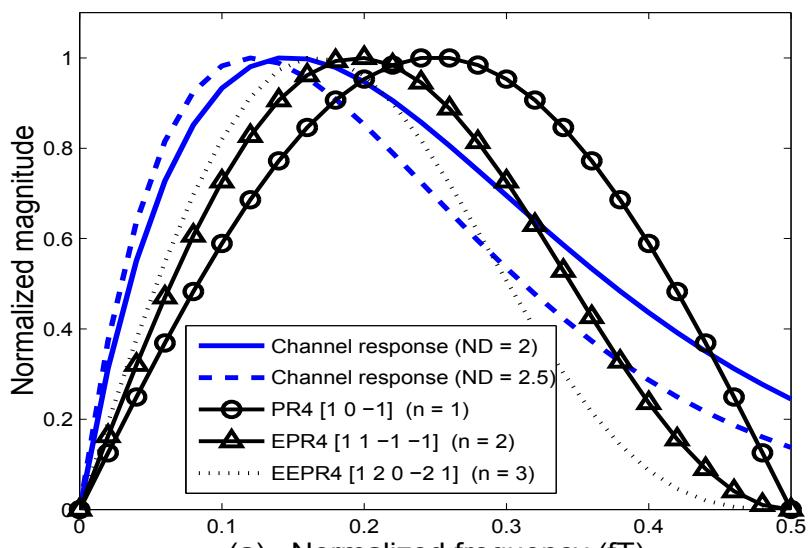  
(a) Normalized frequency (fT)

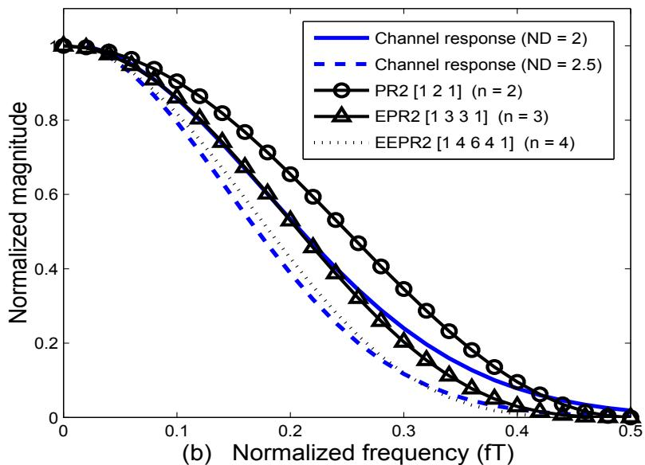  
รูปที่ 1.8: ผลตอบสนองเชิงความถี่ของทาร์เก็ตแบบต่างๆ สำหรับช่องสัญญาณการบันทึก (a) แบบ

## 1.6สรุปท้ายบท

ในบทนี้ได้กล่าวถึงพื้นฐานของการบันทึกระบบแม่เหล็กแบบดิจิทัล รวมทั้งหลักการทำงานของกระบวน การเขียนและการอ่านข้อมูลในอุปกรณ์ฮาร์ดดิสก์ไดรฟ์ นอกจากนี้ยังได้อธิบายถึงแบบจำลองการทำงาน ของฮาร์ดดิสก์ไดรฟ์ ทั้งแบบจำลองช่องสัญญาณเสมือนจริง และแบบจำลองช่องสัญญาณอุดมคติ โดยที่ แบบจำลองทั้งสองนี้จะถูกนำมาใช้ในการจำลองระบบ (system simนlatioก) ในบทต่อๆ ไป

เนื่องจาก การวิเคราะห์ระบบการประมวลผลสัญญาณของฮาร์ดดิสก์ไดรฟ์จะอาศัยพื้นฐานทางคณิต ส ศาสตร์ที่เกียวข้องกับการประมวลผลสัญญาณ และการสือสารดิจิทัลค่อนข้างมาก ดังนัน ผู้อ่านควรที่จะ ผี้ๆ.1.7 , ทบทวนความรูเหล่านี้ให้เข้าใจก่อนที่จะศึกษาหนังสือเล่มนี้ ซึ่งความรู้พื้นฐานทางคณิตศาสตร์ด้านต่างๆ ที่เกียวข้องกับการวิเคราะห์ระบบการประมวลผลสัญญาณของฮาร์ดดิสก์ไดรฟ์ สามารถทีจะศึกษาได้จาก หนังสือ "การประมวลผลสัญญาณสำหรับการจัดเก็บข้อมูลดิจิทัล เล่ม 1: พื้นฐานช่องสัญญาณอ่าน– เขียน"[10]

## 1.7 แบบฝึกหัดท้ายบท

1. จงอธิบายหลักการทำงานของการบันทึกระบบแม่เหล็ก

2. จงอธิบายข้อแตกต่างระหว่างระบบการบันทึกแบบแนวนอนและแบบแนวตั้ง

3. จงอธิบายหลักการเบื้องต้นของกระบวนการเขียนและการอ่านข้อมูลในฮาร์ดดิสก์ไดรฟ์

4. จงอธิบายหลักการทำงานของแบบจำลองช่องสัญญาณเสมือนจริง

5. จงอธิบายหลักการทำงานของแบบจำลองช่องสัญญาณอุดมคติ

6. จงยกตัวอย่างทาร์เก็ตแบบ PR สำหรับระบบการบันทึกแบบแนวนอนมาอย่างน้อย 4 ทาร์เก็ต

ะ 7. จงยกตัวอย่างทาร์เก็ตแบบ PR สำหรับระบบการบันทึ่กแบบแนวตังมาอย่างน้อย 4 ทาร์เกิต