## บที่ 2

## ไทมมิ่งริดัฟเวอรี

ในบทนี้ จะ อธิบายถึงความสำคัญของไทมมิ่งริคัฟเวอรี (timing recovery) พร้อมทั้งอธิบายหลักการ ทำงานของไทมมิงริดัฟเวอรีแบบที่ใช้กันทั่วไป (conventional timing recovery) ซึ่งอยู่บนพื้นฐานของ วงจรเฟสล็อกลูป (PLL: phaรed-โ๐ck l๐op) นอกจากนียังอธิบายถึง วิธีการออกแบบค่าพารามิเตอร์ ของวงจรเฟสล็อกลูป โดยใช้แบบจำลองการทำงานของวงจรเฟสล็อกลูปแบบเชิงเส้น (linลrized PLL model) รวมทังแสดงผลการทดลองเพื่อให้เห็นถึงความสำคัญของระบบไทมมิงริคัฟเวอรี

## 2.1บทนำ

ในปัจจุบันนี้ ความเจริญก้าวหน้าทางด้านเทคโนโลยีการสื่อสาร (communication) ได้พัฒนาไปอย่าง รวดเร็ว โดยเฉพาะอย่างยิ่งการสื่อสารดิจิทัลที่ใช้ในระบบต่างๆ เช่น ระบบโทรศัพท์เคลื่อนที่ และระบบ การประมวลผลสัญญาณภายในอุปกรณ์ฮาร์ดดิสก์ไดรฟ์ เป็นต้น เพราะฉะนั้น ความต้องการที่จะเพิ่ม ประสิทธิ ภาพโดยรวมของระบบจึงเป็นสิ่งที่จำเป็นมาก เพราะว่าจะได้สามารถรับและส่งข้อมลได้อย่าง น่าเชื่อถือมากยิ่งขึ้น

ในระบบสื่อสารดิจิทัล (digital communication system) การส่งสัญญาณจากต้นทางไปยังปลาย ทาง อุปกรณ์ต้นทางจะ ทำหน้าที่เปลี่ยนสัญญาณดิจิทัล (digital) ให้เป็นสัญญาณ แอนะล็อก (anar log) ก่อนที่จะ ถูกส่งออกไปยังปลายทาง เมื่อสัญญาณแอนะล็อกมาถึงที่อุปกรณ์ปลายทาง ก็จะ ถูกส่ง ไปยังวงจรชักตัวอย่าง (รampler) เพื่อทำการแปลงสัญญาณ แอนะล็อกให้กลับไปเป็นสัญญาณดิจิทัล ในรูปของ "ข้อมูลวิยุต (discrete data)"หรือ ที่เรียกกันว่า "แซมเปิล (sample)" การ ชักตัวอย่าง (sampliทg) สัญญาณแอนะล็อกทีผิดจังหวะจะทำให้เกิดผลเสียหายอย่างมากกับประสิทธิ ภาพโดยรวม ของระบบ ไทมมิ่งริคัฟเวอรีจะทำหน้าที่ในการเข้าจังหวะ (รynchronize) วงจรชักตัวอย่างกับสัญญาณ แอนะล็อกที่ได้รับ เพื่อให้ได้ข้อมูลแซมเปิลที่ดีที่สุดออกมา ก่อนที่จะนำข้อมูลแซมเปิลเหล่านั้นไปทำ การประมวลผลขั้นต่อไป เช่น ส่งต่อไปยังอีควอไลเซอร์ (equalizer) และวงจรถอดรหัส (decoder) เป็นต้น ดังนั้นไทมมิ่งริคัฟเวอรีจึงนับได้ว่าเป็นองค์ประกอบที่ความสำคัญมากอย่างหนึ่งในระบบสื่อสาร ดิจิทัล เพราะว่า ถ้าวงจรชักตัวอย่างทำงานไม่ดี ก็จะส่งผลทำให้ข้อมูลแซมเปิลที่ได้ไม่มีคุณภาพหรือ มีข้อผิดพลาดมาก และ เมื่อส่งข้อมูลแซมเปิลเหล่านี้ไปยังอีควอไลเซอร์และวงจรถอดรหัส ก็จะ ทำให้ ผลลัพธ์ที่ได้มีข้อผิดพลาดมาก นั้นคือ อัตราข้อผิดพลาดบิต (BER: bit-error rate) ของระบบจะมีค่า สูงซึ่งเป็นสิ่งที่ควรจะหลีกเลี่ยง

โดยทั่วไปไทมมิ่งริดัฟเวอรีจะทำงานอยู่บนพื้นฐานของวงจรเฟสล็อกลูป (PLL) [4] ซึ่งประกอบไป ด้วย วงจรตรวจหาข้อผิดพลาดทางเวลา (TED: timing error detector), วงจรกรองลูป (loop filter), และวงจร VC0 (voltage-controlled oscillator) ในทางปฏิบัติ โครงสร้างของไทมมิงริคัฟเวอรีจะมีอยู 2 รูปแบบ คือ แบบนิรนัย (deductive) และแบบอุปนัย (inductive) โดยจะขึ้นอยูกับว่า ข้อมูลทางเวลา ถูกดึงออกมาใช้ณ ตำแหน่งก่อนหรือหลังวงจรชักตัวอย่าง ไทมมิ่งริคัฟเวอรีแบบนิรนัย (deฝแctive timing recovery) จะดึงข้อมูลทางเวลา ที่เรียกกันว่า "timing tone"[16] จากสัญญาณแอนะล็อกที ด้านขาเข้าของวงจรชักตัวอย่าง ตามรูปที่ 2.1 โดยที่ วงจร PLL ถูกนำใช้เพื่อลดผลกระทบของไทมมิ่ง จิตเตอร์1 (timing jitter)ที่แฝงอยู่ในสัญญาณแอนะล็อก ในขณะที่ ไทมมิ่งริคัฟเวอรีแบบอุปนัย (inductive timing recovery) จะใช้วงจร PLL แบบป้อนกลับ (feedback) เพื่อทำหน้าที่ในการดึงข้อมูล ทางเวลาจากสัญญาณแอนะล็อก ที่ด้านขาออกของวงจรชักตัวอย่าง ดังที่แสดงในรูปที่ 2.2 ข้อดีของ ไทมมิ่งริคัฟเวอรีแบบอุปนัย คือ ทุกส่วนประกอบของไทมมิ่งริคัฟเวอรีแบบนี้สามารถที่จะถูกสร้างให้ เป็นแบบดิจิทัลได้ เนื่องจาก ไทมมิ่งริคัฟเวอรีแบบอุปนัยเป็นที่นิยมใช้งานกันมาก ดังนั้น ในหนังสือ เล่มนี้จะเรียกไทมิ่งริดัฟเวอรีแบบนี้ว่า "ไทมมิ่งริดัฟเวอรีแบบที่ใช้กันทั่วไป (conventional timing

## 2.2. ไทมิ่งริดัฟเวอรีแบบที่ใช้กันทั่วไป

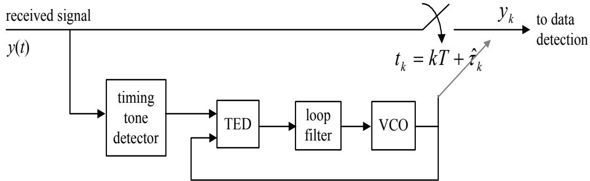  
รูปที่ 2.1: ไทมมิ่งริศัฟเวอรีแบบนิรนัย

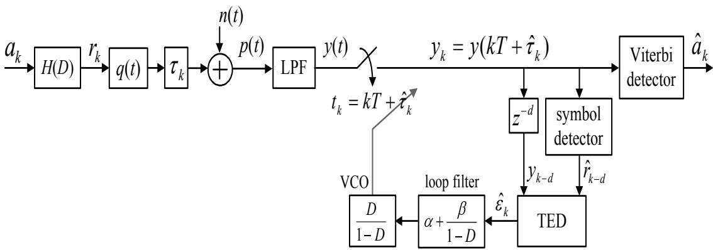  
รูปที่ 2.2: แบบจำลองช่องสัญญาณอุดมคติ พร้อมกับไทมมิ่งริคัฟเวอรีแบบอุปนัย

recovery)" สำหรับรายละเอียดเกี่ยวกับไทมมิ่งริดัฟเวอรีแบบนิรนัยสามารถศึกษาเพิ่มเติมได้จาก [20]

## 2.2 ไทมมิ่งริดัฟเวอรีแบบที่ใช้กันทั่วไป

พิจารณาแบบจำลองช่องสัญญาณอุดมคติ (ideal chanทel model) ในรูปที่ 2.2 ลำดับข้อมูลอินพุต $a _ { k } \in \{ \pm 1 \}$ ซึ่งมีคาบเวลาของบิด T ถูกส่งผ่านไปยังช่องสัญญาณ $\begin{array} { r } { H ( D ) = \sum _ { k = 0 } ^ { \nu } h _ { k } D ^ { k } } \end{array}$ โดยที่ $h _ { k }$ คือ ค่าสัมประสิทธิ์ตัวที่ k ของช่องสัญญาณ, D คือ ตัวดำเนินการหน่วงเวลา (delay operator), และ

ν คือ หน่วยความจำของช่องสัญญาณ ดังนั้น สัญญาณ read-bลck สามารถเขียนเป็นสมการได้ คือ

$$
p ( t ) = \sum _ { k } r _ { k } q ( t - k T - \tau _ { k } ) + n ( t )\tag{2.1}
$$

โดยที่ $\begin{array} { r } { r _ { k } = \sum _ { i } a _ { k - i } h _ { i } } \end{array}$ คือข้อมูลเอาต์พุตของช่องสัญญาณที่ปราศจากสัญญาณรบกวน, $q ( t ) =$ sin $( \pi t / T ) / ( \pi t / T )$ คือ ฟังก์ชันซิงก์ (sinc function) หรือสัญญาณพัลส์ไในควิตส์ (Nyquist pulse) ที่มีแบนด์วิดท์เกินเป็นศูนย์ (zero-excess-bandwidth) [16], $\tau _ { k }$ คือ ออฟเซตทางเวลาที่ไม่ทราบค่า (unknown timing offset) ตัวที k, และ $n ( t )$ คือ สัญญาณรบกวนเกาส์สี ขาวแบบบวก (AพGN: additive white Gaussian noise) ที่มีความหนาแน่นสเปกตรัมกำลัง (power spectrum density) แบบสองด้านเท่ากับ $N _ { 0 } / 2$ ในหนังสือนี้ ออฟเซตทางเวลา $\tau _ { k }$ จะถูกจำลองให้มีลักษณะ เป็น "การ เดินแบบสุ่ม2 (random walk)" ซึ่งนิยามโดย [21]

$$
\tau _ { k + 1 } = \tau _ { k } + w _ { k }\tag{2.2}
$$

เมื่อ $w _ { k }$ คือ ตัวแปรสุ่มเกาส์เซียuแบบ i.i.d. (independent and identically distributed) ที่มีค่าเฉลี่ ย (mean) เท่ากับค่าศูนย์ และมีค่าความแปรปรวน (variance) เท่ากับ $\sigma _ { w } ^ { 2 }$ หรือเขียนแทนได้ด้วย Wk \~ $\mathcal { N } ( 0 , \sigma _ { w } ^ { 2 } )$ โดยค่า $\sigma _ { w }$ จะเป็นตัวกำหนดระดับความรุนแรงของไทมมิ่งจิตเตอร์

ที่วงจรภาครับ สัญญาณ read-back จะ ถูกส่งผ่านไปยังวงจรกรองผ่านต่ำ3 (LPF) ที่มีผลตอบสนอง อิมพัลส์เท่ากับ $q ( t ) / T$ นั่นคือ มีความถี่ตัด (cut-off frequency) เท่ากับ $1 / ( 2 T )$ เพื่อทำหน้าที่กำจัด สัญญาณรบกวนที่อยู่นอกแถบความถี่ (out-of-baทd ทoise) จากนั้น ก็จะทำการชักตัวอย่างสัญญาณ read-back ที่เวลา $k T + \hat { \tau } _ { k }$ เพื่อทำให้ได้เป็นข้อมูลแซมเปิล

$$
y _ { k } = y ( k T + \hat { \tau } _ { k } ) = \sum _ { i } r _ { i } q ( k T + \hat { \tau } _ { k } - i T - \tau _ { i } ) + n _ { k }\tag{2.3}
$$

## 2.2. ไทม่งริดัเอรีแบบที่ใช้กันทั่วไป

เมื่อ $\hat { \tau } _ { k }$ คือ ค่าประมาณของ $\tau _ { k }$ หรือทีเรียกว่า ออฟเซตทางเฟส (phase offset) ตัวที k ของการ ชักตัวอย่าง, และ $n _ { k }$ คือ AพN ที่มีค่าเฉลี่ยเท่ากับค่าศูนย์และค่าความแปรปรวนเท่ากับ $\sigma _ { n } ^ { 2 } = $ $N _ { 0 } / ( 2 T )$ นั่นคือ $n _ { k } \sim \mathcal N ( 0 , \sigma _ { n } ^ { 2 } )$

วงจร TED จะทำหน้าที่ในการคำนวณหาค่าประมาณของข้อผิดพลาดทางเวลา (timing error) $\epsilon _ { k }$ $= \tau _ { k } - \hat { \tau } _ { k }$ ซึ่งก็คือ ค่าความไม่ตรงกันระหว่างเฟสของสัญญาณแอนะล็อกที่ได้รับกับเฟสของสัญญาณ นาพิกาของวงจร PLL ในทางปฏิบัติแล้ว วงจร TED มีหลายประเภท [4] โดยจะขึ้นอยู่กับลักษณะ การนำข้อมลที่ด้านขาเข้าของวงจร TED มาใช้งาน ซึ่งโดยทั่วไปแล้ว ประสิทธิภาพของไทมมิ่งริคัฟเวอรี จะขึ้นอยู่กับคุณภาพของวงจร TED ในหนังสือเล่มนี้จะพิจารณาเฉพาะวงจร TED ที่นิยมใช้งานกัน นันคือ วงจร TED แบบ Mueller and Müller หรือเรียกสันๆ ว่า M&M TED [24]ซึงจะคำนวณ หาค่าประมาณของข้อผิดพลาดทางเวลา ดังนี้

$$
\hat { \epsilon } _ { k } = K _ { T } \{ y _ { k } \hat { r } _ { k - 1 } - y _ { k - 1 } \hat { r } _ { k } \}\tag{2.4}
$$

โดยที่ $\hat { r } _ { k }$ คือ ค่าประมาณของ $r _ { k }$ $K _ { T }$ คือ ค่าคงตัว (constant) ที่ถูกใช้เพื่อทำให้มั่นใจได้ว่า $E [ \hat { \epsilon } _ { k } | \epsilon ]$ $\qquad = \ \epsilon$ เมื่อระดับอัตราส่วนค่ากำลัง เฉลี่ย ของสัญญาณที่ต้องการต่อค่ากำลังเฉลี่ย ของสัญญาณรบกาวน (SNR: signal-to-noise ratio) มีค่าสูง หรืออาจจะ กล่าวได้ว่า ค่า $K _ { T }$ ถูกนำมาใช้เพื่อทำให้ความชัน ของเส้นโด้งรูปตัวเอส (S-curve) [4] มีค่าเท่ากับค่าหนึ่ง ณ จุดกำเนิด, และ $E [ \cdot ]$ คือ ตัวดำเนินการ ค่าคาดหมาย (expectation operator) [10, 25, 26] จากสมการ (2.4) จะ เห็นได้ว่า ประสิทธิ ภาพ ซี ของวงจร TED จะ ขึ้นอยู่กับค่าตัดสินใจ (decision) $\left\{ \hat { r } _ { k } \right\}$ ดังนั้น ประสิทธิ ภาพของไทมมิ่งริคัฟเวอรี จะเป็นฟังก์ชันของความน่าเชื่อถือของค่าตัดสินใจและ รNR ที่ใช้ จึงเป็นเหตุผลว่า ทำไมวงจรตรวจหา สัญลักษณ์ (symbol detector) ที่ใช้ในไทมมิ่งริดัฟเวอรี คือ วงจรตรวจหาวีเทอร์บิ4 (Viterbi detector) [15] ที่มีปริมาณการหน่วงเวลาสำหรับการตัดสินใจ (decision delay) เท่ากับ dT หน่วย (เช่น d = 4) แทนการใช้งานวงจรตรวจหาขีดเริ่มเปลี่ยนแบบหลายระดับ (multi-level threรhold detector) [27]

หลังจากนัน ค่าประมาณของข้อผิดพลาดทางเวลา $\hat { \epsilon } _ { k }$ จะถูกส่งผ่านไปยังวงจรกรองลูป เพื่อกำจัด สัญญาณรบกวนที่แฝงอยู่ในสัญญาณข้อผิดพลาดทางเวลา และออฟเซตทางเฟส ของการชักตัวอย่าง (sampling phase offset) ตัวถัดไป $\hat { \tau } _ { k + 1 }$ ก็จะ ถูกปรับค่า (update) โดยวงจร PLL อันดับที่สอง

(second-order PLL) ตามความสัมพันธ์ดังนี้[4]

$$
\begin{array} { r c l } { \hat { \theta } _ { k + 1 } } & { = } & { \hat { \theta } _ { k } + \beta \hat { \epsilon } _ { k } , } \end{array}\tag{2.5}
$$

$$
\begin{array} { r c l } { \hat { \tau } _ { k + 1 } } & { = } & { \hat { \tau } _ { k } + \alpha \hat { \epsilon } _ { k } + \hat { \theta } _ { k + 1 } } \end{array}\tag{2.6}
$$

เมื่อ $\widehat { \theta } _ { k }$ คือ ค่าประมาณของข้อผิดพลาดทางความถี่ (frequency error) [27], และ α และ $\beta$ คือ พารามิเตอร์ของวงจร PLL [4] ซึ่งจะเป็นตัวกำหนด แบนด์วิดท์ของลูป (loop bandพidth) และอัตรา การลู่เข้า (convergence rate) กล่าวคือ ถ้าค่าพารามิเตอร์ของวงจร PLL ยิงมาก แบนด์วิดท์ของลูปก็ จะกว้าง ซึ่งจะทำให้อัตราการลู่เข้าก็จะเร็ว แต่สัญญาณรบกวนที่เข้ามาในวงจร PLL ก็จะมีมาก สำหรับ ในกรณีที่ ระบบมีเฉพาะข้อผิดพลาดทางเฟส (phase error) เท่านั้น วงจรภาครับอาจจะนำวงจร PLL อันดับที่หนึ่ง (frst-order PLL) มาใช้งานแทนวงจร PLL อันดับที่สองก็ได้ โดยที่ ออฟเซตทางเฟส ของการชักตัวอย่างตัวถัดไป $\hat { \tau } _ { k + 1 }$ จะถูกปรับค่าตามความสัมพันธุ์ดังนี้ [4]

$$
\hat { \tau } _ { k + 1 } = \hat { \tau } _ { k } + \alpha \hat { \epsilon } _ { k }\tag{2.7}
$$

โดยทั่วไป ไทมมิ่งริดัฟเวอรีจะทำงานเป็น 2 ภาวะ (mode) คือ

1) ภาวะ การได้มา (acqนiรition mode) จะทำงานในตอน เริ่มต้นของกระบวนการ เข้าจังหวะด้วย ความช่วยเหลือของแบบข้อมูล (data pattern) ที่เรียกว่า “preamble"[27]เนื่องจาก ไทมมิ่ง ริคัฟเวอรีรูแน่นอนว่า preamble มีลักษณะเป็นอย่างไร จึงทำให้สามารถทราบได้ว่า ค่า $\hat { r } _ { k }$ ที่ ถูกต้องคือค่าอะไร ดังนั้นในช่วงภาวะการได้มานี้ วงจร PLL จะใช้ค่า $\hat { r } _ { k } = r _ { k }$ ในการคำนวณ หาค่า $\hat { \epsilon } _ { k }$ ตามสมการ (2.4) (วงจรตรวจหาสัญลักษณ์ที่ใช้ในไทมมิงริคัฟเวอรีจะยังไม่ถูกใช้งาน ในช่วงนี้ ซึ่งจะทำให้ได้ค่าที่ถูกต้องเพราะฉะนั้น กระบวนการไทมมิ่งริคัฟเวอรีในช่วงนี้จึงมี ความน่าเชื่อถือมาก โดยจุดประสงค์หลักของภาวะการได้มา ก็คือ การหาค่าประมาณเริ่มต้นของ ออฟเซตทางเฟสและ ออฟเซตทางความถี่ (frequency Ofรset)ที่แฝงอ ยู่ในสัญญาณแอนะล็อก ที่จะทำการชักตัวอย่าง

2) ภาวะ การติดตาม (tracking mode) จะทำงานต่อจากภาวะการได้มา โดยในขั้นตอนนี้ค่า $\hat { r } _ { k }$ ชร ใช้ในการคำนวณหาค่า $\hat { \epsilon } _ { k }$ ตามสมการ (2.4) จะได้มาจากวงจรตรวจหาสัญลักษณ์ที่ใช้ในไทมมิ่ง ริคัฟเวอรี (ซึ่งอาจจะมีคุณภาพไม่ดี เมื่อเทียบกับการใช้ $r _ { k }$ จริงๆ) ดังนั้น จุดประสงค์หลักของ

## 2.3. การออกแบบค่าพารามิเตอร์ของวงจร PLL

ภาวะการติดตาม ก็คือ เป็นการแก้ไขและปรับปรุงค่าเริ่มต้นของออฟเซตทางเฟส และออฟเซต ทางความถี่ที่ได้มาจากภาวะการได้มา

จะเห็นได้ว่าในช่วงภาวะการได้มา วงจร PLL ทราบแน่นอนว่า preamble คืออะไร ดังนั้น วงจร PLL จึงสามารถที่จะใช้ค่า α และ $\beta$ ที่มีค่ามากได้ เพื่อช่วยทำให้มีอัตราการลู่เข้าที่รวดเร็ว อย่างไรก็ตาม ค่า α และ $\beta$ ที่ใช้ควรที่จะมีค่าลดลง เมื่อไทมมิ่งริดัฟเวอรีเข้าสู่ช่วงภาวะการติดตาม เพื่อลดผลกระทบของ สัญญาณรบกวนที่จะเข้ามาในวงจร PLL [28] ดังนั้น นักออกแบบระบบจะต้องประนีประนอมระหว่าง แบนด์วิดท์ของลูปและอัตราการลู่เข้า ในระหว่างที่ทำการออกแบบค่าพารามิเตอร์ α และ ดร $\beta$

## 2.3 การออกแบบค่าพารามิเตอร์ของวงจร PLL

จากผลการทดลองที่ได้รับจากการจำลองระบบ (system simนlation) พบว่า วิธีการที่ดีที่สุดในการ ออกแบบค่าพารามิเตอร์ของวงจร PLL (ทั้ง α และ β) คือ การเลือกใช้ค่าพารามิเตอร์ของวงจร PLL ที่ ทำให้ระบบมี BER น้อยสุด ณ ที่วงจรภาครับ อย่างไรก็ตาม วิธีนี้ไม่สามารถใช้งานได้จริงในทางปฏิบัติ เนื่องจาก ต้องใช้ระยะเวลานานในการที่จะหาค่าพารามิเตอร์ของวงจร PLL ที่เหมาะ สุด ดังนั้นโดย ทั่วไปแล้ว แบบจำลองการทำงานของวงจรเฟสล็อกลูปแบบเชิงเส้นมักจะถูกนำมาใช้ในการออกแบบค่า พารามิเตอร์ของวงจร PLL [4] เกณฑ์ (criterion) หนึ่ที่เป็นไปได้ ก็คือ การเลือกใช้ค่า $\alpha$ และ $\beta$ -าร ทำให้ผลตอบสนองของระบบ (รyรtem response) สามารถที่จะตามทันการเปลี่ยนแปลงของเฟส และ ความถีของสัญญาณ read-back ภายในช่วง $^ { 6 6 } C ^ { 9 }$ บิต หรือคาบเวลาของบิต (bit period) ซึ่งอาจจะ พิจารณาได้ว่า เกณฑ์นี้สอดคล้องกับอัตราการลู่เข้า กล่าวคือ ถ้าค่า $C$ ยิ่งน้อยก็หมายความว่าไทมมิ่ง ริคัฟเวอรีจะมีอัตราการลู่เข้าที่ยิ่งเร็ว

## 2.3.1 การวิเคราะห์เชิงเส้นของวงจร PLL อันดับที่หนึ่ง

วงจร PLL อันดับที่หนึ่ง (firsรt-๐rder PLL) จะสามารถจัดการกับข้อผิดพลาดทางเฟสได้เพียงอย่างเดียว (ไม่สามารถจัดการกับข้อผิดพลาดทางความถี่ได้) ในส่วนนี้จะ อธิบายการออกแบบค่าพารามิเตอร์ของ วงจร PLL อันดับที่หนึ่ง ซึ่งจะเป็นประโยชน์ต่อการเรียนรู้วงจร PLL อันดับสูงๆ ต่อไป สำหรับในการ วิเคราะห์นี้ ข้อผิดพลาดทางเฟสจะถูกจำลองให้เป็นฟังก์ชันขั้นบันได (step function) นั้นคือ $\tau _ { k } = T$

เมื่อ $k \geq 0$ และ $\tau _ { k } = 0$ เมื่อ $k < 0$

พิจารณาสมการปรับค่าออฟเซตทางเฟสของการชักตัวอ ย่างตัวถัดไป $\hat { \tau } _ { k + 1 }$ ของวงจร PLL อันดับ ที่หนึ่ง ดังต่อไปนี้

$$
\hat { \tau } _ { k + 1 } = \hat { \tau } _ { k } + \alpha \hat { \epsilon } _ { k - d }\tag{2.8}
$$

เมื่อ $d$ คือ ปริมาณหน่วงเวลาในไทมมิ่งลูป (timing loop) มีหน่วยเป็นบิตเซลล์ T, $\hat { \epsilon } _ { k } = \epsilon _ { k } + v _ { k }$ คือ ค่าประมาณของข้อผิดพลาดทางเวลา, $\epsilon _ { k } = \tau _ { k } - \hat { \tau } _ { k }$ คือ ข้อผิดพลาดทางเวลาที่หลงเหลืออยู(residual timing error), และ $v _ { k }$ คือ สัญญาณรบกวนในวงจร TED ถ้าสมมุติให้ $v _ { k }$ มีค่าน้อยมาก (สามารถที จะเพิกเฉยได้) ดังนั้น ฟังก์ชันถ่ายโอน (tranรfer function) [12] ของระบบตามสมการ (2.8) สามารถ ที่จะหาได้โดยการใช้การแปลงซี (Z-transform) [12, 16] นั่นคือ

$$
G ( z ) = { \frac { { \hat { \Gamma } } ( z ) } { \Gamma ( z ) } } = { \frac { \alpha z ^ { - ( d + 1 ) } } { 1 - z ^ { - 1 } + \alpha z ^ { - ( d + 1 ) } } }\tag{2.9}
$$

เมื่อ $\hat { \Gamma } ( z )$ และ F(z) คือ ผลการแปลงซีของ $\hat { \tau } _ { k }$ และ $\tau _ { k }$ ตามลำดับ เพราะฉะนั้น ฟังก์ชันถ่ายโอนของ ข้อผิดพลาด $\epsilon _ { k } = \tau _ { k } - \hat { \tau } _ { k }$ สามารถเขียนได้เป็น

$$
E ( z ) = \Gamma ( z ) - \hat { \Gamma } ( z ) = \frac { 1 - z ^ { - 1 } } { 1 - z ^ { - 1 } + \alpha z ^ { - ( d + 1 ) } } \Gamma ( z )\tag{2.10}
$$

เมื่อ $E ( z )$ คือ ผลการแปลงซีของ $\epsilon _ { k }$

เกณฑ์ที่อาจจะนำมาใช้ในการเลือกค่า α คือ การเลือกค่า α ที่ทำให้เสถียรภาพ (รtable) ของ ระบบและอัตราการลู่เข้าเป็นที่น่าพอใจ สำหรับแต่ละค่าของปริมาณหน่วงเวลาในลูป d (100p delay) ที่กำหนดให้มา วิธีการนี้สามารถทำได้โดยใช้ทั้งสมการ (2.9) หรือ (2.10) ก็ได้ กล่าวคือ ขั้นตอนแรก ให้หาค่า α ทั้งหมดที่ทำให้ระบบมีความเสถียรภาพ จากสมการ (2.9) และ (2.10) ระบบจะมีความ เสถียรภาพ ก็ต่อเมื่อ ทุกโพล (all poles) หรือรากคำตอบ (r0ot) ของตัวส่วน ของสมการ (2.9) หรือ (2.10) อยูภายในวงกลมหนึ่งหน่วย [16] จากการแก้สมการจะได้ว่า ค่า α ที่ทำให้ระบบมีความ เสถียรภาพ สามารถหาได้จาก [4]

$$
0 < \alpha < 2 \sin \left( \frac { \pi } { 4 d + 2 } \right)\tag{2.11}
$$

รูปที่ 2.3 แสดงค่ามากสุดของ α ที่ ยังคงทำให้ระบบมีความเสถียรภาพ สำหรับแต่ละค่า d จะเห็น ได้ชัดเจนว่า ช่วงเสถียรภาพของค่า α จะลดลงอย่างรวดเร็ว เมื่อ d มีค่าเพิ่มขึ้น และถึงแม้ว่าจะ มี ค่าα หลายค่าที่ทำให้ระบบมีความเสถียรภาพ แต่จะเลือกใช้ $\alpha$ เพียงค่าเดียวที่ทำให้ผลตอบสนอง ของระบบสามารถที่จะติดตามผลตอบสนองขั้นบันได (รtep reรponรe) ภายใน C บิต โดยยอมให้มี ความคลาดเคลื่อน $M _ { 0 } \% \pm 5 \%$ โดยที่ ตัวเลข 5% นี้ถูกนำใช้เพื่อเป็นการผ่อนปรนเกณฑ์การออกแบบ α เพื่อที่จะได้ลดผลกระทบของสัญญาณรบกวนที่จะเข้ามาในวงจร PLL รูปที่ 2.4(a) แสดงค่า $\alpha _ { C }$ ที่ ทำให้ระบบมีความเสถียรภาพและมีอัตราการลู่เข้าภายใน C บิต สังเกตจะ พบว่า อัตราการลู่เข้ายิ่งเร็ว (นั่นคือ ค่า C มีค่าน้อย) ค่า α ก็จะยิ่งมีค่ามาก จากที่แสดงในรูปที่ 2.4(a) เมื่อกำหนด C มาให้จะ พบว่ามีเพียง α บางค่าที่ทำให้ระบบมีความเสถี่ยรภาพสำหรับค่า d ค่าหนึ่ง ตัวอย่างเช่น จะมีค่า α100 สำหรับ d ตั้งแต่ค่า 0 ถึง 30T เท่านั้น ที่ทำให้ระบบมีความเสถี่ยรภาพและมีอัตราการลู่เข้าภายใน 100 บิต รูปที่ 2.4(b) แสดงผลตอบสนองขั้นบันไดของระบบตามสมการ (2.9) โดยใช้ $\alpha _ { 1 0 0 }$ สำหรับ $d = 0$ ถึง 30T ซึ่งสอดคล้องกับเกณฑ์การออกแบบ ฉ ที่ังไ้

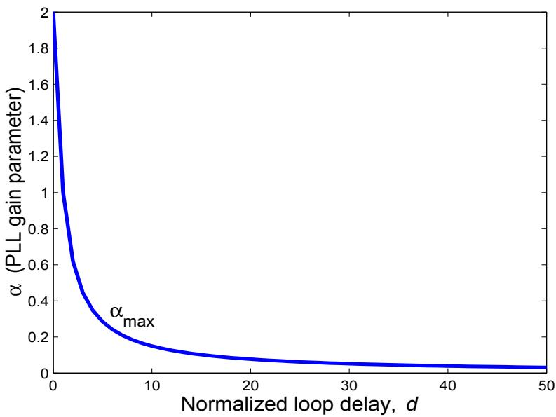  
รูปที่ 2.3: ค่ามากสุดของ α ที่ยังคงทำให้ระบบมีความเสถียรภาพ สำหรับแต่ละค่า d

เนื่องจาก α100 ถูกออกแบบมาเพื่อให้ระบบสามารถที่จะติดตามผลตอบสนองขั้นบันไดภายใน 100 บิต ด้วยค่าความคลาดเคลื่อนยินยอม (toleraทce) ±5% ดังนั้น ค่าสัมบูรณ์ของขนาดของผลตอบสนอง ข้อผิดพลาด (error response) $E ( z )$ ตามสมการ (2.10) ควรทีจะมีขนาดน้อยกว่า 0.05 หลังจากที ข้อมูลผ่านไป 100 บิดต ตามที่แสดงในรูปที่ 2.5 สำหรับ $d = 1 4 T$ สังเกตจะพบว่า มีค่า $\alpha _ { 1 0 0 }$ จำนวน

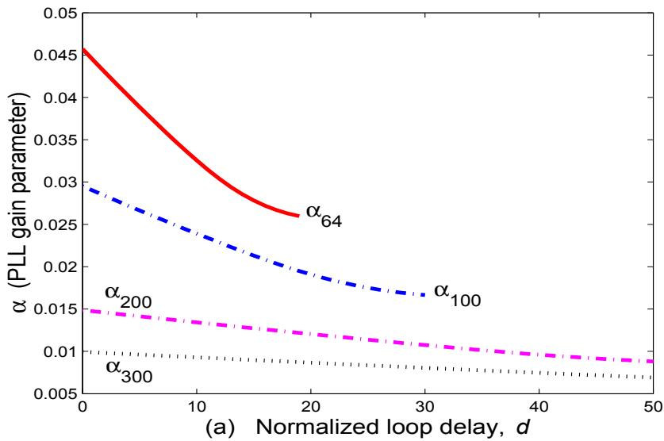

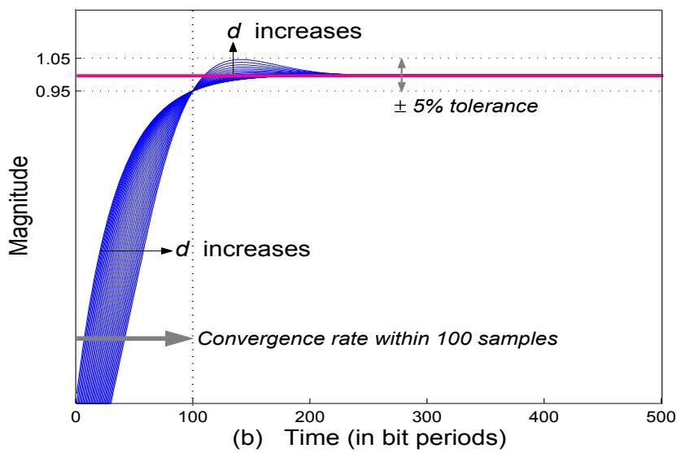  
รูปที่ 2.4: (a) ค่า $\alpha _ { C }$ ที่ทำให้ระบบมีความเสถียรภาพและมีอัตราการลู่เข้าภายใน $C$ บิต สำหรับแต่ละ d, และ (b) ผลตอบสนองของระบบเมื่อใช้ $\alpha _ { 1 0 0 }$ สำหรับค่า d จาก 0 ถึง 30T

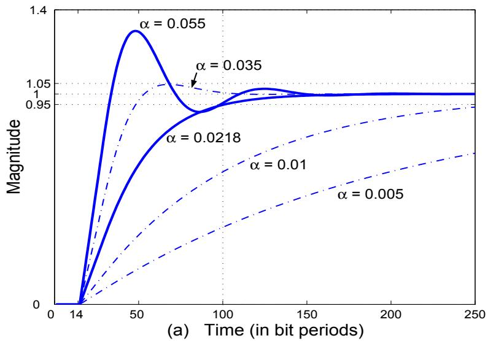

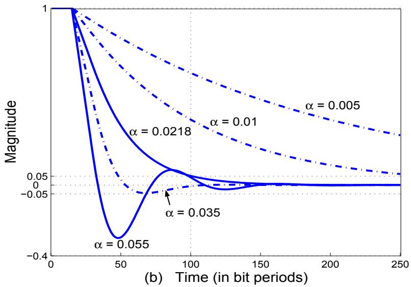  
รูปที่ 2.5: (a) ผลตอบสนองขั้นบันไดของระบบ และ (b) ผลตอบสนองข้อผิดพลาดสำหรับ $d = 1 4 T$ และค่า α ต่างๆ

2 ค่า คือ $\alpha = 0 . 0 2 1 8$ และ $\alpha = 0 . 0 5 5$ ที่ทำให้ระบบมีอัตราการลู่เข้าภายใน 100 บิด ด้วยค่าความ คลาดเคลือนยินยอม $\pm 5 \%$ อย่างไรก็ตามในทางปฏิบัติ ค่า $\alpha$ ที่มีค่าน้อยกว่า จะถูกเลือกมาใช้งานใน วงจร PLL เพื่อที่จะทำให้แบนด์วิดท์ของลูปมีค่าน้อย ซึ่งจะช่วยลดผลกระทบของสัญญาณรบกวนที่จะ เข้ามาในวงจร PLL ได้

## 2.3.2 การวิเคราะห์เชิงเส้นของวงจร PLL อันดับที่สอง

ในกรณี ที่ระบบมีองค์ประกอบของออฟเซตทางความถี่ (frequency offset) วงจร PLL อันดับที่สอง จะต้องถูกนำมาใช้งานแทนวงจร PLL อันดับที่หนึ่ง ซึ่งพารามิเตอร์ที่จะต้องคำนวณหา คือ $\alpha$ และ $\beta$ ในการออกแบบค่าพารามิเตอร์ของวงจร PLL อันดับที่สองนี้จะ เริ่มต้นจากการหาค่า α สำหรับค่า d และ $C$ ที่กำหนดมาให้ โดยสมมุติว่า ในระบบมีเพียงแค่ข้อผิดพลาดทางเฟสเท่านั้น (นั่นคือ ใช้วิธีการ ออกแบบค่า α ตามที่อธิบายในหัวข้อที่ 2.3.1) จากนั้นเมื่อได้ค่า $\alpha$ ที่ต้องการแล้ว ก็จะเริ่มหาค่า $\beta$ โดยใช้การวิเคราะห์เชิงเส้นของวงจร PLL อันดับที่สอง สำหรับปริมาณของออฟเซตทางความถี่ที่ให้มา ซึ่งในการวิเคราะห์นี้ ข้อผิดพลาดทางความถี่จะถูกจำลองให้มีค่าเป็น $\tau _ { k } = k f _ { d }$ เมื่อ $f _ { d }$ คือ ปริมาณ ของออฟเซตทางความถี มีหน่วยเป็นเปอร์เซ็นต์ (percent) ของบิตเซลล์ T

พิจารณาสมการปรับค่าออฟเซตทางเฟสของการชักตัวอ ย่างตัวถัดไป $\hat { \tau } _ { k + 1 }$ ของวงจร PLL อันดับ ที่สอง ดังต่อไปนี้

$$
\hat { \theta } _ { k + 1 } = \hat { \theta } _ { k } + \beta \hat { \epsilon } _ { k - d }\tag{2.12}
$$

$$
\hat { \tau } _ { k + 1 } = \hat { \tau } _ { k } + \alpha \hat { \epsilon } _ { k - d } + \hat { \theta } _ { k + 1 }\tag{2.13}
$$

เช่นเดียวกัน ถ้าสมมุติว่าไม่มีสัญญาณรบกวนในวงจร TED นั่นคือ $\hat { \epsilon } _ { k } = \epsilon _ { k } = \tau _ { k } - \hat { \tau } _ { k }$ ,เพราะฉะนั้น ฟังก์ชันถ่ายโอนของระบบตามสมการ (2.12) และ (2.13) สามารถที่จะ หาได้โดยการใช้การแปลงซี ดังนี้

$$
G ( z ) = { \frac { \hat { \Gamma } ( z ) } { \Gamma ( z ) } } = { \frac { ( \alpha + \beta ) z ^ { - ( d + 1 ) } - \alpha z ^ { - ( d + 2 ) } } { 1 - 2 z ^ { - 1 } + z ^ { - 2 } + ( \alpha + \beta ) z ^ { - ( d + 1 ) } - \alpha z ^ { - ( d + 2 ) } } }\tag{2.14}
$$

และฟังก์ชันถ่ายโอนของข้อผิดพลาด คือ

$$
E ( z ) = \Gamma ( z ) - { \hat { \Gamma } } ( z ) = { \frac { 1 - 2 z ^ { - 1 } + z ^ { - 2 } } { 1 - 2 z ^ { - 1 } + z ^ { - 2 } + ( \alpha + \beta ) z ^ { - ( d + 1 ) } - \alpha z ^ { - ( d + 2 ) } } } \Gamma ( z )\tag{2.15}
$$

ในทำนองเดียวกัน เกณฑ์ที่อาจจะนำมาใช้ในการเลือกค่า $\beta$ คือ การเลือกค่า $\beta$ ที่ทำให้เสถียรภาพ ของระบบและอัตราการลู่เข้าเป็นที่น่าพอใจ สำหรับปริมาณของออฟเซตทางความถี่ที่กำหนดมาให้ของ แต่ละ d, C และ $\alpha _ { C }$ ซึ่งสามารถที่จะคำนวณหาได้ดังนี้ สำหรับค่า d, C และ $\alpha _ { C }$ ที่กำหนดมาให้ ขั้นตอนแรก คือ การเลือกค่า $\beta$ ที่ทำให้ระบบมีความเสถียรภาพ จากสมการ (2.14) และ (2.15) ระบบ จะมีความเสถี่ยรภาพก็ต่อเมือ ทุกโพลหรือรากคำตอบของตัวส่วนของสมการ (2.14) หรือ (2.15) อยู ภายในวงกลมหนึ่งหน่วย และถึงแม้ว่าจะมีค่า $\beta$ หลายค่าที่ทำให้ระบบมีความเสถียรภาพ แต่จะเลือก $\beta$ เพียงค่าเดียวที่ทำให้ $E ( z )$ มีขนาดน้อยสุด หลังจากที่ข้อมูลผ่านไป $C$ บิต เพื่อที่จะลดผลกระทบ ของสัญญาณรบกวนที่จะเข้ามาในวงจร PLL รูปที่ 2.6 แสดงขนาดมากสุด (maximนm magทitude) ของ $E ( z )$ ตามสมการ (2.15) หลังจากที่ข้อมูลผ่านไป $C$ บิต สำหรับ $d = 1 4 T$ และ $\alpha _ { C }$ สังเกตจะ พบว่า วิธีการวิเคราะห์นี้จะให้ได้ค่า $\beta$ เป็นค่าเดียวกัน โดยไม่คำนึ่งถึงปริมาณของออฟเซตทางความถี e เพียงแต่ขนาดของ $E ( z )$ จะต่างกันเท่านัน ตามปริมาณของออฟเซตทางความถี

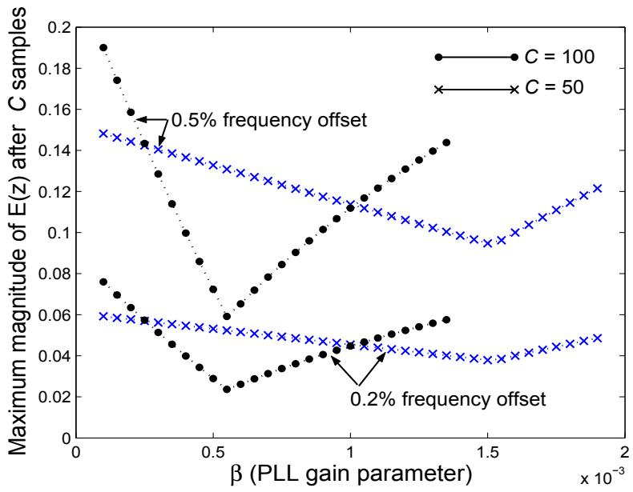  
รูปที่ 2.6: ขนาดมากสุดของ $E ( z )$ หลังจากที่ข้อมูลผ่านไป C บิต เมื่อใช้ $d = 1 4$ และ $\alpha _ { C }$

หมายเหตุ วิธีการออกแบบค่าพารามิเตอร์ของวงจร PLL ตามที่กล่าวมาข้างต้นนี้ จะอยู่บนพื้นฐาน ของสมมุติฐานที่ว่า ความชันของเส้นโด้งรูปตัวเอส (S-cนrve) ของสมการ (2.4) มีค่าเป็นค่าหนึง ณ จุดกำเนิด และไม่มีสัญญาณรบกวนภายในวงจร TED เพราะฉะนั้น ก่อนที่จะนำค่า $\alpha$ และ $\beta$ ที่ได้ จากวิธีการออกแบบตามที่กล่าวมาข้างต้นนี้ไปใช้งาน $\mathbb { N } ^ { \widehat { \mathbb { I } } }$ ช้จะต้องทำให้ความชันของเส้นโค้งรูปตัวเอส ของวงจร TED มีค่าเป็นค่าหนึ่ง ณ จุดกำเนิดก่อนเสมอ

## 2.3.3 การหาเส้นโค้งรูปตัวเอส

ไทมมิ่งฟังก์ชัน (timing function) หรือ เส้นโค้งรูปตัวเอส (S-curve) [22] จะ นิยามโดย ค่าเฉลี่ย (mean) ของ $\big \{ \hat { \epsilon } _ { k } \big \}$ โดยสมมุติว่า ค่า $\hat { r } _ { k }$ ที่ได้จากวงจรตรวจหาสัญลักษณ์มีค่าถูกต้องทั้งหมด นั่นคือ $\hat { r } _ { k }$ $\mathit { \Theta } = \mathit { \Pi } r _ { k }$ สำหรับทุกค่า k, และ ข้อมูลอินพุตแต่ละ บิตไม่มีสหสัมพันธ์กัน (uncorrelated) และมีพลังงาน เท่ากับ 1 หน่วย ดังนั้น

$$
S _ { \mathrm { T E D } } ( \epsilon ) = E [ \hat { \epsilon } _ { k } \ : | \ : \epsilon , \ : \hat { r } _ { k } = r _ { k } \ : \ : \mathrm { f o r } \forall k ]\tag{2.16}
$$

เมื่อ $\epsilon = \tau - \hat { \tau }$ คือ ข้อผิดพลาดทางเวลา เนื่องจาก รูปกราฟของไทมมิ่งฟังก์ชันมีลักษณะ คล้าย ตัวอักษร "S" (เมื่อหมุนรูปกราฟ 90 องศา) ดังนั้น จึงเรียกกันว่า "เส้นโด้งรูปตัวเอส (S-curve)" ซึ่ง สามารถที่จะนำมาใช้วัดประสิทธิภาพของวงจร TED ได้

นอกจากนี้ ในกรณีที่ทราบว่าผลตอบสนองอิมพัลส์ของช่องสัญญาณคืออะไร เส้นโค้งรูปตัวเอส สามารถที่จะ คำนวณหาได้โดยตรง [22] ตัวอย่างเช่น ให้พิจารณาแบบจำลองของช่องสัญญาณ PR4 (partial-response class IV) ในรูปที่ 2.2 เมื่อ $H ( D ) = 1 - D ^ { 2 }$ ดังนั้น เส้นโค้งรูปตัวเอสของวงจร M&M TED สำหรับช่องสัญญาณนี้ หาได้จาก

$$
\begin{array} { r c l } { { S _ { \mathrm { T E D } } ( \epsilon ) } } & { { = } } & { { E [ \hat { \epsilon } _ { k } | \epsilon , \hat { r } _ { k - 1 } = r _ { k - 1 } , \hat { r } _ { k } = r _ { k } ] } } \\ { { } } & { { } } & { { } } \\ { { } } & { { = } } & { { K _ { T } E [ r _ { k - 1 } y _ { k } - r _ { k } y _ { k - 1 } ] } } \\ { { } } & { { } } & { { } } \\ { { } } & { { = } } & { { K _ { T } E [ ( a _ { k - 1 } - a _ { k - 3 } ) \displaystyle \sum _ { i } a _ { i } h ( k T - i T - \epsilon ) } } \\ { { } } & { { } } & { { } } \\ { { } } & { { } } & { { - \left( a _ { k } - a _ { k - 2 } \right) \displaystyle \sum _ { i } a _ { i } h ( k T - T - i T - \epsilon ) ] } } \\ { { } } & { { } } & { { } } \\ { { } } & { { = } } & { { { \displaystyle \frac { 3 T } { 1 6 } \left\{ - h ( - T - \epsilon ) + 2 h ( T - \epsilon ) - h ( 3 T - \epsilon ) \right\} } } } \end{array}\tag{2.17}
$$

โดยที่ $r _ { k } = a _ { k } - a _ { k - 2 }$ คือ ข้อมูลเอาต์พุตตัวที่ k ของช่องสัญญาณที่ปราศจากสัญญาณรบกวน, $y _ { k } =$ $\begin{array} { r } { \sum _ { i } a _ { i } h \big ( k T - i T - \epsilon \big ) } \end{array}$ คือ ข้อมูลเอาต์พุตตัวที่ k ของวงจรชักตัวอย่าง, และ $h ( t ) = q ( t ) - q ( t - 2 T )$

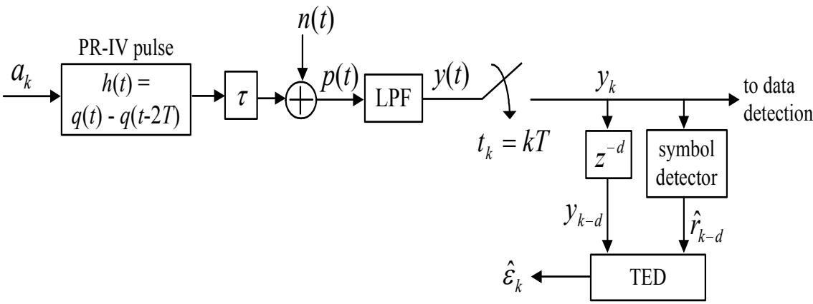  
รูปที่ 2.7: แบบจำลองสำหรับการหาเส้นโคด้งรูปตัวเอส

คือ สัญญาณพัลส์แบบ PR4 ค่าคงตัว $K _ { T } = 3 T / 1 6$ ถูกใช้เพื่อช่วยทำให้ความชันของเส้นโด้งรูปตัว เอสในสมการ (2.17) มีค่าเท่ากับค่าหนึ่ง ณ จุดกำเนิด

สำหรับในกรณีที่ไม่ทราบผลตอบสนองอิมพัลส์ของช่องสัญญาณ เส้นโค้งรูปตัวเอสก็ยังสามารถที จะหาได้โดยการทำการจำลองระบบ ซึ่งทำได้โดยการเปิดไทมมิ่งลูปของแบบจำลองในรูปที่ 2.2 (กล่าวคือ ตัดวงจรกรองลูปและวงจร VC0 ออกจากแบบจำลอง) ซึ่งจะทำให้ได้เป็นแบบจำลองใหม่ตามรูปที่ 2.7 จากรูป สัญญาณ y(t) จะถูกทำการชักตัวอย่างที่เวลา $k T$ (นั้นคือ กำหนดให้ $\hat { \tau } = 0 )$ และแทนค่า τ ด้วย  จากนั้น ทำการคำนวณหาค่าเฉลี่ยทางเวลา (time average) ของ $\left\{ \hat { \epsilon } _ { k } \right\}$ สำหรับแต่ละค่า ( เพื่อให้ได้เป็นค่า $S _ { \mathrm { T E D } } ( \epsilon )$ ค่าเดียว ทำลักษณะนี้ไปเรื่อยๆ เพื่อหาค่า $S _ { \mathrm { T E D } } ( \epsilon )$ สำหรับ  สำหรับค่า —0.5T ถึงค่า 0.5T สดท้ายก็ทำการวาดกราฟระหว่าง $\epsilon / T$ และ $S _ { \mathrm { T E D } } ( \epsilon ) / T$ เพื่อให้ได้เป็นเส้นโค้ง รูปตัวเอส

รูปที่ 2.8 แสดงเส้นโค้งรูปตัวเอสของวงจร M&M TED สำหรับช่องสัญญาณแบบ PR4 ที่ใช้ ไทมมิ่งริคัฟเวอรีแบบที่ใช้กันทั่วไป ณ ระดับ รNR ต่อบิต หรือ $E _ { b } / N _ { 0 }$ ต่างๆ มีหน่วยเป็นเดซิเบล (dB) โดยใช้วงจร PLL จะใช้ค่าตัดสินใจขณะ หนึ่งแบบแข็ง (instantaneous hard decision)ที่ได้รับ จากวงจรตรวจหาขีดเริ่มเปลี่ยนที่ไม่มีหน่วยความจำ (memoryless threshold detector) แบบ 3 ระดับ โดยมีระดับขีดริมเปลี่ยน (threshold level) ที่ค่ ±1 นั่นคือ

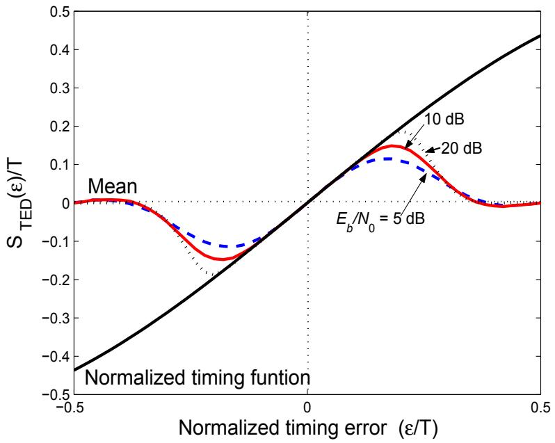  
รูปที่ 2.8: เส้นโค้งรูปตัวเอสของวงจร M&M TED สำหรับช่องสัญญาณ PR4 ที่ใช้ไทมมิ่งริคัฟเวอรี แบบที่ใช้กันทั่วไป

$$
\hat { r } _ { k } = \left\{ \begin{array} { c l } { { 2 } } & { { \mathrm { i f } y _ { k } > 1 } } \\ { { - 2 } } & { { \mathrm { i f } y _ { k } < - 1 } } \\ { { 0 } } & { { \mathrm { e l s e } } } \end{array} \right.\tag{2.18}
$$

เส้นกราฟของ "ไทมมิ่งฟังก์ชันแบบนอร์มอลไลซ์ (normalized timing function)" จะได้มาจากสมการ (2.17) จากรูปที่ 2.8 จะพบว่า เส้นโค้งรูปตัวเอสมีลักษณะสมมาตรแบบคี่ (odd รymmetric) เมื่อเทียบ กับ $\epsilon = 0$ ซึ่งหมายความหมายว่า ออฟเซตทางเฟสของการชักตัวอย่างที่ถูกปรับค่าด้วยวงจร PLL จะ สิ้นสุด ณ จุดเสถียรภาพ (stable point)ที่ $\epsilon = 0$ สังเกตจะพบว่า เส้นโค้งรูปตัวเอส $S _ { \mathrm { T E D } } ( \epsilon ) / T$ ดร ได้จากการจำลองระบบจะสอดคล้องกับไทมมิ่งฟังก์ชันแบบนอร์มอลไลซ์เมื่อ $\epsilon / T$ มีค่าน้อย ทั้น้เป็น เพราะว่า สมมุติฐานที่กำหนดให้ $\hat { r } _ { k } = r _ { k }$ สำหรับทุกค่า k จะใช้ได้ไม่ดี เมื่อ $\epsilon / T$ มีค่ามาก ดังนั้นจึง เป็นเหตุผลว่าทำไมช่วงของกราฟที่ $S _ { \mathrm { T E D } } ( \epsilon ) / T$ สอดคล้องกับไทมมิ่งฟังก์ชันแบบนอร์มอลไลซ์เมื่อ

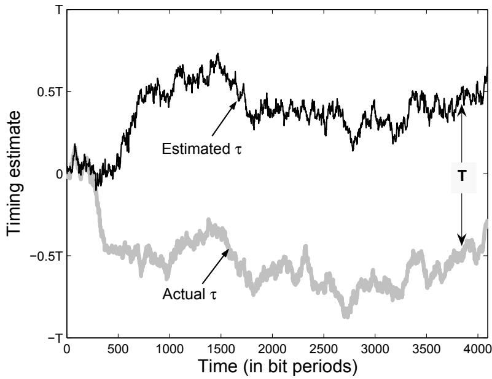  
รูปที่ 2.9: ตัวอย่างลักษณะของไซเคิลสลิป

## $E _ { b } / N _ { 0 }$ มีค่าสูง จึงมีความกว้างมากกว่าช่วงของกราฟ เมื่อ $E _ { b } / N _ { 0 }$ มีค่าน้อย 2

นอกจากนี้จุดที่เส้นโค้งรูปตัวเอสตัดกับเส้นแกน x นั่นคือเมื่อ $S _ { \mathrm { T E D } } ( \epsilon ) / T ~ = ~ 0$ จะเรียกว่า "จุดสมดุล (equilibriนm point)" ของการทำงาน ซึ่งเป็นจุดที่วงจร PLL จะสามารถติดตามออฟเซต ทางเวลาได้เป็นอย่างดี อย่างไรก็ตามในทางปฏิบัติ จุดสมดุลจะมีหลายตำแหน่ง คือ $\epsilon = 0 , \pm T$ ±2T, .. .,±nT เมื่อ n คือ เลขจำนวนเต็ม เนื่องจาก สัญญาณรบกวนและการรบกวน (distนrbance) ในระบบอาจจะทำให้เกิดข้อผิดพลาดขนาดใหญ่ ระหว่างกระบวนการปรับค่าออฟเซตทางเฟสของการ ชักตัวอย่าง ซึ่งเป็นผลทำให้การทำงานของวงจร PLL เกิดการเปลี่ยนสถานะจากจุดสมดุลจุดหนึ่งไป ยังจุดสมดุลอีกจุดหนึ่ง เหตุการณ์ เช่นนี้จะ เรียกกันว่า "ไซ เคิลสลิป (ตycle slip)" ซึ่งจะ ทำให้เกิด ข้อผิดพลาดจำนวนมากที่วงจรตรวจหา (detector) รูปที่ 2.9 แสดงตัวอย่างลักษณะ ของไซ เคิลสลิป จากรูปจะพบว่า วงจร PLL สามารถติดตามการเปลี่ยนแปลงของ 7 ได้ดี ณ จุดเริ่มต้นของกลุ่มข้อมูล (data packet) แต่เมื่อมีไซเคิลสลิปเกิดขึ้น วงจร PLL จะค่อยๆ สูญเสียการติดตามค่า T จนกระทั้ง วงจร PLL เข้าสู่จุดสมดุลใหม่อีกจุดหนึ่ง ดังนั้น อาจจะกล่าวได้ว่า ไซเคิลสลิปเป็นสาเหตุทำให้วงจร

PLL ทำงานที่จุดสมดุลอีกจุดหนึ่ง ซึ่งเป็นเหตุผลว่าทำไม 7 จึงมีค่าต่างจาก 7 ประมาณ T เมื่อสิ้นสุด ซ ของกลุ่มข้อมูล จะ เห็นได้ว่า ไซ เคิลสลิปเป็นสิ่งที่อันตรายมากสำหรับระบบไทมมิ่งริคัฟเวอรี ดังนั้น นักวิจัยจึงได้เสนอวิธี การต่างๆ ที่จะ นำใช้ในการจัดการกับไซ เคิลสลิป สำหรับผู้สนใจสามารถศึกษา รายละเอียดได้ใน [29, 30, 31, 32, 33]

## 2.4 ประสิทธิภาพของไทมมิ่งริคัฟเวอรีแบบที่ใช้กันทั่วไป

พิจารณาแบบจำลองช่องสัญญาณ PR4 ที่แสดงในรูปที่ 2.2 จะเห็นได้ว่า ไทมมิ่งริคัฟเวอรี และวงจร ตรวจหาสัญลักษณ์จะทำงานแยกจากกัน ดังนั้น ประสิทธิภาพรวมของระบบที่ไม่ได้ถูกเข้ารหัส (uท- coded รystem) จะขึนอยู่กับคุณภาพของระบบไทมมิงริคัฟเวอรี

ในส่วนนี้จะแสดงประสิทธิภาพของไทมมิ่งริดัฟเวอรีแบบที่ใช้กันทั่วไป เมื่อทำงานในระบบที่มีและ ขีดเริ่มเปลี่ยนที่ไม่มีหน่วยความจำแบบหลายระดับ (multi-level memoryless threshold detector) โดยข้อมูลเอาต์พุตที่ได้จะ เป็นไปตามสมการ (2.18) สำหรับกระบวนการตรวจหาข้อมูล ลำดับข้อมูล {y} จะ ถูกส่งไปยังวงจรตรวจหาวีเทอร์บิที่มีปริมาณหน่วงเวลาสำหรับการตัดสินใจเท่ากับ 60T เพื่อ aซ หาลำดับข้อมูลอินพุตที่เป็นไปได้มากที่สุด นอกจากนี้ BER แต่ละ ค่าที่ได้จะ ถูกคำนวณโดยใช้กลุ่ม ข้อมูลจำนวนมากจนกว่าจะเกิดข้อผิดพลาดรวมทั้งหมด 1000 บิต

สำหรับระบบที่ไม่มีออฟเซตทางความถี่ วงจรภาครับสามารถที่จะใช้วงจร PLL อันดับที่หนึ่งได้ ซึ่งทำได้โดยการกำหนดให้ $\tau _ { 0 } = 0$ เพื่อที่ว่าจะได้ไม่ต้องใช้ข้อมูล preamble และ กำหนดให้ข้อมูล หนึ่งกลุ่มมีจำนวน 4096 บิต รูปที่ 2.10 เปรียบเทียบประสิทธิภาพของข้อผิดพลาดทางเวลาแบบราก กำลังสองเฉลีย (RMS: root mean square) นันคือ $\sigma _ { \epsilon } = \sqrt { E [ ( \tau _ { k } - \hat { \tau } _ { k } ) ^ { 2 } ] }$ และ BER โดยค่า พารามิเตอร์ของวงจร PLL (α) ที่ใช้จะถูกออกแบบมาเพื่อให้สามารถติดตามการเปลี่ยนแปลงทางเฟส ได้ภายใน 100 บิต (นั่นคือ $\alpha _ { 1 0 0 } ~ = ~ 0 . 0 2 9 5 )$ ตามที่ได้อธิบายในหัวข้อที่2.3.1 จะ เห็นได้ว่า เมื่อ ระดับความรุนแรงของจิตเตอร์ทางเวลา $\sigma _ { w } / T$ ยิ่งมากประสิทธิภาพของระบบก็จะยิ่งแย่(ทั้งในรูป ของ $\sigma _ { \epsilon } / T$ และ BER) นอกจากนี้ ถ้าระบบมีค่า $\sigma _ { \epsilon } / T$ น้อย ระบบก็จะมี BER ต่ำ ดังนั้น พารามิเตอร์ $\sigma _ { \epsilon } / T$ และ BER จึงสามารถที่จะนำมาใช้เป็นเกณฑ์ในการเปรียบเทียบประสิทธิ ภาพของระบบไทมมิ่ง

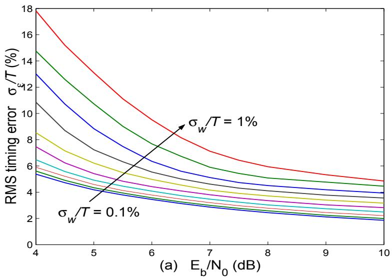

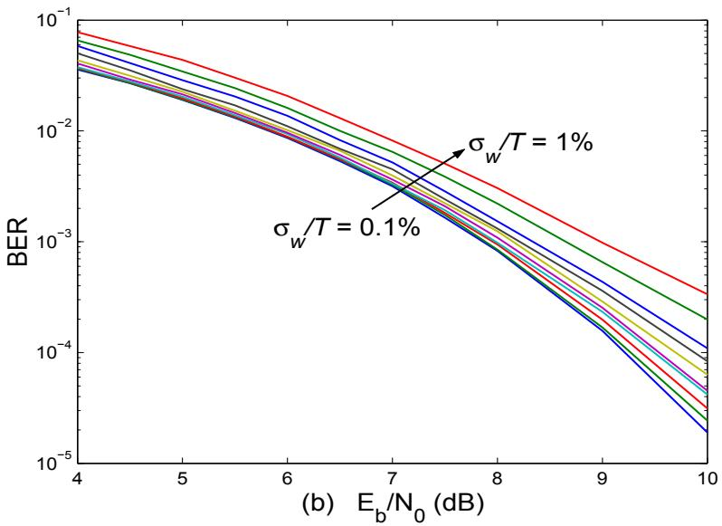  
รูปที่ 2.10: (a) ข้อผิดพลาดทางเวลาแบบ RMs $\sigma _ { \epsilon } / T$ และ (b) ประสิทธิ ภาพของ BER สำหรับ ช่องสัญญาณอุดมคติแบบ PR4 ที่มีค่า $\sigma _ { w } / T$ ต่างๆ กัน (เมื่อระบบไม่มีออฟเซตทางความถี่)

ริคัฟเวอรีแบบต่างๆ ได้

ในทำนองเดียวกัน สำหรับระบบที่มีออฟเซตทางความถี่ วงจรภาครับจะต้องใช้วงจร PLL อันดับที่ สองในการจัดการกับออฟเซตทางความถี่นี้ โดยจะพิจารณาระบบที่ทำงานในสภาวะปานกลาง (moderate condition) นันคือมี $\sigma _ { w } / T = 0 . 5 \%$ และออฟเซตทางความถี่0.2% เช่นเดียวกัน พารามิเตอร์ α และ $\beta$ ที่ใช้จะถูกออกแบบมาเพื่อให้สามารถติดตามการเปลี่ยนแปลงทางเฟสและทางความถี่ได้ภายใน $C$ บิต ตามที่ได้อธิบายในหัวข้อที่ 2.3.2 ซึ่งจะได้ว่า ค่า α ที่ถูกออกแบบสำหรับ $d = 0$ และ C $= 5 0$ ,100, และ 256 คือ 0.012, 0.029, และ 0.058, ตามลำดับ ในขณะที ค่า $\beta$ ที่ถูกออกแบบ สำหรับ $d = 0$ และ $C = 5 0$ ,100, และ 256 คือ 0.00015, 0.000885, และ 0.00325, ตามลำดับ นอกจากนี้จะพิจารณาเฉพาะกรณีที่วงจร PLL ใช้ค่า α และค่า $\alpha$ $\beta$ เดียวกัน สำหรับทั้งช่วงภาวะการได้ มาและ ภาวะการติดตาม โดยข้อมูลหนึ่งกลุ่มจะประกอบไปด้วย preลmble จำนวน $C$ บิต และส่วนที่ เป็นบิตข่าวสารจำนวน 4096 บิต รูปที่ 2.11 แสดงประสิทธิ ภาพของไทมมิ่งริคัฟเวอรีแบบที่ใช้กันทั่วไป เมื่อใช้พารามิเตอร์ของวงจร PLL ที่ออกแบบสำหรับแต่ละ C เส้นกราฟที่เขียนว่า "Perfect timing" ใช้แทนไทมมิ่งริคัฟเวอรีแบบที่ใช้กันทั่วไป ที่ใช้ $\hat { \tau } _ { k } ~ = ~ \tau _ { k }$ สำหรับการชักตัวอ ย่างสัญญาณ y(t) จะ เห็นได้ว่า ไทมมิ่งริศัฟเวอรีแบบที่ใช้กันทั่วไปไม่สามารถทำงานได้ดี เมื่อทำงานในระบบที่ต้องการอัตรา การลู่เข้าทีรวดเร็ว หรืออีกนัยหนึ่งก็คือ เมือใช้งานกับค่าพารามิเตอร์ของวงจร PLL ที่ถูกออกแบบ สำหรับ C น้อยๆ

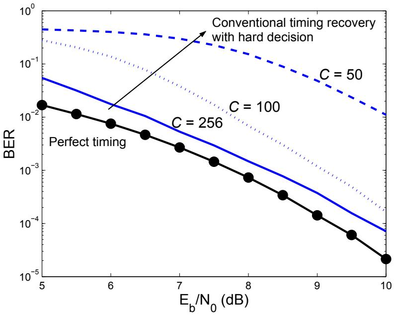  
รูปที่ 2.11: ประสิทธิภาพ BER ของไทมมิ่งริคัฟเวอรีแบบที่ใช้กันทั่วไปของช่องสัญญาณอุดมคติแบบ PR4 สำหรับ $\sigma _ { w } / T = 0 . 5 \%$ และออฟเซตทางความถี0.2%

## 2.5ไทมมิ่งริคัฟเวอรีแบบดิจิทัล

ไทมมิ่งริศัฟเวอรีแบบที่ใช้กันทั่วไปที่อธิบายในบทนี้จะ มีลักษณะ การทำงานเป็นแบบผสม (hybrid) นั่นคือ มีทั้งส่วนที่ทำงานกับสัญญาณแอนะล็อก และส่วนที่ทำงานกับสัญญาณดิจิทัล พิจารณาจาก รูปที่ 2.2 โดยทั่วไป วงจร VC0 มักจะเป็นวงจรแอนะล็อกซึ่งมีลักษณะการทำงานที่ซับซ้อนและ มี ราคาแพง ในส่วนนี้จะกล่าวถึงระบบไทมมิ่งริคัฟเวอรีที่มีลักษณะเป็นแบบดิจิทัลทั้งหมด ซึ่งมีใช้ในชิป ช่องสัญญาณอ่าน (read-channel chip) บางรุ่น

ไทมมิ่งริดัฟเวอรี แบบติจิทัล จะ ใช้อัตราการ ชัก ตัวอย่าง (sampling rate) ที่ไม่ เข้าจังหวะ (asynchronous) กับสัญญาณแอนะล็อกที่ได้รับ เพียงแต่ขอให้มีความถี่การชักตัวอย่าง (sampling frequency) สูงกว่าความถี่ในควิตส์5 (Nyquist frequency) [2, 10] ของสัญญาณแอนะล็อก หรืออาจจะกล่าว ได้ว่า วงจรชักตัวอย่างใช้อัตราการชักตัวอย่างแบบเกินจริง6 (oversampling rate) [34, 35] เนื่องจาก ข้อมูลแซมเปิลที่ได้จากวงจรชักตัวอย่างนี้จะไม่เข้าจังหวะกับข้อมูลบิตที่ส่งมาจากต้นทาง ดังนั้น จึงต้อง มี “การปรับค่าทางเวลา (timing adjนรtment)" ด้วยวิธีการทางดิจิทัลที่เรียกว่า "เทคนิคการประมาณ ค่าในช่วง (interpolation technique)" เพื่อให้ได้ข้อมูลแซมเปิลที่สอดคล้องกับข้อมูล บิตที่ส่งมาจาก ต้นทาง ระบบไทมมิ่งริคัฟเวอรีที่ใช้เทคนิคนี้ จะเรียกกันทั่วไปว่า "ไทมมิ่งริคัฟเวอรีแบบประมาณค่า ในช่วง (interpolated timing recovery)"ซึ่งมีโครงสร้างตามรูปที่ 2.12 โดยส่วนประกอบทุกส่วน ในวงจร PLL จะ มีลักษณะการทำงานเป็นแบบดิจิทัลทั้งหมด ซึ่งจะช่วยทำให้สามารถลดค่าใช้จ่ายใน การสร้างระบบไทมมิ่งริคัฟเวอรีได้ จากการทดลองพบว่า ไทมมิ่งริคัฟเวอรีแบบประมาณค่าในช่วงมี ประสิทธิภาพเทียบเท่ากับไทมิ่งริคัฟเวอรีแบบที่ใช้กันทั่วไป ถ้ามีการเลือกใช้วงจรกรองการประมาณ ค่าในช่วง (interpolatioก filter) ที่เหมาะสม สำหรับผู้สนใจสามารถ ศึกษารายละเอียด ของไทมมิ่ง ริคัฟเวอรีแบบประมาณค่าในช่วงเพิ่มเติมได้จาก [34, 35, 36, 37]

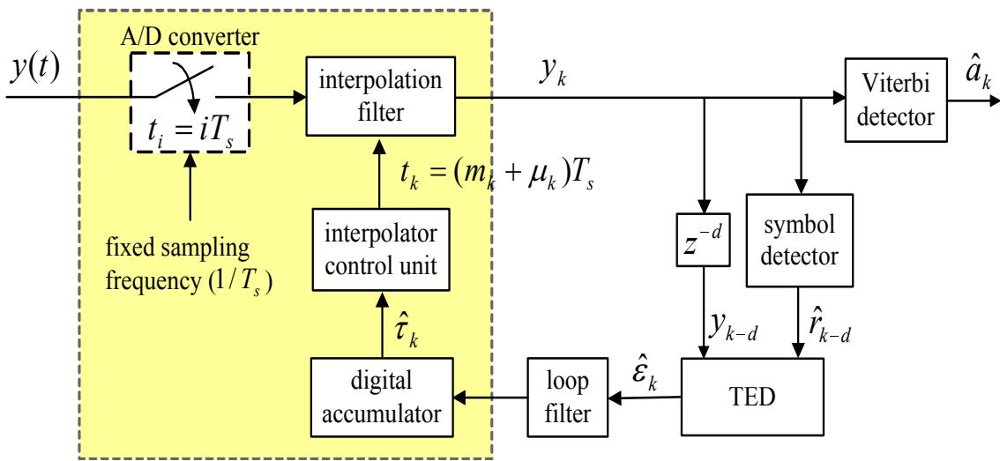  
รูปที่ 2.12: โครงสร้างของไทมมิ่งริดัฟเวอรีแบบประมาณค่าในช่วง

## 2.6 แนวโน้มของระบบไทมมิ่งริดัฟเวอรีในอนาคต

จากผลลัพธ์ที่แสดงในรูปที่ 2.10 และ 2.11 สรุปได้ว่า ไทมมิ่งริคัฟเวอรีแบบที่ใช้กันทั่วไปจะทำงาน ได้ไม่ดี ถ้าระบบมีข้อผิดพลาดทางเวลามาก หรือเมื่อทำงานในระบบที่ต้องการอัตราการลู่เข้าที่รวดเร็ว วิธีการแก้ไขปัญหาที่ง่าย ที่สุดในการเพิ่มประสิทธิ ภาพของไทมมิ่งริคัฟเวอรี แบบที่ใช้กันทั่วไป ก็คือ การเปลี่ยนวงจรตรวจหาสัญลักษณ์ที่ใช้ในไทมมิ่งลูปจากวงจรตรวจหาขีดเริ่มเปลี่ยนแบบแข็ง (hard threshold detector) ไปเป็นวงจรตรวจหาขีดเริ่มเปลี่ยนแบบอ่อน (soft threshold detector) [33] หรือ อาจจะใช้วงจรตรวจหาวีเทอร์บิที่มีปริมาณหน่วงเวลาสำหรับการตัดสินใจ ฝT สั้นก็ได้ [27] อย่างไร ก็ตาม วิธีการที่กล่าวมาเหล่านี้จะช่วยเพิ่มประสิทธิภาพที่ได้เพียงเล็กน้อยเท่านั้น ญ

ดังนั้น ระบบไทมมิ่งริคัฟเวอรีแบบใหม่ที่มีประสิทธิภาพมากกว่าไทมมิ่งริคัฟเวอรีแบบที่ใช้กันทั่วไป จึงเป็นสิ่งที่ต้องการอย่างมาก ใน [30, 38] ได้นำเสนอไทมมิ่งริคัฟเวอรีรูปแบบใหม่ที่เรียกว่า "เพอเซอร์ ไวเวอร์ไทมมิ่งริดัฟเวอรี (per-survivor timing recovery)" ซึ่งใช้งานกับระบบที่ไม่ได้ถูกเข้ารหัส ซึ่งม ประสิทธิภาพดีกว่าไทมมิ่งริดัฟเวอรีแบบที่ใช้กันทั่วไป ดังแสดงในรูปที่ 2.13 โดยที่ เส้นแกน ป จะบอก ถึงปริมาณ $E _ { b } / N _ { 0 }$ (มีหน่วยเป็น 4B) ที่ระบบต้องการ ในการที่จะทำให้ระบบมี $\mathrm { B E R } = 1 0 ^ { - 4 }$ หรืออีก นัยหนึ่งก็คือ เส้นแกน y จะบอกถึงกำลัง (poพer) ที่วงจรภาคส่งต้องใช้ในการส่งข้อมูล เพื่อที่จะทำให้ วงจรภาครับมี $\mathrm { B E R } = 1 0 ^ { - 4 }$ จากรูปที่2.13 เส้นกราฟที่เขียนว่า "Genie-aided detector" หมายถึง ไทมมิ่งริคัฟเวอรีแบบที่ใช้กันทั่วไปที่วงจร PLL ใช้ $\hat { r } _ { k } = r _ { k }$ (ดูรูปที่ 2.2) ในการปรับค่าออฟเซตทาง เฟสของการชักตัวอย่างตัวถัดไป, และ "tentative decision $( d = 4 ) ^ { \ ' }$ หมายถึง ไทมมิ่งริคัฟเวอรีแบบ ที่ใช้กันทั่วไปที่วงจรตรวจหาสัญลักษณ์ที่ใช้ในไทมมิ่งลูป คือ วงจรตรวจหาวีเทอร์บที่มีปริมาณหน่วง เวลา $d = 4 T$ จะผลการทดลองพบว่า เพอเซอร์ไวเวอร์ไทมมิ่งริคัฟเวอรีมีประสิทธิภาพดีกว่าไทมมิ่ง ริคัฟเวอรีแบบที่ใช้กันทั่วไป (เนื่องจาก ใช้ $E _ { b } / N _ { 0 }$ น้อยกว่า ในการที่จะทำให้ระบบมี BER = 10−4 เท่ากัน) โดยเฉพาะอย่างยิ่ง เมื่อทำงานที่ระดับความรุนแรงของไทมมิ่งจิตเตอร์ $\sigma _ { w } / T$ สูง

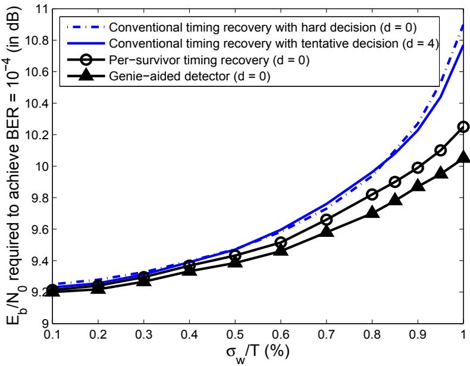  
รูปที่ 2.13: ประสิทธิ ภาพของไทมมิ่งริดัฟเวอรีแบบต่างๆ ของช่องสัญญาณอุดมคติแบบ PR4

ในการตรวจสอบอัตราการลู่เข้าของไทมมิ่งริคัฟเวอรีแบบต่างๆ จะใช้แบบจำลองในรูปที่ 2.2 โดย กำหนดให้ $\sigma _ { w } / T = 0 \% , \ : \hat { \tau } _ { 0 } = 0 . 5 T$ ,ออฟเซตทางความถีเท่ากับ 0%, และค่าพารามิเตอร์ของวงจร PLL จะถูกออกแบบมาสำหรับ $C = 5 0$ นั่นคือ $\alpha _ { 5 0 }$ สำหรับ $d = 0$ และ $4 T$ คือ 0.058 และ 0.049 ตามลำดับ รูปที่ 2.14 เปรียบเทียบอัตราการลู่เข้าของไทมมิ่งริคัฟเวอรีแบบต่างๆ โดยคิดเฉลี่ยจากกลุ่ม ข้อมูล ร0000 กลุ่ม โดยที่ ระบบจะถูกพิจารณาว่าประสบความสำเร็จในการลู่เข้า ณ เวลาที่ k ก็ต่อเมื่อ $\hat { \tau } _ { i }$ สำหรับ $i \geq k$ มีค่าเท่ากับค่า 0 หรือ T ด้วยค่าความคลาดเคลื่อนยินยอม ±10% จากรูปจะ พบ ว่า ระบบที่ใช้ "Genie-aided detector" จะลู่เข้าภายใน 50 บิต ซึ่งจะสอดคล้องกับ $\alpha _ { 5 0 }$ ที่ใช้ เพราะว่า วงจร PLL ของ "Genie-aided detector"ใช้ค่าที่ถกต้อง (นั้นคือ $\hat { r } _ { k } = r _ { k } )$ ในการปรับค่าออฟเซต ทางเฟสของการชักตัวอย่างตัวถัดไป นอกจากนี้ยังพบว่า เพอเซอร์ไวเวอร์ไทมมิ่งริคัฟเวอรีมีอัตราการ ลู่เข้าที่รวดเร็ว เมื่อเทียบกับไทมมิ่งริคัฟเวอรีแบบที่ใช้กันทั่วไป

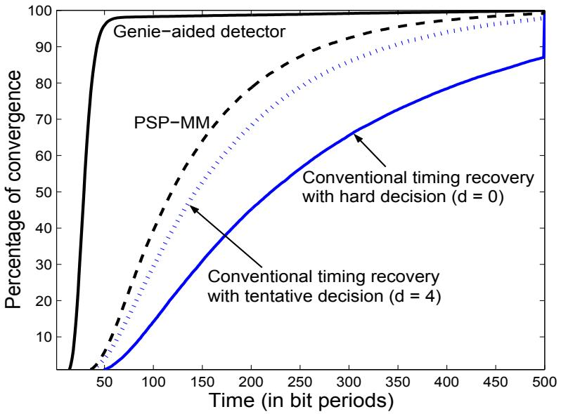  
รูปที่ 2.14: อัตราการลู่เข้าของไทมมิ่งริดัฟเวอรีแบบต่างๆ เมื่อใช้ $\alpha _ { 5 0 }$ ชร $E _ { b } / N _ { 0 } = 1 0$ dB

ประสิทธิภาพของเพอเซอร์ไวเวอร์ไทมมิ่งริศัฟเวอรีสามารถที่จะทำให้เพิ่มขึ้นได้อีก โดยการนำไป ใช้งานร่วมกันกับรหัส แก้ไขข้อผิดพลาด (ECC: error-correction code) ซึ่งผลลัพธ์ ที่ได้จะ เรียกว่า "เพอเซอร์ไวเวอร์ไทมมิงริดัฟเวอรีแบบทำงานซ้ำ (per-survivor iterative timing recovery)" [30, 39, 40] โดยจะใช้งานกับระบบที่ถูกเข้ารหัส (coded รystem) ซึ่งจากผลการทดลองพบว่า เพอเซอร์ ไวเวอร์ไทมมิ่งริคัฟเวอรีแบบทำงานซ้ำมีประสิทธิภาพมากกว่าไทมมิ่งริคัฟเวอรีแบบที่ใช้กันทั่วไปมาก โดยเฉพาะอย่างยิ่ง เมื่อระบบมีข้อผิดพลาดทางเวลามาก หรือ เมื่อ ทำงานในระบบที่ต้องการอัตราการ ลู่เข้าที่รวดเร็ว สำหรับผู้สนใจสามารถศึกษารายละเอียดเพิ่มเติมได้ใน [30, 39, 40] ซึ่งสามารถดาวน์ โหลดเอกสารเหล่านี้ได้ที่ http:/home.npru.ac.th/\~t3058

## 2.7สรุปท้ายบทธี

ในบทนี้ได้อธิบายถึงหลักการทำงานของไทมมิ่งริดัฟเวอรีแบบที่ใช้กันทั่วไป รวมไปถึงวิธีการออกแบบ ค่าพารามิเตอร์ของวงจร PLL โดยใช้แบบจำลองวงจรเฟสล็อกลูปแบบเชิงเส้น จากผลการทดลองพบ ว่า ค่าพารามิเตอร์ของวงจร PLL ที่ได้จากการออกแบบตามเกณฑ์ที่กำหนดไว้มีค่าเดียวกันไม่ว่าใน ระบบจะมีปริมาณออฟเซตทางความถี่เท่าใด และก่อนที่จะนำค่าพารามิเตอร์ของวงจร PLL ที่ได้จาก วิธีการออกแบบตามที่อธิบายในบทนี้ไปใช้งาน ผู้ใช้จะต้องทำให้ความชันของเส้นโค้งรูปตัวเอสของ ลซ   
วงจร TED มีค่าเป็นค่าหนึ่ง ณ จุดกำเนิดก่อนเสมอ นอกจากนี้ ผลการทดลองแสดงให้เห็นว่า ไทมมิ่ง ริคัฟเวอรีแบบที่ใช้กันทั่วไปทำงานได้ไม่ดี เมื่อระบบมีข้อผิดพลาดทางเวลามาก หรือเมื่อทำงานในระบบ ที่ต้องการอัตราการลู่เข้าที่รวดเร็ว

อย่างไรก็ตามในทางปฏิบัติ ไทมมิ่งริคัฟเวอรี แบบที่ใช้กันทั่วไปก็ยังเป็นที่นิยมใช้งานกันมากใน เกือบจะทุกงานประยุกต์ เนื่องจากเป็นวงจรที่ง่ายต่อการสร้างและสามารถทำงานได้ดีเพียงพอ ถ้าเลือก ใช้ค่าพารามิเตอร์ของวงจร PLL ที่เหมาะสม รวมทั้งระบบมีข้อผิดพลาดทางเวลาไม่มากนัก และระบบ ไม่มีความต้องการอัตราการลู่เข้าที่รวดเร็ว

## 2.8 แบบฝึกหัดท้ายบทร

1. จงอธิบายหลักการทำงานของวงจรเฟสล็อกลูป (PLL: phaรed-lock loop) มาพอสังเขป

2. จงอธีบายขันตอนการออกแบบค่าพารามิเตอร์ของวงจร PLL อันดับที่หนึ่ง

0 e 3. จงอธิบายขันตอนการออกแบบค่าพารามิเตอร์ของวงจร PLL อันดับที่สอง

4. จงอธิบายคุณสมบัติและประโยชน์ของเส้นโค้งรูปตัวเอส

5. จงคำนวณหาสมการเส้นโด้งรูปตัวเอส ของวงจร M&M TED และวาดรูปไทมมิ่งฟังก์ชันของ ช่องสัญญาณ H(D) ต่อไปนี้

5.1) $H ( D ) = 1 - D$

5.2) $H ( D ) = 1 + D$

5.3) $H ( D ) = 1 + 2 D + D ^ { 2 }$

5.4) $H ( D ) = 1 + D - D ^ { 2 } - D ^ { 3 }$

5.5) $H ( D ) = 1 + 3 D + 3 D ^ { 2 } + D ^ { 3 }$

6. จงเปรียบเทียบหลักการทำงานของไทมมิ่งริดัฟเวอรีแบบที่ใช้กันทั่วไปและไทมมิ่งริดัฟเวอรีแบบ ประมาณค่าในช่วง มาพอสังเขป