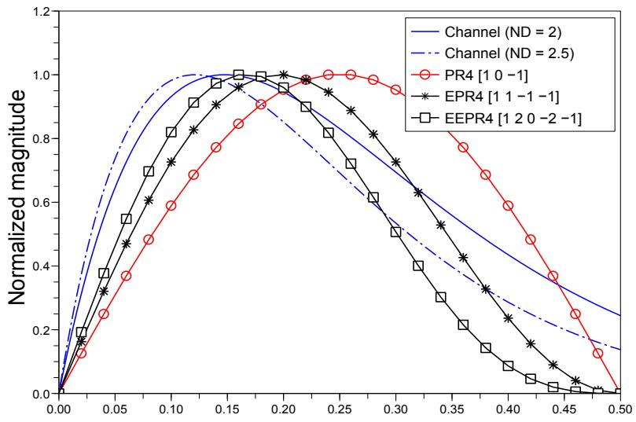
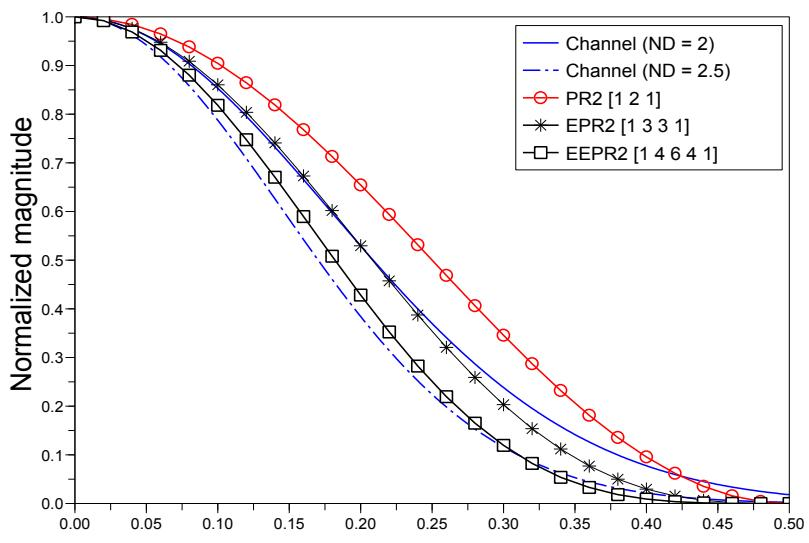
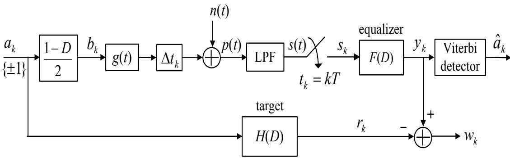
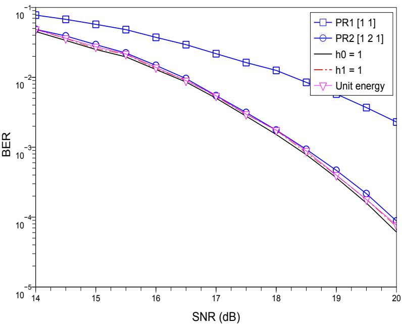
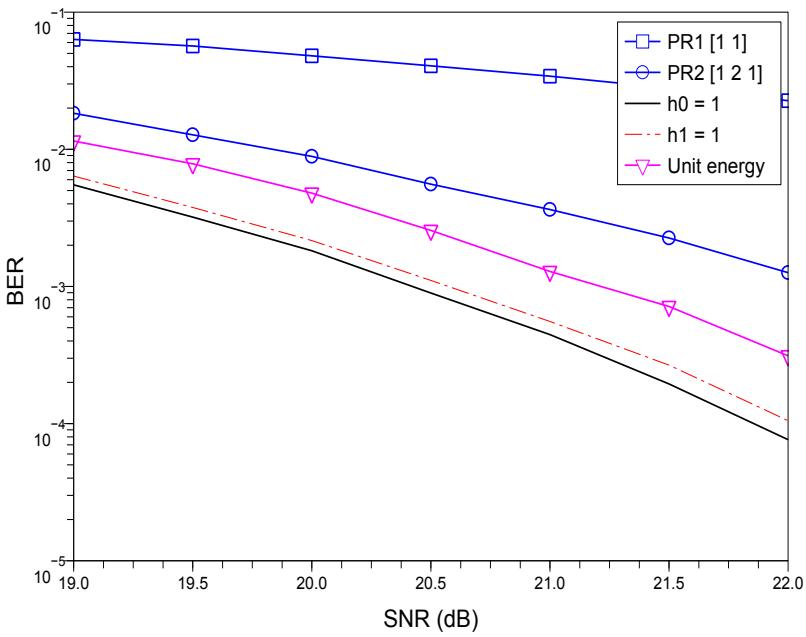
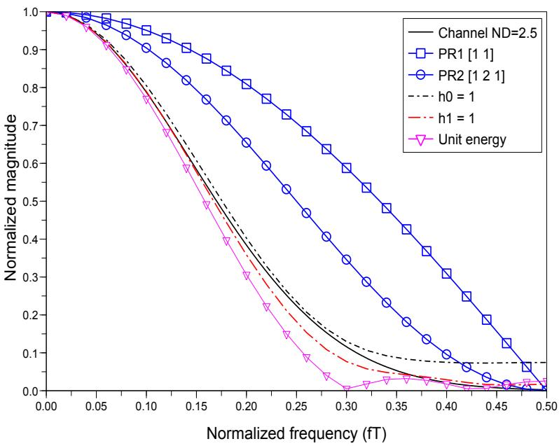
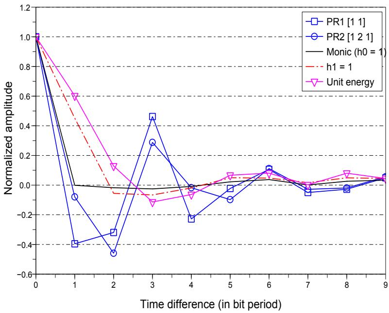
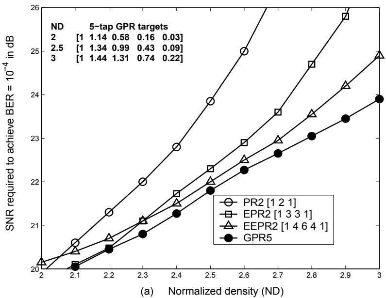
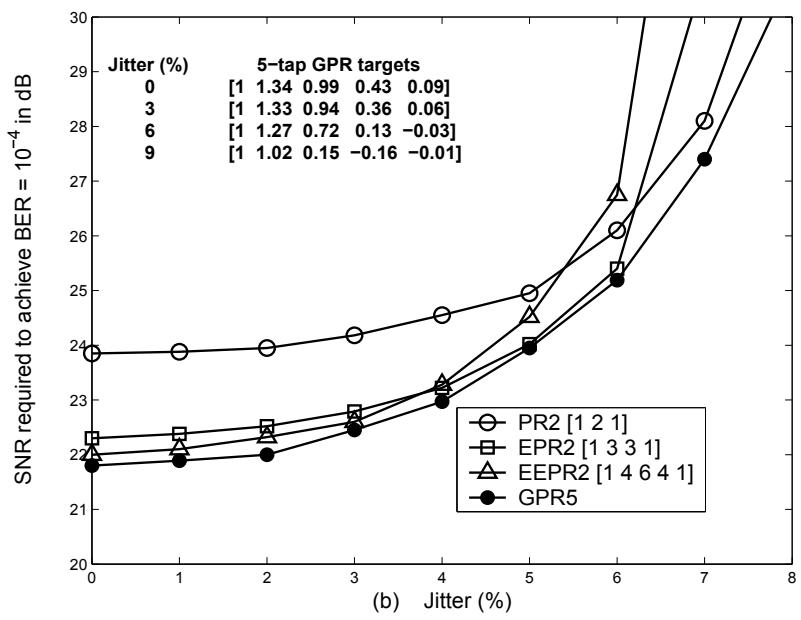

## 3.1บทนำ

ในระบบการประมวลผลสัญญาณของฮาร์ดดิสก์ไดรฟ์ วงจรตรวจหาวีเทอร์บิ (Viterbi detector) [15] จะถูกนำมาใช้งานร่วมกันกับอีควอไลเซอร์แบบ PR (partial-response equalizer) ซึ่งอีควอไลเซอร์ นี้ ก็คือ วงจรกรองแบบเชิงเส้น (linear fIlter) ที่ทำหน้าที่ในการปรับรูปร่างของผลตอบสนองรวมของ ช่องสัญญาณให้อยู่ในรูปของผลตอบสนองที่ต้องการ หรือที่เรียกกันว่า "ทาร์เก็ต (target)" จากนั้น วงจร ตรวจหาวีเทอร์บิก็ จะ นำเอาข้อมูล เอาต์พุตของอีควอไลเซอร์มาทำการตรวจหาลำดับ (sequence detection) แบบควรจะ เป็นมากสุด (ML: maximum-likelihood) เพื่อคำนวณหาลำดับข้อมูลอินพุต ที่ส่งมาจากวงจรภาคส่ง ขั้นตอนทั้ง 2 นี้รวมเรียกกันว่า "เทคนิคผลตอบสนองบางส่วนควรจะเป็น มากสุด (PRML: partial-response maximum-likelihood)" ซึ่งถือว่าเป็นหัวใจสำคัญ ของระบบการ ประมวลผลสัญญาณของฮาร์ดดิสก์ไดรฟ์ในปัจจุบัน

ทาร์เก็ตแบบ PR ทีเป็นที่ยอมรับกันในระบบการบันทึกแบบแนวนอน (1ongitนdiกal recording) จะอยูในรูปของพหุนาม (polynomial)

$$
H ( D ) = ( 1 - D ) ( 1 + D ) ^ { n }\tag{3.1}
$$

โดยที่ n คือ เลขจำนวนเต็มบวก และ D คือ ตัวดำเนินการหน่วงเวลา (delay operator) จากสมการ (3.1) จะพบว่า ผลตอบสนองเชิงความถี่ของทาร์เก็ตนี้จะมีสเปกตรัมค่าศูนย์ (รpectral ทนll) ณ ความถี ค่าศูนย์และความถีในควิตส์ (Nyquist frequency) เนื่องจาก มีพจน์ที่เป็น (1– D) และ (1+ D) ตาม ลำดับ ในขณะที่ สัญญาณ read-back ของระบบการบันทึกแบบแนวตั้ง (perpendicular recording) จะมีองค์ประกอบของไฟฟ้ากระแสตรง (d.c. component) ดังนั้น พจน์ (1 – D) จึงไม่จำเป็นสำหรับ ระบบการบันทึกแบบแนวตั้ง เพราะฉะนั้น ทาร์เก็ตแบบ PR ที่เป็นที่ยอมรับในระบบการบันทึกแบบ แนวตั้ง จะอยู่ในรูปของพหุนาม

$$
H ( D ) = ( 1 + D ) ^ { n }\tag{3.2}
$$

ตารางที่ 3.1 แสดงทาร์เก็ตแบบ PR ที่เป็นที่ยอมรับกันทั่วไป ในระบบการบันทึกแบบแนวนอน และแบบแนวตั้ง และรูปที่ 3.1 แสดงผลตอบสนองเชิงความถี่ของทาร์เก็ตแบบต่างๆ เมื่อเปรียบเทียบ กับผลตอบสนองเชิงความถี ของช่องสัญญาณที ND = 2 และ 2.5 จากรูปที่ 3.1 จะ พบว่า เมื่อ ค่า ND ของช่องสัญญาณมีค่าเพิ่มขึ้น ทาร์เก็ตที่ใช้ก็ควรที่จะมีจำนวนแท็ปมากขึ้น (ค่า n มากขึ้น) เพื่อที่จะทำให้มีผลตอบสนองเชิงความถี่ที่สอดคล้องกับผลตอบสนองเชิงความถี่ของช่องสัญญาณให้ มากที่สุด อย่างไรก็ตาม ทาร์เก็ตที่ใช้ไม่ควรที่จะมีจำนวนแท็ปมากเกินความจำเป็น เพราะจะส่งผลทำ ให้วงจรตรวจหาวีเทอร์บิมีความซับซ้อน (complexity) มากขึ้น ซึ่งจะอธิบายต่อไปในบทที่ 4

จากสมการ (3.1) และ (3.2) สังเกตจะ พบว่าทาร์เก็ตแบบ PR จะ มีค่าสัมประสิทธิ์ของแต่ละแท็ป   
เป็นเลขจำนวนเต็ม แต่ถ้าระบบ PRML ยอมใช้ทาร์เก็ตที่มีค่าสัมประสิทธิ์ของแต่ละแท็ปเป็นเลขจำนวน รู้   
จริงจะพบว่าทาร์เก็ตแบบนี้จะ สามารถช่วยเพิ่มประสิทธิภาพรวมของระบบได้มากโดยเฉพาะอย่างยิ่ง

ตารางที่ 3.1: ตัวอย่างทาร์เก็ตแบบ PR ที่เป็นที่ยอมรับกันในฮาร์ดดิสก์ไดรฟ์
<table><tr><td rowspan=1 colspan=1>ทาร์เก็ตแบบ PR</td><td rowspan=1 colspan=1> $n = 1$ </td><td rowspan=1 colspan=1> $n = 2$ </td><td rowspan=1 colspan=1> $n = 3$ </td></tr><tr><td rowspan=1 colspan=1>ระบบการบันทึกแบบแนวนอน</td><td rowspan=1 colspan=1> $\mathsf { P R 4 } \ [ 1 \ 0 \ - \ 1 ]$  $1 - D ^ { 2 }$ </td><td rowspan=1 colspan=1>EPR4 [1 1 − 1 − 1] $1 + D - D ^ { 2 } - D ^ { 3 }$ </td><td rowspan=1 colspan=1>EEPR4 $[ 1 ~ 2 ~ 0 ~ - 2 ~ - 1 ]$  $1 + 2 D - 2 D ^ { 3 } - D ^ { 4 }$ </td></tr><tr><td rowspan=1 colspan=1>ระบบการบันทีกแบแนวตั้ง</td><td rowspan=1 colspan=1>PR1 [1 1] $1 + D$ </td><td rowspan=1 colspan=1>PR2 [1 2 1] $1 + 2 D + D ^ { 2 }$ </td><td rowspan=1 colspan=1>EPR2 [1 3 3 1] $1 + 3 D + 3 D ^ { 2 } + D ^ { 3 }$ </td></tr></table>

ที่ND สูงๆ โดยทาร์เก็ตลักษณะนี้จะเรียกกันทั่วไปว่า "ทาร์เก็ตแบบ GPR (generalized partialresponse)" ซึ่งสามารถที่จะหาได้จากหลายวิธีการ เช่น [41, 42, 43, 44, 45, 46]

1) การออกแบบทาร์เก็ตโดยให้ผล ตอบสนองทาร์เก็ต (target response) มีรูปร่างเหมือนกับผล ตอบสนองการเปลี่ยนสถานะ (transition response) หรือผลตอบสนองไดบิต (dibit response) ของช่องสัญญาณ ทั้งในโดเมนเวลา (time domain) และโดเมนความถี่ (frequency domain)

วิธีการนี้จะทำการหาทาร์เก็ตที่มีรูปร่างของผลตอบสนองทาร์เก็ตเหมือนกับผลตอบสนอง การเปลี่ยนสถานะหรือผลตอบสนองไดบิตของช่องสัญญาณแต่ละ ND ทั้งในโดเมนเวลาและ โดเมนความถี่ ตัวอย่างเช่นในระบบการบันทึกแบบแนวตั้ง ทาร์เก็ตที่สอดคล้องกับผลตอบสนอง ไดบิต [43] ในโดเมนเวลา ได้แก่ [1 −4 1], [1 −2 −2 1], และ [1 0 -8 0 1] เป็นต้น นอกจากนี้ ทาร์เก็ตบางแบบอาจจะ ไม่สอดคล้องกับผลตอบสนองของช่องสัญญาณในโดเมน เวลา แต่จะสอดคล้องกับผลตอบสนองของช่องสัญญาณในโดเมนความถี่มากก็ได้ ในทางปฏิบัติ ความสอดคล้องกับผลตอบสนองของช่องสัญญาณในโดเมนความถี่เป็นสิ่งที่ต้องการมากกว่า ความสอดคล้องในโดเมนเวลา เนื่องจาก จะ ช่วยบอกให้ทราบถึงคุณสมบัติเกี่ยวกับอัตราการ ขยายสัญญาณรบกวน (noise enhancement) ได้

2) การออกแบบทาร์เก็ตที่ทำให้กำลังรวมของสัญญาณรบกวนที่ด้านขาออกของอีควอไลเซอร์มีค่า น้อยที่สุด

วิธีการนี้จะสมมุติว่า นักออกแบบระบบทราบว่าช่องสัญญาณคืออะไร เพื่อที่จะได้นำเอา ช่องสัญญาณนั้นมาใช้ในการคำนวณหาฟังก์ชันถ่ายโอนของอีควอไลเซอร์ จากนั้น ก็จะทำการ คำนวณหากำลังรวมของสัญญาณรบกวนที่ด้านขาออกของอีควอไลเซอร์ และ เมื่อได้กำลังรวม

  
(a) Normalized frequency (fT)

  
(b) Normalized frequency (fT)  
รูปที่ 3.1: ผลตอบสนองเชิงความถี่ของทาร์เก็ตแบบต่างๆ สำหรับระบบบันทึก (a) แบบแนวนอน และ

9 ของสัญญาณรบกวนที่อยูในรูปของสมการทางคณิตศาสตร์แล้ว ก็จะทำการหาค่าสัมประสิทธิ ของทาร์เก็ตที่ทำให้กำลังรวมของสัญญาณรบกวนมีค่าน้อยที่สุด โดยใช้เทคนิคการหาอนุพันธ์ (differeทtiลtion) สำหรับรายละ เอียดของวิธีการนี้สามารถศึกษาเพิ่มเติมได้จาก [41]

3) การออกแบบทาร์เก็ตที่ ทำให้ค่า SNR ประสิทธิผล (effective SNR) ที่ด้านขาออกของวงจร ตรวจหาวีเทอร์บิมีค่ามากที่สุด

วิธีการออกแบบทาร์เก็ตแบบต่างๆ ตามที่กล่าวมาข้างต้นนี้ ไม่ได้รับประกันว่า ประสิทธิ ภาพรวมของระบบในรูปของอัตราข้อผิดพลาดบิต (BER: bit error-rate) ที่ด้านขาออก ของ วงจรตรวจหาวีเทอร์บิจะมีค่าน้อยที่สุด ใน [19, 42] ได้เสนอวิธีการหา "ทาร์เก็ตที่เหมาะที่สุด (optimal target)" ที่จะทำให้ค่า รNR ประสิทธิผลที่ด้านขาออกของวงจรตรวจหาวีเทอร์บิมีค่า มากทีสุด หรืออีกนัยหนึงก็คือ ทาร์เก็ตทีทำให้ BER ของระบบ เมือวัดที่ด้านขาออกของวงจร ตรวจหาวีเทอร์บิมีค่าน้อยที่สุด สำหรับผู้สนใจสามารถศึกษารายละเอียดเพิ่มเติมได้ใน [19, 42]

4) การออกแบบทาร์เก็ตที่ทำให้ข้อผิดพลาดกำลังสองเฉลี่ย (MSE: mean-squared error) ระหว่าง สัญญาณที่ด้านขาออกของอีควอไลเซอร์และสัญญาณที่ต้องการ (นั้นคือ สัญญาณตามทาร์เก็ต ที่ต้องการ) มีค่าน้อยที่สุด

จากการศึกษาพบว่า วิธีการนี้เป็นวิธีการที่ง่ายและเหมาะสำหรับการนำมาใช้งานจริงใน   
ทางปฏิบัติ [19] นอกจากนี้ ทาร์เก็ตที่ได้จะ มีประสิทธิภาพใกล้เคียงกับทาร์เก็ตที่เหมาะ ที่สุด ปี่น   
วิธีการออกแบบทาร์เก็ตแบบนี้จะรู้จักกันในชื่อว่า วิธีการ "ข้อผิดพลาดกำลังสองเฉลี่ยที่น้อย   
สุด (MMรE: minimum mean-squared error)" ซึ่งจะอธิบายรายละเอียดวิธีการนี้ ดังต่อไปนี้

## 3.2 การออกแบบทาร์เก็ตด้วยวิธีการ MMSE

การออกแบบทาร์เก็ตด้วยวิธีการ MMรE [19] จะทำให้ได้ทาร์เก็ตหลายรูปแบบตามเงื่อนไขบังคับ (Cconstraint) ที่กำหนดลงไปในระหว่างกระบวนการออกแบบ ให้พิจารณาแบบจำลองระบบในรูปที่ 3.2 โดย ที่ อีควอไลเซอร์จะพยายามสร้างข้อมูลเอาต์พุต $y _ { k }$ ให้มีค่าใกล้เคียงกับข้อมูลที่ต้องการ $r _ { k }$ ให้มากที่สุด โดยปราศจากการขยายสัญญาณรบกวน ถ้ากำหนดให้อีควอไลเซอร์มีจำนวนแท็ปเท่ากับ $N = 2 K + 1$ แท็ป และสมมุติให้แท็ปศูนย์กลางอยู่ที่เวลา $k = 0$ เพราะฉะนั้น อีควอไลเซอร์สามารถที่จะเขียนให้ อยูในรูปสมการทางคณิตศาสตร์ในโดเมน D ได้ คือ

  
รูปที่ 3.2: แบบจำลองสำหรับการออกแบบทาร์เก็ตด้วยวิธีการ MMSE

$$
F ( D ) = \sum _ { k = - K } ^ { K } f _ { k } D ^ { k }\tag{3.3}
$$

เมื่อ D คือ ตัวดำเนินการหน่วงเวลา $T$ หน่วย ในทำนองเดียวกัน ทาร์เก็ตที่มีจำนวนแท็ปเท่ากับ 1 แท็ป ก็จะสามารถเขียนให้อยู่ในรูปของฟังก์ชันในโดเมน D ได้ คือ

$$
H ( D ) = \sum _ { k = 0 } ^ { L - 1 } h _ { k } D ^ { k }\tag{3.4}
$$

โดยที่ $f _ { k }$ และ $h _ { k }$ เป็นค่าสัมประสิทธ์ที่เป็นเลขจำนวนจริงในแตละแท็ปของอีควอไลเซอร์และทาร์เก็ต ตามลำดับจดประสงค์ในการออกแบบทาร์เก็ตด้วยวิธีการ MMรEคือ จะ ทำการคำนวณหาค่าสัมประ สิทธิ์ ของ F(D) และ H(D) ไปพร้อมกันในเวลาเดียวกันโดยการทำให้ค่า MรE ระหว่างข้อมูล เอาต์พุตของอีควอไลเซอร์ $y _ { k }$ และ ข้อมูลเอาต์พุตของทาร์เก็ต $r _ { k }$ มีค่าน้อยที่สุด หรืออีกนัยหนึ่งคือ ค่าสัมประสิทธิ์ $f _ { k }$ and $h _ { k }$ จะถูกเลือก เพื่อที่ทำให้ค่า

$$
E \left[ w _ { k } ^ { 2 } \right] = E \left[ \left\{ ( s _ { k } * f _ { k } ) - ( a _ { k } * h _ { k } ) \right\} ^ { 2 } \right]\tag{3.5}
$$

มีค่าน้อยที่สุด เมื่อ $\boldsymbol { w } _ { k } = \boldsymbol { y } _ { k } - \boldsymbol { r } _ { k }$ คือ ข้อผิดพลาดที่ได้จากการออกแบบทาร์เก็ต, \* คือ ตัวดำเนินการ e คอนโวลูชัน (convolution Operator), และ E[] คือ ตัวดำเนินการค่าคาดหมาย (expectation operator)

## 3.2. การออกแบบทาร์เก็ตด้วยวิธีการ MMรE

ถ้ากำหนดให้เวกเตอร์แนวตั้ง $\mathbf { H } = \left[ h _ { 0 } , h _ { 1 } , \cdots , h _ { L - 1 } \right] ^ { \mathrm { T } }$ และ $\mathbf { F } = [ f _ { - K } , \cdot \cdot \cdot , f _ { 0 } , \cdot \cdot \cdot , f _ { K } ] ^ { \mathrm { T } }$ โดยที่ $h _ { k }$ and $f _ { k }$ คือค่าสัมประสิทธิ์ของ $H ( D )$ and $F ( D )$ ตามลำดับ, และ $[ \cdot ] ^ { \mathrm { T } }$ คือเครื่องหมาย เมทริกซ์สลับเปลี่ยน (transpose matrix) ในบทนี้จะกำหนดให้ $K = 1 0$ (อีควอไลเซอร์มีทั้งหมด 21 แท็ป) ถ้ากำหนดให้ R คือ เมทริกซ์อัตสหสัมพันธ์ (auto-correlation matrix) ขนาด $N \times N$ ของ ข้อมูล $s _ { k }$ ,A คือ เมทริกซ์อัตสหสัมพันธ์ขนาด $L \times L$ ของข้อมูล ak, และ P คือ เมทริกซัสหสัมพันธ์ $a _ { k }$ ข้าม (cross-correlation matrix) ขนาด $N \times L$ ระหว่างข้อมูล $s _ { k }$ และ $a _ { k }$ โดยที่ สมาชิก (i, j) (แถว ที่ และแนวตั้งที่ $j )$ ของเมทริกซ์ทั้งสามนี้ คือ

$$
\begin{array} { r c l } { { { \bf { R } } } ( i , j ) } & { = } & { { \displaystyle E \left[ \sum _ { k = 0 } ^ { S - 1 } s _ { k + K - i } \right]} { s _ { k + K - j } }  , \quad - K \le i , j \le K } \end{array}\tag{3.6}
$$

$$
\mathbf { A } ( i , j ) ~ = ~ E \left[ \sum _ { k = 0 } ^ { S - 1 } a _ { k - i } a _ { k - j } \right] , ~ 0 \leq i , j \leq L - 1\tag{3.7}
$$

$$
\mathbf { P } ( i , j ) ~ = ~ E \left[ \sum _ { k = 0 } ^ { S - 1 } s _ { k + K - i } a _ { k - j } \right] , ~ - K \leq i \leq K , ~ 0 \leq j \leq L - 1\tag{3.8}
$$

เมิ่อ 4 $S$ คือ ความยาว (หรือจำนวนบิต) ของลำดับข้อมูลอินพุต {ak}

จากตัวแปรที่กำหนดให้ข้างต้นนี้ สมการ (3.5) สามารถที่จะเขียนให้อยู่ในรูปของเมทริกซ์ได้ ดังนี้

$$
E [ w ^ { 2 } ] = \mathbf { F } ^ { \mathrm { T } } \mathbf { R } \mathbf { F } + \mathbf { H } ^ { \mathrm { T } } \mathbf { A } \mathbf { H } - 2 \mathbf { F } ^ { \mathrm { T } } \mathbf { P } \mathbf { H }\tag{3.9}
$$

ในการทำให้ค่า $E [ w ^ { 2 } ]$ มีค่าน้อยที่สุดโดยเทียบกับ F และ H จะต้องมีการกำหนดเงื่อนไขบังคับเข้าไป ในระหว่างกระบวนการทำให้มีค่าน้อยสุด (minimizatioก process) เพื่อที่จะ หลีกเลี่ยงการได้ผลลัพธ์ เป็น $\mathbf { F } = \mathbf { 0 }$ และ $\mathbf H = \mathbf 0$ ในส่วนนี้จะอธิบายถึงเงื่อนไขบังคับที่น่าสนใจ ที่ใช้ในการคำนวณหาค่า F และ G ดังต่อไปนี้

## 3.2.1 เงื่อนไขบังคับแบบโมนิก $( h _ { 0 } = 1 )$

เงื่อนไขบังคับแบบโมนิก (monic constraint) จะกำหนดให้ค่าสัมประสิทธิ์ของแท็ปตัวแรกของทาร์เก็ต มีค่าเท่ากับค่าหนึ่ง นันคือ $h _ { 0 } = 1 ~ [ 1 9 ]$ ถ้ากำหนดให้เวกเตอร์แนวตั้ง I ขนาด $L \times 1$ ที่มีสมาชิกตัว แรกมีค่าเท่ากับค่าหนึ่ง ส่วนสมาชิกตัวอื่นๆ มีค่าเท่ากับค่าศูนย์ กล่าวคือ $\mathbf { I } = [ 1 , 0 , \cdots , 0 ] ^ { \mathrm { T } }$ ดังนั้น เงื่อนไขบังคับแบบโมนิกนี้สามารถเขียนให้อยู่ในรูปของเมทริกซ์ได้ คือ $\mathbf { I } ^ { \mathrm { T } } \mathbf { H } = 1$

กระบวนการในการออกแบบทาร์เก็ตด้วยวิธีการ $\ddot { \ P }$ คือ การทำให้ค่า MSE ในสมการ (3.9) มีค่า น้อยที่สุด โดยพยายามรักษาให้ค่า $\mathbf { I } ^ { \mathrm { T } } \mathbf { H } = 1$ อยู่ตลอดเวลา นั่นคือ กระบวนการนี้จะทำให้ค่า

$$
E [ w ^ { 2 } ] = \mathbf { F } ^ { \mathrm { T } } \mathbf { R } \mathbf { F } + \mathbf { H } ^ { \mathrm { T } } \mathbf { A } \mathbf { H } - 2 \mathbf { F } ^ { \mathrm { T } } \mathbf { P } \mathbf { H } - 2 \lambda ( \mathbf { I } ^ { \mathrm { T } } \mathbf { H } - 1 )\tag{3.10}
$$

มีค่าน้อยที่สุด โดยที่ $\lambda$ คือ ตัวคูณ ลากรานจ์ (Lagrange multiplier) เป็นค่าส เกลาร์ (scalar) การ ทำให้สมการ (3.10) มีค่าน้อยที่สุด สามารถทำได้โดยการหาอนุพันธ์ (differentiation) ของสมการ (3.10) เทียบกับ F, H, และ X ตามลำดับ ซึ่งจะได้ผลลัพธ์ดังนี้ (รายละเอียดในภาคผนวก ค)

$$
\frac { \partial \left( E [ w ^ { 2 } ] \right) } { \partial \mathbf { F } } = 2 \mathbf { R } \mathbf { F } - 2 \mathbf { P } \mathbf { H }\tag{3.11}
$$

$$
\frac { \partial \left( E [ w ^ { 2 } ] \right) } { \partial \mathbf { H } } = 2 \mathbf { A } \mathbf { H } - 2 \mathbf { P } ^ { \mathrm { T } } \mathbf { F } - 2 \lambda \mathbf { I }\tag{3.12}
$$

$$
\frac { \partial \left( E [ w ^ { 2 } ] \right) } { \partial \lambda } = - 2 { \bf I ^ { \mathrm { T } } H } + 2\tag{3.13}
$$

จากนั้นก็กำหนดให้ ผลลัพธ์ ของอนุพันธ์ ทั้งหมดที่ได้จากสมการ (3.11) - (3.13) มีค่าเป็นค่าศูนย์ นั่นคือ กำหนดให้สมการ (3.11) มีค่าเท่ากับค่าศูนย์ จะได้ว่า

$$
\begin{array} { r c l } { { 2 \mathbf { R } \mathbf { F } - 2 \mathbf { P } \mathbf { H } } } & { { = } } & { { 0 } } \\ { { } } & { { } } & { { } } \\ { { \mathbf { R } \mathbf { F } } } & { { = } } & { { \mathbf { P } \mathbf { H } } } \\ { { } } & { { } } & { { } } \\ { { \mathbf { F } } } & { { = } } & { { \mathbf { R } ^ { - 1 } \mathbf { P } \mathbf { H } } } \end{array}\tag{3.14}
$$

และกำหนดให้สมการ (3.12) มีค่าเท่ากับค่าศูนย์ จะได้ว่า

$$
\begin{array} { r l r } { 2 \mathbf { A } \mathbf { H } - 2 \mathbf { P } ^ { \mathrm { T } } \mathbf { F } - 2 \lambda \mathbf { I } } & { = } & { 0 } \\ & { } & { \mathbf { A } \mathbf { H } - \mathbf { P } ^ { \mathrm { T } } \mathbf { F } = \lambda \mathbf { I } } \end{array}\tag{3.15}
$$

แทนค่า F จากสมการ (3.14) ลงในสมการ (3.15) จะได้

$$
{ \begin{array} { r l r l } { \mathbf { A H } - \mathbf { P } ^ { \mathrm { T } } \left( \mathbf { R } ^ { - 1 } \mathbf { P } \mathbf { H } \right) } & { = } & { \lambda \mathbf { I } } & & { } \\ & { \left( \mathbf { A } - \mathbf { P } ^ { \mathrm { T } } \mathbf { R } ^ { - 1 } \mathbf { P } \right) \mathbf { H } } & { = } & { \lambda \mathbf { I } } & & { } \\ & { \mathbf { H } } & { = } & { \lambda \left( \mathbf { A } - \mathbf { P } ^ { \mathrm { T } } \mathbf { R } ^ { - 1 } \mathbf { P } \right) ^ { - 1 } \mathbf { I } } \end{array} }\tag{3.16}
$$

ในทำนองเดียวกัน กำหนดให้สมการ (3.13) มีค่าเท่ากับค่าศูนย์ จะได้ว่า

$$
\begin{array} { r l r } { - 2 { \bf I } ^ { \mathrm { T } } { \bf H } + 2 } & { = } & { 0 } \\ & { } & { \qquad } \\ { { \bf I } ^ { \mathrm { T } } { \bf H } } & { = } & { 1 } \end{array}\tag{3.17}
$$

แทนค่า H จากสมการ (3.16) ลงในสมการ (3.17) จะได้

$$
\begin{array} { r c l } { { { \bf { I } } ^ { \mathrm { { T } } } } \lambda \left( { { \bf { A } } - { { \bf { P } } ^ { \mathrm { { T } } } } { { \bf { R } } ^ { - 1 } } { { \bf { P } } } } \right) ^ { - 1 } { \bf { I } } } & { { = } } & { { 1 } } \\ { { \lambda } } & { { = } } & { { \frac { 1 } { { \bf { I } } ^ { \mathrm { { T } } } ( { \bf { A } } - { { \bf { P } } ^ { \mathrm { { T } } } } { \bf { R } } ^ { - 1 } { { \bf { P } } } ) ^ { - 1 } { \bf { I } } } } } \end{array}\tag{3.18}
$$

เพราะฉะนั้นโดยสรุปแล้ว ขั้นตอนในการออกแบบทาร์เก็ตและอีควอไลเซอร์สำหรับเงื่อนไขบังคับแบบ โมนิก $( h _ { 0 } = 1 )$ คือ

1) กำหนดจำนวนแท็ปของทาร์เก็ตและอีควอไลเซอร์ (ค่า L และ N) นั้นคือสร้างเวกเตอร์ F และ H

2) หาค่าเมทริกซ์ R, A, และ P จากสมการ (3.6) - (3.8)

3) สร้างเวกเตอร์ ${ \bf I } = [ 1 , 0 , \cdots , 0 ] ^ { \mathrm { T } }$ ขนาด $L \times 1$

4) หาค่าตัวคูณลากรานจ์ λ จากสมการ (3.18) นั้นคือ

$$
\lambda = \frac { 1 } { \mathbf { I } ^ { \mathrm { T } } ( \mathbf { A } - \mathbf { P } ^ { \mathrm { T } } \mathbf { R } ^ { - 1 } \mathbf { P } ) ^ { - 1 } \mathbf { I } }\tag{3.19}
$$

5) หาค่าทาร์เก็ต H จากสมการ (3.16) นั้นคือ

$$
\mathbf { H } = \lambda ( \mathbf { A } - \mathbf { P } ^ { \mathrm { T } } \mathbf { R } ^ { - 1 } \mathbf { P } ) ^ { - 1 } \mathbf { I }\tag{3.20}
$$

6) หาค่าอีควอไลเซอร์ F จากสมการ (3.14) นั้นคือ

$$
{ \bf F } = { \bf R } ^ { - 1 } { \bf P } { \bf H }\tag{3.21}
$$

ค่า A ที่ได้จากสมการ (3.19) เป็นค่า MMSE ที่ได้ภายใต้เงื่อนไขบังคับนี้ ซึ่งสามารถพิสูจน์ได้โดย การแทนค่า F and H จากสมการ (3.20) - (3.21) ลงในสมการ (3.9) นั้นคือ

$$
\begin{array} { r c l } { { E [ w ^ { 2 } ] } } & { { = } } & { { ( \mathbf { R } ^ { - 1 } \mathbf { P H } ) ^ { \mathrm { T } } \mathbf { R } ( \mathbf { R } ^ { - 1 } \mathbf { P H } ) + \mathbf { H } ^ { \mathrm { T } } \mathbf { A } \mathbf { H } - 2 ( \mathbf { R } ^ { - 1 } \mathbf { P H } ) ^ { \mathrm { T } } \mathbf { P H } } } \\ { { } } & { { = } } & { { \mathbf { H } ^ { \mathrm { T } } \mathbf { P } ^ { \mathrm { T } } ( \mathbf { R } ^ { - 1 } ) ^ { \mathrm { T } } \mathbf { P H } + \mathbf { H } ^ { \mathrm { T } } \mathbf { A } \mathbf { H } - 2 \mathbf { H } ^ { \mathrm { T } } \mathbf { P } ^ { \mathrm { T } } ( \mathbf { R } ^ { - 1 } ) ^ { \mathrm { T } } \mathbf { P H } } } \\ { { } } & { { = } } & { { \mathbf { H } ^ { \mathrm { T } } ( \mathbf { A } - \mathbf { P } ^ { \mathrm { T } } \mathbf { R } ^ { - 1 } \mathbf { P } ) \mathbf { H } } } \\ { { } } & { { = } } & { { \lambda ^ { 2 } \left\{ [ \Gamma ^ { \mathrm { T } } ( \mathbf { A } - \mathbf { P } ^ { \mathrm { T } } \mathbf { R } ^ { - 1 } \mathbf { P } ) ^ { - 1 } ] ^ { \mathrm { T } } ( \mathbf { A } - \mathbf { P } ^ { \mathrm { T } } \mathbf { R } ^ { - 1 } \mathbf { P } ) ( \mathbf { A } - \mathbf { P } ^ { \mathrm { T } } \mathbf { R } ^ { - 1 } \mathbf { P } ) ^ { - 1 } \mathbf { I } \right\} } } \\ { { } } & { { = } } & { { \lambda ^ { 2 } \left\{ \mathbf { I } ^ { \mathrm { T } } ( \mathbf { A } - \mathbf { P } ^ { \mathrm { T } } \mathbf { R } ^ { - 1 } \mathbf { P } ) ^ { - 1 } \mathbf { I } \right\} } } \\ { { } } & { { = } } & { { \lambda } } \end{array}\tag{3.22}
$$

สมการ (3.22) หาได้โดยอาศัยหลักความจริงที่ว่า เมทริกซ์ R และ A เป็นเมทริกซ์อัตสหสัมพันธ์แบบ สมมาตร นอกจากนี้ เมทริกซ์ R, A และ P ยังเป็นเมทริกซ์แบบ Toeplitz2 ซึ่งจะทำให้ได้ว่า $( \mathbf { R } ^ { - 1 } ) ^ { \mathrm { T } }$ $= \mathbf { R } ^ { - 1 } \mathbf { \updownarrow } \mathbf { \updownarrow } \mathbf { \updownarrow } \mathbf { \updownarrow } \mathbf { \updownarrow } = \mathbf { \left[ ( A - P ^ { \mathrm { T } } R ^ { - 1 } P ) ^ { - 1 } \right] } ^ { \mathrm { T } } = ( \mathbf { A } - \mathbf { P } ^ { \mathrm { T } } \mathbf { R } ^ { - 1 } \mathbf { P } ) ^ { + }$ -1

## 3.2.2 เงื่อนไขบังคับแบบ $h _ { 1 } = 1$

เงื่อนไขบังคับแบบ $h _ { 1 } = 1$ จะกำหนดให้ค่าสัมประสิทธิของแท็ปตัวสองของทาร์เก็ตมีค่าเท่ากับค่าหนึ่ง นั่นคือ $h _ { 1 } = 1$ [19] ส่วนค่าสัมประสิทธิ์ของแท็ปตัวอื่นๆ จะเป็นค่าอะไรก็ได้ โดยเงื่อนไขบังคับนี้มี วัตถประสงค์เพื่อใช้ในการเปรียบเทียบประสิทธิภาพของทาร์เก็ตแบบต่างๆ ถ้ากำหนดให้เวกเตอร์แนว ตั้ง J ขนาด $L \times 1$ ที่สมาชิกตัวที่สองมีค่าเท่ากับค่าหนึ่ง ส่วนสมาชิกอื่นๆ มีค่าเป็นค่าศูนย์ กล่าวคือ $\mathbf { J } = [ 0 , 1 , 0 , \cdots , 0 ] ^ { \mathrm { T } }$ ดังนั้น เงื่อนไขบังคับแบบ $h _ { 1 } = 1$ สามารถเขียนให้อยู่ในรูปของเมทริกซ์ได้ คือ $\mathbf { J } ^ { \mathrm { T } } \mathbf { H } = 1$

กระบวนการในการออกแบบทาร์เก็ตโดยเงื่อนไขบังคับนี้จะเหมือนกับการออกแบบทาร์เก็ตโดยใช้ เงื่อนไขบังคับแบบโมนิก เพียงแต่เปลี่ยนพจน์สุดท้ายในสมการ (3.10) จาก $2 \lambda ( \mathbf { I } ^ { \mathrm { T } } \mathbf { H } - 1 )$ ไปเป็น $2 \lambda ( \mathbf { J } ^ { \mathrm { T } } \mathbf { H } - 1 )$ ดังนั้น ผลลัพธ์ที่ได้ก็จะเหมือนกับสมการ (3.19) - (3.21) เพียงแต่เปลี่ยนเวกเตอร์ 1 เป็นเวกเตอร์ J

## 3.2.3 เงื่อนไขบังคับแบบพลังงานหนึ่งหน่วย $( \mathbf { H } ^ { \mathrm { T } } \mathbf { H } = 1 )$

เงื่อนไขบังคับแบบพลังงานหนึ่งหน่วย (นทit eทergy) สามารถเขียนให้อยู่ในรูปของเมทริกซ์ได้ คือ ${ \bf H } ^ { \mathrm { T } } { \bf H } = 1$ ซึ่งเป็นการกำหนดให้พลังงานของทาร์เก็ตมีค่าเท่ากับค่าหนึ่ง [19, 46]

กระบวนการในการออกแบบทาร์เก็ตด้วยวิธีการนี้ คือ การทำให้ค่า MSE ในสมการ (3.9) มีค่า น้อยที่สุด โดยที่ พยายามรักษาให้ค่า ${ \bf H } ^ { \mathrm { T } } { \bf H } = 1$ ตลอดเวลา กล่าวคือ กระบวนการนี้จะทำให้ค่า

$$
E [ w ^ { 2 } ] = \mathbf { F } ^ { \mathrm { T } } \mathbf { R } \mathbf { F } + \mathbf { H } ^ { \mathrm { T } } \mathbf { A } \mathbf { H } - 2 \mathbf { F } ^ { \mathrm { T } } \mathbf { P } \mathbf { H } - 2 \lambda ( \mathbf { H } ^ { T } \mathbf { H } - 1 )\tag{3.23}
$$

มีค่าต่ำสุด ซึ่งสามารถทำได้โดยการหาอนุพันธ์ของสมการ (3.23) เทียบกับ F, H, และ λ ตามลำดับ แล้วกำหนดให้ผลลัพธ์ ของอนุพันธ์ ทั้งหมดที่ได้มีค่าเป็นค่าศูนย์ โดยเมื่อทำตามขั้นตอนนี้แล้ว จะ พบ 4 น ว่า ทาร์เก็ตและอีควอไลเซอร์ สามารถหาได้จากการแก้สมการ

$$
( \mathbf { A } - \mathbf { P } ^ { \mathrm { T } } \mathbf { R } ^ { - 1 } \mathbf { P } ) \mathbf { H } = \lambda \mathbf { H }\tag{3.24}
$$

ซึ่งการแก้สมการนี้มีลักษณะคล้ายกับ "การแก้ปัญหาค่าลักษณะเฉพาะ (eigeทvalue problem)" [12, 25] โดยที่ ค่า λ ในสมการ (3.24) สามารถพิสูจน์ได้ว่า คือ ค่า MMรE นั้นเอง ดังนั้น จากสมการ (3.24) ค่า λ จริงๆ แล้ว ก็คือ ค่าลักษณะ เฉพาะที่น้อยที่สุด (minimum eigenvalue) ของเมทริกซ์ $( \mathbf { A } - \mathbf { P } ^ { \mathrm { T } } \mathbf { R } ^ { - 1 } \mathbf { P } )$ , H คือ เวกเตอร์ลักษณะ เฉพาะแบบนอร์มอลไลซ์(normalized eigenvector)ที่ สอดคล้องกับค่าลักษณะเฉพาะที่น้อยที่สุด, และ F จะมีค่าเหมือนกับสมการ (3.21)

## 3.24 เงื่อนไขบังคับแบบทาร์เก็ตเฉพาะ

สำหรับเงือนไขบังคับแบบทาร์เก็ตเฉพาะ นี (fixed target) ทาร์เก็ตจะ ถูกกำหนดมาให้ตังแต่เริมแรก สิ่งที่ระบบต้องการ คือ อีควอไลเซอร์ F ที่เหมาะสมกับทาร์เก็ตที่กำหนดมาให้ ซึ่งสามารถหาได้จาก สมการ (3.21) นันคือ

$$
{ \bf F } = { \bf R } ^ { - 1 } { \bf P } { \bf G }\tag{3.25}
$$

โดยจะรับประกันได้ว่าค่า MSE ที่ได้จะมีค่เท่ากับค่าในสมการ (3.9)

วิธีการออกแบบทาร์เก็ตแบบนี้มีประโยชน์มาก เนื่องจากในการใช้งานจริง ชิปประมวลผลสัญญาณ ของฮาร์ดดิสก์ไดรฟ์จะ ถูกออกแบบมาให้ใช้งานกับทาร์เก็ตแบบใดแบบหนึ่งเท่านั้น ดังนั้น ผู้ใช้งาน จะต้องพยายามปรับค่าสัมประสิทธิ์แต่ละแท็ปของอีควอไลเซอร์ให้สอดคล้องกับทาร์เก็ตที่กำหนดมาให้ เพื่อให้ได้สัญญาณที่ด้านขาออกของอีควอไลเซอร์มีรูปร่างเหมือนกับสัญญาณที่ต้องการ ซึ่งจะ ช่วยทำ ให้วงจรตรวจหาวีเทอร์บิทำงานได้ง่ายขึ้น ในทางตรงกันข้าม ถ้าทำการปรับค่าสัมประสิทธิ์แต่ละ แท็ป ของอีควอไลเซอร์แบบลองผิดลองถูก (trial and error) ก็จะทำให้เสียเวลามาก และอีควอไลเซอร์ที่ได้ ก็มักจะไม่สอดคล้องกับทาร์เก็ตที่กำหนดมาให้

หมายเหตุ ในการหาทาร์เก็ต H จากสมการ (3.20) และอีควอไลเซอร์ F จากสมการ (3.21) ขั้นตอน แรกที่ควรทำ คือ การหาค่าเมทริกซ์ R, A, และ P ซึ่งเมทริกซ์ทั้งสามนี้สามารถหาได้ง่ายในทาง ปฏิบัติ กล่าวคือ จากแบบจำลองที่ใช้ในการออกแบบทาร์เก็ตตามรูปที่ 3.2 ให้ทำการส่งลำดับข้อมูล อินพุต $\{ a _ { k } \}$ จำนวนหนึ่งเซกเตอร์ (sector) หรือ 4096 บิต เข้าไปในระบบ เพื่อทำการเขียนข้อมูลลง ไปในสื่อบันทึก (นั่นคือ ผู้ใช้ทราบแน่นอนว่า $\{ a _ { k } \}$ คืออะไร) จากนั้น ก็ให้หัวอ่านทำการอ่านข้อมูล จากสื่อบันทึก แล้วส่งสัญญาณ read-back ที่ได้ผ่านไปยังวงจรกรองผ่านต่ำและวงจรชักตัวอย่าง ทำ ให้ได้ผลลัพธ์เป็นลำดับข้อมูล $\{ s _ { k } \}$ ซึ่งในทางปฏิบัติ ผู้ใช้สามารถที่จะทราบได้ว่าข้อมูล $\{ s _ { k } \}$ คืออะไร เพราะฉะนั้น เมื่อได้ข้อมูล $\{ a _ { k } \}$ และ $\{ s _ { k } \}$ แล้ว ก็ทำการคำนวณหาค่าเมทริกซ์R, A, และ P โดย ใช้โปรแกรม MATLAB [13] หรือ SCILAB [14] จะเห็นได้ว่า วิธีการออกแบบทาร์เก็ตแบบ MMSE สามารถทำได้ง่ายในทางปฏิบัติ เมื่อเทียบกับวิธีการออกแบบทาร์เก็ตแบบอื่นๆ

## 3.3ผลการทดลอง

ในส่วนนี้จะทำการเปรียบเทียบประสิทธิภาพของระบบที่ใช้ทาร์เก็ตแบบต่างๆ โดยใช้แบบจำลองในรูป ที่3.2 สำหรับระบบการบันทึกแบบแนว $\mathring { \bigcirc } | \mathring { \mathfrak { g } } ^ { 3 }$ จากรูปที่ 3.2 สัญญาณ read-back ที่ได้จากหัวอ่าน สามารถเขียนให้อ ยู่ในรูปของสมการคณิตศาสตร์ได้ คือ [40]

$$
p ( t ) = \sum _ { k = 0 } ^ { S - 1 } b _ { k } g ( t - k T + \Delta t _ { k } ) + n ( t )\tag{3.26}
$$

โดยที่ $b _ { k } = ( a _ { k } - a _ { k - 1 } ) / 2$ คือบิตเปลี่ยนสถานะ (เมื่อ $b _ { k } = \pm 1$ สอดคล้องกับการเปลียนแปลง สถานะบวกหรือลบ และ $b _ { k } = 0$ หมายถึง ไม่มีการเปลี่ยนแปลงสถานะ), $a _ { k } \in \pm 1$ คือ ข้อมูลอินพุต บิตตัวที่ k ที่มีจำนวนทั้งหมด 4096 บิต (1 เซกเตอร์), $g ( t )$ คือ สัญญาณพัลส์เปลียนสถานะของระบบ การบันทึกแบบแนวตั้ง ตามสมการที่(1.2), $\Delta t$ คือ สัญญาณรบกวนจิตเตอร์ของสื่อบันทึก (media jitter noise), และ $n ( t )$ คือ สัญญาณรบกวนเกาส์สีขาวแบบบวก (AพGN) ทีมีความหนาแน่น สเปกตรัมกำลังแบบสองด้านเท่ากับ $N _ { 0 } / 2$ ในหนังสือเล่มนี้ สัญญาณรบกวนจิตเตอร์ของสื่อบันทึก จะ ถูกจำลองให้มีลักษณะ เป็น "การ เลื่อนตำแหน่งของการเปลี่ยนสถานะ แบบสุ่ม (random transition รhift)" ซึ่งมีฟังก์ชันความหนาแน่นความน่าจะเป็นแบบเกาส์เซียน (Gauรรiaท probability density fนทตtoก)ที่มีค่าเฉลียเท่ากับค่าศูนย์และ ค่าความแปรปรวนเท่ากับ $| b _ { k } | \sigma _ { j } ^ { 2 }$ (นั่นคือ $\Delta t _ { k } \sim$ $\mathcal { N } ( 0 , | b _ { k } | \sigma _ { j } ^ { 2 } ) )$ และถูกจำกัดให้มีค่าไม่เกิน $T / 2 )$ เมื่อ $\sigma _ { j }$ จะถูกกำหนดเป็นจำนวนเปอร์เซ็นต์ของบิต เซลล์ $T$ และ $\left| b _ { k } \right|$ คือ ค่าสัมบูรณ์ของ $b _ { k }$

สัญญาณ read-back, $p ( t )$ ,จะถูกส่งผ่านไปยังวงจรกรองผ่านต่ำบัตเทอร์เวิร์ต (Butterพorth) อันดับที่ $7$ และจะทำการชักตัวอย่างสัญญาณ $p ( t )$ ด้วยอัตราความถี่เท่ากับ $1 / T$ (นั่นคือ ข้อมูลแซม เปิลแต่ละแซมเปิลที่ได้จากการชักตัวอย่างจะอยู่ห่างกัน 1 บิดเซลล์) โดยในที่นี้จะสมมุติว่า กระบวนการ เข้าจังหวะระหว่างสัญญาณ read-back และวงจร ชัก ตัวอย่าง เป็นแบบสมบูรณ์4 (perfect synchronization) จากนั้น ลำดับข้อมูล $\{ s _ { k } \}$ ก็จะถูกส่งไปยังอีควอไลเซอร์ เพื่อปรับรูปร่างสัญญาณให้เป็นไป ตามทาร์เก็ตทีระบบต้องการ และวงจรตรวจหาวีเทอร์บิก็จะทำการถอดรหัสลำดับข้อมูล $\left\{ y _ { k } \right\}$ เพื่อหา ลำดับข้อมูล $\{ a _ { k } \}$ ที่เป็นไปได้มากที่สุด

ในการทดลอง จะนิยาม "Electronics SNR" (หรือเรียกสั้นๆ ว่า SNR) ให้มีค่าเท่ากับ

$$
\mathrm { S N R } = 1 0 \log _ { 1 0 } \left( \frac { { V _ { p } } ^ { 2 } } { \sigma ^ { 2 } } \right)\tag{dB}
$$

(3.27)

โดยที่ $V _ { p } = g ( \infty ) = 1$ คือ ขนาดของสัญญาณ พัลส์เปลี่ยนสถานะ เอกเทศ (iรolated traทรition pulse) ณ เวลา $t ~ = ~ \infty$ และ $\sigma _ { n } ^ { 2 } ~ = ~ N _ { 0 } / ( 2 T )$ คือ กำลังของสัญญาณรบกวน $n ( t )$ แต่ละจุดของ BER ถูกคำนวณโดยใช้ข้อมูลหลายๆ เซกเตอร์จนกว่าจะได้ข้อผิดพลาดรวมไม่น้อยกว่า 1000 บิต และทาร์เก็ตและอีควอไลเซอร์ทีใช้จะถูกออกแบบให้เหมาะสมกับการทำงานในแต่ละ ND

ณ ระดับ 0 $\mathrm { B E R } = 1 0 ^ { - 5 }$

ตัวอย่างที่ 3.1 ตัวอย่างนี้จะแสดงขั้นตอนการคำนวณหาทาร์เก็ตและอีควอไลเซอร์ ตามสมการ (3.19) – (3.21) ให้พิจารณาแบบจำลองระบบการบันทึกแบบแนวตั้งในรูปที่ 3.2 สำหรับ ND = 1.5 และ S-NR = 20 dB ถ้ากำหนดให้ลำดับข้อมูลอินพุต $\left\{ a _ { k } \right\} = \left\{ 1 , 1 , 1 , - 1 , 1 , - 1 \right\}$ และลำดับข้อมูลด้าน ขาเข้าของอีควอไลเซอร์ที่สอดคล้องกับ $\{ a _ { k } \}$ คือ $\{ s _ { k } \} = \{ - 0 . 5 3 3 7 , \ : \ : - 0 . 0 6 6 2 , \ : 0 . 8 8 2 1 , \ : 0 . 8 1 2 2 , \ :$ 0.3219, 0.0260} จงคำนวณหาทาร์เก็ตแบบ GPR ขนาด 3 แท็ป และอีควอไลเซอร์ขนาด 5 แท็ป ที่ สอดคล้องกับทาร์เก็ต ตามเงื่อนไขบังคับ ดังต่อไปนี้

ก) เื่อนไขบังคับแบบโมนิก $h _ { 0 } = 1$

ข) เงือนไขบังคับแบบ $h _ { 1 } = 1$

\- ท ค) เงือนไขบังคับแบบพลังงานหนึงหน่วย

ง) เงื่อนไขบังคับแบบทาร์เก็ตเฉพาะ เมื่อกำหนดให้ 4 0น 4 $H ( D ) = 1 + 2 D + D ^ { 2 }$

วิธีทำ ขั้นตอนแรกในการหาทาร์เก็ตและอีควอไลเซอร์ คือ การหาค่าเมทริกซ์ R, A, และ P ตาม สมการ $( 3 . 6 ) \mathrm { ~ - ~ } ( 3 . 8 )$ เมื่อ S = 6, K = 2, และ $L = 3$ ซึ่งจากการคำนวณจะได้ว่า เมทริกซ์ R มีค่าเท่ากับ

$$
\mathbf { R } = \left[ \begin{array} { c c c c c c } { 0 . 3 0 5 2 } & { 0 . 1 9 2 6 } & { - 0 . 0 5 4 9 } & { - 0 . 1 4 4 0 } & { - 0 . 0 8 6 8 } \\ { 0 . 1 9 2 6 } & { 0 . 3 0 5 2 } & { 0 . 1 9 2 6 } & { - 0 . 0 5 4 9 } & { - 0 . 1 4 4 0 } \\ { - 0 . 0 5 4 9 } & { 0 . 1 9 2 6 } & { 0 . 3 0 5 2 } & { 0 . 1 9 2 6 } & { - 0 . 0 5 4 9 } \\ { - 0 . 1 4 4 0 } & { - 0 . 0 5 4 9 } & { 0 . 1 9 2 6 } & { 0 . 3 0 5 2 } & { 0 . 1 9 2 6 } \\ { - 0 . 0 8 6 8 } & { - 0 . 1 4 4 0 } & { - 0 . 0 5 4 9 } & { 0 . 1 9 2 6 } & { 0 . 3 0 5 2 } \end{array} \right]
$$

เมทริกซ์ A มีค่าเท่ากับ

$$
\mathbf { A } = { \left[ \begin{array} { l l l } { 1 . 0 0 0 0 } & { - 0 . 2 0 0 0 } & { 0 . 5 0 0 0 } \\ { - 0 . 2 0 0 0 } & { 1 . 0 0 0 0 } & { - 0 . 2 0 0 0 } \\ { 0 . 5 0 0 0 } & { - 0 . 2 0 0 0 } & { 1 . 0 0 0 0 } \end{array} \right] }
$$

และเมทริกซ์ P มีค่าเท่ากับ

$$
\mathbf { P } = { \left[ \begin{array} { l l l } { 0 . 4 9 7 6 } & { 0 . 3 8 6 7 } & { 0 . 1 7 4 0 } \\ { 0 . 2 6 6 4 } & { 0 . 4 9 7 6 } & { 0 . 3 8 6 7 } \\ { - 0 . 0 3 9 0 } & { 0 . 2 6 6 4 } & { 0 . 4 9 7 6 } \\ { - 0 . 1 9 8 3 } & { - 0 . 0 3 9 0 } & { 0 . 2 6 6 4 } \\ { - 0 . 0 9 9 4 } & { - 0 . 1 9 8 3 } & { - 0 . 0 3 9 0 } \end{array} \right] }
$$

โดยในที่นี้จะขอแสดงตัวอย่างการคำนวณหาสมาชิก (i,j) บางตัวของเมทริกซ์ A ดังนี้ เมทริกซ์ A หาได้จาก

$$
\mathbf { A } ( i , j ) = E \left[ \sum _ { k = 0 } ^ { 5 } a _ { k - i } a _ { k - j } \right] , 0 \leq i , j \leq 2
$$

ซ เนืองจาก ลำดับข้อมูลอินพุต $\left\{ a _ { k } \right\} = \left\{ a _ { 0 } , a _ { 1 } , a _ { 2 } , a _ { 3 } , a _ { 4 } , a _ { 5 } \right\} = \left\{ 1 , 1 , 1 , - 1 , 1 , - 1 \right\}$ e ดังนั้น

$$
{ \begin{array} { l l l } { \mathbf { A } ( 0 , 0 ) } & { = } & { E \left[ \displaystyle \sum _ { k = 0 } ^ { 5 } a _ { k } a _ { k } \right] } \\ & { = } & { E \left[ a _ { 0 } a _ { 0 } + a _ { 1 } a _ { 1 } + a _ { 2 } a _ { 2 } + a _ { 3 } a _ { 3 } + a _ { 4 } a _ { 4 } + a _ { 5 } a _ { 5 } \right] } \\ & { = } & { { \cfrac { 1 } { 6 } } \left[ ( 1 ) ( 1 ) + ( 1 ) ( 1 ) + ( 1 ) ( 1 ) + ( - 1 ) ( - 1 ) + ( 1 ) ( 1 ) + ( - 1 ) ( - 1 ) \right] } \\ & { = } & { 1 } \end{array} }
$$

$$
{ \begin{array} { l l l } { \mathbf { A } ( 0 , 1 ) } & { = } & { E \left[ \displaystyle \sum _ { k = 0 } ^ { 5 } a _ { k } a _ { k - 1 } \right] } \\ & { = } & { E \left[ a _ { 1 } a _ { 0 } + a _ { 2 } a _ { 1 } + a _ { 3 } a _ { 2 } + a _ { 4 } a _ { 3 } + a _ { 5 } a _ { 4 } \right] } \\ & { = } & { { \frac { 1 } { 5 } } \left[ ( 1 ) ( 1 ) + ( 1 ) ( 1 ) + ( - 1 ) ( 1 ) + ( 1 ) ( - 1 ) + ( - 1 ) ( 1 ) \right] } \\ & { = } & { - 0 . 2 } \end{array} }
$$

$$
\begin{array} { l c l } { { { \bf A } ( 0 , 2 ) } } & { { = } } & { { E \left[ \displaystyle \sum _ { k = 0 } ^ { 5 } a _ { k } a _ { k - 2 } \right] } } \\ { { } } & { { = } } & { { E \left[ a _ { 2 } a _ { 0 } + a _ { 3 } a _ { 1 } + a _ { 4 } a _ { 2 } + a _ { 5 } a _ { 3 } \right] } } \\ { { } } & { { = } } & { { { \displaystyle \frac { 1 } { 4 } \left[ ( 1 ) ( 1 ) + ( - 1 ) ( 1 ) + ( 1 ) ( 1 ) + ( - 1 ) ( - 1 ) \right] } } } \\ { { } } & { { = } } & { { 0 . 5 } } \end{array}
$$

สำหรับสมาชิกของเมทริกซ์อื่นๆ ก็สามารถคำนวณหาได้ในลักษณะ เดียวกัน เมื่อได้เมทริกซ์ R, A, น และ P แล้ว และจากโจทย์จะได้ว่า $\mathbf { H } = [ h _ { 0 } , h _ { 1 } , h _ { 2 } ] ^ { \mathrm { T } }$ และ $\mathbf { F } = [ f _ { - 2 } , f _ { - 1 } , f _ { 0 } , f _ { 1 } , f _ { 2 } ] ^ { \mathrm { T } }$ เพราะฉะนัน ซ ทาร์เก็ตและอีควอไลเซอร์สามารถหาค่าได้ตามสมการ (3.19) - (3.21) ตามเถื่อนไขบังคับต่างๆ ดังนี้

ก) เงื่อนไขบังคับแบบโมนิก $h _ { 0 } = 1 \ \mathfrak { q } _ { \circ } ^ { \circ } | _ { \bar { \ } { \mathfrak { q } } \bar { 1 } \ \bar { 2 } \ 1 \ \textbf { I } } ^ { * } = [ 1 , 0 , 0 ] ^ { \mathrm { T } } , \ \lambda = - 0 . 0 8 3 7 , \ \mathbf { H } = [ 1 , 0 . 1 7 5 4 ,$ $- 0 . 8 5 8 7 ] ^ { \mathrm { T } }$ , และ F = [1.0936, −0.0722, −0.9953, −0.2400, −0.0805]T

ข) เื่อนไขบังคับแบบ h1 = 1 จะได้ว่า J = [0, 1, 0]T, λ = −2.2814, H = [4.7796, 1, $\cdot 1 . 6 6 1 3 ] ^ { \mathrm { T } }$ , และ F = [7.0507, 1.8111, −4.6115, 3.0835, −1.9107]T

ค) เงือนไขบังคับแบบพลังงานหนึงหน่วย จะได้ว่าค่าลักษณะเฉพาะของเมทริกซ์ $( \mathbf { A } - \mathbf { P } ^ { \mathrm { T } } \mathbf { R } ^ { - 1 } \mathbf { P } )$ คือ {1.5182, −0.0476, −1.0211}, H = [0.3843, 0.7335, 0.5607]T, และ $\mathbf { F } = [ 1 . 7 1 3 8 .$ 1.1288, 0.0256, 1.5285, –0.6140]T

ง) เงื่อนไขบังคับแบบทาร์เก็ตเฉพาะ เมื่อ H = [1, 2, 1]T จะได้ว่า F = [4.2431, 2.6064, 0.1106, 3.1983, –1.3164]T

ในการทดลองนี้จะทำการเปรียบเทียบประสิทธิภาพของระบบที่ใช้ทาร์เก็ตแบบต่างๆ ทั้ง 5 แบบ คือ

1) ทาร์เก็ตแบบ PR1 นันคือ $H ( D ) = 1 + D$ หรือเขียนแทนด้วย [1, 1]

2) ทาร์เก็ต PR2 นั่นคือ $H ( D ) = 1 + 2 D + D ^ { 2 }$ หรือเขียนแทนด้วย [1, 2, 1]

.ศ ส s $h _ { 0 } = 1$

4) ทาร์เก็ตที่ออกแบบตามเงือนไขบังคับแบบ e $h _ { 1 } = 1$

ป.ศ e 0 น 5) ทาร์เก็ตที่ออกแบบตามเงือนไขบังคับแบบพลังงานหนึงหน่วย

รูปที่ 3.3 เปรียบเทียบประสิทธิ ภาพของระบบที่ใช้ทาร์เก็ตต่างๆ สำหรับ ND = 2 โดยที่ ระบบจะใช้ ทาร์เก็ตแบบ GPR ที่มีจำนวน 3 แท็ป ซึ่งในที่นี้จะได้ว่า ทาร์เก็ตแบบโมนิก $h _ { 0 } = 1 \ \mathring { \cap } \ 0 \ 1 + 1 . 1 5 D$ $+ ~ 0 . 4 8 D ^ { 2 }$ ,ทาร์เก็ตแบบ $h _ { 1 } = 1$ คือ $0 . 5 5 + D + 0 . 5 5 D ^ { 2 }$ , และทาร์เก็ตแบบพลังงานหนึ่งหน่วย คือ $0 . 4 5 + 0 . 7 7 D \ : + \ : 0 . 4 5 D ^ { 2 }$ จากรูปที่ 3.3 จะเห็นได้ว่า โดยภาพรวมแล้วระบบที่ใช้ทาร์เก็ตแบบ GPR จะมีประสิทธิภาพดีกว่าระบบที่ใช้ทาร์เก็ตแบบ PR และระบบที่ใช้ทาร์เก็ตแบบโมนิกจะให้ประสิทธิภาพ ด น ดีที่สุด โดยเฉพาะอย่างยิ่งที่ ND สูงๆ

  
รูปที่ 3.3: ประสิทธิภาพในรูป BER ของระบบที่ใช้ทาร์เก็ตต่างๆ สำหรับ $\mathrm { N D } = 2$

เพื่อเป็นการยืนยันว่า ทาร์เก็ตแบบ GPR มีประสิทธิภาพดีกว่าทาร์เก็ตแบบ PR จะทำการเปรียบ เทียบประสิทธิภาพของระบบที่ $\mathrm { N D } ~ = ~ 2 . 5$ แต่คราวนี้จะใช้ทาร์เก็ตแบบ GPR ที่มีจำนวน 5 แท็ป (จำนวนแท็ปมากขึ้น เพื่อรองรับ ND ที่เพิ่มขึ้น) ซึ่งในกรณีนี้จะได้ว่า ทาร์เก็ตแบบโมนิก $h _ { 0 } = 1$ คือ $1 + 1 . 4 2 D + 1 . 0 6 D ^ { 2 } + 0 . 4 3 D ^ { 3 } + 0 . 0 8 D ^ { 4 }$ ,ทาร์เก็ตแบบ $h _ { 1 } = 1$ คือ $0 . 4 7 + D + 0 . 9 6 D ^ { 2 } +$ $0 . 5 3 D ^ { 3 } + 0 . 1 4 D ^ { 4 }$ และทาร์เก็ตแบบพลังงานหนึ่งหน่วย คือ $0 . 2 0 + 0 . 5 D + 0 . 6 6 D ^ { 2 } + 0 . 5 D ^ { 3 } +$ $0 . 2 D ^ { 4 }$ รูปที่ 3.4 เปรียบเทียบประสิทธิภาพของระบบที่ใช้ทาร์เก็ตต่างๆ ที่ $\mathrm { N D } = 2 . 5$ จากผลลัพธ์ที่ ได้จะพบว่า ระบบที่ใช้ทาร์เก็ตแบบ $h _ { 0 } = 1$ จะให้ประสิทธิภาพดีที่สุด ทั้งนี้เป็นเพราะว่า ทาร์เก็ตแบบ GPR (โดยเฉพาะอย่างยิ่ง ทาร์เก็ตแบบโมนิก $h _ { 0 } = 1 )$ จะมีผลตอบสนองเชิงความถีใกล้เคียงกับผล

  
รูปที่ 3.4: ประสิทธิภาพในรูป BER ของระบบที่ใช้ทาร์เก็ตต่างๆ $\stackrel { \mathrm { d } } { \boldsymbol { \ P } }$ ND = 2.5

## ตอบสนองของช่องสัญญาณมากกว่าทาร์เก็ตแบบ PR ดังแสดงในรูปที่ 3.5

นอกจากนี้ ทาร์เก็ตแบบ GPR มีแนวโน้มที่จะช่วยทำให้องค์ประกอบของสัญญาณรบกวนที่ด้าน ขาเข้าของวงจรตรวจหาวีเทอร์บิมีลักษณะเป็นสัญญาณรบกวนสีขาว (พhite ทอiรe) ซึ่งเป็นข้อกำหนด หลักที่จะช่วยทำให้วงจรตรวจหาวีเทอร์บิสามารถทำงานได้อย่างมีประสิทธิ ภาพมากที่สุด [15] การตรวจ สอบสัญญาณรบกวน $w _ { k }$ ว่ามีคุณสมบัติเป็นสัญญาณรบกวนสีขาวหรือไม่ ทำได้โดยการหาค่าอัตสห สัมพันธ์ (auto-correlation) ของลำดับข้อมูล {wk} (ดูรูปที่ 3.2) ถ้าผลลัพธ์ที่ได้มีค่าเฉพาะ ตำแหน่ง ที่ผลต่างของเวลามีค่าเท่ากับค่าศูนย์ และมีค่าศูนย์ (หรือค่าใกล้ศูนย์) เมื่อผลต่างของเวลามีค่าเป็นค่า อื่นๆ จะสรุปได้ว่า ลำดับข้อมูล $w _ { k }$ มีลักษณะ เป็นสัญญาณรบกวนสีขาว รูปที่ 3.6 แสดงค่าอัตสห สัมพันธุ์ของลำดับข้อมูล $\{ w _ { k } \}$ สำหรับระบบที่ใช้ทาร์เก็ตแบบต่างๆ ที่ $\mathrm { N D } ~ = ~ 2 . 5$ จากรูปจะ พบว่า ระบบที่ใช้ทาร์เก็ตแบบโมนิก $h _ { 0 } = 1$ จะมีผลทำให้องค์ประกอบของสัญญาณรบกวนที่ด้านขาเข้าของ วงจรตรวจหาวีเทอร์บิ มีลักษณะเป็นสัญญาณรบกวนสีขาวมากที่สุด เมื่อเทียบกับทาร์เก็ตแบบอื่นๆ

เนื่องจาก ทาร์เก็ตแบบโมนิก $h _ { 0 } = 1$ ให้ประสิทธิภาพดีที่สุด เมื่อเปรียบเทียบกับทาร์เก็ตแบบ

  
รูปที่ 3.5: ผลตอบสนองเชิงความถี่ของทาร์เก็ตแบบต่างๆ เทียบกับช่องสัญญาณที่ $\mathrm { N D } = 2 . 5$

GPR อื่นๆ ในส่วนต่อไปนี้ สัญลักษณ์ "GPRn" จะถูกใช้แทนทาร์เก็ตแบบโมนิก $h _ { 0 } = 1$ ที่มีจำนวน ท แท็ป รูปที่ 3.7(a) เปรียบเทียบประสิทธิภาพของทาร์เก็ตแบบต่างๆ $\stackrel { \mathrm { d } } { \boldsymbol { \ P } }$ ND ต่างๆ สำหรับกรณีที่ ไม่มีสัญญาณรบกวนจิตเตอร์ของสื่อบันทึก $( \sigma _ { j } / T = 0 \% )$ โดยที่เส้นแกน y แสดง SNR ที่ระบบ ต้องการเพื่อที่จะทำให้ได้ $\mathrm { B E R } = 1 0 ^ { - 4 }$ ดังนั้น ระบบที่ใช้ รNR น้อยกว่าก็แสดงว่ามีประสิทธิภาพดี กว่า จากรูปจะเห็นได้ว่า ทาร์เก็ตแบบ GPR มีประสิทธิภาพดีกว่าทาร์เก็ตแบบ PR โดยเฉพาะอย่างยิ่ง ที่ ND สูงๆ ทั้งนี้เป็นเพราะว่า ทาร์เก็ตแบบ GPR มีผลตอบสนองเชิงความถี่ใกล้เคียงกับช่องสัญญาณ มากกว่าทาร์เก็ตแบบ PR (ดูรูปที่ 3.5)

รูปที่ 3.7(b) เปรียบเทียบประสิทธิ ภาพของทาร์เก็ตแบบต่างๆ ที่ระดับความรุนแรงของ $\sigma _ { j } / T$ ต่างๆ สำหรับ ${ \mathrm { N D } } = 2 . 5$ ในทำนองเดียวกันจะได้ว่า ทาร์เก็ตแบบ GPR มีประสิทธิ ภาพดีกว่า (ต้องการ S-NR น้อยกว่า เพื่อให้ได้ BER $. = 1 0 ^ { - 4 }$ เท่ากัน) ทาร์เก็ตแบบ PR ณ ทุกระดับความรุนแรงของ $\sigma _ { j } / T$ สังเกตจะพบว่า ทาร์เก็ตแบบ PR2 ต้องการ รNR น้อยกว่า (มีประสิทธิภาพดีกว่า) ทาร์เก็ตแบบ EPR2 และ EEPR2 เมื่อ ความรุนแรงของ $\sigma _ { j } / T$ มีค่ามาก ทั้งนี้อาจจะเป็นเพราะว่า ทาร์เก็ตแบบ PR ที่มี ยรี้ จำนวนแท็ปน้อยจะ มีความอ่อนไหว (รeกรเtivอ) กับสัญญาณรบกวนจิตเตอร์ของสื่อ บันทึกน้อยกว่า ทาร์เก็ตแบบ PR ที่มีจำนวนแท็ปมาก ในทางตรงกันข้าม ทาร์เก็ตแบบ GPR จะให้ประสิทธิภาพที่ดี ขึ้นเสมอ เมื่อ ทาร์เก็ตที่ใช้มีจำนวนแท็ปมากขึ้น โดยไม่คำนึงถึงระดับความรุนแรงของ $\sigma _ { j } / T$

  
รูปที่ 3.6: อัตสหสัมพันธ์ของลำดับข้อมูล $\{ w _ { k } \}$ สำหรับระบบที่ทาร์เก็ตแบบต่างๆ $\stackrel { \mathrm { d } } { \boldsymbol { \ P } }$ ${ \mathrm { N D } } = 2 . 5$

## 3.4สรุปท้ายบทธ

ทาร์เก็ตแบบ GPR ให้ประสิทธิภาพดีกว่าทาร์เก็ตแบบ PR โดยเฉพาะอย่างยิ่งที่ ND สูงๆ ทั้งนี้เป็น เพราะว่า ทาร์เก็ตแบบ GPR มีผลตอบสนองเชิงความถี่ไกล้เคียงกับผลตอบสนองเชิงความถี่ของช่อง สัญญาณมากกว่าทาร์เก็ตแบบ PR นอกจากนี้ ทาร์เก็ตแบบ GPR ยังมีแนวโน้มที่จะช่วยทำให้องค์ ประกอบของสัญญาณรบกวนที่ด้านขาเข้าของวงจรตรวจหาวีเทอร์บิมีลักษณะเป็นสัญญาณรบกวนสี ขาว ซึ่งส่งผลทำให้วงจรตรวจหาวีเทอร์บิสามารถทำงานได้อย่างมีประสิทธิภาพมากยิ่งขึ้น

การออกแบบทาร์เก็ต และ อีควอไลเซอร์สามารถทำได้หลายวิธีการ แต่ในทางปฏิบัติ จะพบว่าการออกแบบทาร์เก็ตด้วยวิธี MMSE สามารถทำได้ง่ายกว่าวิธีการออกแบบทาร์เก็ตแบบอื่นๆ และจากการทดลองพบว่า ทาร์เก็ตที่ออกแบบด้วยวิธีอย่างง่าย (practical method) จะให้ประสิทธิภาพใกล้เคียงหรือดีกว่าทาร์เก็ตที่ออกแบบด้วยวิธีอื่นๆ นอกจากนี้ การออกแบบทาร์เก็ตที่ดีควรจะออกแบบทาร์เก็ตให้เหมาะสมกับสภาวะการทำงานของชิปช่องสัญญาณอ่าน (read-channel chip) เช่น การออกแบบทาร์เก็ตสำหรับแต่ละ ND, SNR, และ σj/T เพื่อที่จะทำให้ได้ทาร์เก็ตที่มีประสิทธิภาพดีที่สุดสำหรับสภาวะการทำงานนั้นๆ

  
รูปที่ 3.7: (a) กราฟระหว่าง SNR ที่ต้องการ และ ND เมื่อ $\sigma_j = 0\%$ และ (b) กราฟระหว่าง SNR ที่ต้องการ และ $\sigma_j$ ที่ ND = 2.5

## 3.5 แบบฝึกหัดท้ายบท

1. จงพิสูจน์สมการ (3.9)

2. จงพิสูจน์สมการ (3.24)

3. จงใช้แบบจำลองตามรูปที่ 3.2 สำหรับระบบการบันทึกแบบตามยาว (longitudinal recording) ที่ ND = 2 และ SNR = 20 dB กำหนดให้ลำดับข้อมูลอินพุต $\{a_k\} = \{1, -1, 1, -1, 1, 1\}$ และลำดับข้อมูลด้านขาเข้าของอีควอไลเซอร์ที่สอดคล้องกับ $\{a_k\}$ คือ $\{s_k\} = \{0.0767, 0.6184, -0.1537, 0.0469, -0.2469, 0.2096\}$ จงคำนวณหาทาร์เก็ตแบบ GPR ขนาด 3 แท็ป และอีควอไลเซอร์ขนาด 5 แท็ป ที่สอดคล้องกับทาร์เก็ต ตามเงื่อนไขบังคับดังต่อไปนี้

   ก) เงื่อนไขบังคับแบบโมนิก $h_0 = 1$

   ข) เงื่อนไขบังคับแบบ $h_1 = 1$

   ค) เงื่อนไขบังคับแบบพลังงานหนึ่งหน่วย

   ง) เงื่อนไขบังคับแบบทาร์เก็ตเฉพาะ เมื่อกำหนดให้ $H(D) = 1 - D^2$

4. จงใช้โปรแกรม SCILAB หรือ MATLAB เพื่อตรวจสอบผลตอบสนองเชิงความถี่ของทาร์เก็ตแบบ $[1, -4, 1]$, $[1, -2, -2, 1]$, และ $[1, 0, -8, 0, 1]$ เพื่อยืนยันว่าทาร์เก็ตเหล่านี้สอดคล้องกับผลตอบสนองเชิงความถี่ของระบบการบันทึกแบบตามยาวในช่วงความถี่ที่สนใจ