## 4.1บทนำ

เป็นที่ทราบกันว่า เมื่อความจุของฮาร์ดดิสก์ไดรฟ์เพิ่มขึ้น ผลกระทบที่เกิดจากการแทรกสอดระหว่าง สัญลักษณ์ (IS) ก็จะยิ่งมากขึ้น ทำให้ไม่สามารถใช้งานวงจรตรวจหาจุดสูงสุด (peak detector) ได้อีก 4 ต่อไป ดังนั้น เพื่อจัดการกับ ISI จำนวนมากเหล่านี้ วงจรตรวจหา PRML [27] จึงได้ถูกพัฒนาและ นำมาใช้งานในฮาร์ดดิสก์ไดรฟัจนถึงทุกวันนี้ โดยทั่วไป คำว่า PาML หมายถึง เทคนิคการใช้งานร่วม กันระหว่างอีควอไลเซอร์แบบ PR และวงจรตรวจหาวีเทอร์บิ ตามรูปที่ 4.1 ซึ่งสามารถแบ่งขั้นตอนการ ทำงานออกเป็น 2 ขั้นตอน คือ

1) ปรับรูปร่างของสัญญาณให้เป็นไปตามทาร์เก็ตที่ต้องการ

2) ถอดรหัสข้อมูลโดยใช้วงจรตรวจหาวีเทอร์บิที่สร้งจากทาร์เก็ตที่กำหนดไว้ ข้อดีของการใช้เทคนิค PRML คือ ระบบจะ เผชิญกับการขยายสัญญาณรบกวน (ทoise enhancement) ที่ต่ำ และความซับซ้อนของระบบจะน้อยลง ในส่วนต่อไปนี้จะอธิบายหลักการทำงานของอีควอไลเซอร์ แบบ PR และอัลกอริทึมวีเทอร์บิอย่างละเอียด

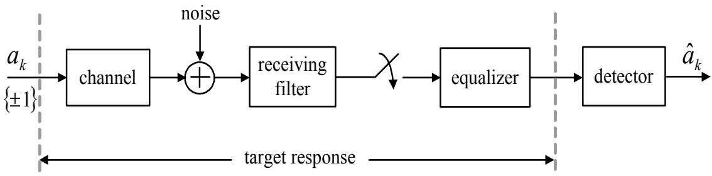

รูปที่ 4.1: หลักการพื้นฐานของเทคนิด PRML  
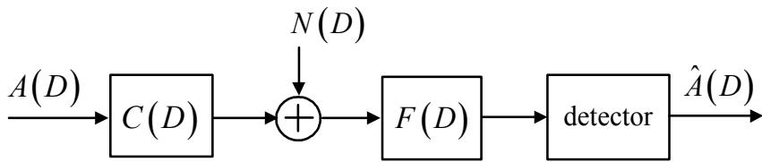  
รูปที่ 4.2: แบบจำลองช่องสัญญาณที่ไม่ต่อเนื่องทางเวลาแบบสมมูล

## 4.2 อีควอไลเซอร์

พิจารณาแบบจำลองช่องสัญญาณที่ไม่ต่อเนื่องทางเวลาแบบสมมูล (equivลlent discrete-time channel mอdel) ตามรูปที่ 4.2 โดยข้อมูลต่างๆ จะอยูในโดเมน D และสมมุติให้ N(D) เป็นสัญญาณ รบกวนเกาส์สี้ขาวแบบบวก (AพGN) จากรูปจะได้ว่า สัญญาณที่วงจรภาครับได้รับ P(D) สามารถ เขียนให้อ ยู่ในรูปของสมการทางคณิตศาสตร์ คือ

$$
P ( D ) = A ( D ) C ( D ) + N ( D )\tag{4.1}
$$

โดยทั่วไปช่องสัญญาณ C(D) จะ มีลักษณะ เป็นวงจรกรองที่มีผลตอบสนองอิมพัลส์จำกัด (FIR: fnite impulse response) และ มีจำนวนแท็ปมาก (ก่อให้เกิด ISI มาก) ถ้าไม่มีการใช้อีควอไลเซอร์ F(D) เพื่อลดผลกระทบของ IS1 ให้น้อยลง วงจรตรวจหา (detector) ที่ใช้จะต้องมีความซับซ้อนมาก เพื่อจัดการกับ ISI จำนวนมาก เพราะฉะนั้น เพื่อลดความซับซ้อนของวงจรตรวจหา จึงได้มีการนำ อีควอไลเซอร์มาใช้งาน เพื่อปรับรูปร่างของสัญญาณให้เป็นไปตามทาร์เก็ตที่ต้องการ (เป็นวงจรกรอง แบบ FIR ที่มีจำนวนแท็ปน้อย) ซึ่งจะช่วยลดผลกระทบของ ISI ให้น้อยลงได้ อย่างไรก็ตาม การนำ อีควอไลเซอร์มาใช้งานมีข้อเสีย คือ (ถ้าวางอีควอไลเซอร์ไว้หลังวงจรชักตัวอย่าง) จะทำให้เกิดปริมาณ หน่วงเวลา (dะโลม) จำนวนมากในไทมมิ่งลูป กล่าวคือ จำนวนแท็ปของอีควอไลเซอร์ยิ่งมาก ปริมาณ หน่วงเวลาก็จะยิ่งมาก ซึ่งจะส่งผลทำให้อัตราการลู่เข้า (convergence rate) ของระบบไทมมิ่งริคัฟเวอรี ช้าลง ทำให้วงจรเฟสล็อกลูป (PLL) ไม่สามารถติดตามการเปลี่ยนแปลงเฟสและความถี่ของสัญญาณ แอนะล็อกที่จะทำการชักตัวอย่างได้ทัน ซึ่งอาจจะส่งผลทำใหี้เกิดการสูญเสียกระบวนการเข้าจังหวะได้

## 4.2.1 อีควอไลเซอร์แบบผลตอบสนองเต็ม

อีควอไลเซอร์แบบผลตอบสนองเต็ม (full-response equalizer) หมายถึงอีควอไลเซอร์ที่จะทำให้ข้อมูล เอาต์พุตที่ได้มีค่าเท่ากับ ข้อมูลอินพต $A ( D )$ บวกกับสัญญาณรบกวน $W ( D )$ ดังนั้น จากรูปที่ 4.2 จะ ได้ว่า อีควอไลเซอร์แบบผลตอบสนองเต็มจะ มีผลตอบสนองอิมพัลส์ (impulse response) ในโดเมน Dคือ

$$
F ( D ) = { \frac { 1 } { C ( D ) } }\tag{4.2}
$$

และข้อมูลเอาต์พุต $Y ( D )$ ของอีควอไลเซอร์นี้ คือ

$$
Y ( D ) = P ( D ) F ( D )\tag{4.3}
$$

แทนค่า $F ( D )$ จากสมการ (4.2) ลงในสมการ (4.1) จะได้

$$
{ \begin{array} { l l l } { Y ( D ) } & { = } & { \{ A ( D ) C ( D ) + N ( D ) \} { \frac { 1 } { C ( D ) } } } \\ & { = } & { A ( D ) + \underbrace { \frac { N ( D ) } { C ( D ) } } _ { W ( D ) } } \end{array} }\tag{4.4}
$$

นั่นคือ องค์ประกอบของสัญญาณรบกวนที่จะเข้าไปในวงจรตรวจหาสัญลักษณ์ (sรymbo1 detector) คือ $W ( D ) ~ = ~ N ( D ) / C ( D )$ ถ้าสมมุติว่า $W ( D )$ มีค่าน้อยมากวงจรตรวจหาสัญลักษณ์ ที่ใช้ก็ สามารถเป็นแบบง่ายๆ ได้ เช่น วงจร ตรวจหาขีดเส้นแบ่งแบบหลายระดับ (mนlti-level threshold detector)เพือ ทำการ ถอดรหัส ข้อมูล $Y ( D )$ อย่างไรก็ตาม ข้อเสียของการใช้อีควอไลเซอร์แบบผล ตอบสนองเต็มก็คือ สัญญาณรบกวน $W ( D )$ ที่หลงเหลืออยู่อาจจะก่อให้เกิดปรากฎการณ์การขยาย สัญญาณรบกวน นั้นคือ W(D) มีค่าเป็นค่าอนันต์ ถ้าช่องสัญญาณ C(D) มีสเปกตรัมค่าศูนย์ (spectral nu) ที่ความถี่ใดๆ เพราะฉะนั้น ในทางปฏิบัติ จึงไม่นิยมนำอีควอไลเซชอร์แบบผลตอบสนอง เต็มมาใช้งานในฮาร์ดดิสก์ไดรฟ์

## 4.2.2 อีควอไลเซอร์แบบผลตอบสนองบางส่วน

อีควอไลเซอร์แบบผลตอบสนองบางส่วน (partial-response equalizer) คือ อีควอไลเซอร์ที่สามารถ เขียนให้อ ยู่ในรูปของสมการทางคณิตศาสตร์ได้ดังนี้

$$
F ( D ) = { \frac { H ( D ) } { C ( D ) } }\tag{4.5}
$$

โดยที่ $H ( D )$ คือ ผลตอบสนองทาร์เก็ต (target response) ที่ต้องการ และเมื่อแทนค่า $F ( D )$ นี้ลง ในสมการ (4.3) จะได้

$$
{ \begin{array} { r c l } { Y ( D ) } & { = } & { \{ A ( D ) C ( D ) + N ( D ) \} { \frac { H ( D ) } { C ( D ) } } } \\ & { = } & { \underbrace { A ( D ) H ( D ) } _ { \mathrm { ~ w a n t e d ~ s i g n a l } } + \underbrace { N ( D ) { \frac { H ( D ) } { C ( D ) } } } _ { W ( D ) } } \end{array} }\tag{4.6}
$$

นันคือ ข้อมูลเอาต์พุตของอีควอไลเซอร์แบบผลตอบสนองบางส่วนจะประกอบไปด้วย ข้อมูลที่ต้องการ $A ( D ) H ( D )$ และสัญญาณรบกวน $W ( D ) = N ( D ) H ( D ) / C ( D )$ จากสมการ (4.6) จะ เห็นได้ว่า ข้อมูลทีต้องการจะมี IS1 แฝงอยูแต่เนืองจาก วงจรภาครับทราบว่า IS1 นีคืออะไร (เพราะว่าเป็น IS1 ที่เกิดจากทาร์เก็ต) ดังนั้น ISI นี้สามารถที่จะถูกจัดการได้ด้วยวงจรตรวจหาวีเทอร์บิ ซึ่งจะอธิบายต่อไป ในหัวข้อที่ 4.3

## 4.3. วงจรตรวจหาวีเทอร์บิ

นอกจากนี้ เมื่อพิจารณาส่วนของสัญญาณรบกวน W(D) ในสมการ (4.6) จะพบว่า สาเหตุที่ ระบบการประมวลผลสัญญาณของฮาร์ดดิสก์ไดรฟ์ต้องการที่จะได้ทาร์เก็ต H(D) ที่มีผลตอบสนอง เชิงความถีเหมือนกับผลตอบสนองเชิงความถีของช่องสัญญาณ C(D) ไห้มากทีสุด ก็เพือที่ว่าจะได้ ทำให้ W(D) มีลักษณะเป็นสัญญาณรบกวนเกาส์สีขาว $N ( D )$ ให้มากที่สุด ทั้งนี้เป็นเพราะว่า ถ้า $H ( D ) = C ( D )$ แล้ว จะได้ว่า $W ( D ) = N ( D )$ ซึ่งถือว่าเป็นเงื่อนไขหลักที่จะทำให้วงจรตรวจหา วีเทอร์บิสามารถทำงานได้อย่างมีประสิทธิภาพมากที่สุด หรือกล่าวอีกนัยหนึ่งคือ วงจรตรวจหาวีเทอร์บิ จะถูก พิจารณาว่าเป็น "วงจรตรวจหาที่เหมาะที่สุด (opimal detector)"ถ้าองค์ประกอบของสัญญาณ รบกวนที่ด้านขาเข้าของวงจรตรวจหาวีเทอร์บิเป็นสัญญาณรบกวนเกาส์สีขาว [15] ดังนั้น อาจจะสรุป ได้ว่า ถ้าผลตอบสนองเชิงความถี่ของทาร์เก็ตเหมือนกับผลตอบสนองเชิงความถี่ของช่องสัญญาณมาก เท่าใด ประสิทธิภาพของระบบในรูปของอัตราข้อผิดพลาดบิต (BER) วัดที่ด้านขาออกของวงจรตรวจหา วีเทอร์บิก็จะดีมากขึ้นเท่านั้น e ซ

## 4.3วงจรตรวจหาวีเทอร์บิ

วงจรตรวจหาวีเทอร์บิ คือ วงจรตรวจหาลำดับ (sequence detector) ที่สร้างโดยใช้"อัลกอริทึมวีเทอร์บิ (Viterbi algorithm)" [15] เพื่อใช้ในการถอดรหัสข้อ มูลที่ถูกเข้ารหัสด้วย “รหัส คอนโวลูชัน (convo-ใutional cอde)" [7] เท่านัน ในทางปฏิบัติแล้ว ช่องสัญญาณสามารถที่จะถูกพิจารณาว่าเป็นรหัส คอน โวลูชันประเภทหนึ่งที่มีอัตรารหัส (code rate) เท่ากับค่าหนึ่ง (นั่นคือ ข้อมูลอินพุต 1 บิต เมื่อเข้ารหัส แล้วจะได้ข้อมูลเอาต์พุตออกมา 1 บิตเช่นกัน) วงจรตรวจหาวีเทอร์บิมีความสามารถที่จัดการกับ ISI ที่ แฝงอยูในข้อมลที่จะทำการถอดรหัสได้อย่างมีประสิทธิภาพ โดยที่ถ้า Iร1 ยิ่งมาก ความซับซ้อนของ วงจรตรวจหาวีเทอร์บิก็จะยิงมาก และถ้า Iร1 น้อย ความซับซ้อนของวงจรตรวจหาวีเทอร์บิก็จะน้อย

เนื่องจาก วงจรตรวจหาวีเทอร์บิมีความซับซ้อนมากกว่าวงจรตรวจหาแบบง่าย (simple detector) เช่น วงจรตรวจหาขีดเส้นแบ่งแบบหลายระดับ ในการที่จะ ตัดสินใจว่าจะ นำวงจรตรวจหาวีเทอร์บิมา ใช้งานในระบบหรือไม่นั้น ให้พิจารณาจากรูปที่ 4.3 ดังต่อไปนี้ จากรูปที่ 4.3[a) ถาช่องสัญญาณไม่ มีISI วงจรภาครับก็สามารถนำวงจรตรวจหาแบบง่ายมาใช้งานได้เลย ถ้าช่องสัญญาณมี IS1 น้อย ตามรูปที่ 4.3(b) วงจรภาครับก็สามารถนำวงจรตรวจหาวีเทอร์บิมาใช้งานได้เลย แต่ถ้าช่องสัญญาณ มีISI จำนวนมากตามรูปที่ 4.3(C) วงจรภาครับก็ควรที่นำอีควอไลเซอร์มาใช้งาน เพื่อลดผลกระทบ รูปที่ 4.3: ตัวอย่างแบบจำลองช่องสัญญาณที่ไม่ต่อเนื่องทางเวลาแบบสมมูลลักษณะต่างๆ

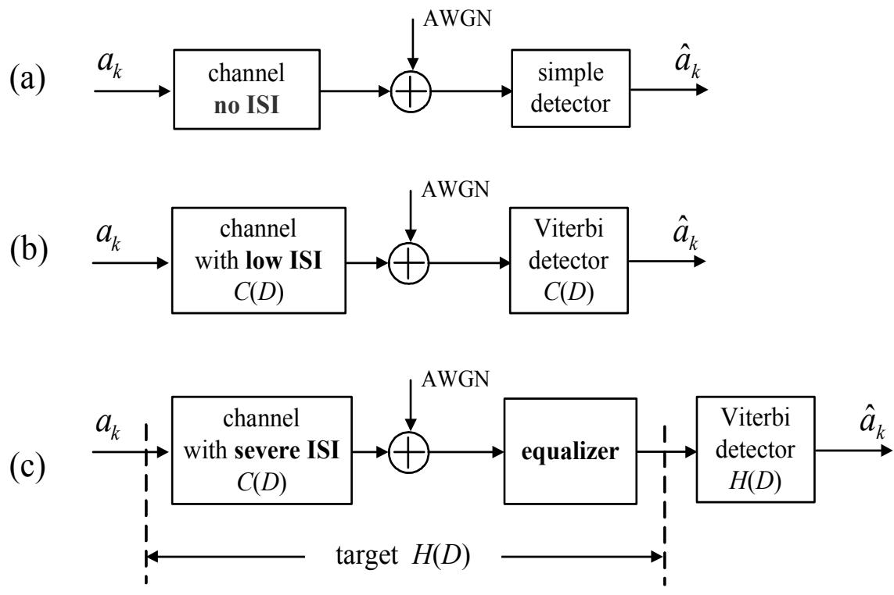

ของ ISI ให้น้อยลง จากนั้นจึงค่อยส่งข้อมูลเอาด์พุตที่ได้จากอีควอไลเซอร์ไปทำการถอดรหัส ข้อมูล ด้วยวงจรตรวจหาวีเทอร์บิ

วงจรตรวจหาวีเทอร์บิถือว่าเป็นวงจรตรวจหาข้อมูลที่มีประสิทธิภาพ และถูกนำมาใช้งานในหลายๆ งานประยุกต์ รวมทั้งในระบบการประมวลผลสัญญาณของฮาร์ดดิสก์ไดรฟ์ โดยที่ หลักการทำงานของ วงจรตรวจหาวีเทอร์บิจะอยูบนพืนฐานของ “แผนภาพเทรลลิส (trelliร diagram)"ซึ่งสร้างมาจาก "เครืองสถานะจำกัด (FรM:finite state machine)"ดังนัน ก่อนทีจะ อธิบายหลักการทำงานของ อัลกอริทึมวีเทอร์บิ ผู้อ่านควรจะทำความเข้าใจเกี่ยวกับวิธีการสร้างเครื่องสถานะจำกัดและ แผนภาพ เทรลลิสก่อน ซึ่งมีรายละเอียดดังนี้

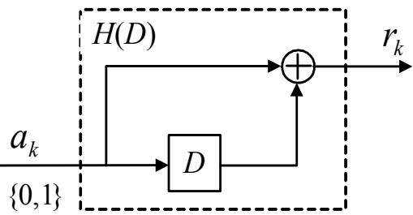  
รูปที่ 4.4: แผนภาพช่องสัญญาณแบบ PR1, $H ( D ) = 1 + D$

ตารางที่ 4.1: ความสัมพันธ์ระหว่าง $a _ { k }$ และ $r _ { k }$ ของช่องสัญญีาณ $H ( D ) = 1 + D$
<table><tr><td> $a _ { k }$ </td><td> $\boldsymbol { a } _ { k - 1 }$ </td><td> $r _ { k }$ </td><td rowspan="5"></td></tr><tr><td>o</td><td>o</td><td>o</td></tr><tr><td>o</td><td>1</td><td>1</td></tr><tr><td>1</td><td>o</td><td>1</td></tr><tr><td>1</td><td>1</td><td>2</td></tr></table>

## 4.3.1 เครืองสถานะจำกัด

พิจารณาช่องสัญญาณ $H ( D ) = 1 + D$ ในรูปที่ 4.4 เมื่อ ข้อมูลบิตอินพุต $a _ { k } \in \{ 0 , 1 \}$ ถูกส่งผ่าน เข้าไปในช่องสัญญาณทำให้ได้เป็นข้อมูลเอาต์พุตช่องสัญญาณ (channel output) $r _ { k } \in \{ 0 , 1 , 2 \}$ ถ้า เขียนตารางแสดงความสัมพันธ์ระหว่างข้อมูลอินพุต $a _ { k }$ และข้อมูลเอาต์พุต $r _ { k }$ จะได้ตามตารางที่ 4.1 โดยที่ข้อมูลบิต $a _ { k - 1 }$ อาจจะ ถูกพิจารณาว่าเป็นข้อมูลที่หลงเหลืออยูใน "เรจิสเตอร์แบบเลื่อน (shift register)" ในบล็อก D

ความสัมพันธุ์ระหว่าง $a _ { k }$ และ $r _ { k }$ ในตารางที่ 4.1 สามารถแสดงให้อยู่ในรูปของ "เครื่องสถานะ จำกัด (FSM: finite state machine)" ซึ่งก็คือ แบบจำลอง ของการ คำนวณ ที่ แสดงให้เห็นถึงการ เปลี่ยนแปลงของ ข้อมูลอินพุต, สถานะเริ่มต้น (start state), สถานะ ต่อไป (next state), และข้อมูล เอาต์พุตช่องสัญญาณ ดังแสดงในรูปที่ 4.5 โดยที่ ข้อมูลบิต 0 และบิต 1 ที่อยูในวงกลม คือ ค่าที่อยู ในเรจิสเตอร์แบบเลื่อน ณ เวลาขณะนั้น, X คือ ค่าข้อมูลอินพุต $a _ { k }$ , และ Y คือ ค่าข้อมูลเอาต์พุต ช่องสัญญาณ $r _ { k }$ ตัวอย่างเช่น สมมุติว่า ณ ตอนนี้ค่าที่อยู่ในเรจิสเตอร์แบบเลื่อน คือ ค่า 1 ถ้าข้อมูล อินพุตที่เข้ามาในช่องสัญญาณ คือ $a _ { k } = 0$ จะได้ว่า ค่าที่อยู่ในเรจิสเตอร์แบบเลื่อนเมื่อเวลาผ่านไป หนึ่งหน่วย (หรือ สถานะต่อไป) คือ ค่า 0 โดยจะได้ข้อมูลเอาต์พุตช่องสัญญาณ $r _ { k } = 1$ ในทำนอง เดียวกัน ถ้าตอนนี้ค่าที่อยู่ในเรจิสเตอร์แบบเลื่อน คือ ค่า 0 และข้อมูลอินพุตที่เข้ามาในช่องสัญญาณ คือ $a _ { k } = 0$ จะได้ว่า ค่าที่อยู่ในเรจิสเตอร์แบบเลื่อนเมื่อเวลาผ่านไปหนึ่งหน่วย คือค่า0 โดยจะได้ เด ข้อมูลเอาต์พุตช่องสัญญาณ $r _ { k } = 0$ เป็นต้น

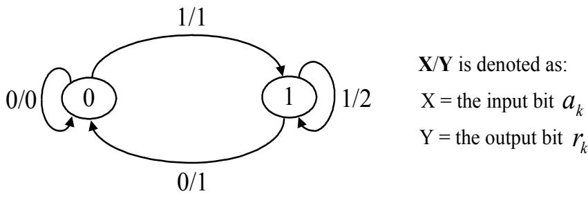  
รูปที่ 4.5: เครื่องสถานะจำกัดของช่องสัญญาณ PR1, $H ( D ) = 1 + D$

หมายเหตุถ้ากำหนดให้ $| { \cal A } |$ คือ จำนวนค่าที่เป็นไปได้ทั้งหมดของข้อมูลอินพุต $a _ { k }$ , และ $\nu$ คือ หน่วยความจำของช่องสัญญาณ ดังนั้น จำนวนสถานะ (รtate) ทั้งหมดในเครื่องสถานะจำกัด คือ $| { \mathcal { A } } | ^ { \nu }$ เช่น แบบจำลองช่องสัญญาณในรูปที่ 4.4 จะได้ว่า $| { \mathcal { A } } | = 2$ และ $\nu = 1$ เพราะฉะนั้น เครื่องสถานะ จำกัดของช่องสัญญาณ PR1 จะมีจำนวนสถานะทั้งหมด $2 ^ { 1 } = 2$ สถานะ

## 4.3.2แผนภาพเทรลลิส

เครื่องสถานะจำกัดที่แสดงในรูปที่ 4.5 สามารถแสดงให้อยู่ในรูปของแผนภาพเทรลลิสได้ ดังแสดงใน รูปที่ 4.6 โดยที่ จุดต่อ (ทde) ทางด้านซ้ายมือ คือ สถานะเริ่มต้น (ซึ่งมีค่าเท่ากับ $a _ { k - 1 } )$ ,จุดต่อทาง ด้านขวามือ คือ สถานะต่อไป, ลูกศรเส้นปะใช้แทนการส่งข้อมูลอินพุต $a _ { k } = 0$ , ลูกศรเส้นทึบใช้แทน การส่งข้อมูลอินพุต $a _ { k } = 1$ , และตัวเลขทีแสดงอยูในแต่ละเส้นสาขา (branch) คือ ค่าข้อมูลเอาต์พุต

## 4.3. วงจรตรวจหาวีเทอร์บิ

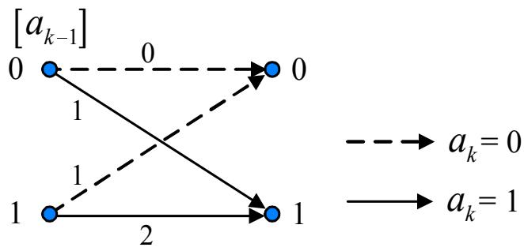  
$\mathfrak { J } \| \overset { \underset { \mathrm { d } } { } } { \underset { \mathrm { ~ } } { \mathrm { ~ } } }$ 4.6: แผนภาพเทรลลิสของช่องสัญญาณ PR1, $H ( D ) = 1 + D$

ช่องสัญญาณ $r _ { k }$ ตัวอย่างเช่น ถ้าสถานะเริ่มต้น คือค่า 0 เมื่อข้อมูลอินพุต $a _ { k } = 1$ เข้ามาในระบบ จะ ทำให้ได้ข้อมูลเอาต์พุตช่องสัญญาณ $r _ { k } = 1$ และสถานะต่อไป คือค่า 1 ในทำนองเดียวกัน ถ้าสถานะ เริ่มต้น คือค่า 1 เมื่อข้อมูลอินพุต $a _ { k } = 1$ เข้ามาในระบบ จะทำให้ได้ข้อมูลเอาต์พุตช่องสัญญาณ $r _ { k } = 2$ และสถานะต่อไป คือค่า 1

ในทำนองเดียวกัน รูปที่ 4.7 แสดงตัวอย่างแผนภาพเทรลลิสของช่องสัญญาณ EPR4 (extended PR4), $H ( D ) = 1 + D - D ^ { 2 } - D ^ { 3 }$ , เมื่อ ข้อมูลอินพุต $\{ a _ { k } \} \in \{ 0 , 1 \}$ ซึ่งในกรณีนี้ จำนวนสถานะ ของแผนภาพเทรลลิสจะมีจำนวนเท่ากับ $| { \mathcal { A } } | ^ { \nu } = 2 ^ { 3 } = 8$ สถานะ เนืองจาก ช่องสัญญาณ EPR4 มี จำนวนหน่วยความจำเท่ากับ 3 หน่วย

ตัวอย่างที่ 4.1 กำหนดให้ข้อมูลอินพุต $a _ { k } \in \{ - 1 , 1 \}$ ถูกส่งผ่านเข้าไปยังช่องสัญญาณแบบ PR4, $H ( D ) = 1 - D ^ { 2 }$ , แล้วได้ข้อมูลเอาต์พุตเป็น $r _ { k } \in \{ - 2 , 0 , 2 \}$ จง

ก) วาดแผนภาพบล็อกของช่องสัญญาณแบบ PR4 $\ddot { \ P }$ (คล้ายกับรูปที่ 4.4)

ข) เขียนสมการแสดงความสัมพันธ์ระหว่างข้อมูลอินพุตและข้อมูลเอาต์พุตของช่องสัญญาณนี้

ค) สร้างเครืองสถานะจำกัด

ง) สร้างแผนภาพเทรลลิส

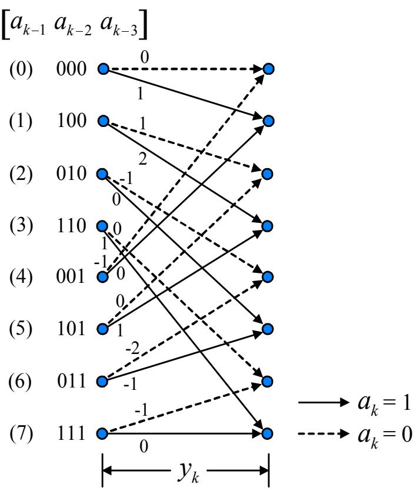  
รูปที่ 4.7: แผนภาพเทรลลิสของช่องสัญญาณ EPR4, $H ( D ) = 1 + D - D ^ { 2 } - D ^ { 3 }$

## วิธีทำ

ก) จากช่องสัญญาณที่กำหนดให้ สามารถแสดงเป็นแผนภาพบล็อกของช่องสัญญาณแบบ PR4 ได้ ดังรูปที่ 4.8(a)

ข)เนื่องจาก $\begin{array} { r } { H ( D ) = \sum _ { k } { h _ { k } D ^ { k } } = 1 - D ^ { 2 } } \end{array}$ ดังนั้น สมการแสดงความสัมพันธ์ระหว่างข้อมูล อินพุตและข้อมูลเอาต์พุตของช่องสัญญาณนี้ คือ

$$
r _ { k } = a _ { k } * h _ { k } = a _ { k } - a _ { k - 2 }
$$

ค) จากสมการแสดงความสัมพันธ์ระหว่างข้อมูลอินพุตและข้อมูลเอาต์พุตที่ได้ในข้อ ข) เครื่องสถานะ จำกัดสามารถแสดงได้ตามรูปที่ 4.8(b)

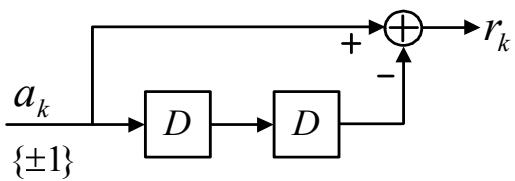  
(a) Block diagram: PR4

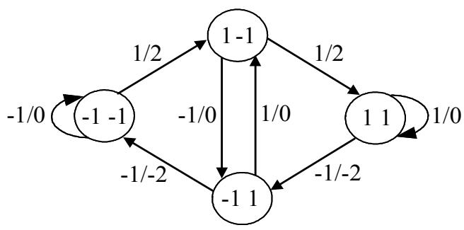  
(b) FSM

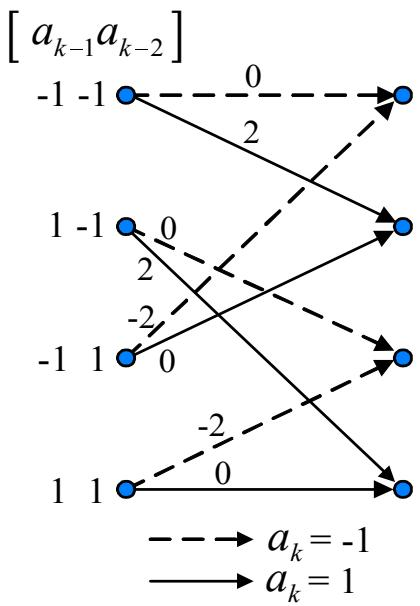  
(c) Trellis diagram  
รูปที่ 4.8: (a) แผนภาพบล็อก, (b) เครื่องสถานะจำกัด, และ (C) แผนภาพเทรลลิส ของช่องสัญญาณ $H ( D ) = 1 - D ^ { 2 }$

## ง) แผนภาพเทรลลิสสามารถสร้างได้จากเครื่องสถานะจำกัด ดังแสดงในรูปที่ 4.8(C)

## 4.3.3 อัลกอริทึมวีเทอร์บิ

พิจารณาแบบจำลองช่องสัญญาณ H(D) ตามรูปที่ 4.9 โดยที่ $a _ { k }$ คือ ข้อมูลบิตอินพุตที่ถูกเลือกมา จากเซตของชุดตัวอักษร A, $\begin{array} { r } { H ( D ) = \sum _ { k = 0 } ^ { \nu } h _ { k } D ^ { k } } \end{array}$ คือ ช่องสัญญาณวิยุต (discrete channel), $h _ { k }$ คือ ค่าสัมประสิทธิ์ตัวที่ k, v คือ หน่วยความจำของช่องสัญญาณ, $n _ { k }$ คือ สัญญาณรบกวนเกาส์สี ขาวแบบบวก (AพGN) ที่มีค่าเฉลี่ยเท่ากับค่าศูนย์ และความแปรปรวนเท่ากับค่า $\sigma ^ { 2 }$ หรือเขียนแทน ได้ด้วย $n _ { k } \sim \mathcal N ( 0 , \sigma ^ { 2 } ) , r _ { k }$ คือ ข้อมูลเอาต์พุตช่องสัญญาณ, และ L คือ ความยาวของลำดับข้อมูล อินพุต $\{ a _ { k } \}$ (โดยทั่วไป $L = 4 0 9 6$ บิต สำหรับข้อมูล 1 เซกเตอร์), และ $\hat { a } _ { k }$ คือ ค่าประมาณของ ข้อมูลบิตอินพุต $a _ { k }$ ที่ได้จากการถอดรหัสข้อมูลโดยวงจรตรวจหาวีเทอร์บิ

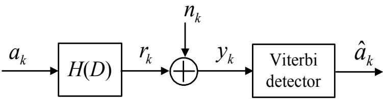  
รูปที่ 4.9: แบบจำลองช่องสัญญาณ H(D) พร้อมวงจรตรวจหาวีเทอร์บิ

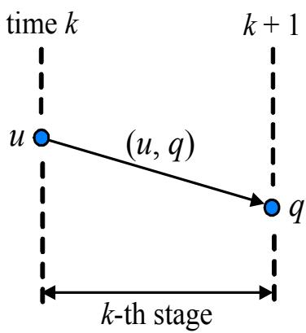  
รูปที่ 4.10: คำอธิบายแผนภาพเทรลลิส

ก่อนที่จะอธิบายหลักการทำงานของอัลกอริทึมวีเทอร์บิ จะนิยามสัญลักษณ์ตามรูปที่4.10 ดังนี้ ให้ $\Psi _ { k } = \left[ a _ { k } a _ { k - 1 } \ldots a _ { k - \nu + 1 } \right]$ คือ สถานะ ณ เวลา k (หรือค่าที่อยู่ในเรจิสเตอร์แบบเลื่อนทั้งหมด ณ เวลา k), $Q = | { \mathcal { A } } | ^ { \nu }$ คือ จำนวนสถานะทั้งหมดที่เป็นไปได้, $| { \cal A } |$ คือ จำนวนค่าที่เป็นไปได้ทั้งหมด ของข้อมูลอินพุต, $\nu \ { \stackrel { \mathrm { e q } } { \varphi } } \ { \widehat { \mathfrak { e } } }$ หน่วยความจำของช่องสัญญาณ, ระยะ $\stackrel { \mathrm { d } } { \boldsymbol { \ P } }$ k (k-th stage) คือ กลุ่มของเส้น สาขาที่เป็นไปได้ทั้งหมด ณ เวลาที่ k, และ $( u , q )$ คือ สัญลักษณ์ ที่ใช้แทนการเปลี่ยนสถานะจาก สถานะ น ไปยังสถานะ q

พิจารณาแผนภาพเทรลลิสของช่องสัญญาณ PR4 นั่นคือ $H ( D ) = 1 - D ^ { 2 }$ ตามรูปที่4.11 ซึ่ง มีจำนวนสถานะทั้งหมด $Q = 2 ^ { 2 } = 4$ สถานะ ที่แสดงด้วยสัญลักษณ์ (0), (1), (2), และ (3) เมื่อ ข้อมูลอินพุต $a _ { k } \in \{ - 1 , 1 \}$ ในการทำงานของอัลกอริทีมวีเทอร์บิ สิ่งที่ต้องคำนวณทุกช่วงเวลา คือ ค่าเมตริกสาขา (braทc metric) ณ เวลา k ของการเปลี่ยนสถานะจากสถานะ u ไป ยังสถานะ $q ,$ $\lambda _ { k } ( u , q )$ , ค่าเมตริกเส้นทาง (path metric) ณ เวลา $k + 1$ ที่สถานะ q, $\Phi _ { k + 1 } ( q )$ ,และตัวนำหน้า (predecessor) สำหรับสถานะ q ณ เวลา $k + 1 , \pi _ { k + 1 } ( q )$ , ซึ่งจะ เก็บค่าสถานะเริ่มต้นที่เป็นผลทำให้ เกิดเส้นทางการเปลี่ยนสถานะที่ดีที่สุด (best traทร์เtion) เช่น พิจารณาที่สถานะ (2) ณ เวลา $k + 1$ จะมีเส้นทางการเปลี้ยนสถานะ 2 เส้นทาง คือ (1, 2) และ (3, 2) สมมุติว่า อัลกอริที่มวีเทอร์บิจะทำ การเลือกเส้นทางเพียงเส้นทางเดียวที่มาถึงสถานะ (2) ณ เวลา $k + 1$ สมมุติว่า เส้นทาง (1,2) คือ เส้นทางการเปลียนสถานะทีดีทีสุด จะได้ว่า $\pi _ { k + 1 } ( 2 ) = 1$ นั่นเอง

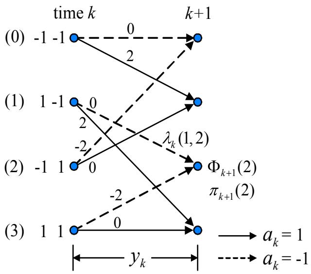  
รูปที่ 4.11: แผนภาพเทรลลิสของช่องสัญญาณ PR4, $H ( D ) = 1 - D ^ { 2 }$

เป็นที่ทราบกันว่า วงจรตรวจหาที่ทำให้ความน่าจะเป็นของข้อผิดพลาดของลำดับข้อมูลทั้งลำดับมี ค่าน้อยที่สุด คือ "วงจรตรวจหาลำดับที่ควรจะเป็นมากสุด (MLรD: maximum-likelihood sequence detector)" ซึ่งสามารถสร้างได้โดยใช้อัลกอริทึมวีเทอร์บิ จากแบบจำลองช่องสัญญาณในรูปที่ 4.9 วงจร ตรวจหาวีเทอร์บิจะ เลือกลำดับข้อมูลอินพุต $\{ a _ { k } \}$ ที่ทำให้ความน่าจะ เป็นของลำดับข้อมูล $\left\{ y _ { k } \right\}$ เมื่อ

กำหนดลำดับข้อมูล $\{ a _ { k } \}$ มาให้ นั่นคือ

$$
p ( { \bf y } | { \bf a } ) = \frac { 1 } { \left( \sqrt { 2 \pi \sigma ^ { 2 } } \right) ^ { L + \nu } } \exp \left\{ - \frac { 1 } { 2 \sigma ^ { 2 } } \sum _ { k = 0 } ^ { L + \nu - 1 } | y _ { k } - r _ { k } | ^ { 2 } \right\}\tag{4.7}
$$

มีค่ามากที่สุด สมการ (4.7) ได้มาจากความจริงที่ว่า สัญญาณรบกวน $n _ { k } \sim \mathcal N ( 0 , \sigma ^ { 2 } )$ และเมื่อกำหนด ลำดับข้อมูลอินพุต a มาให้ แสดงว่าระบบทราบว่าลำดับข้อมูลเอาต์พุต r คืออะไร ดังนั้น ข้อมูล $y _ { k }$ จะมีฟังก์ชันความหนาแน่นความน่าจะเป็นแบบเกาส์เซียน (Gaussian probability density function) เหมือนกับ $n _ { k }$ ที่มีค่าเฉลี่ยเท่ากับค่า $r _ { k }$ และค่าความแปรปรวนเท่ากับ $\sigma _ { 2 }$

เมื่อใส่ลอการิทึมธรรมชาติ (natural logarithm) ทั้งสองข้างของสมการ (4.7) จะได้เป็น

$$
\ln \left\{ p ( \mathbf { y } | \mathbf { a } ) \right\} = \ln \left\{ { \frac { 1 } { \left( { \sqrt { 2 \pi \sigma ^ { 2 } } } \right) ^ { L + \nu } } } \right\} - { \frac { 1 } { 2 \sigma ^ { 2 } } } \sum _ { k = 0 } ^ { L + \nu - 1 } | y _ { k } - r _ { k } | ^ { 2 }\tag{4.8}
$$

สังเกตจะพบว่า การทำให้สมการ (4.8) มีค่ามากที่สุด มีผลเที่ยบเท่ากับการทำให้พจน์ที่สองทางด้าน ขวามือของสมการ (4.8) มีค่าน้อยที่สุด เนืองจาก พจน์ที่หนึ่งเปรียบเสมือนกับค่าคงที เพราะฉะนัน ๑ ร ะ การทำให้สมการ (4.8) มีค่ามากที่สุดจะมีค่าเท่ากับการทำให้เมตริก (metric)

$$
\sum _ { k = 0 } ^ { L + \nu - 1 } | y _ { k } - r _ { k } | ^ { 2 }\tag{4.9}
$$

มีค่าน้อยที่สุด ดังนั้น วงจรตรวจหาวีเทอร์บิจะเลือกลำดับข้อมูลอินพุตที่ทำให้สมการ (4.9) มีค่าน้อย ที่สุด สังเกตจากสมการ (4.9) จะพบว่าพจน์ $| y _ { k } - r _ { k } | ^ { 2 }$ ก็คือ ค่าระยะทางกำลังสองเฉลี่ย1 (MSD: mean-รquared distance) [10] เมตริกในสมการ (4.9) สามารถทำให้มีค่าน้อยที่สุดได้ โดยการค้นหา เส้นทาง (pลh) ที่มีค่าเมตริกน้อยที่สุดตามแผนภาพเทรลลิส เมื่อ เมตริกเส้นทางมีค่าเท่ากับผลรวม ของเมตริกสาขา โดยที่ เมตริกสาขาของการเปลี่ยนสถานะจากสถานะ น ไปยังสถานะ $q$ จะนิยามโดย

$$
\lambda _ { k } ( u , q ) = | y _ { k } - \hat { r } _ { k } ( u , q ) | ^ { 2 }\tag{4.10}
$$

(A-1) กำหนดค่าเริ่มต้นของเมตริกเส้นทาง $\Phi _ { 0 } ( p ) = 0$ สำหรับทุกค่า P

(A-2) For $k = 0 , 1 , \ldots , L + \nu - 1$

(A-3)

$$
\mathrm { F o r } \ q = 0 , 1 , \dotsc , Q - 1\tag{A-4}
$$

$$
\lambda _ { k } ( p , q ) = | y _ { k } - { \hat { r } } ( p , q ) | ^ { 2 } { \mathrm { ~ f o r ~ } } \forall p\tag{A-5}
$$

$$
\pi _ { k + 1 } ( q ) = \arg \operatorname* { m i n } _ { p } \{ \Phi _ { k } ( p ) + \lambda _ { k } ( p , q ) \}\tag{A-6}
$$

$$
\Phi _ { k + 1 } ( q ) = \Phi _ { k } ( \pi _ { k + 1 } ( q ) ) + \lambda _ { k } ( \pi _ { k + 1 } ( q ) , q )\tag{A-7}
$$

$$
\mathbf { S } _ { k + 1 } ( q ) = [ \mathbf { S } _ { k } ( \pi _ { k + 1 } ( q ) ) \ | \pi _ { k + 1 } ( q ) ]
$$

(A-8) End

(A-9) End

(A-10) ถอดรหัสข้อมูลอินพุต a จากเส้นทางที่ยังมีชีวิตอยู่ที่มีค่า $\Phi _ { L + \nu }$ น้อยที่สุด

รูปที่ 4.12: ขั้นตอนการทำงานของอัลกอริทึมวีเทอร์บิ

เมื่อ $\hat { r } _ { k } ( u , q )$ คือ ข้อมูลเอาต์พุตช่องสัญญาณที่สอดคล้องกับ $( u , q )$ และเมตริกเส้นทางสามารถหาได้ จาก

$$
\Phi _ { k + 1 } ( q ) = \sum _ { i = 0 } ^ { k } \lambda _ { i }\tag{4.11}
$$

รูปที่ 4.12 แสดงขั้นตอนการทำงานของอัลกอริทึมวีเทอร์บิ ตัวอย่างเช่น จากแผนภาพเทรลลิส ของช่องสัญญาณ $H ( D ) = 1 - D ^ { 2 }$ ในรูปที่ 4.11 ให้พิจารณาระยะ $\stackrel { \mathrm { d } } { \boldsymbol { \ P } }$ k (k-th stage) ของแผนภาพ เทรลลิส จะพบว่า มีการเส้นทางการเปลี่ยนสถานะ 2 เส้นทางที่มาถึงสถานะ (2) ณ เวลา $k + 1$ นั่นคือ (1,2) และ (3, 2) ให้ทำการคำนวณค่าเมตริกสาขาทั้ง 2 เส้นทาง นั้นคือ $\lambda _ { k } ( 1 , 2 )$ และ $\lambda _ { k } ( 3 , 2 )$ ตามขั้นตอนที่ (A-4) จากนั้น สถานะเริ่มต้นที่สอดคคล้องกับเส้นทางการเปลี่ยนสถานะที่ดี ที่สุดทีมาถึงสถานะ (2) ณ เวลา $k + 1$ จะถูกเลือกตามขั้นตอนที่ (A-5) สมมุติว่า (1, 2) คือ เส้นทาง การเปลี่ยนสถานะที่ดีที่สุดที่มาถึงสถานะ (2) ณ เวลา $k + 1$ ดังนั้นจะได้ว่า $\pi _ { k + 1 } ( 2 ) = 1$ หลังจาก นั้น เมตริกเส้นทางที่มาถึงสถานะ (2) ณ เวลา $k + 1 , \Phi _ { k + 1 } ( 2 )$ , จะถูกปรับค่าตามขั้นตอนที่ (A-6) Q และเส้นทางที่ยังมีชีวิตอยู(ธurvivor path) ทีมาถึงสถานะ (2) ณ เวลา $k + 1 , \mathbf { S } _ { k + 1 } ( 2 )$ , จะถูก ปรับค่าตามขั้นตอนที่ $( \mathsf { A } \cdot 7 )$ ให้ทำตามขั้นตอนต่างๆ เหล่านี้ตามอัลกอริทึมวีเทอร์บิไปจนสิ้นสุดลำดับ ข้อมูล $\left\{ y _ { k } \right\}$ ที่ได้รับมา และขั้นตอนสุดท้ายก็คือ การตัดสินใจจะถูกกระทำโดยการเลือกเส้นทางที่ยังมี ชีวิตอยู่ที่มีค่าเมตริกเส้นทาง ณ เวลา ${ \cal L } + \nu , \Phi _ { L + \nu }$ , น้อยที่สุด

## 4.3.4 ความซับซ้อนของวงจรตรวจหาวีเทอร์บิ

เนื่องจากวงจรตรวจหาวีเทอร์บิจะ ทำการประมวลผลลำดับข้อมูลทั้งหมดก่อนที่จะ ตัดสินใจว่า ลำดับ ข้อมลที่ได้รับควรจะ เป็นลำดับข้อมลอินพตไดมากที่สด ดังนั้น ความซับซ้อนของวงจรตรวจหาวีเทอร์บิ จึงขึ้นอยูกับหลายปัจจัย ดังนี้

$| { \cal A } |$

2) ความยาวของลำดับข้อมูลอินพุต L

3) หน่วยความจำของช่องทาร์เก็ต V

หรืออาจจะสรุปได้ว่าวงจรตรวจหาวีเทอร์บิแบบที่ใช้งานกันทั่วไปจะมีจำนวนสถานะทั้งหมดในแผนภาพ เทรลลิสเท่ากับ $| { \mathcal { A } } | ^ { \nu }$ และต้องการใช้จำนวนหน่วยความจำในการเก็บข้อมูลต่างๆ เช่น ค่า $\left\{ \pi _ { k } \right\}$ อย่าง น้อยเท่ากับ $( L + 1 ) | A | ^ { \nu }$ หน่วย

จะเห็นได้ว่า วงจรตรวจหาวีเทอร์บิแบบที่ใช้งานกันทั่วไปไม่สามารถนำมาใช้งานจริงได้ในทางปฏิบัติ เนื่องจากต้องการหน่วยความจำเป็นจำนวนมาก เพราะฉะนั้นวิธีการลดความซับซ้อนของวงจรตรวจหา วีเทอร์บิ คือการใช้พารามิเตอร์ที่เรียกว่า ความลึกการถอดรหัส dT (decoding depth)" ในอัลกอริทึม วีเทอร์บิเมื่อ $T$ คือ คาบเวลาของบิต (bit period) กล่าวคือ วงจรตรวจหาวีเทอร์บิจะทำการตัดสินใจ ข้อมลทีละบิต หลังจากที่เวลาผ่านไป $d T$ หน่วย ดังนั้น วงจรตรวจหาวีเทอร์บิที่มีการใช้ความลึกการ ถอดรหัสจะต้องการจำนวนหน่วยความจำในการเก็บข้อมูลต่างๆ อย่างน้อยเท่ากับ $( d + 1 ) | { \mathcal { A } } | ^ { \nu }$ ซึ่งโดย ทั่วไปแล้วมักจะใช้ $d \geq 5 ( \nu + 1 )$ [27]

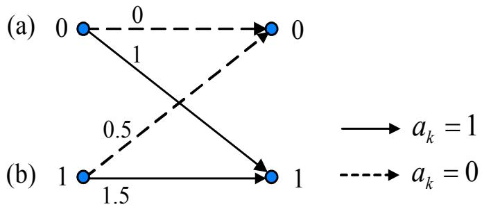  
รูปที่ 4.13: แผนภาพเทรลลิสของช่องสัญญาณ $H ( D ) = 1 + 0 . 5 D$

## 4.4 ตัวอย่างการใช้งานวงจรตรวจหาวีเทอร์บิ

ในส่วนน้จะแสดงตัวอย่างขึ้นตอนการถอดรหัสข้อมูด้วยวงจรตรวจหาวีเทอร์บิอย่งละเอียด ดังต่อไปนี้

ตัวอย่างที่ 4.2 จากแบบจำลองช่องสัญญาณในรูปที่ 4.9 ถ้ากำหนดให้ลำดับข้อมูลอินพุต $\left\{ a _ { k } \right\} =$ $\{ 0 , 0 , 1 \}$ , ช่องสัญญาณ $h _ { k } = \delta _ { k } + 0 . 5 \delta _ { k - 1 }$ เมื่อ $\delta _ { k }$ คือ ฟังก์ชันโครเนคเกอร์เดลตา (Kronecker delta function), สัญญาณรบกวน $\left\{ n _ { k } \right\} = \left\{ 0 . 2 , 0 . 5 , 0 , - 0 . 3 5 \right\}$ จงแสดงขันตอนการถอดรหัส ข้อมูล $\left\{ y _ { k } \right\}$ ด้วยวงจรตรวจหาวีเทอร์บิ

วิธีทำ จากที่โจทย์กำหนด ข้อมูลเอาต์พุตช่องสัญญาณ $r _ { k }$ หาได้จาก

$$
r _ { k } = a _ { k } * h _ { k } = \{ r _ { 0 } , r _ { 1 } , r _ { 2 } , r _ { 3 } \} = \{ 0 , 0 , 1 , 0 . 5 \}
$$

เมื่อ \* คือ ตัวดำเนินการคอนโวลูชัน (convolution operator) และ

$$
y _ { k } = r _ { k } + n _ { k } = \{ 0 . 2 , 0 . 5 , 1 , 0 . 1 5 \}
$$

จากนั้น ให้สร้างแผนภาพเทรลลิสจากช่องสัญญาณ $h _ { k } = \delta _ { k } + 0 . 5 \delta _ { k - 1 }$ นั่นคือ $H ( D ) = 1 + 0 . 5 D$ ซึ่งจะได้ตามรูปที่ 4.13 โดยในที่นี แผนภาพเทรลลิสมีทั้งหมด 2 สถานะ คือ สถานะ (a) และ สถานะ (b) ขั้นตอนการถอดรหัสข้อมูลสามารถแบ่งออกเป็นช่วงเวลาต่างๆ ดังแสดงในรูปที่ 4.14 ซึ่ง มีรายละเอียดดังนี้

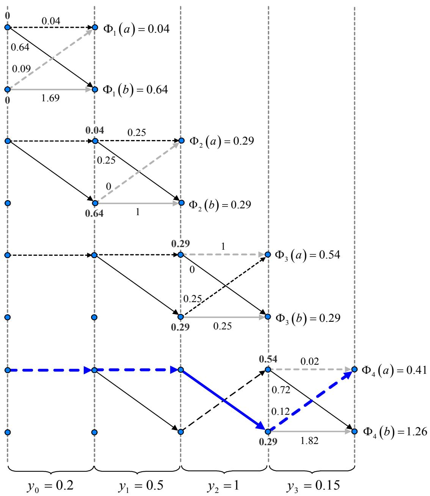  
รูปที่ 4.14: แผนภาพอธิบายการทำงานของวงจรตรวจหาวีเทอร์บิในแต่ละช่วงเวลา

ช่วงเวลาที่0 เมื่อเริ่มต้นรับข้อมูล $y _ { 0 } = 0 . 2$ วงจรตรวจหาวีเทอร์บิจะทำการกำหนดค่าเริมต้นของ เมตริกเส้นทางให้เท่ากับค่าศูนย์ ตามขั้นตอนที่ (A-1) ในรูปที่ 4.12 นั่นคือ

$$
\Phi _ { 0 } ( a ) = 0 \qquad \plus _ { \mathbf { 0 } } \oplus \quad \Phi _ { 0 } ( b ) = 0
$$

จากนั้น ก็จะทำการคำนวณเมตริกสาขาทุกเส้นสาขาตามขั้นตอนที่ (A−4) ในรูปที่ .12 ดังนี้

$$
\begin{array} { l c l } { { \lambda _ { 0 } ( a , a ) } } & { { = } } & { { | 0 . 2 - 0 | ^ { 2 } = 0 . 0 4 } } \\ { { } } & { { } } & { { } } \\ { { \lambda _ { 0 } ( a , b ) } } & { { = } } & { { | 0 . 2 - 1 | ^ { 2 } = 0 . 6 4 } } \\ { { } } & { { } } & { { } } \\ { { \lambda _ { 0 } ( b , a ) } } & { { = } } & { { | 0 . 2 - 0 . 5 | ^ { 2 } = 0 . 0 9 } } \\ { { } } & { { } } & { { } } \\ { { \lambda _ { 0 } ( b , b ) } } & { { = } } & { { | 0 . 2 - 1 . 5 | ^ { 2 } = 1 . 6 9 } } \end{array}
$$

ตามที่เขียนแสดงไว้ในแต่ละเส้นสาขาในรูปที่ 4.14 จากนั้น ที่แต่ละจุดต่อก็จะทำการเลือกเส้นทางการ เปลี่ยนสถานะที่ดีทีสด แล้วก็ทำการปรับค่าเมตริกเส้นทาง ตามขั้นตอนที่ (A-5) และ (A-6) ในรูปที 4.12 นั่นคือ

$$
\begin{array} { l l l } { { \Phi _ { 1 } ( a ) } } & { { = } } & { { \operatorname* { m i n } \{ 0 + 0 . 0 4 , 0 + 0 . 0 9 \} = 0 . 0 4 } } \\ { { } } & { { } } & { { } } \\ { { \Phi _ { 1 } ( b ) } } & { { = } } & { { \operatorname* { m i n } \{ 0 + 0 . 6 4 , 0 + 1 . 6 9 \} = 0 . 6 4 } } \end{array}
$$

ตามที่เขียนแสดงไว้ในจุดต่อในรูปที่ 4.14 โดยที่ เส้นลูกศรสีดำ คือ เส้นทางที่ยังมีชีวิตอยู่ (sนrvivor path) ส่วนเส้นลูกศรสีเทา คือ เส้นทางที่ถูกตัดทิ้ง

ช่วงเวลาที่ 1 เมื่อรับข้อมูล 1 = 0.5 วงจรตรวจหาวีเทอร์บิจะทำการคำนวณเมตริกสาขาทั้งหมด ดังนี้

$$
{ \begin{array} { r c l } { \lambda _ { 1 } ( a , a ) } & { = } & { | 0 . 5 - 0 | ^ { 2 } = 0 . 2 5 } \\ & & \\ { \lambda _ { 1 } ( a , b ) } & { = } & { | 0 . 5 - 1 | ^ { 2 } = 0 . 2 5 } \\ & & \\ { \lambda _ { 1 } ( b , a ) } & { = } & { | 0 . 5 - 0 . 5 | ^ { 2 } = 0 } \\ & & \\ { \lambda _ { 1 } ( b , b ) } & { = } & { | 0 . 5 - 1 . 5 | ^ { 2 } = 1 } \end{array} }
$$

ตามที่เขียนแสดงไว้ในแต่ละเส้นสาขาในรูปที่ 4.14 จากนั้น ที่แต่ละจุดต่อก็จะทำการเลือกเส้นทางการ

$$
\begin{array} { l l l } { \Phi _ { 2 } ( a ) } & { = } & { \operatorname* { m i n } \{ 0 . 0 4 + 0 . 2 5 , 0 . 6 4 + 0 \} = 0 . 2 9 } \end{array}
$$

$$
\begin{array} { l l l } { \Phi _ { 2 } ( b ) } & { = } & { \operatorname* { m i n } \{ 0 . 0 4 + 0 . 2 5 , 0 . 6 4 + 1 \} = 0 . 2 9 } \end{array}
$$

ตามที่เขียนแสดงไว้ในจุดต่อในรูปที่ 4.14

ช่วงเวลาที่ 2 เมื่อรับข้อมูล y2 = 1 วงจรตรวจหาวีเทอร์บิจะทำการคำนวณเมตริกสาขาทั้งหมด ดังนี้

$$
\begin{array} { r c l } { { \lambda _ { 2 } ( a , a ) } } & { { = } } & { { | 1 - 0 | ^ { 2 } = 1 } } \\ { { } } & { { } } & { { } } \\ { { \lambda _ { 2 } ( a , b ) } } & { { = } } & { { | 1 - 1 | ^ { 2 } = 0 } } \\ { { } } & { { } } & { { } } \\ { { \lambda _ { 2 } ( b , a ) } } & { { = } } & { { | 1 - 0 . 5 | ^ { 2 } = 0 . 2 5 } } \\ { { } } & { { } } & { { } } \\ { { \lambda _ { 2 } ( b , b ) } } & { { = } } & { { | 1 - 1 . 5 | ^ { 2 } = 0 . 2 5 } } \end{array}
$$

ตามที่เขียนแสดงไว้ในแต่ละเส้นสาขาในรูปที่ 4.14 จากนั้น ที่แต่ละจุดต่อก็จะทำการเลือกเส้นทางการ

$$
\begin{array} { l l l } { { \Phi _ { 3 } ( a ) } } & { { = } } & { { \operatorname* { m i n } \{ 0 . 2 9 + 1 , 0 . 2 9 + 0 . 2 5 \} = 0 . 5 4 } } \\ { { } } & { { } } & { { } } \\ { { \Phi _ { 3 } ( b ) } } & { { = } } & { { \operatorname* { m i n } \{ 0 . 2 9 + 0 , 0 . 2 9 + 0 . 2 5 \} = 0 . 2 9 } } \end{array}
$$

ตามที่เขียนแสดงไว้ในจุดต่อในรูปที่ 4.14

ช่วงเวลาที่ 3 เมื่อรับข้อมูล 3 = 0.15 วงจรตรวจหาวีเทอร์บิจะทำการคำนวณเมตริกสาขาทั้งหมด ดังนี้

$$
\begin{array} { l c l } { \lambda _ { 3 } ( a , a ) } & { = } & { | 0 . 1 5 - 0 | ^ { 2 } = 0 . 0 2 } \end{array}
$$

$$
\begin{array} { l c l } { \lambda _ { 3 } ( a , b ) } & { = } & { | 0 . 1 5 - 1 | ^ { 2 } = 0 . 7 2 } \end{array}
$$

$$
\begin{array} { l c l } { \lambda _ { 3 } ( b , a ) } & { = } & { | 0 . 1 5 - 0 . 5 | ^ { 2 } = 0 . 1 2 } \end{array}
$$

$$
\begin{array} { l c l } { \lambda _ { 3 } ( b , b ) } & { = } & { | 0 . 1 5 - 1 . 5 | ^ { 2 } = 1 . 8 2 } \end{array}
$$

ตามที่เขียนแสดงไว้ในแต่ละเส้นสาขาในรูปที่ 4.14 จากนั้น ที่แต่ละจุดต่อก็จะทำการเลือกเส้นทางการ

$$
{ \Phi } _ { 4 } ( a ) ~ = ~ \operatorname* { m i n } \{ 0 . 5 4 + 0 . 0 2 , 0 . 2 9 + 0 . 1 2 \} = 0 . 4 1
$$

$$
\begin{array} { l l l } { \Phi _ { 4 } ( b ) } & { = } & { \operatorname* { m i n } \{ 0 . 5 4 + 0 . 7 2 , 0 . 2 9 + 1 . 8 2 \} = 1 . 2 6 } \end{array}
$$

ตามที่เขียนแสดงไว้ในจุดต่อในรูปที่ 4.14

หลังจากทำตามขั้นตอนของอัลกอริทึมวีเทอร์บิจนสิ้นสุดลำดับข้อมูลที่ได้รับ วงจรตรวจหาวีเทอร์บิ จะได้ว่า $\Phi _ { 4 } ( a ) = 0 . 4 1$ มีค่าน้อยที่สุด เพราะฉะนั้น วงจรตรวจหาวีเทอร์บิจะมองย้อนกลับไป (trace back) ตามเส้นทางที่ยังมีชีวิตอยู่ที่มาถึงจุดต่อ $\Phi _ { 4 } ( a )$ ก็จะพบว่า ข้อมูลอินพุต $\{ \hat { a } _ { k } \}$ ที่สอดคล้องกับ เส้นทางที่ยังมีชีวิตอยู่นี้ คือ

$$
\{ \hat { a } _ { k } \} = \{ \hat { a } _ { 0 } , \hat { a } _ { 1 } , \hat { a } _ { 2 } \} = \{ 0 , 0 , 1 \}
$$

ซึ่งตรงกับข้อมูลอินพุต $\{ a _ { k } \}$ ที่ส่งมาจากต้นทางจริง แสดงว่าการถอดรหัสด้วยวงจรตรวจหาวีเทอร์บินี้ ไม่มีข้อผิดพลาดเกิดขึ้นในระบบ

หมายเหตุ ข้อมูลอินพุตตัวสุดท้ายที่สามารถถอดรหัสได้จากวงจรตรวจหาวีเทอร์บิ (ในที่นี้คือ $a _ { 3 } =$ $^ { - 1 ) }$ ไม่จำเป็นต้องถอดรหัส เพราะถือว่า เป็นข้อมูลบิตส่วนเกินที่ได้จากการทำคอนโวลูชันของข้อมูล อินพุตกับช่องสัญญาณ แต่ข้อมูล $y _ { 3 }$ เป็นข้อมูลที่จำเป็นที่จะต้องนำมาใช้ในการถอดรหัส ข้อมูลของ วงจรตรวจหาวีเทอร์บิ

ตัวอย่างที่ 4.3 จากแบบจำลองช่องสัญญาณในรูปที่ 4.9 ถ้ากำหนดให้ลำดับข้อมูลอินพุต $\left\{ a _ { k } \right\} =$ $\{ - 1 , \ - 1 , \ 1 , \ - 1 \}$ ,ช่องสัญญาณ $h _ { k } \ : = \ : \delta _ { k } \ : - \ : \delta _ { k - }$ -1 เมื่อ $\delta _ { k }$ คือ ฟังก์ชันโครเนคเกอร์เดลตา, สัญญาณรบกวน $\left\{ n _ { k } \right\} = \left\{ 0 . 5 , - 0 . 4 , 0 . 1 , 0 . 7 , - 0 . 3 \right\}$ จง

ก) วาดแผนภาพบล็อกของช่องสัญญาณ $h _ { k }$

ข) เขียนสมการแสดงความสัมพันธ์ระหว่างข้อมูลอินพุตและ ข้อมูลเอาต์พุตของช่องสัญญาณ และ คำนวณหาค่า $\left\{ y _ { k } \right\}$

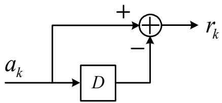  
(a) Block diagram

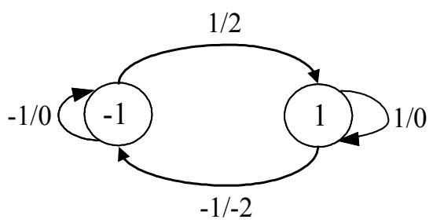  
(b) FSM

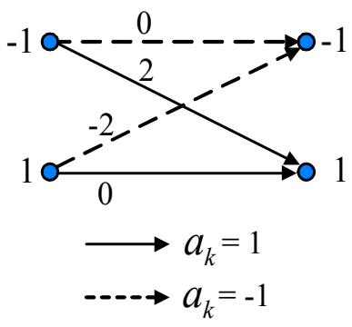  
(c) Trellis diagram  
รูปที่ 4.15: (a) แผนภาพบล็อก, (b) เครื่องสถานะจำกัด, และ (c) แผนภาพเทรลลิส ของช่องสัญญาณ $H ( D ) = 1 - D$

ค) สร้างเครืองสถานะจำกัด และวาดแผนภาพเทรลลิส ของช่องสัญญาณ $h _ { k }$

ง)ถอดรหัสข้อมูล {yk} ด้วยวงจรตรวจหาวีเทอร์บิ

## วิธีทำ

ก)จากช่องสัญญาณที่กำหนดมาให้ $h _ { k } = \delta _ { k } - \delta _ { k - 1 }$ นั่นคือ $H ( D ) = 1 - D$ สามารถแสดงเป็น แผนภาพบล็อกของช่องสัญญาณได้ตามรูปที่ 4.15(a)

ข) เนื่องจาก $H ( D ) = 1 - D$ ดังนั้น สมการแสดงความสัมพันธ์ระหว่างข้อมูลอินพุต $a _ { k }$ และข้อมูล เอาต์พุต $r _ { k }$

$$
r _ { k } = a _ { k } - a _ { k - 1 }
$$

ซึ่งจะได้ว่า $r _ { k } = \{ - 1 , 0 , 2 , - 2 , 1 \}$ ดังนัน yk = rk + nk = {−0.5, −0.4, 2.1, −1.3, 0.7} ค)จากสมการแสดงความสัมพันธ์ระหว่างข้อมูลอินพุตและข้อมูลเอาต์พุตที่ได้ในข้อ ข) เครื่องสถานะ จำกัดและแผนภาพเทรลลิส สามารถแสดงได้ตามรูปที่ 4.15(b) และ 4.15(c) ตามลำดับ

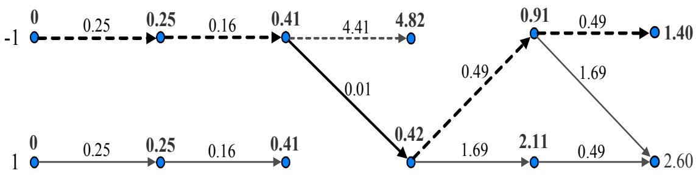  
รูปที่ 4.16: แผนภาพสรุปขั้นตอนการทำงานของวงจรตรวจหาวีเทอร์บิ

ง) วงจรตรวจหาวีเทอร์บิใช้แผนภาพเทรลลิสในการถอดรหัสข้อมูล $\left\{ y _ { k } \right\}$ โดยที่ ขึ้นตอนการถอดรหัส ข้อมูลสามารถสรุปได้ตามรูปที่ 4.16 เมื่อ ตัวเลขที่แสดงอยู่บนจุดต่อแต่ละจุด คือ ค่าเมตริกเส้นทาง ทีมาถึง ณ จุดต่อนัน และตัวเลขที่แสดงอยู่บนเส้นสาขาแต่ละเส้น คือ ค่าเมตริกสาขาของแต่ละเส้น สาขาที่ดีที่สุดที่มาถึงที่จุดต่อนั้นๆ จากรูปที่ 4.16 ค่าเมตริกเส้นทางที่น้อยที่สุด คือ ค่า 1.40 ดังนั้น วงจรตรวจหาวีเทอร์บิจะถอดรหัสข้อมูลโดยการมองย้อนกลับไปตามเส้นทางที่ยังมีชีวิตอยู่ที่มาถึงจุดต่อ ที่มีค่าเมตริกเส้นทางเท่ากับ 1.40 ซึ่งจะพบว่า ค่าประมาณของลำดับข้อมูลอินพุต $\{ \hat { a } _ { k } \}$ ที่สอดคล้อง กับเส้นทางที่ยังมีชีวิตอยู่นี้ คือ

$$
\{ \hat { a } _ { k } \} = \{ \hat { a } _ { 0 } , \hat { a } _ { 1 } , \hat { a } _ { 2 } , \hat { a } _ { 3 } \} = \{ - 1 , - 1 , 1 , - 1 \}
$$

ซึ่งมีค่าตรงกับลำดับข้อมูลอินพุต $\{ a _ { k } \}$ ที่ส่งมาจากวงจรภาคส่ง เพราะฉะนั้น การถอดรหัสด้วยวงจร ซ   
ตรวจหาวีเทอร์บิในตัวอย่างข้อนี้ จึงไม่มีข้อผิดพลาดเกิดขึ้น

## 4.4.1 สรุปวงจรตรวจหาวีเทอร์บิ

วงจรตรวจหาวีเทอร์บิจะทำงานได้อย่างมีประสิทธิภาพมากทีสุด ก็ต่อเมือ องค์ประกอบของสัญญาณ รบกวนที่แฝงอยูในข้อมูลที่จะทำการถอดรหัสด้วยวงจรตรวจหาวีเทอร์บิมีลักษณะเป็นสัญญาณรบกวน เกาส์สี ขาวแบบบวก (AพGN) [15] ทั้งนี้เป็นเพราะว่า อัลกอริทึมวีเทอร์บิได้มาจากสมมุติฐานที่ว่า องค์ประกอบของสัญญาณรบกวนที่ด้านขาเข้าของวงจรตรวจหาวีเทอร์บิเป็นสัญญาณรบกวนแบบเกาส์ สีขาวแบบบวก

ตารางที่ 4.2: ตัวอย่างแสดงจำนวนสถานะที่ต้องใช้ในแผนภาพเทรลลิสของทาร์เก็ตแบบต่างๆ
<table><tr><td rowspan=1 colspan=1>ทาร์เก็ตแบบ PR</td><td rowspan=1 colspan=1> $H ( D )$ </td><td rowspan=1 colspan=1>หน่วยความจำ บ</td><td rowspan=1 colspan=1>จำนวนสถานะทั้งหมด</td></tr><tr><td rowspan=1 colspan=1>PR4  $[ 1 \ 0 \ - 1 ]$ EPR4  $[ 1 ~ 1 ~ - 1 ~ - 1 ]$ EEPR4  $[ 1 ~ 2 ~ 0 ~ - 2 ~ - 1 ]$ </td><td rowspan=1 colspan=1> $( 1 - D ) ( 1 + D )$  $( 1 - D ) ( 1 + D ) ^ { 2 }$  $( 1 - D ) ( 1 + D ) ^ { 3 }$ </td><td rowspan=1 colspan=1>234</td><td rowspan=1 colspan=1> $2 ^ { 2 } = 4$  $2 ^ { 3 } = 8$  $2 ^ { 4 } = 1 6$ </td></tr></table>

หน้าที่หลักของวงจรตรวจหาวีเทอร์บิ คือ จะทำการถอดรหัสข้อมูลโดยให้มีค่าความน่าจะเป็นของ ข้อ ผิดพลาดลำดับ (probability of sequence error) น้อยที่สุด และโดยทั่วไปความซับซ้อนของวงจร ตรวจหาวีเทอร์บิจะขึ้นอยู่กับจำนวนสถานะที่ใช้ในแผนภาพเทรลลิส ดังแสดงในตารางที่ 4.2 จะ พบว่า เมื่อทาร์เก็ตที่ใช้มีจำนวนแท็ป (หรือหน่วยความจำ) มากขึ้น ความซับซ้อนของวงจรตรวจหาวีเทอร์บิ ก็จะมากขึ้น เนื่องจาก จำนวนสถานะที่ใช้ในแผนภาพเทรลลิสมีมากขึ้น อย่างไรก็ตาม เมื่อความจุ ข้อมูลของฮาร์ดดิสก์ไดรฟ์สูงขึ้น ทาร์เก็ตที่จะนำมาใช้ก็ควรที่จะต้องมีจำนวนแท็ปมากขึ้น เพื่อทำให้ผล ตอบสนองเชิงความถี่ของ ทาร์เก็ตสอดคล้องกับผลตอบสนองเชิงความถี่ของช่อง สัญญาณ ดังนั้นใน การพิจารณาว่า จะนำทาร์เก็ตที่มีจำนวนแท็ปมากมาใช้งานหรือไม่นั้น จะต้องประนีประนอมระหว่าง ประสิทธิ ภาพของระบบที่จะได้รับ และความซับซ้อนของวงจรตรวจหาวีเทอร์บิ

## 4.5สรุปท้ายบทธ

เทคนิด PRML เป็นการใช้งานร่วมกันระหว่างอีควอไลเซอร์แบบ PR และวงจรตรวจหาวีเทอร์บิ ซึ่ง เป็นที่นิยมใช้งานกันมากในระบบการประมวลผลสัญญาณของฮาร์ดดิสก์ไดรฟ์ สาเหตุหนึ่งอาจจะเป็น เพราะว่าวงจรตรวจหาวีเทอร์บิถือได้ว่าเป็นวงจรตรวจหาข้อมูลที่มีประสิทธิ ภาพมาก โดยเฉพาะอย่างยิ่ง เมื่อองค์ประกอบของสัญญาณรบกวนที่ด้านขาเข้าของวงจรตรวจหาวีเทอร์บิมีลักษณะ เป็นสัญญาณ รบกวนแบบเกาส์สีขาวแบบบวก หลักการทำงานของวงจรตรวจหาวีเทอร์บิจะอยู่บนพื้นฐานของแผน ภาพเทรลลิสซึ่งอาจจะสร้างได้จากเครื่องสถานะจำกัด และโดยทั่วไปแล้วความซับซ้อนของวงจรตรวจหา

วีเทอร์บิจะขึ้นอยู่กับจำนวนสถานะทั้งหมดที่ต้องใช้ในแผนภาพเทรลลิส ซึ่งจำนวนสถานะที่ใช้ในแผน ซ   
ภาพเทรลลิสจะขึ้นอยู่กับ จำนวนค่าที่เป็นไปได้ทั้งหมดของข้อมูลอินพุต และหน่วยความจำของทาร์เก็ต   
ดังนั้น การจะนำทาร์เก็ตไดมาใช้งานในฮาร์ดดิสก์ไดรฟ์ จะต้องประนีประนอมระหว่างประสิทธิภาพ   
ของระบบที่จะได้รับ และความซับซ้อนของวงจรตรวจหาวีเทอร์บิ

## 4.6 แบบฝึกหัดท้ายบท

1. จงอธิบายข้อแตกต่างระหว่างอีควอไลเซอร์แบบผลตอบสนองเต็ม (full-response) และแบบผล ตอบสนองบางส่วน (partial response)

2. กำหนดให้ข้อมูลอินพุต $a _ { k } \in \{ - 1 , 1 \}$ จงวาดแผนภาพบล็อก (block diagram), เครืองสถานะ จำกัด (FSM), และ แผนภาพเทรลลิส (Trellis diagram) ของช่องสัญญาณ $H ( D )$ ต่อไปนี้

2.1) $H ( D ) = 1 - 0 . 5 D$

2.2) $H ( D ) = 1 + 2 D + D ^ { 2 }$

2.3) $H ( D ) = 1 - D ^ { 3 }$

2.4) $H ( D ) = 1 + 3 D + 3 D ^ { 2 } + D ^ { 3 }$

3. จากแบบจำลองช่องสัญญาณในรูปที่ 4.9 ถ้ากำหนดให้ลำดับข้อมูลอินพุต $\{ a _ { k } \} = \{ 1 , ~ - 1$ −1, 1} ถูกส่งผ่านช่องสัญญาณ $H ( D )$ ซึ่งถูกรบกวนด้วยสัญญาณรบกวน $\{ n _ { k } \} = \{ 0 . 5 $ $- 0 . 4 , 0 . 1 , 0 . 7 , - 0 . 3 , 0 . 4 \}$ จงถอดรหัส ข้อมูล $\left\{ y _ { k } \right\}$ โดยใช้วงจรตรวจหาวีเทอร์บิ สำหรับช่อง สัญญาณต่อไปนี้

3.1) $H ( D ) = 1 + 2 D + D ^ { 2 }$

3.2) $H ( D ) = 1 - D ^ { 2 }$

4. จากแบบจำลองช่องสัญญาณในรูปที่ 4.9 ถ้ากำหนดให้ลำดับข้อมูลอินพุต $\{ a _ { k } \} = \{ 1 , 0 , 1$ 0} ถูกส่งผ่านช่องสัญญาณ $H ( D )$ ซึ่งถูกรบกวนด้วยสัญญาณรบกวน $\left\{ n _ { k } \right\} = \left\{ 0 . 3 , - 0 . 5 . \right.$ $0 . 2 , 0 . 6 , - 0 . 4 , - 0 . 3 , 0 . 5 \}$ จงถอดรหัสข้อมูล $\left\{ y _ { k } \right\}$ โดยใช้วงจรตรวจหาวีเทอร์บิ สำหรับช่อง สัญญาณต่อไปนี้