## บทที่ 6

## วงจรตรวจหา NPML

ในบทนี้จะ อธิบายหลักการทำงานและ ประโยชน์ของ วงจรตรวจหา NPML (noise-predictive maximum-likelihoอd) [51, 52] ซึ่งเป็นวงจรตรวจหาที่มีประสิทธิ ภาพมากกว่าวงจรตรวจหา PRML (partial-response maximum-likelihood) โดยเฉพาะอย่างยิ่ง เมื่อ ระบบทำงานที่ ความจุข้อมูล ของ ฮาร์ด ดิสก์ไดรฟ์สูง ในทางปฏิบัติ วงจรตรวจหา NPML ประยุกต์มาจากวงจรตรวจหา PRML โดยการนำ กระบวนการในการทำนายสัญญาณรบกวน (noise prediction process) แฝงเข้าไปอ ยูในแต่ละ เส้น สาขา (branch) ของแผนภาพเทรลลิส (trellis diagram) ดังที่จะอธิบายต่อไปในบทนี้ พร้อมทั้งแสดง ผลการเปรียบเทียบประสิทธิ ภาพระหว่างวงจรตรวจหา PRML และวงจรตรวจหา NPML

## 6.1 บทนำ

เทคนิค PRML คือ การใช้งานร่วมกันระหว่างอีควอไลเซอร์แบบ PR (partial response) และวงจร ตรวจหาวีเทอร์บิ (Viterb detector) ซึ่งเป็นที่นิยมใช้งานมากในระบบการประมวลผลสัญญาณของ ฮาร์ดดิสก์ไดรฟ์ ตามที่อธิบายในบทที่ 4 ให้พิจารณาแบบจำลองช่องสัญญาณที่ไม่ต่อเนื่องทางเวลา แบบสมมูลในโดเมน D ตามรูปที่ 6.1 เมื่อ A(D) คือ ข้อมูลบิตอินพุต, C(D) คือ ช่องสัญญาณ, N(D) คือ สัญญาณรบกวนเกาส์สีขาวแบบบวก (AพGN), F(D) คือ อีควอไลเซอร์แบบ PR, H(D) คือ ทาร์เก็ต (targะt), Y(D) คือ ข้อมูลที่จะ ถูกส่งเข้าไปทำการถอดรหัสข้อมูลด้วยวงจรตรวจหาวีเทอร์บิ และ $\hat { A } ( D )$ คือ ค่าประมาณของข้อมูลบิตอินพุต A(D)

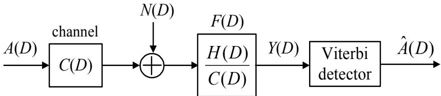  
รูปที่ 6.1: แบบจำลองช่องสัญญาณที่ไม่ต่อเนื่องทางเวลาแบบสมมูล

จากรูปที่ 6.1 ข้อมูลเอาต์พุตของอีควอไลเซอร์ Y(D) สามารถเขียนเป็นสมการทางคณิตศาสตร์ ได้ตามสมการ (4.6) นั่นคือ

$$
Y ( D ) = \underbrace { A ( D ) H ( D ) } _ { \mathrm { w a n t e d ~ s i g n a l } } + \underbrace { N ( D ) { \frac { H ( D ) } { C ( D ) } } } _ { W ( D ) }\tag{6.1}
$$

โดยที่ W(D) คือ สัญญาณรบกวนที่จะเข้าไปในวงจรตรวจหาวีเทอร์บิ (ตามที่อธิบายในหัวข้อที่ 4.2.2) โดยทั่วไป วงจรตรวจหาวีเทอร์บิจะทำงานได้อย่างมีประสิทธิภาพมากที่สุด ก็ต่อเมื่อ W(D) มีลักษณะ เป็นสัญญาณรบกวนเกาส์สี ขาวแบบบวก อย่างไรก็ตามในทางปฏิบัติ แล้ว (โดยเฉพาะอย่างยิ่ง เมื่อ ระบบทำงานที่ความจุข้อมูลของฮาร์ดดิสก์ไดรฟ์สูงๆ) การออกแบบทาร์เก็ต H(D) ที่มีจำนวนแท็ป (tap) น้อย ให้มีผลตอบสนองเหมือนกับช่องสัญญาณ C(D) ทำได้ยากมาก ดังนั้นโดยทั่วไป W(D) จะ มีลักษณะ เป็นสัญญาณรบกวนแบบสี1 (colored noise) [25] ซึ่งจะ ส่งผลทำให้ประสิทธิ ภาพการ ทำงานของวงจรตรวจหาวีเทอร์บิลดลง เพราะฉะนัน ถ้าต้องการให้วงจรตรวจหาวีเทอร์บิสามารถที่จะ ทำงานได้อย่างมีประสิทธิภาพสูงสุดเหมือนเดิม นักวิจัยจะต้องหาวิธีการใดวิธีการหนึ่งในการทำให้องค์ ประกอบของสัญญาณรบกวนในข้อมูล Y(D) (นั้นคือ W(D)) มีลักษณะเป็นสัญญาณรบกวนเกาส์ สีขาวแบบบวก ก่อนที่จะส่งผลลัพธ์ที่ได้เข้าไปทำการถอดรหัสด้วยวงจรตรวจหาวีเทอร์บิ

ดังนั้นอาจจะกล่าวได้ว่า เทคนิด NPML [51, 52] คือ การใช้งานร่วมกันระหว่างอีควอไลเซอร์แบบ PR และวงจรตรวจหาวีเทอร์บิที่มีกระบวนการในการทำนายสัญญาณรบกวน หรือ กระบวนการในการ ทำให้สัญญาณรบกวนเป็นสี ขาว (noise whitening process) แฝงอยู่ข้างในอัลกอริทึ่มวีเทอร์บิ ดัง แสดงในรูปที่ 6.2 เพราะฉะนั้น เมื่อระบบทำงานที่ความจุข้อมูลของฮาร์ดดิสก์ไดรฟ์สูงๆ วงจรตรวจหา NPML จึงควรที่จะ ถูกนำมาใช้งานมากกว่าการใช้วงจรตรวจหา PRML เพื่อที่จะได้ประสิทธิภาพรวม ของระบบทีดีกว่า

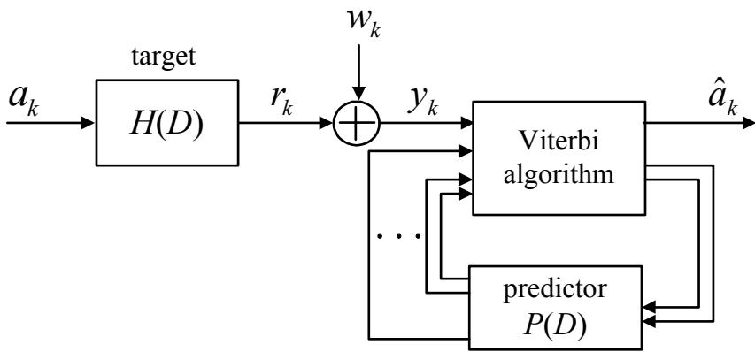  
รูปที่ 6.2: แบบจำลองช่องสัญญาณพร้อมวงจรตรวจหา NPML

## 6.2 กระบวนการในการทำนายสัญญาณรบกวน

วงจรกรองทำนาย (predictor filter) ที่ใช้งานทั่วไปในระบบการประมวลผลสัญญาณดิจิทัลจะมีลักษณะ ทั้งที่เป็น แบบผลตอบสนองอิมพัลส์จำกัด (FIR: finite impulse response) และ แบบผลตอบสนอง อิมพัลส์ไม่จำกัด (IIR: infinite impulse response) นอกจากนี้ คุณสมบัติทั่วไปของวงจรกรองทำนาย คือ ข้อผิดพลาดการทำนาย (prediction error) จะค่อยๆ ลดลง เมื่อจำนวนแท็ปของวงจรกรองทำนาย เพิ่มขึ้น ในหนังสือเล่มนี้จะพิจารณาเฉพาะวงจรกรองทำนายแบบ FIR เท่านั้น

พิจารณาแบบจำลองกระบวนการในการทำให้สัญญาณรบกวนเป็นสีขาว ในรูปที่ 6.3 เมื่อ $w _ { k }$ คือ สัญญาณรบกวนแบบสี, $\hat { w } _ { k }$ คือ ค่าประมาณของ wk, $e _ { k } = w _ { k } - \hat { w } _ { k }$ คือ ข้อผิดพลาดการทำนาย, และ $P ( D )$ คือ ฟังก์ชันถ่ายโอนของวงจรกรองทำนายในโดเมน $D$ ซึ่งมีรูปสมการ คือ

$$
P ( D ) = \sum _ { k = 1 } ^ { N } p _ { k } D ^ { k } = p _ { 1 } D + p _ { 2 } D ^ { 2 } + . . . + p _ { N } D ^ { N }\tag{6.2}
$$

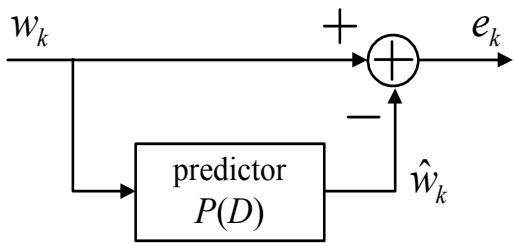  
รูปที่ 6.3: แบบจำลองกระบวนการในการทำให้สัญญาณรบกวนเป็นสีขาว

โดยที่ $p _ { k }$ คือ ค่าสัมประสิทธิ์ตัวที่ k ของวงจรกรองทำนาย และ N คือ จำนวนแท็ปทั้งหมดของวงจร กรองทำนาย ดังนั้น $\hat { w } _ { k }$ สามารถเขียนให้อยู่ในรูปของสมการทางคณิตศาสตร์ได้ คือ

$$
\hat { w } _ { k } = \sum _ { i = 1 } ^ { N } p _ { i } w _ { k - i }\tag{6.3}
$$

สมการ (6.3) จะรูจักกันในชื่อของ "วงจรกรองทำนายหนึ่งขั้นแบบเชิงเส้น (linear one-step predictor)"เช่นเดียวกัน ข้อผิดพลาดการทำนาย $e _ { k }$ สามารถจัดให้อยู่ในรูปของสมการทางคณิตศาสตร์ได้ ดังนี้

$$
e _ { k } = w _ { k } - { \hat { w } } _ { k } = w _ { k } - \sum _ { i = 1 } ^ { N } p _ { i } w _ { k - i }\tag{6.4}
$$

หรือเขียนให้อยู่ในรูปของโดเมน $D$ ได้ คือ

$$
E ( D ) = [ 1 - P ( D ) ] W ( D )\tag{6.5}
$$

โดยที่ พจน์ $[ 1 - P ( D ) ]$ จะ เรียกกันทั่วไปว่า "วงจรกรองข้อผิดพลาดการทำนาย (prediction error filter)"

## 6.3 การหาค่าสัมประสิทธิ์ของวงจรกรองทำนาย

จุดประสงค์ในการออกแบบวงจรกรองทำนาย $P ( D )$ (นั่นคือ การหาค่าสัมประสิทธิ์ ของวงจรกรอง ทำนาย) คือ การทำให้ข้อผิดพลาดการทำนาย $e _ { k }$ มีค่าน้อยที่สุด หรืออีกนัยหนึ่งก็คือ การทำให้ $e _ { k }$ มี

## ซ 6.3. การหาค่าสัมประสิทธิของวงจรกรองทำนาย

ลักษณะ เป็นสัญญาณรบกวนสีขาวให้มากที่สุด ทั้งนี้เป็นเพราะว่า ข้อมูล $e _ { k }$ ถือว่าเป็นองค์ประกอบ   
ของสัญญาณรบกวนที่หลงเหลืออยู่ในข้อมูลที่จะส่งเข้าไปทำการถอดรหัสด้วยวงจรตรวจหาวีเทอร์บิ 6   
ดังนั้น วิธีการหาค่าสัมประสิทธิของวงจรกรองทำนายที่ดีที่สุด ก็คือ การทำให้ค่าข้อผิดพลาดกำลังสอง   
เฉลีย (MSE: mean-squared error) [51, 52]

$$
E \left[ e _ { k } ^ { 2 } \right] = E \left[ ( w _ { k } - \hat { w } _ { k } ) ^ { 2 } \right]\tag{6.6}
$$

มีค่าน้อยที่สุด โดยที่ $E [ \cdot ]$ คือ ตัวดำเนินการค่าคาดหมาย ซึ่งสามารถทำได้โดยการหาอนุพันธ์ ของ สมการ (6.6) เทียบกับค่าสัมประสิทธิ์ ของวงจรกรองทำนาย $p _ { i }$ แต่ละตัว แล้วให้ผลลัพธ์ที่ได้มีค่าเท่า กับค่าศูนย์ จากนัน ทำการแก้ระบบสมการเชิงเส้นก็จะได้คำตอบออกมา หรือ อาจจะอาศัย "หลักการ เชิงตั้งฉาก (orthogonality principle)" ที่ว่า

$$
E \left[ ( w _ { k } - \hat { w } _ { k } ) w _ { m } \right] = 0\tag{6.7}
$$

สำหรับ $m = 1 , 2 , \ldots , N$ โดยการแก้สมการ (6.7) จะได้ว่า

$$
\begin{array} { r c l } { { E [ w _ { k } w _ { m } ] - \displaystyle \sum _ { i = 1 } ^ { N } p _ { i } E [ w _ { k - i } w _ { m } ] } } & { { = } } & { { 0 } } \\ { { } } & { { } } & { { } } \\ { { E [ w _ { k } w _ { m } ] } } & { { = } } & { { \displaystyle \sum _ { i = 1 } ^ { N } p _ { i } E [ w _ { k - i } w _ { m } ] } } \\ { { } } & { { } } & { { } } \\ { { R _ { w w } ( k - m ) } } & { { = } } & { { \displaystyle \sum _ { i = 1 } ^ { N } p _ { i } R _ { w w } ( k - i - m ) } } \end{array}\tag{6.8}
$$

เมื่อ $R _ { w w } ( i )$ คือ ค่าอัตสหสัมพันธ์ (auto-correlation) ลำดับที่ $i$ ของสัญญาณรบกวน $w _ { k }$ ซึ่งนิยาม โดย

$$
R _ { w w } ( i ) = E [ w _ { k + i } w _ { k } ] = E \left[ \sum _ { k = 0 } ^ { S - 1 } w _ { k + i } w _ { k } \right]\tag{6.9}
$$

โดยที่ $S$ คือ ความยาวหรือจำนวนบิตของลำดับข้อมูล $\{ w _ { k } \}$ ถ้าแทนค่า $k - m = j$ ในสมการ (6.8) จะได้ผลลัพธ์เป็น "สมการนอร์มอล (normal equation)" นั่นคือ

$$
R _ { w w } ( j ) = \sum _ { i = 1 } ^ { N } p _ { i } R _ { w w } ( j - i )\tag{6.10}
$$

สำหรับ $j = 1 , 2 , \dots , N$ ซึ่งสามารถจัดให้อยู่ในรูปของเมทริกซ์ได้ คือ

$$
\underbrace { \left[ \begin{array} { c } { R _ { w w } ( 1 ) } \\ { R _ { w w } ( 2 ) } \\ { \vdots } \\ { R _ { w w } ( N ) } \end{array} \right] } _ { \mathbf { r } } = \underbrace { \left[ \begin{array} { c c c c c c } { R _ { w w } ( 0 ) } & { R _ { w w } ( 1 ) } & { \hdots } & { R _ { w w } ( N - 1 ) } \\ { R _ { w w } ( 1 ) } & { R _ { w w } ( 0 ) } & { \hdots } & { R _ { w w } ( N - 2 ) } \\ { \vdots } & { \vdots } & { \vdots } & { \vdots } \\ { R _ { w w } ( N - 1 ) } & { \hdots } & { R _ { w w } ( 1 ) } & { R _ { w w } ( 0 ) } \end{array} \right] } _ { \mathbf { R } } \underbrace { \left[ \begin{array} { c } { p _ { 1 } } \\ { p _ { 2 } } \\ { \vdots } \\ { p _ { N } } \end{array} \right] } _ { \mathbf { p } }\tag{6.11}
$$

หรือ

$$
\mathbf { r } = \mathbf { R } \mathbf { p }\tag{6.12}
$$

เนื่องจาก R เป็นเมทริกซ์จัตุรัส (squลre matrix) ดังนั้น ค่าสัมประสิทธิ์ของวงจรกรองทำนาย P สามารถหาได้จากการแก้สมการ (6.12) นั่นคือ

$$
\mathbf { p } = \mathbf { R } ^ { - 1 } \mathbf { r }\tag{6.13}
$$

และค่าข้อผิดพลาดกำลังสองเฉลี่ยที่น้อยสุด (MMSE: minimum mean-squared error) ของวงจร กรองทำนายจะมีค่าเท่ากับ [52]

$$
E \left[ e _ { k } ^ { 2 } \right] = R _ { w w } ( 0 ) - \sum _ { i = 1 } ^ { N } p _ { i } R _ { w w } ( i )\tag{6.14}
$$

## 6.4 หลักการทำงานของวงจรตรวจหา NPML

เพื่อให้ง่ายต่อการอธิบายหลักการทำงานของวงจรตรวจหา NPML ให้พิจารณาแบบจำลองช่องสัญญาณ PR4 ตามรูปที่ 6.4 โดยที่ ข้อมูลที่ด้านขาเข้าของวงจรตรวจหา NPML สามารถเขียนให้อยูในรูปสมการ ทางคณิตศาสตร์ได้ คือ

$$
\begin{array} { l c l } { { y _ { k } } } & { { = } } & { { r _ { k } + w _ { k } } } \\ { { } } & { { } } & { { } } \\ { { } } & { { = } } & { { a _ { k } - a _ { k - 2 } + w _ { k } } } \end{array}\tag{6.15}
$$

เมื่อ $r _ { k } = a _ { k } - a _ { k - 2 }$ คือ ข้อมูลเอาต์พุตช่องสัญญาณ และ $w _ { k }$ คือสัญญาณรบกวนแบบสี

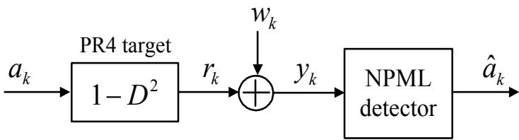  
รูปที่ 6.4: แบบจำลองช่องสัญญาณ PR4

หลักการทำงานของวงจรตรวจหา NPML จะต่างจากหลักการทำงานของวงจรตรวจหาวีเทอร์บิ ใน เรื่องของการคำนวณเมตริกสาขา (braทch metric) กล่าวคือ เมตริกสาขาของวงจรตรวจหา NPML จะ มีพจน์ที่เป็นค่าทำนายของสัญญาณรบกวน $\hat { w } _ { k }$ เข้ามาร่วมด้วย นันคือ

$$
\lambda _ { k } ( u , q ) = | y _ { k } - \hat { r } _ { k } ( u , q ) - \hat { w } _ { k } | ^ { 2 }\tag{6.16}
$$

เมื่อ $\hat { r } _ { k } ( u , q )$ คือ ข้อมูลเอาต์ พุตช่องสัญญาณที่ไม่มีสัญญาณรบกวน (noiseless channel output) $\stackrel { \mathrm { d } } { \boldsymbol { \ P } }$ สอดคล้องกับการเปลี่ยนสถานะจากสถานะ น ไปสถานะ $q$ ถ้ากำหนดให้ $a _ { k } ( q )$ คือ ข้อมูลบิตอินพุต ณ เวลาที่k ที่สอดคล้องกับเส้นทางการเปลี่ยนสถานะจากสถานะ น ไปสถานะ $q$ ดังนั้น สำหรับช่อง สัญญาณ PR4 จะได้ว่า

$$
\hat { r } _ { k } ( u , q ) = a _ { k } ( q ) - a _ { k - 2 } ( q )\tag{6.17}
$$

นอกจากนี้ ค่าทำนายของสัญญาณรบกวน $\hat { w } _ { k }$ สามารถเขียนให้อยู่ในรูปสมการทางคณิตศาสตร์ได้ คือ

$$
\hat { w } _ { k } = \sum _ { i = 1 } ^ { N } p _ { i } w _ { k - i }\tag{6.18}
$$

แทนค่า $w _ { k } = y _ { k } - a _ { k } + a _ { k - 2 }$ จากสมการ (6.15) ลงในสมการ (6.18) จะได้

$$
{ \hat { w } } _ { k } = \sum _ { i = 1 } ^ { N } p _ { i } \left( y _ { k - i } - a _ { k - i } + a _ { k - i - 2 } \right)\tag{6.19}
$$

แทนค่า $\hat { r } _ { k } ( u , q )$ จากสมการ (6.17) และ $\hat { w } _ { k }$ จากสมการ (6.19) ลงในสมการ (6.16) จะได้เป็น

$$
\lambda _ { k } ( u , q ) = \left. y _ { k } - a _ { k } ( q ) + a _ { k - 2 } ( q ) - \sum _ { i = 1 } ^ { N } p _ { i } \left( y _ { k - i } - \hat { a } _ { k - i } ( q ) + \hat { a } _ { k - i - 2 } ( q ) \right) \right. ^ { 2 }\tag{6.20}
$$

โดยที่ $\hat { a } _ { k } ( \boldsymbol q )$ คือ ค่าประมาณของข้อมูลบิตอินพุต ณ เวลาที่ k ที่สอดคล้องกับเส้นทางที่ยังมีชีวิตอยู่ (survivor path) ที่มาถึงสถานะ q

เมตริกสาขาในสมการ (6.20) ไม่เหมาะสำหรับการนำมาใช้กับงานประยุกต์ (aplicatioท) ที่ต้อง การความเร็วในการประมวลผลสูง เช่น ฮาร์ดดิสก์ไดรฟ์ เนืองจาก การคำนวณเมตริกสาขามีฟังก์ชัน การคูณ (สำหรับการทำนายสัญญาณรบกวน) เพิ่มขึ้นมา แทนที่จะมีเฉพาะฟังก์ชันการบวก-การเปรียบ เทียบ-การเลือก (ACS: add-compare-select) เหมือนกับที่ใช้ในอัลกอริทึมวีเทอร์บิแบบธรรมดา ดังนั้น เพื่อให้วงจรตรวจหา NPML สามารถนำมาใช้กับงานประยุกต์ที่ต้องการความเร็วในการประมวลผลสูง ได้ สมการ (6.20) จะต้องถูกจัดรูปใหม่ให้เป็น

$$
\lambda _ { k } ( u , q ) = \left| z _ { k } - \sum _ { i = K + 1 } ^ { N + 2 } \hat { a } _ { k - i } ( q ) g _ { i } + \sum _ { i = 1 } ^ { K } a _ { k - i } ( q ) g _ { i } - a _ { k } ( q ) \right| ^ { 2 }\tag{6.21}
$$

เมื่อ K คือ พาราเตอร์ที่ใช้ในการประนีประนอมระหว่างความซับซ้อน (comวexity) และประสิทธิภาพ ของวงจรตรวจหา NPML กล่าวคือ ถ้า K มีค่ามาก ความซับซ้อนก็จะมาก แต่ประสิทธิ ภาพที่ได้ก็จะดี (และในทางตรงกันข้าม),

$$
z _ { k } = y _ { k } - \sum _ { i = 1 } ^ { N } y _ { k - i } p _ { i }\tag{6.22}
$$

คือ ข้อมูลเอาต์พุตของวงจรกรองข้อผิดพลาดการทำนาย $[ 1 - P ( D ) ]$ ดังแสดงในรูปที่ 6.5, และ gi คือ ค่าสัมประสิทธิ์ของ "ทาร์เก็ตประสิทธิผล (effective target)" ในโดเมน D ซึ่งนิยามโดย ซ

$$
\begin{array} { l c l } { { H _ { \mathrm { e f f } } ( D ) } } & { { = } } & { { 1 - g _ { 1 } D - g _ { 2 } D ^ { 2 } - \ldots - g _ { N + 2 } D ^ { N + 2 } } } \\ { { } } & { { } } & { { } } \\ { { } } & { { = } } & { { ( 1 - D ^ { 2 } ) [ 1 - P ( D ) ] } } \end{array}\tag{6.23}
$$

โดยสรุปแล้ว การสร้างวงจรตรวจหา NPML ในทางปฏิบัติ ทำได้ดังต่อไปนี้

1) คำนวณหาวงจรกรองทำนาย P(D) โดยใช้สมการ (6.13)

2) คำนวณหาลำดับข้อมูล {zk} จากสมการ (6.22) โดยนำลำดับข้อมูลเอาต์พุตของอีควอไลเซอร์ $\left\{ y _ { k } \right\}$ ที่สอดคล้องกับทาร์เก็ต H(D) ที่ต้องการ มาผ่านวงจรกรองข้อผิดพลาดการทำนาย [1− P(D)] ตามรูปที่ 6.5

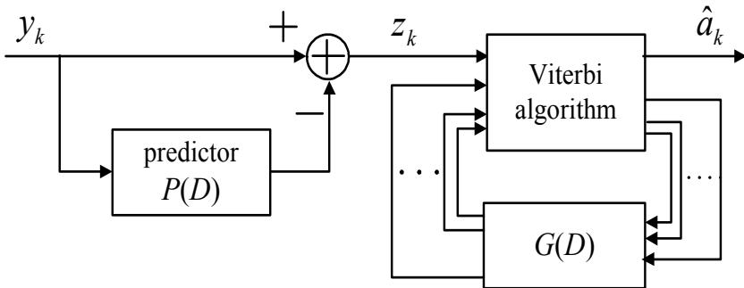  
รูปที่ 6.5: โครงสร้างของวงจรตรวจหา NPML ที่ใช้ กับงานประยุกต์ที่ต้องการความเร็วใน การ ประมวลผลสูง

3) นำลำดับข้อมูล $\{ z _ { k } \}$ ที่ได้ไปทำการถอดรหัส ข้อมูลด้วยวงจรตรวจหาวีเทอร์บิแบบธรรมดา แต่ แผนภาพเทรลลิสที่ใช้ในการคำนวณตามอัลกอริทึมวีเทอร์บิ (ตามที่อธิบายในหัวข้อที่ 4.3.3) จะต้องสร้างจากทาร์เก็ตประสิทธิผล $H _ { \mathrm { e f f } } ( D )$ ซึ่งหาได้จาก

$$
H _ { \mathrm { e f f } } ( D ) = H ( D ) [ 1 - P ( D ) ]\tag{6.24}
$$

เมื่อ $H ( D )$ คือ ทาร์เก็ตที่สอดคล้องกับอีควอไลเซอร์ที่ใช้ในระบบ จะเห็นได้ว่า ค่าสัมประสิทธิ์ ของ ทาร์เก็ต ประสิทธิผลจะ เป็นเลขจำนวนจริง กล่าวคือถึงแม้ว่า ค่าสัมประสิทธิ์ ของ $H ( D )$ จะ เป็นเลข จำนวนเต็ม แต่ค่าสัมประสิทธิ์ของ $P ( D )$ เป็นเลข จำนวนจริง ดังนั้น ผลลัพธ์ที่ได้ $H _ { \mathrm { e f f } } ( D )$ จะมี ค่าสัมประสิทธิ์เป็นเลขจำนวนจริง เพราะฉะนั้นอาจจะ กล่าวได้ว่า ทาร์เก็ตประสิทธิผล $H _ { \mathrm { e f f } } ( D )$ คือ ทาร์เก็ตแบบ GPR แบบหนึ่งก็ได้

ตัวอย่างที่ 6.1 จากการออกแบบทาร์เก็ตและอีควอไลเซอร์ ตามแบบจำลองในรูปที่ 3.2 สำหรับระบบ $\mathrm { N D } ~ = ~ 2$ และ SNR = 15 dB โดยกำหนดให้ทาร์เก็ตที่ต้องการ คือ $H ( D ) = 1 - D$ ปรากฎว่า ลำดับข้อผิดพลาด $\{ w _ { k } \}$ ที่ได้ คือ $\{ 0 . 8 6 , - 0 . 2 6 , - 0 . 1 3 , - 0 . 1 4 , 0 . 3 5$ : −0.66} จงคำนวณหา

ก) วงจรกรองทำนาย $P ( D )$ แบบ 2 แท็ป และทาร์เก็ตประสิทธิผล $H _ { \mathrm { e f f } } ( D )$

ข) วงจรกรองทำนาย $P ( D )$ แบบ 4 แท็ป และทาร์เก็ตประสิทธิผล $H _ { \mathrm { e f f } } ( D )$

วิธีทำ จากลำดับข้อผิดพลาด $\{ w _ { k } \}$ ที่กำหนดให้ ค่าอัตสหสัมพันธ์ของ $w _ { k }$ สามารถหาได้จากสมการ (6.9) ดังนี้

$$
R _ { w w } ( i ) = \{ 0 . 2 3 3 6 , - 0 . 0 9 0 3 , - 0 . 0 0 7 1 , - 0 . 0 4 1 9 , 0 . 2 3 6 3 , - 0 . 5 6 7 6 \}
$$

สำหรับ $i = 0 , 1 , 2 , \ldots , 5$ ตามลำดับ

ก) วงจรกรองทำนายแบบ 2 แท็ป สามารถหาได้จากการแก้สมการ (6.11) นั้นคือ

$$
\left[ \begin{array} { c } { - 0 . 0 9 0 3 } \\ { - 0 . 0 0 7 1 } \end{array} \right] = \left[ \begin{array} { c c } { 0 . 2 3 3 6 } & { - 0 . 0 9 0 3 } \\ { - 0 . 0 9 0 3 } & { 0 . 2 3 3 6 } \end{array} \right] \left[ \begin{array} { c } { p _ { 1 } } \\ { p _ { 2 } } \end{array} \right]
$$

ซ ค่าสัมประสิทธิของวงจรกรองทำนาย มีค่าเท่ากับ

$$
\begin{array} { r l r } { \left[ \begin{array} { l } { p _ { 1 } } \\ { p _ { 2 } } \end{array} \right] } & { = } & { \left[ \begin{array} { l l } { 0 . 2 3 3 6 } & { - 0 . 0 9 0 3 } \\ { - 0 . 0 9 0 3 } & { 0 . 2 3 3 6 } \end{array} \right] ^ { - 1 } \left[ \begin{array} { l } { - 0 . 0 9 0 3 } \\ { - 0 . 0 0 7 1 } \end{array} \right] } \\ & { = } & { \left[ \begin{array} { l } { 5 . 0 3 2 3 } & { 1 . 9 4 5 4 } \\ { 1 . 9 4 5 4 } & { 5 . 0 3 2 3 } \end{array} \right] \left[ \begin{array} { l } { - 0 . 0 9 0 3 } \\ { - 0 . 0 0 7 1 } \end{array} \right] } \\ & { = } & { \left[ \begin{array} { l } { - 0 . 4 6 8 4 } \\ { - 0 . 2 1 1 6 } \end{array} \right] } \end{array}
$$

ดังนั้น วงจรกรองทำนายแบบ 2 แท็ป คือ

$$
P ( D ) = - 0 . 4 6 8 4 D - 0 . 2 1 1 6 D ^ { 2 }
$$

และทาร์เก็ตประสิทธิผลที่สอดคล้องกับวงจรกรองทำนายนี้ คือ

$$
\begin{array} { l l l } { { H _ { \mathrm { e f f } } ( D ) } } & { { = } } & { { \left( 1 - D \right) \left[ 1 - \left( - 0 . 4 6 8 4 D - 0 . 2 1 1 6 D ^ { 2 } \right) \right] } } \\ { { } } & { { } } & { { } } \\ { { } } & { { = } } & { { 1 - 0 . 5 3 1 6 D - 0 . 2 5 6 8 D ^ { 2 } - 0 . 2 1 1 6 D ^ { 3 } } } \end{array}
$$

โดยจำนวนสถานะในแผนภาพเทรลลิสที่ใช้ในวงจรตรวจหา NPML จะมีทั้งหมด $2 ^ { 3 } = 8$ สถานะ

ข) ในทำนองเดียวกัน วงจรกรองทำนายแบบ 4 แท็ป ก็สามารถหาได้จากการแก้สมการ (6.11) นั้นคือ

$$
\left[ \begin{array} { c } { { - 0 . 0 9 0 3 } } \\ { { - 0 . 0 0 7 1 } } \\ { { - 0 . 0 4 1 9 } } \\ { { 0 . 2 3 6 3 } } \end{array} \right] = \left[ \begin{array} { c c c c } { { 0 . 2 3 3 6 } } & { { - 0 . 0 9 0 3 } } & { { - 0 . 0 0 7 1 } } & { { - 0 . 0 4 1 9 } } \\ { { - 0 . 0 9 0 3 } } & { { 0 . 2 3 3 6 } } & { { - 0 . 0 9 0 3 } } & { { - 0 . 0 0 7 1 } } \\ { { - 0 . 0 0 7 1 } } & { { - 0 . 0 9 0 3 } } & { { 0 . 2 3 3 6 } } & { { - 0 . 0 9 0 3 } } \\ { { - 0 . 0 4 1 9 } } & { { - 0 . 0 0 7 1 } } & { { - 0 . 0 9 0 3 } } & { { 0 . 2 3 3 6 } } \end{array} \right] \left[ \begin{array} { c } { { p _ { 1 } } } \\ { { p _ { 2 } } } \\ { { p _ { 3 } } } \\ { { p _ { 4 } } } \end{array} \right]
$$

ค่าสัมประสิทธิ์ของวงจรกรองทำนาย มีค่าเท่ากับ

$$
\begin{array} { r l } { | \mathcal { R } | } \\ { | \mathcal { R } | } \\ { | \mathcal { R } | } \\ { | \mathcal { R } | } \\ { | \mathcal { R } | } \\ { | \mathcal { I } | } \\ { | \mathcal { R } | } \end{array} \mapsto \begin{array} { r l r } { \left[ 3 . 0 3 6 \mathcal { R } \right. ~ - 1 0 1 8 8 8 9 ~ - 1 0 0 1 ~ - 3 . 6 1 1 1 1 ~ - 1 0 1 1 9 ~ - 1 . 1 0 1 8 8 1 } \\ { - 1 . 0 0 0 7 1 ~ 0 } & { 0 . 2 3 1 1 9 ~ - 1 . 0 6 0 1 1 ~ - 1 . 0 6 0 1 1 ~ - 1 . 0 6 0 1 1 } \\ { 0 . 1 0 7 1 ~ - 1 . 0 1 8 8 9 ~ - 1 . 0 1 8 5 1 ~ - 1 . 0 1 6 0 1 1 ~ - 1 . 0 1 1 1 9 ~ \right] } \\ { - 0 . 1 6 0 7 1 ~ - 1 . 0 1 9 9 1 1 ~ - 1 . 0 2 0 9 1 1 ~ - 1 . 0 2 3 9 1 ~ \left[ \begin{array} { l } { 1 . 0 1 6 1 1 1 1 1 ~ - 0 . 1 1 1 1 1 1 ~ } \\ { - 1 . 0 1 1 1 1 9 1 } \\ { - 0 . 0 1 1 9 5 1 1 ~ - 1 . 0 1 0 1 1 1 ~ - 1 . 0 1 1 1 1 1 ~ - 0 . 1 1 1 1 1 1 ~ - 0 . 2 3 1 1 1 1 ~ } \\ { 0 . 2 3 1 1 1 1 ~ - 1 . 0 1 1 1 1 1 ~ - 1 . 0 1 1 1 1 1 1 ~ - 0 . 1 1 1 1 1 1 ~ - 1 . 0 1 1 1 1 1 1 ~ } \end{array} \right] } \\  \left[ \begin{array} { l } { 5 . 3 1 1 1 1 1 ~ - 2 . 1 1 1 4 1 1 ~ 2 . 1 3 1 1 1 ~ - 2 . 0 1 1 8 8 1 1 } \\ { 3 . 2 1 1 1 ~ - 1 . 0 1 1 1 1 ~ - 2 . 0 1 1 1 1 1 ~ - 1 . 0 1 1 1 1 1 ~ - 1 . 0 1 1 1 1 1 ~ - 0 . 1 1 1 1 1 ~ } \\  0 . 2 0 1 1 1 ~ - 1 . 0 1 1 1 1 ~ - 1 . 0 1 1 1 1 1 ~ - 1 . 0 1 1 1 1 1 \end{array} \end{array}
$$

ดัง $1 \mathring { \mathcal { U } } \mathfrak { U }$ วงจรกรองทำนายแบบ 4 แท็ป คือ

$$
P ( D ) = - 0 . 1 7 6 2 D + 0 . 0 2 7 4 D ^ { 2 } + 0 . 2 4 1 2 D ^ { 3 } + 1 . 0 7 3 9 D ^ { 4 }
$$

และทาร์เก็ตประสิทธิผลที่สอดคล้องกับวงจรกรองทำนายนี คือ

$$
\begin{array} { l l l } { { H _ { \mathrm { e f f } } ( D ) } } & { { = } } & { { \left( 1 - D \right) \left[ 1 - \left( - 0 . 1 7 6 2 D + 0 . 0 2 7 4 D ^ { 2 } + 0 . 2 4 1 2 D ^ { 3 } + 1 . 0 7 3 9 D ^ { 4 } \right) \right] } } \\ { { } } & { { } } & { { } } \\ { { } } & { { = } } & { { 1 - 0 . 8 2 3 8 D - 0 . 2 0 3 6 D ^ { 2 } - 0 . 2 1 3 8 D ^ { 3 } - 0 . 8 3 2 7 D ^ { 4 } + 1 . 0 7 3 9 D ^ { 5 } } } \end{array}
$$

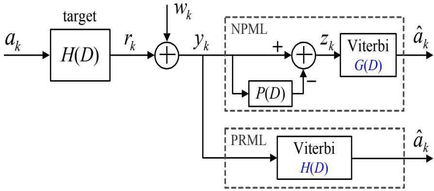  
รูปที่ 6.6: แบบจำลองช่องสัญญาณแบบสมมูล พร้อมทั้งวงจรตรวจหา NPML และ PRML  
โดยจำนวนสถานะในแผนภาพเทรลลิสที่ใช้ในวงจรตรวจหา NPML จะมีทั้งหมด $2 ^ { 5 } = 3 2$ สถานะ

สังเกตจะ พบว่า วงจรตรวจหา NPML จะมีความซับซ้อนมากกว่าวงจรตรวจหา PRML ทั้งนี้เป็น เพราะว่า ทาร์เก็ตประสิทธิผล $H _ { \mathrm { e f f } } ( D )$ จะมีจำนวนแท็ปมากขึ้นกว่าทาร์เก็ตปกติ $H ( D )$ ซึ่งเป็นผล มาจากจำนวนแท็ปของวงจรกรองทำนาย หรืออาจจะกล่าวได้ว่า จำนวนสถานะในแผนภาพเทรลลิสที่ ใช้ในวงจรตรวจหา NPML มีจำนวนเท่ากับ

$$
\mathring { \mathfrak { q } } { 1 } \mathfrak { k } { \mathfrak { q } } { \mathfrak { k } } \mathfrak { a } { \mathfrak { q } } { \mathfrak { q } } { \mathfrak { k } } { \mathfrak { q } } = | { \mathcal { A } } | ^ { \nu + N }
$$

เมื่อ $| { \cal { A } } |$ แทนจำนวนข้อมูลบิตอินพุตที่เป็นไปได้ทั้งหมด, V คือ จำนวนหน่วยความจำของทาร์เก็ต ปกติ $H ( D )$ , และ N คือ จำนวนแท็ปของวงจรกรองทำนาย อย่างไรก็ตาม ความซับซ้อนของวงจร ตรวจหา NPML สามารถทำให้ลดลงได้ตามที่เสนอใน [53]

ตัวอย่างที่ 6.2 แบบจำลองการออกแบบทาร์เก็ตและอีควอไลเซอร์ ในรูปที่ 3.2 สำหรับระบบการ บันทึกแบบแนวนอนที่ $\mathrm { N D } = 2$ และ $\mathrm { S N R } = 1 5$ dB สามารถลดรูปได้เป็น แบบจำลองช่องสัญญาณ แบบสมมูล ตามรูปที่ 6.6 เมื่อทาร์เก็ตที่ต้องการ คือ $H ( D ) = 1 - D$ ถ้ากำหนดให้ลำดับข้อมูล

อินพุต $\{ a _ { k } \} = \{ - 1 , 1 , 1 , 1 \}$ และสัญญาณรบกวน $\{ w _ { k } \} = \{ 0 . 4 6 , - 1 . 2 0 , 1 . 0 2 , - 0 . 5 9 , - 0 . 9 8 \}$ จงถอดรหัสข้อมูล $y _ { k }$ ด้วย

ก) วงจรตรวจหา PRML

ข) วงจรตรวจหา NPML เมื่อใช้วงจรกรองทำนายแบบ 1 แท็ป คือ $P ( D ) = - 0 . 7 5 3 D$

วิธีทำ จากรูปที่ 6.6 ข้อมูลเอาต์พุตช่องสัญญาณ $r _ { k }$ หาได้จาก

$$
r _ { k } = a _ { k } * h _ { k } = \{ - 1 , 2 , 0 , 0 , - 1 \}
$$

ญ 4 น ดังนัน ข้อมลที่ด้านขาเข้าของวงจรตรวจหา PRML และ NPML คือ

$$
y _ { k } = r _ { k } + w _ { k } = \{ - 0 . 5 4 , 0 . 8 0 , 1 . 0 2 , - 0 . 5 9 , - 1 . 9 8 \}
$$

ก) สำหรับระบบ PRML วงจรตรวจหาวีเทอร์บิจะ ทำการถอดรหัส ข้อมูล $\left\{ y _ { k } \right\}$ โดยใช้แผนภาพ เทรลลิสที่สร้างจากทาร์เก็ต $H ( D ) = 1 - D$ ตามที่แสดงในรูปที่ $6 . 7 ( \mathrm { a } )$ ซึ่งขันตอนการถอดรหัส ข้อมูล $\left\{ y _ { k } \right\}$ สามารถสรุปได้ ตามรูปที่ 6.8 โดยที่ ตัวเลขที่แสดงอยู่บนจุดต่อ (ทอde) แต่ละจุด คือ ค่า เมตริกเส้นทางทีมาถึง ณ จุดต่อนัน และตัวเลขที่แสดงอยู่บนเส้นสาขาแต่ละเส้น คือ ค่าเมตริกสาขา ของแต่ละเส้นสาขาทีดีที่สุดที่มาถึงที่จุดต่อนันๆ เพราะฉะนัน จากรูปที 6.8 ค่าเมตริกเส้นทางทีน้อย e ที่สุด คือ ค่า 2.24 ดังนั้นวงจรตรวจหาวีเทอร์บิจะถอดรหัสข้อมูลโดยการมองย้อนกลับไปตามเส้นทาง ที่ยังมีชีวิตอยู่(ธurvivor path) ที่มาถึง ณ จุดต่อที่มีค่าเมตริกเส้นทางเท่ากับ 2.24 ซึ่งจะพบว่า ค่า ประมาณของลำดับข้อมูลอินพุต $\{ \hat { a } _ { k } \}$ ที่สอดคล้องกับเส้นทางที่ยังมีชีวิตอยู่นี้ คือ

$$
\{ \hat { a } _ { k } \} = \{ \hat { a } _ { 0 } , \hat { a } _ { 1 } , \hat { a } _ { 2 } , \hat { a } _ { 3 } \} = \{ - 1 , - 1 , 1 , 1 \}
$$

ซึ่งมีค่าไม่ตรงกับลำดับข้อมูลอินพุต $\{ a _ { k } \} = \{ - 1 , 1 , 1 , 1 \}$ ที่ส่งมาจากต้นทาง ดังนั้น การถอดรหัส ด้วยวงจรตรวจหา PRML ในกรณีนี้ มีข้อผิดพลาดเกิดขึ้นเป็นจำนวน 1 บิต

ข) สำหรับระบบ NPML ลำดับข้อมูล $\left\{ y _ { k } \right\}$ จะ ถูกส่งผ่านเข้าไปในวงจรกรองในการทำให้สัญญาณ รบกวนเป็นสีขาว (noise whitening filter) โดยจะได้ผลลัพธ์ ออกมาเป็น $Z ( D ) = Y ( D ) [ 1 - P ( D ) ]$ หรือแสดงเป็นลำดับข้อมูล $\{ z _ { k } \}$ ในโดเมนเวลา ได้ดังนี้

$$
\{ z _ { k } \} = \{ - 0 . 5 4 0 0 , 0 . 3 9 3 4 , 1 . 6 2 2 4 , 0 . 1 7 8 1 , - 2 . 4 2 4 3 , - 1 . 4 9 1 0 \}
$$

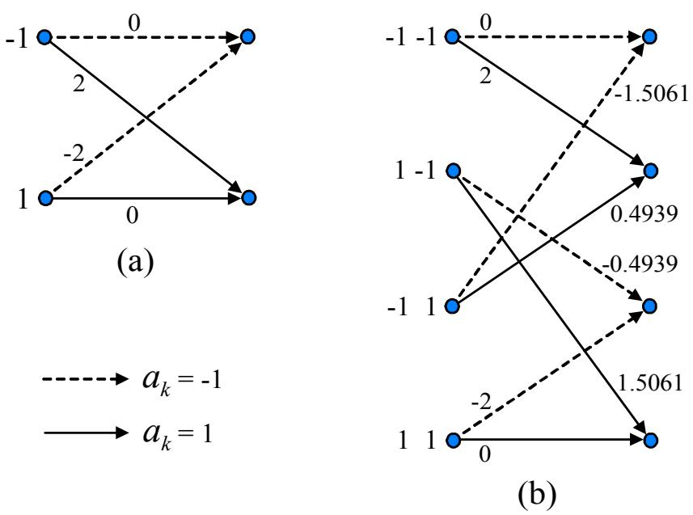  
รูปที่ 6.7: แผนภาพเทรลลิสของ (a) ทาร์เก็ต $H ( D ) = 1 - D$ และ (b) ทาร์เก็ตประสิทธิผล $H _ { \mathrm { e f f } } ( D )$ $= 1 - 0 . 2 4 7 D - 0 . 7 5 3 D ^ { 2 }$ ที่ใช้ในการถอดรหัสข้อมูลของระบบ PRML และ NPML ตามลำดับ

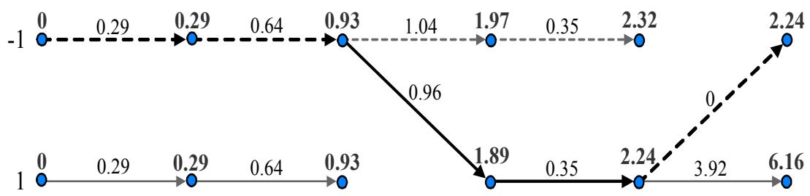  
รูปที่ 6.8: แผนภาพสรุปขั้นตอนการทำงานของวงจรตรวจหาวีเทอร์บิสำหรับระบบ PRML

จากนัน ลำดับข้อมูล {zk} จะ ถูกถอดรหัสข้อมูลด้วยวงจรตรวจหาวีเทอร์บิทีทำงานโดยใช้แผนภาพ เทรลลิสที่สร้างจากทาร์เก็ตประสิทธิผล $H _ { \mathrm { e f f } } ( D ) = H ( D ) [ 1 - P ( D ) ] = 1 - 0 . 2 4 7 D - 0 . 7 5 3 D ^ { 2 }$ ตามที่ แสดงในรูปที่ 6.6(b) โดยที่ ขั้นตอนการถอดรหัสข้อมูล {zk} สามารถสรุปได้ตามรูปที่ 6.9

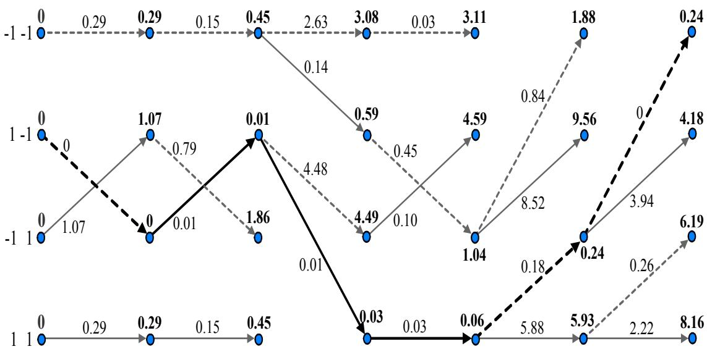  
รูปที่ 6.9: แผนภาพสรุปขั้นตอนการทำงานของวงจรตรวจหาวีเทอร์บิสำหรับระบบ NPML

เนืองจาก ค่าเมตริกเส้นทางที่น้อยทีสุด คือ ค่า 0.24 เพราะฉะนัน วงจรตรวจหาวีเทอร์บิจะถอดรหัส ข้อมูลโดยการมองย้อนกลับไปตามเส้นทางที่ยังมีชีวิตอยู่ที่มาถึง ณ จุดต่อที่มีค่าเมตริกเส้นทางเท่ากับ 0.24 ซึ่งจะพบว่า ค่าประมาณของลำดับข้อมูลอินพุต $\{ \hat { a } _ { k } \}$ ที่สอดคล้องกับเส้นทางที่ยังมีชีวิตอยู่นี้ คือ

$$
\{ \hat { a } _ { k } \} = \{ \hat { a } _ { 0 } , \hat { a } _ { 1 } , \hat { a } _ { 2 } , \hat { a } _ { 3 } \} = \{ - 1 , 1 , 1 , 1 \}
$$

ซึ่งมีค่าตรงกับลำดับข้อมูลอินพุต $\{ a _ { k } \} = \{ - 1 , 1 , 1 , 1 \}$ ที่ส่งมาจากต้นทาง ดังนั้น การถอดรหัสด้วย วงจรตรวจหา NPML ในตัวอย่างข้อนี้ จึงไม่มีข้อผิดพลาดเกิดขึ้น

## 6.5 ผลการทดลอง

ในส่วนนี้จะทำการเปรียบเทียบประสิทธิภาพของวงจรตรวจหา PRML และ NPML โดยใช้แบบจำลอง ช่องสัญญาณ ของระบบการบันทึก แบบแนวนอน (longitนdinal recording) ตามรูปที่6.10 โดยที่

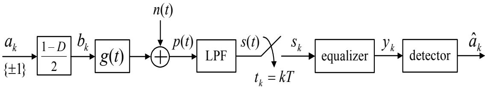  
รูปที่ 6.10: แบบจำลองช่องสัญญาณของระบบการบันทึกแม่เหล็ก

สัญญาณ reลd-back สามารถเขียนให้อยู่ในรูปของสมการคณิตศาสตร์ได้ คือ

$$
p ( t ) = \sum _ { k = 0 } ^ { S - 1 } b _ { k } g ( t - k T ) + n ( t )\tag{6.25}
$$

เมื่อ $b _ { k } = ( a _ { k } - a _ { k - 1 } ) / 2$ คือ บิตเปลี่ยนสถานะ $( b _ { k } = \pm 1$ สอดคล้องกับการเปลี่ยนแปลงสถานะ บวกหรือลบ และ $b _ { k } = 0$ หมายถึง ไม่มีการเปลี่ยนแปลงสถานะ), $a _ { k } \in \pm 1$ คือ บิตอินพุตที่มีจำนวน ทังหมด ซู $S = 4 0 9 6$ บิต หรือ 1 เซกเตอร์ (sector), $g ( t )$ คือ สัญญาณพัลส์เปลียนสถานะ ตามสมการ (1.1), และ $n ( t )$ คือ สัญญาณรบกวนเกาส์สีขาวแบบบวกที่มีความหนาแน่นสเปกตรัมกำลังแบบสอง ด้านเท่ากับ $N _ { 0 } / 2$

สัญญาณ read-back $p ( t )$ จะถูกส่งผ่านไปยังวงจรกรองผ่านต่ำบัตเทอร์เวิร์ตอันดับที่ 7 และถูกทำ การชักตัวอย่างด้วยความถีการชักตัวอย่างเท่ากับ $1 / T$ โดยสมมุติว่า กระบวนการในการชักตัวอย่างมี การเข้าจังหวะ ระหว่างสัญญาณ read-back และวงจรชัก ตัวอย่างแบบสมบูรณ์ (perfect synchronization) จากนัน ลำดับข้อมูลเอาต์พุต $\{ s _ { k } \}$ จะถูกป้อนไปยังอีควอไลเซอร์ (equalizer) เพื่อปรับรูปร่างของ สัญญาณให้เป็นไปตามทาร์เก็ตที่ต้องการ แล้วก็ส่งลำดับข้อมูลเอาต์พุต $\left\{ y _ { k } \right\}$ ที่ได้ ไปทำการถอดรหัส ข้อมูลด้วยวงจรตรวจหา (detector) เพือหาค่าประมาณของลำดับข้อมูลอินพุต $\{ a _ { k } \}$ ที่เป็นไปได้มาก ที่สุด ในที่นี้ ค่า รNR ที่ใช้จะนิยามโดย

$$
\mathrm { S N R } = 1 0 \log _ { 1 0 } \left( \frac { { V _ { p } } ^ { 2 } } { \sigma ^ { 2 } } \right)\tag{dB}
$$

(6.26)

เมื่อ $V _ { p } = 1$ คือ ขนาดสูงสุดของสัญญาณพัลส์เปลี่ยนสถานะ เอกเทศ (isolated traทรitioท pulse) และ $\sigma ^ { 2 } = N _ { 0 } / ( 2 T )$ คือ กำลังของสัญญาณรบกวน $n ( t )$ นอกจากนี แต่ละจุดของอัตราข้อผิดพลาด บิต (BER) จะ ถูกคำนวณโดยใช้ข้อมูลหลายๆ เซกเตอร์ จนกว่าจะได้ข้อผิดพลาดบิตมากกว่าหรือเท่า กับ 1000 บิต

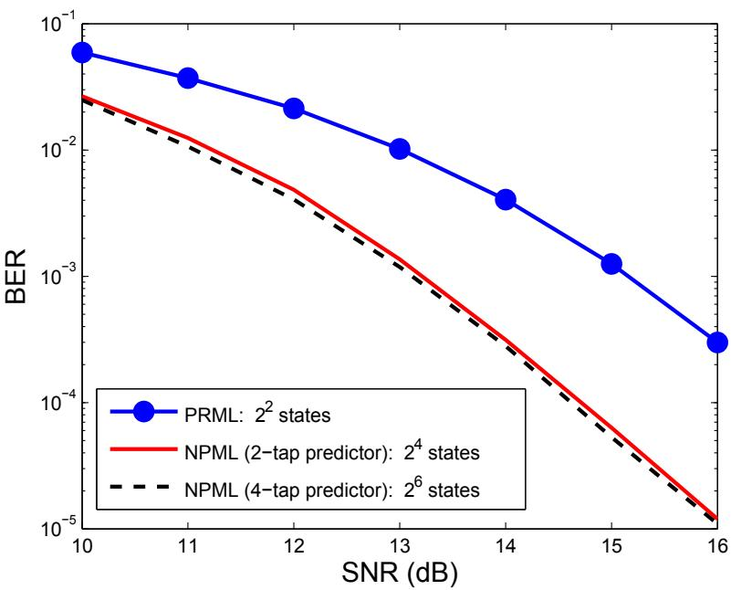  
รูปที่ 6.11: ประสิทธิภาพของระบบต่างๆ ที่ ND = 2

รูปที่ 6.11 เปรียบเทียบประสิทธิภาพของวงจรตรวจหา PRML และ NPML ที่ ND = 2 เมื่อ กำหนดให้ทุกระบบใช้ทาร์เก็ตแบบ PR4, $H ( D ) = 1 - D ^ { 2 }$ เพราะฉะนั้น จำนวนสถานะทั้งหมดที่ใช้ ในแผนภาพเทรลลิสของวงจรตรวจหา PRML คือ $2 ^ { 2 } = 4$ สถานะ ในขณะที่ จำนวนสถานะทั้งหมด ที่ใช้ในแผนภาพเทรลลิสของวงจรตรวจหา NPML คือ $2 ^ { 2 + 2 } = 1 6$ สถานะ (สำหรับวงจรกรองทำนาย แบบ 2 แท็ป) และ $2 ^ { 2 + 4 } = 6 4$ สถานะ (สำหรับวงจรกรองทำนายแบบ 4 แท็ป) ดังนั้นจะ เห็นได้ว่า วงจรตรวจหา NPML มีความซับซ้อนมากกว่าวงจรตรวจหา PRML แต่จากผลการทดลองตามรูปที่ 6.11 พบว่า วงจรตรวจหา NPML มีประสิทธิภาพมากกว่าวงจรตรวจหา PRML อย่างเห็นได้ชัด หรือ อาจจะกล่าวได้ว่า ณ ระดับ $\mathrm { B E R } = 1 0 ^ { - 4 }$ วงจรตรวจหา NPML มีประสิทธิภาพดีกว่าวงจรตรวจหา PRML ประมาณ 2 dB นอกจากนี้จากผลการทดลองยังพบว่า วงจรตรวจหา NPML ที่ใช้วงจรกรอง ทำนาย 2 แท็ป มีประสิทธิภาพใกล้เคียงกับวงจรกรองทำนาย 4 แท็ป ดังนั้น สำหรับระบบที่พิจารณานี้ วงจรตรวจหา NPML สามารถใช้วงจรกรองทำนายแบบ 2 แท็ป ก็เพียงพอต่อการใช้งานแล้ว เนื่องจาก ให้ประสิทธิภาพที่ไกล้เคียงกับการใช้วงจรกรองทำนายแบบ 4 แท็ป แต่ความซับซ้อนจะน้อยกว่ามาก

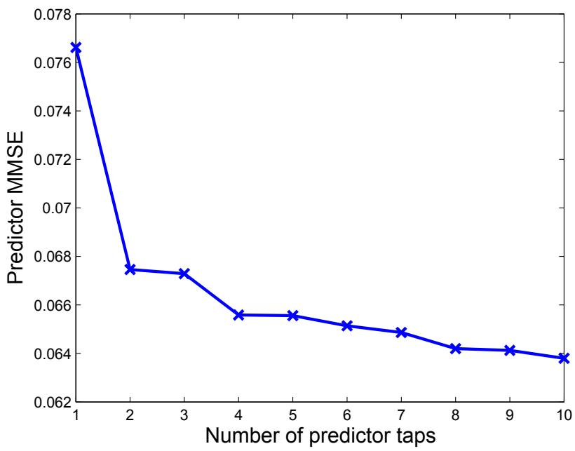  
รูปที่ 6.12: ประสิทธิ ภาพของวงจรกรองทำนายที่ใช้จำนวนแท็ปต่างกัน ที่ รNR = 17 dB

รปที่6.12 เปรียบเทียบประสิทธิ ภาพของวงจรกรองทำนายที่ใช้จำนวนแท็ปต่างกัน ที่ $\mathrm { S N R } = 1 7$ dB จะเห็นได้ว่า วงจรกรองทำนาย 2 แท็ป ก็มีประสิทธิภาพเพียงพอสำหรับการใช้งานแล้ว เนื่องจาก ถึงแม้ว่าจะเพิ่มจำนวนแท็ปมากขึ้น ประสิทธิภาพที่ได้ก็เพิ่มขึ้นน้อยมาก ซึ่งไม่คุ้มค่ากับความชับซ้อนที่ ได้รับ ในทำนองเดียวกันรูปที่ 6.13 เปรียบเทียบประสิทธิภาพของวงจรตรวจหา PRML และ NPM-Lที่ ${ \mathrm { N D } } = 2 . 5$ โดยใช้ทาร์เก็ตแบบ PR4 เหมือนเดิม แต่คราวนี้จะพบว่า วงจรตรวจหา NPML ให้ ประสิทธิ ภาพที่ดีกว่าวงจรตรวจหา PRML ค่อนข้างมาก เมื่อเทียบกับการทำงานที่ ND = 2 โดยอาจจะ กล่าวได้ว่า ณ ระดับ $\mathrm { B E R } = 1 0 ^ { - 4 }$ วงจรตรวจหา NPML มีประสิทธิภาพดีกว่าวงจรตรวจหา PRML ประมาณ 3 dB ทั้งนี้เป็นเพราะว่า ที่ความจุข้อมูลของฮาร์ดดิสก์ไดรฟัสูง (หรือ ND สูง) องค์ประกอบ ของสัญญาณรบกวนที่แฝงอยูในข้อมูลที่จะ ทำการถอดรหัส ด้วยวงจรตรวจหาวีเทอร์บิ จะ มีลักษณะ เป็นสัญญาณรบกวนแบบสีมากขึ้น จึงทำให้การใช้งานวงจรตรวจหา NPML ได้ประสิทธิภาพที่ดีกว่า

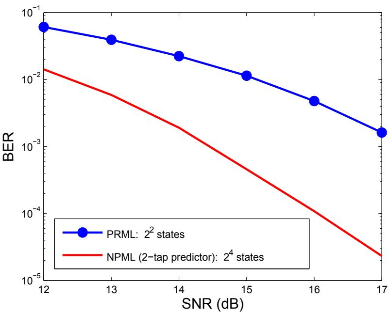  
รูปที่ 6.13: ประสิทธิ ภาพของระบบต่างๆ ที่ ND = 2.5

การใช้งานวงจรตรวจหา PRML มาก

เพื่อให้การเปรียบเทียบเป็นไปอย่างยุติธรรมในเรื่องของความชับซ้อนของระบบ จะทำการทดลอง เปรียบเทียบประสิทธิ ภาพของระบบ 3 ระบบ ที่ ND = 2.5 ดังต่อไปนี้

1) วงจรตรวจหา NPML ที่ใช้ทาร์เก็ตแบบ PR4 $H ( D ) = 1 - D ^ { 2 }$ และวงจรกรองทำนายแบบ 2 แท็ป

2) วงจรตรวจหา PRML ที่ใช้ทาร์เก็ตแบบ PR $H ( D ) = 1 + 2 D - 2 D ^ { 3 } - D ^ { 4 }$

3) วงจรตรวจหา GPRML2 ที่ใช้ทาร์เก็ตแบบ GPR ซึ่งออกแบบโดยเื่อนไขบังคับแบบโมนิก (ดู รายละเอียดในหัวข้อที่ 3.2.1) โดยที่ ทาร์เก็ตแบบ GPR นี้จะถูกออกแบบสำหรับแต่ละ SNR ตามรูปที่ 6.14 เมื่อแผนภาพเทรลิสที่ใช้ในการถอดรหัส ข้อมูลด้วยอัลกอริทึมวีเทอร์บิของทุกระบบ จะ มีจำนวนสถานะ เท่ากัน คือ 16 สถานะ และอีควอไลเซอร์ที่ใช้ของแต่ละระบบจะ ถูกออกแบบให้ เหมาะสมกับทาร์เก็ต H(D) ที่กำหนด จากรูปจะเห็นได้ว่า วงจรตรวจหา NPML มีประสิทธิภาพมาก กว่าวงจรตรวจหา PRML ที่ใช้ทาร์เก็ตแบบ PR แต่มีประสิทธิใกล้เคียงกับวงจรตรวจหา GPRML ทั้งนี้เป็นเพราะว่า ทาร์เก็ตประสิทธิผล $H _ { \mathrm { e f f } } ( D ) = H ( D ) [ 1 - P ( D ) ]$ ที่ใช้ในการสร้างแผนภาพ เทรลลิสของวงจรตรวจหา NPML สามารถที่จะ ถูกพิจารณาได้ว่าเป็นทาร์เก็ตแบบ GPR แบบหนึ่งได้ เนื่องจาก ค่าสัมประสิทธิของทาร์เก็ตประสิทธิผลเป็นเลขจำนวนจริง

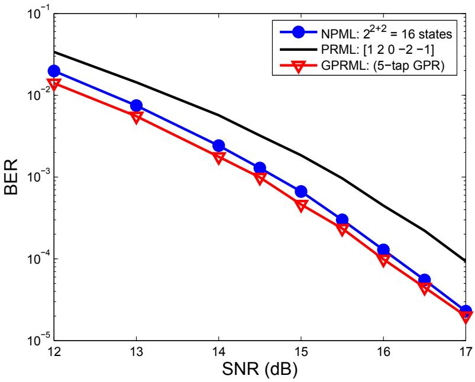  
รูปที่ 6.14: ผลการเปรียบเทียบประสิทธิ ภาพของระบบต่างๆ ที่ ND = 2.5

## 6.6สรุปท้ายบท

เมื่อระบบทำงานที่ความจุข้อมูลของฮาร์ดดิสก์ไดรฟ์สูง องค์ประกอบของสัญญาณรบกวนที่ด้านขาเข้า ของวงจรตรวจหาวีเทอร์บิจะ มีลักษณะเป็นสัญญาณรบกวนแบบสี (colored noise) มากขึ้น ในกรณี นี้วงจรตรวจหา PRML ไม่สามารถทำงานได้อย่างมีประสิทธิภาพ ดังนั้นวงจรตรวจหา NPML จึงได้ถูกนำมาใช้เพื่อเพิ่มประสิทธิภาพของระบบ ทั้งนี้เนื่องมาจากว่าวงจรตรวจหา NPML จะมีการใช้ วงจรกรองทำนาย (ในการที่จะทำให้สัญญาณรบกวนแบบสีกลายเป็นสัญญาณรบกวนสีขาว) ร่วมกับ วงจรตรวจหาวีเทอร์บิในการถอดรหัสข้อมูล นอกจากนี้ ยังพบว่าทาร์เก็ตประสิทธิผลที่ใช้ในการสร้าง แผนภาพเทรลลิสของวงจรตรวจหา NPML สามารถที่จะถูกพิจารณาได้ว่าเป็นทาร์เก็ตแบบ GPR จึง เป็นเหตุผลข้อหนึ่งว่าทำไมวงจรตรวจหา NPML จึงมีประสิทธิภาพดีกว่าวงจรตรวจหา PRML เพราะว่า ทาร์เก็ตแบบ GPR มีประสิทธิภาพดีกว่าทาร์เก็ตแบบ PR ตามที่อธิบายในบทที่ 3

ถึงแม้ว่าวงจรตรวจหา NPML มีประสิทธิภาพดีกว่าวงจรตรวจหา PRML แต่วงจรตรวจหา NPML จะมีความซับซ้อนมากกว่า เพราะฉะนั้น ในการตัดสินใจว่าจะนำวงจรตรวจหา NPML มาใช้งานหรือ ไม่ ให้พิจารณาว่า ประสิทธิภาพที่จะได้รับเพิ่มขึ้นจะคุ้มค่ากับความซับซ้อนที่ตามมาหรือไม่

## 6.7 แบบฝึกหัดท้ายบท

1. จงอธิบายที่มาของแนวคิดของวงจรตรวจหา NPML

2. จงอธิบายความแตกต่างของวงจรตรวจหา PRML และวงจรตรวจหา NPML

3. จากการออกแบบทาร์เก็ตและอีควอไลเซอร์ ตามแบบจำลองในรูปที่ 3.2 สำหรับระบบการบันทึก ซ แบบแนวตั้ง (perpendicular recording) ที ND = 2.5 และ SNR = 20 dB โดยกำหนด ให้ทาร์เก็ตที่ต้องการ คือ $H ( D ) = 1 + D$ ปรากฎว่า ลำดับข้อผิดพลาด $\{ w _ { k } \}$ ที่ได้ คือ $\{ 1 . 5 6 , 0 . 3 5 , - 0 . 6 6 , - 0 . 6 9 , 0 . 8 1 , 0 . 2 0 \}$ โดยที่ $a _ { k } \in \{ - 1 , 1 \}$ จงคำนวณหา วงจรกรอง ทำนาย $P ( D )$ ,ทาร์เก็ตประสิทธิผล $H _ { \mathrm { e f f } } ( D )$ , และแสดงแผนภาพเทรลลิสที่ใช้ในการถอดรหัส ข้อมูล ของวงจรตรวจหา NPML ที่ใช้

3.1) วงจรกรองทำนายแบบ 1 แท็ป

3.2) วงจรกรองทำนายแบบ 2 แท็ป

3.3) วงจรกรองทำนายแบบ 3 แท็ป

3.4) วงจรกรองทำนายแบบ 4 แท็ป

4. ทำเช่นเดียวกับข้อ 3 แต่กำหนดให้ทาร์เก็ตที่ต้องการ คือ $H(D) = 1 + 2D + D^2$ และลำดับข้อผิดพลาด $\{w_k\} = \{-0.56, -1.65, -0.21, 0.49, -0.98, -0.09\}$

5. จากแบบจำลองการออกแบบทาร์เก็ตและอีควอไลเซอร์ในรูปที่ 3.2 สำหรับระบบการบันทึกแบบแนวตั้ง (perpendicular recording) ที่ ND = 2.5 และ SNR = 20 dB สามารถที่จะลดรูปได้เป็นแบบจำลองแบบง่ายตามรูปที่ 6.6 เมื่อทาร์เก็ตที่ต้องการ คือ $H(D) = 1 + D$ กำหนดให้ลำดับข้อมูลอินพุต $\{a_k\} = \{1, -1, -1, 1\}$ และสัญญาณรบกวน $\{w_k\} = \{-0.41, -0.33, 0.41, -0.59, -1.29\}$ จงถอดรหัสข้อมูล $y_k$ ด้วยวงจรตรวจหา NPML เมื่อใช้

   5.1) วงจรกรองทำนายแบบ 1 แท็ป คือ $P(D) = -0.2613D$

   5.2) วงจรกรองทำนายแบบ 2 แท็ป คือ $P(D) = -0.3929D - 0.5035D^2$

   5.3) วงจรกรองทำนายแบบ 3 แท็ป คือ $P(D) = -0.3443D - 0.4656D^2 + 0.0964D^3$

6. ทำเช่นเดียวกับข้อ 5 แต่กำหนดให้ทาร์เก็ตที่ต้องการ คือ $H(D) = 1 + 2D + D^2$, ลำดับข้อมูลอินพุต $\{a_k\} = \{-1, 1, 1, -1\}$ และลำดับข้อผิดพลาด $\{w_k\} = \{0.47, 0.25, -0.38, -0.09, -1.12, -3.18\}$