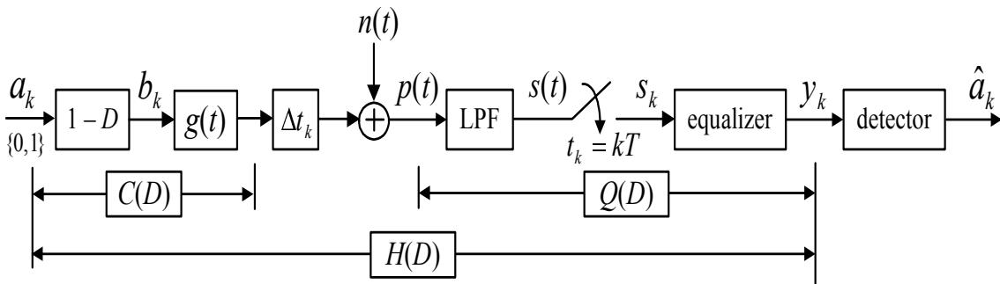
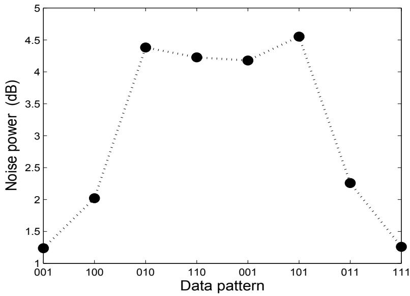
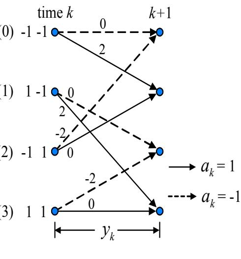
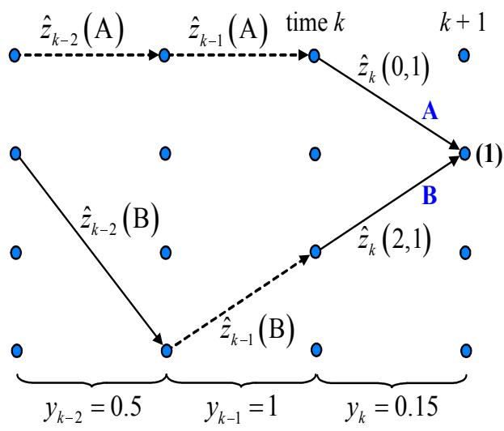
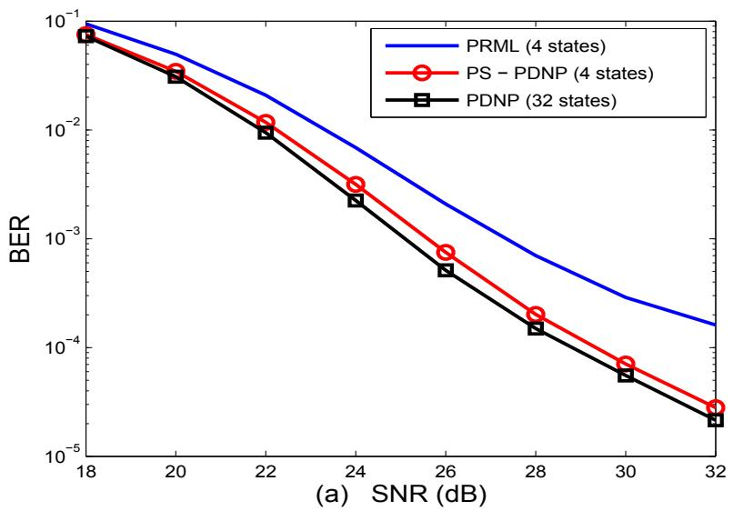
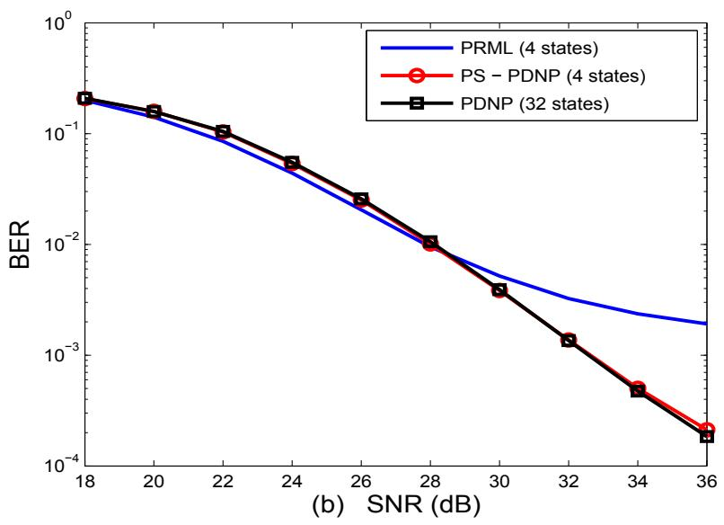

## บที่ 7

## วงจรตรวจหา PDNP

ในบทนี้จะกล่าวถึงที่มา, หลักการทำงาน, และประโยชน์ของ วงจรตรวจหา PDNP (patterท-dependent noise-ทredictive) [54] ซึ่งเป็นวงจรตรวจหาที่ถูกออกแบบมาเพื่อจัดการกับสัญญาณรบกวนจิตเตอร์ ของสื่อบันทึก (media jitter noise) ซึ่งพบบ่อยในระบบการบันทึกแม่เหล็กที่ความจุข้อมูลสูงๆ ดังที่ จะอธิบายต่อไปในบทนี้ พร้อมทั้งแสดงผลการเปรียบเทียบประสิทธิ ภาพระหว่างวงจรตรวจหา PDNP และวงจรตรวจหา PRML

## 7.1บทนำ

จากที่ได้อธิบายไปในบทที่ 4 เทคนิด PRML คือ เทคนิคการใช้งานร่วมกันระหว่างอีควอไลเซอร์แบบ PR (partial-response equalizer) และวงจรตรวจหาวีเทอร์บิ (Viterbi detector) ซึ่งเป็นที่นิยมใช้งาน กันมากในระบบการประมวลผลสัญญาณของฮาร์ดดิสก์ไดรฟ์ [27] เทคนิค PRML จะทำงานเป็น 2 ขั้นตอน คือ ขั้นตอน แรกจะทำการปรับรูปร่างของสัญญาณที่ได้รับให้เป็นไปตามรูปร่างของทาร์เก็ต (target) ที่ต้องการ และขั้นตอนที่สองจะทำการถอดรหัสข้อมูลโดยวงจรตรวจหาวีเทอร์บิที่สร้างขึ้นจาก ทาร์เก็ตที่กำหนดไว้

วงจรตรวจหาวีเทอร์บิถือว่าเป็น "วงจรตรวจหาลำดับเหมาะที่สุด (optimal sequence detector)" ก็ต่อเมื่อ องค์ประกอบของสัญญาณรบกวนที่แฝงอ ยู่ในสัญญาณที่จะทำการถอดรหัสข้อมูลมีลักษณะ เป็นสัญญาณรบกวนเกาส์สีขาวแบบบวก [15] อย่างไรก็ตามในทางปฏิบัติ การใช้งานอีควอไลเซอร์ แบบ PR จะส่งผลทำให้องค์ประกอบของสัญญาณรบกวนที่ด้านขาเข้าของวงจรตรวจหาวีเทอร์บิมีคุณ ลักษณะ เป็นสัญญาณรบกวนแบบสี(colored ทoiรe) โดยเฉพาะอย่างยิ่ง เมื่อความจุข้อมูลของฮาร์ด ดิสก์ไดรฟ์สูง (ND สูง) ซึ่งในกรณีนี้ วงจรตรวจหาวีเทอร์บิจะไม่ถือว่าเป็นวงจรตรวจหาลำดับเหมาะ ที่สุดอีกต่อไป ดังนั้น วงจรตรวจหา NPML (noise-predictive maximum-likelihood) [51, 52] จึง ได้ถูกนำมาใช้เพื่อเพิ่มประสิทธิภาพของระบบ โดยที่ วงจรตรวจหา NPML จะมีกระบวนการในการทำ ให้สัญญาณรบกวนเป็นสีขาว ก่อนที่จะส่งผลลัพธ์ที่ได้ไปทำการถอดรหัสด้วยวงจรตรวจหาวีเทอร์บิ ใน บทที่ 6 แสดงให้เห็นว่า วงจรตรวจหา NPML มีประสิทธิ ภาพดีกว่าวงจรตรวจหา PRML โดยเฉพาะ อย่างยิ่งที่ความจุข้อมูลของฮาร์ดดิสก์ไดรฟ์สูง

นอกจากนี้ ที่ ND สูงๆ องค์ประกอบของสัญญาณรบกวนที่ด้านขาเข้าของวงจรตรวจหาวีเทอร์บิ ยังจะมีลักษณะขึ้นอยู่กับ "แบบข้อมูล (data pattern)" ตัวอย่างเช่น สัญญาณรบกวนจิตเตอร์ของสื่อ บันทึก ถือได้ว่าเป็น "สัญญาณรบกวนที่ขึ้นอยู่กับแบบข้อมูล (pattern-dependent noise)" กล่าวคือ ระดับความรุนแรงของสัญญาณรบกวนจิตเตอร์ของสือบันทึกจะขึ้นอยู่กับแบบข้อมูลที่เขียนลงไปใน สื่อบันทึก เทคนิคต่างๆ ได้ถูกนำเสนอเพื่อทำให้สัญญาณรบกวนประเภทนี้ [54, 55] มีลักษณะกลาย เป็นสัญญาณรบกวนสีขาว (พhite กo์รe) ก่อนที่จะที่ทำการถอดรหัสข้อมูลด้วยวงจรตรวจหาวีเทอร์บิ ในส่วนต่อไปนี้จะอธิบายถึงหลักการทำงานของวงจรตรวจหา PDNP [54] และ เทคนิคการลดความ ซับซ้อนของวงจรตรวจหา PDNP

## 7.2 การขึ้นอยู่กับแบบข้อมูลของสัญญาณรบกวน

พิจารณาแบบจำลองช่องสัญญาณในรูปที่ 7.1 กำหนดให้ $C ( D ) = ( 1 - D ) G ( D )$ คือ ผลตอบสนอง ของช่องสัญญาณในโดเมน D, H(D) คือ ผลตอบสนองทาร์เก็ตในโดเมน D, Q(D) คือ ผล ตอบสนองรวมในโดเมน D ของวงจรกรองผ่านต่ำและอีควอไลเซอร์, และเพื่อให้ง่ายต่อการอธิบาย อีควอไลเซอร์แบบ zero-forcing [2, 16] จะ ถูกนำมาใช้ในส่วนนี้ นั้นคือ $Q ( D ) = H ( D ) / C ( D )$ ใน ทางปฏิบัติ ทาร์เก็ตและอีควอไลเซอร์ซึ่งถูกสร้างโดยวงจรกรองเชิงเส้นแบบผลตอบสนองอิมพัลส์จำกัด (FIR: finite impulse response) จะมีฟังก์ชันถ่ายโอนที่แตกต่างไปจาก $H ( D )$ และ $Q ( D )$ ที่ต้องการ ในทางทฤษฎี เพราะฉะนั้น ถ้ากำหนดให้ $H ^ { \prime } ( D )$ และ $Q ^ { \prime } ( D ) = H ^ { \prime } ( D ) / C ( D )$ คือ ฟังก์ชันถ่าย โอนจริงของทาร์เก็ตและของอีควอไลเซอร์ ตามลำดับ โดยที่ $H ^ { \prime } ( D ) \neq H ( D )$ และ $Q ^ { \prime } ( D ) \neq Q ( D )$ ดังนั้น ข้อมูลเอาต์พุตของอีควอไลเซอร์สามารถเขียนเป็นสมการทางคณิตศาสตร์ได้ คือ

  
รูปที่ 7.1: แบบจำลองช่องสัญญาณ

$$
\begin{array} { r c l } { { Y ( D ) } } & { { = } } & { { A ( D ) C ( D ) Q ^ { \prime } ( D ) + N ( D ) Q ^ { \prime } ( D ) } } \\ { { } } & { { = } } & { { A ( D ) H ^ { \prime } ( D ) + N ( D ) Q ^ { \prime } ( D ) } } \\ { { } } & { { = } } & { { A ( D ) H ^ { \prime } ( D ) + N ( D ) Q ^ { \prime } ( D ) + \left[ A ( D ) H ( D ) - A ( D ) H ( D ) \right] } } \\ { { } } & { { = } } & { { A ( D ) H ( D ) + \underbrace { A ( D ) [ H ^ { \prime } ( D ) - H ( D ) ] + N ( D ) Q ^ { \prime } ( D ) } _ { W ( D ) } } } \end{array}\tag{7.1}
$$

เมื่อ $N ( D )$ คือ สัญญาณรบกวนเกาส์สี ขาวแบบบวก (AพGN) และ $W ( D )$ คือสัญญาณรบกวน รวมที่ได้ ณ ด้านขาเข้าของวงจรตรวจหาลำดับ ตามสมการ (7.1) จะเห็นได้ว่า สัญญาณรบกวน $W ( D )$ มีลักษณะขึ้นอยูกับแบบข้อมูล (data-dependent) เนืองจาก มีพจน์ A(D)อยู

สัญญาณรบกวนจิตเตอร์ของสื่อบันทึก เป็นผลมาจาก “การเลื่อนตำแหน่งของการเปลี่ยนสถานะ แบบสุ่ม(random tranรition shift)"ระหว่างกระบวนการทำให้สื่อบันทึกมีสภาพความเป็นแม่เหล็ก (magทetizatioก)ตามที่ต้องการ โดยจะ มีฟังก์ชันความหนาแน่นความน่าจะเป็นแบบเกาส์เซียนที่มีค่า เฉลียเท่ากับค่าศูนย์และค่าความแปรปรวนเท่ากับ $| b _ { k } | \sigma _ { j } ^ { 2 }$ (นั่นคือ o e $\Delta t _ { k } \sim \mathcal N ( 0 , | b _ { k } | \sigma _ { j } ^ { 2 } ) )$ และถูก จำกัดให้มีค่าไม่เกิน $T / 2 )$ โดยที่ $\sigma _ { j }$ จะถูกกำหนดเป็นจำนวนเปอร์เซ็นต์ของบิตเซลล์ $T$ และ $\left| b _ { k } \right|$ คือ ค่าสัมบูรณ์ของ $b _ { k }$ เนื่องจาก ตำแหน่งการเปลี่ยนสถานะถูกกำหนดโดยข้อมูลบิตอินพุต $\{ a _ { k } \}$ ดังนั้น รซ รูปที่7.2 ความรุนแรงของสัญญาณรบกวนจิตเตอร์ของสือบันทึกจึงขึ้นอยู่กับแบบข้อมูลของ $\{ a _ { k } \}$

  
รูปที่ 7.2: กำลังสัญญาณรบกวนที่ขึ้นกับแบบข้อมูล ณ ด้านขาออกของอีควอไลเซอร์ที่ถูกออกแบบ สูรู้ สำหรับทาร์เก็ต EEPR2 $[ 1 ~ 4 ~ 6 ~ 4 ~ 1 ]$ ของระบบการบันทึกแบบแนวตั้งที่ ${ \mathrm { N D } } = 2 . 5 , { \mathrm { S N R } } = 3 0$ dB, และ $\sigma _ { j } / T = 1 0 \%$

แสดงกำลังสัญญาณรบกวน (ทoiรe poพer) ที่ขึ้นกับแบบข้อมูล ณ ด้านขาออกของอีควอไลเซอร์แบบ 21 แท็ป (tap) ที่ถูกออกแบบให้สอดคล้องกับทาร์เก็ต EEPR2, $H ( D ) = 1 + 4 D + 6 D ^ { 2 } + 4 D ^ { 3 } +$ $D ^ { 4 }$ ,ของระบบการบันทึกแบบแนวตัง (perpendicular recording) ที ND = 2.5, SNR = 30 dB, และ $\sigma _ { j } / T = 1 0 \%$ จะเห็นได้ชัดเจนว่า กำลังสัญญาณรบกวนจะมีค่าสูง เมื่อลำดับข้อมูลมีการเปลี่ยน สถานะหลายครั้ง เช่น แบบข้อมูล "010" และ "101" เป็นต้น

## 7.3 อัลกอริทึม PDNP

พิจารณาวงจรตรวจหาวีเทอร์บิ [15] โดยที่ เมตริกสาขา (braทch metric) คำนวณได้จาก

$$
\lambda _ { k } ( u , v ) = | y _ { k } - \underbrace { \sum _ { i = 0 } ^ { \nu } h _ { i } a _ { k - 1 } } _ { \hat { r } _ { k } ( u , v ) } | ^ { 2 }\tag{7.2}
$$

## 7.3. อัลกอริทึม PDNP

เมื่อ $( u , v )$ แทนการเปลี่ยนสถานะจากสถานะ น ไปยังสถานะ  ในแผนภาพเทรลลิส (trelliร diagram), $y _ { k }$ คือ ข้อมูลทีจะทำการถอดรหัสด้วยวงจรตรวจหาวีเทอร์บิ, $\hat { r } _ { k } ( u , v )$ คือ ข้อมูลเอาต์พุตช่อง สัญญาณที่ไม่มีสัญญาณรบกวนที่สอดคล้องกับ $( u , v )$ (นั่นคือ ค่าที่แสดงอยู่ในแต่ละเส้นสาขาของ แผนภาพเทรลลิส เช่น ตามที่แสดงในรูปที่ 4.6) ซึ่งหาได้จาก

$$
r _ { k } = a _ { k } * h _ { k } = \sum _ { i = 0 } ^ { \nu } a _ { k - i } h _ { i }\tag{7.3}
$$

เมื่อ \* คือ ตัวดำเนินการคอนโวลูชัน (convolution operator), $\begin{array} { r } { H ( D ) = \sum _ { k = 0 } ^ { \nu } h _ { k } D ^ { k } } \end{array}$ คือ ทาร์เก็ตที่ ต้องการ, $h _ { k }$ คือ ค่าสัมประสิทธิ์ตัวที่ k ของทาร์เก็ต, และ v คือ หน่วยความจำของทาร์เก็ต

เนื่องจาก องค์ประกอบของสัญญาณรบกวนที่แฝงอยู่ในข้อมูล $y _ { k }$ ซึ่งหาได้จาก (ดูแบบจำลองการ ออกแบบทาร์เก็ตในรูปที่ 3.2)

$$
\boldsymbol { w } _ { k } = \boldsymbol { y } _ { k } - \boldsymbol { r } _ { k }\tag{7.4}
$$

โดยผลการแปลง D คือ $W ( D )$ ตามสมการ (7.1) จะมีลักษณะเป็นสัญญาณรบกวนที่ขึ้นอยู่กับแบบ ข้อมูลถ้าส่งข้อมูล $y _ { k }$ เข้าไปทำการถอดรหัสด้วยวงจรตรวจหาวีเทอร์บิ ประสิทธิ ภาพในรูปของอัตรา ข้อผิดพลาดบิต (BER) ที่ได้รับจะไม่ดี เพราะฉะนั้น ในการที่จะเพิ่มประสิทธิภาพรวมของระบบ จะ ต้องมีการนำกระบวนการในการทำให้สัญญาณรบกวนเป็นสี ขาว (noise whitening process) เพื่อ ทำให้ข้อมูล $w _ { k }$ มีลักษณะ เป็นสัญญาณรบกวนสีขาว ก่อนที่จะส่งผลลัพธ์ที่ได้ไปทำการถอดรหัสด้วย วงจรตรวจหาวีเทอร์บิ ดังนั้น ในการใช้เทคนิคการทำนายสัญญาณรบกวน (noise predicion) ร่วม กับวงจรตรวจหาวีเทอร์บิ จะทำให้เมตริกสาขาในสมการ (7.2) ต้องถูกดัดแปลงเป็น

$$
\lambda _ { k } ( u , v ) = | y _ { k } - \hat { r } _ { k } ( u , v ) - \hat { w } _ { k } | ^ { 2 }\tag{7.5}
$$

เมื่อ $\hat { w } _ { k }$ คือ สัญญาณรบกวนที่ถูกทำนาย ซึ่งหาได้จาก

$$
\hat { w } _ { k } = \sum _ { i = 1 } ^ { L } p _ { i } w _ { k - i }\tag{7.6}
$$

โดยที่ $\begin{array} { r } { P ( D ) = \sum _ { i = 1 } ^ { L } p _ { i } D ^ { i } } \end{array}$ คือ วงจรกรองทำนาย (predictioก filter) สัญญาณรบกวนแบบ L แท็ป, $p _ { i }$ คือ ค่าสัมประสิทธิ์ตัวที่ iของวงจรกรองทำนายสัญญาณรบกวน, และข้อผิดพลาดที่เกิดจาก

การทำนาย $e _ { k }$ คือ

$$
e _ { k } = w _ { k } - { \hat { w } } _ { k }\tag{7.7}
$$

หรือ

$$
w _ { k } = \sum _ { i = 1 } ^ { L } p _ { i } w _ { k - i } + e _ { k }\tag{7.8}
$$

โดยวงจรกรองทำนายสัญญาณรบกวน $P ( D )$ ที่ดีจะต้องทำให้ข้อผิดพลาดที่เกิดจากการทำนาย $e _ { k }$ มี ลักษณะเป็นสัญญาณรบกวนเกาส์สีขาวให้มากที่สุด

เมื่อระบบทำงานที่ความจุของฮาร์ดดิสก์ไดรฟ์สูงๆ จะทำให้ระดับความรุนแรงของสัญญาณรบกวน จะขึนอยู่กับแบบข้อมูล ดังนั้น วงจรกรองทำนายสัญญาณรบกวนที่เหมาะสุด $P ( D )$ ก็ควรที่จะขึ้น อยู่กับแบบข้อมูลด้วยเช่นกัน เพราะฉะนัน ในการหาค่าสัมประสิทธิของ $P ( D )$ จะต้องจัดรูปสมการ (7.8) ใหม่ ดังนี้

$$
w _ { k } ( \underline { { a } } ) = \sum _ { i = 1 } ^ { L } p _ { i } ( \underline { { a } } ) w _ { k - i } ( \underline { { a } } ) + e _ { k } ( \underline { { a } } )\tag{7.9}
$$

เมื่อ $\underline { { a } }$ ใช้แทนแบบข้อมูลต่างๆ ที่เป็นไปได้ สมการ (7.9) สามารถเขียนให้อยู่ในรูปของเมทริกซ์ได้ คือ

$$
\begin{array} { r } { w _ { k } ( \underline { { a } } ) = \mathbf { p } ( \underline { { a } } ) ^ { \mathrm { T } } \mathbf { w } ( \underline { { a } } ) + e _ { k } ( \underline { { a } } ) } \end{array}\tag{7.10}
$$

โดยที่ $\mathbf { p } ( \underline { { a } } ) \ = \ [ p _ { 1 } ( \underline { { a } } ) , p _ { 2 } ( \underline { { a } } ) , \dots , p _ { L } ( \underline { { a } } ) ] ^ { \mathrm { T } }$ คือ เวกเตอร์แนวตั้งของค่าสัมประสิทธ์ของวงจรกรอง ทำนาย, และ $\mathbf { w } ( \underline { { a } } ) = [ w _ { k - 1 } ( \underline { { a } } ) , w _ { k - 2 } ( \underline { { a } } ) , \dots , w _ { k - L } ( \underline { { a } } ) ] ^ { \mathrm { T } }$

ค่าสัมประสิทธิ์ของ $P ( D )$ สามารถคำนวณหาได้โดยการคูณทั้งสองข้างของสมการ (7.10) ด้วย เวกเตอร์ ${ \mathbf w } ( \underline { { a } } ) ^ { \mathrm { T } }$ แล้วใส่ตัวดำเนินการค่าคาดหมาย (expectation operator) $\mathring { \mathfrak { B } } \setminus$ จะได้ผลลัพธ์เป็น

$$
\begin{array} { r c l } { E \left[ w _ { k } ( \underline { { a } } ) \mathbf { w } ( \underline { { a } } ) ^ { \mathrm { T } } \right] } & { = } & { \mathbf { p } ( \underline { { a } } ) ^ { \mathrm { T } } E \left[ \mathbf { w } ( \underline { { a } } ) \mathbf { w } ( \underline { { a } } ) ^ { \mathrm { T } } \right] } \\ & & { = } & { \mathbf { p } ( \underline { { a } } ) ^ { \mathrm { T } } \mathbf { R } ( \underline { { a } } ) } \end{array}\tag{7.11}
$$

เมื่อ $\mathbf { R } ( \underline { { a } } ) = E \left[ \mathbf { w } ( \underline { { a } } ) \mathbf { w } ( \underline { { a } } ) ^ { \mathrm { T } } \right]$ คือ เมทริกซ์อัตสหสัมพันธ์ (auto-correlation matrix) ของสัญญาณ รบกวน $w _ { k } ( \underline { { a } } )$ ,และ $E \left[ e _ { k } ( \underline { { a } } ) \mathbf { w } ( \underline { { a } } ) ^ { \mathrm { T } } \right] = 0$ ตามหลักการเชิงตั้งฉาก (orthogonality principle) [25] แก้สมการ (7.11) จะได้ผลลัพธ์เป็น

$$
{ \bf p } ( \underline { { a } } ) ^ { \mathrm { T } } = E [ w _ { k } ( \underline { { a } } ) { \bf w } ( \underline { { a } } ) ^ { \mathrm { T } } ] { \bf R } ^ { - 1 } ( \underline { { a } } )\tag{7.12}
$$

## 7.3. อัลกอริทึม PDNP

และค่าความแปรปรวนข้อผิดพลาดการทำนาย (predictor error variance) คือ [54]

$$
\sigma _ { p } ^ { 2 } ( \underline { { a } } ) = E \left[ w _ { k } ( \underline { { a } } ) ^ { 2 } \right] - E \left[ w _ { k } ( \underline { { a } } ) \mathbf { w } ( \underline { { a } } ) ^ { \mathrm { T } } \right] \mathbf { R } ^ { - 1 } ( \underline { { a } } ) E \left[ w _ { k } ( \underline { { a } } ) \mathbf { w } ( \underline { { a } } ) ^ { \mathrm { T } } \right] ^ { \mathrm { T } }\tag{7.13}
$$

สมการ (7.12) และ (7.13) แสดงให้เห็นว่า ค่าสัมประสิทธิ์ของวงจรกรองทำนายและค่าความแปรปรวน ข้อผิดพลาดการทำนายจะขึ้นอยู่กับช่วงเวลา k ที่พิจารณา (ณ ช่วงเวลา k หนึ่งๆ ก็อาจจะมีแบบข้อมูล ระบบเป็นแบบสเตซันเนรี (statioทary) [10, 26] หรือถ้าเป็นระบบที่ไม่เป็นแบบสเตซันเนรี อัลกอริทึม แบบปรับตัว (adaptive algorithm) [4, 10, 16] สามารถที่จะ ถูกนำมาใช้ในการปรับค่าสัมประสิทธิของ วงจรกรองทำนาย และค่าความแปรปรวนข้อผิดพลาดการทำนายได้

เนื่องจาก ค่าความแปรปรวนข้อผิดพลาดการทำนาย (ซึ่งเป็นผลมาจากกระบวนการในการทำให้ สัญญาณรบกวนเป็นสี ขาว) ขึ้นอยู่กับแบบข้อมูล ตามที่แสดงในสมการ (7.13) ค่าเมตริกสาขาของ วงจรตรวจหา PDNP จะต้องคำนึ่งถึงการขึ้นอยู่กับแบบข้อมูลด้วย เพราะฉะนัน เมตริกสาขาของวงจร ตรวจหา PDNP สามารถเขียนได้เป็น

$$
\lambda _ { k } ( u , v ) = \log \left( \sigma _ { p } ( u , v ) \right) + \frac { | y _ { k } - \hat { r } _ { k } ( u , v ) - \hat { w } _ { k } ( u , v ) | ^ { 2 } } { 2 \sigma _ { p } ^ { 2 } ( u , v ) }\tag{7.14}
$$

เมื่อ $\sigma _ { p } ^ { 2 } ( u , v )$ คือ ค่าความแปรปรวนข้อผิดพลาดการทำนายที่สอดคล้องกับ $( u , v )$ และแบบข้อมูลที เกี่ยวข้องกับ $( u , v )$ , และ $\hat { w } _ { k } ( u , v )$ คือ สัญญาณรบกวนที่ถูกทำนายที่สอดคล้องกับ $( u , v )$ และแบบ ข้อมูลที่เกี่ยวข้องกับ $( u , v )$ ซึ่งหาได้จาก

$$
{ \hat { w } } _ { k } ( u , v ) = \sum _ { i = 1 } ^ { L } p _ { i } ( u , v ) \{ y _ { k - i } - { \hat { r } } _ { k - i } ( u , v ) \}\tag{7.15}
$$

จากสมการ (7.12) และ (7.13) จะพบว่า วงจรกรองทำนายสัญญาณ $\begin{array} { r } { P ( D ) = \sum _ { i } ^ { L } p _ { i } D ^ { i } } \end{array}$ และค่าความ แปรปรวนข้อผิดพลาดการทำนาย $\sigma _ { p } ^ { 2 }$ จะขึ้นอยู่กับแบบข้อมูลในแต่ละเส้นสาขา ดังนั้น ค่าพารามิเตอร์ $P ( D )$ และ $\sigma _ { p } ^ { 2 }$ ที่ใช้ในการคำนวณเมตริกสาขาในแต่ละเส้นสาขาของแผนภาพเทรลลิสจะมีค่าต่างกัน ตามแบบข้อมูลทีสอดคล้องกับการเปลียนสถานะ $( u , v ) \stackrel { \circ } { \mathbb { H } } \mathbb { H } ^ { 6 } ]$

ในทางปฏิบัติแล้ว ค่าสัมประสิทธิ์ของวงจรกรองทำนายสัญญาณรบกวน ${ \bf p } ( \underline { { a } } )$ จะขึ้นอยู่กับข้อมูล บิตภายในหน้าต่างเลื่อนแบบจำกัด (finite sliding window)[56] ซึ่งเขียนแทนด้วยสัญลักษณ์ $a _ { k - M } ^ { W }$ สำหรับค่าจำนวนเต็มบวก M และ W ดังนั้น วงจรตรวจหา PDNP จะใช้แผนภาพเทรลลิสที่มีจำนวน สถานะเท่ากับ 2max(ν+ $\cdot L , M ) { + } W$ สถานะ อย่างไรก็ตาม เพื่อให้ง่ายต่อการอธิบายหลักการทำงานของ อัลกอริทึ่ม PDNP ในส่วนี้จะพิจารณาเฉพาะกรณีที่ $W = 0$ และ $M < \nu + L$ เพราะฉะนัน จำนวน สถานะทั้งหมดที่ใช้ในแผนภาพเทรลลิสมีจำนวนเท่ากับ $2 ^ { \nu + L }$

## 7.4 อัลกอริทึม PS-PDNP

อัลกอริทึม PDNP ที่อธิบายไปในหัวข้อที่ 7.3 ต้องการแผนภาพเทรลลิสที่มีจำนวนสถานะทั้งหมด $2 ^ { \nu + L }$ อย่างไรก็ตาม ความซับซ้อนของวงจรตรวจหา PDNP สามารถทำให้ลดลงได้โดยใช้แนวคิด "การ ป้อนกลับค่าตัดสินใจ (decision-feedback)" [53] และเพื่อให้ระบบมีประสิทธิ ภาพที่ยอมรับได้ แนวคิด 07   
นี้ต้องการความลึก (dะpth) การป้อนกลับค่าตัดสินใจที่ค่อนข้างน้อย เมื่อเทียบกับความยาว (หรือ จำนวนแท็ป)ของวงจรกรองทำนายสัญญาณรบกวน ซึ่งหมายความว่า แผนภาพเทรลลิสที่ใช้ยังจำเป็น ต้องถูกขยายให้ใหญ่ขึ้น (trellis expaทรion) นั่นคือ มีจำนวนสถานะมากขึ้นกว่าระบบที่ไม่ใช้วงจร e กรองทำนายสัญญาณรบกวน

ในส่วนนี้จะอธิบาย วิธีการที่เสนอใน [53] ซึ่งคล้ายกับแนวคิด “การประมวลผลแบบเพอเซอร์ ไวเวอร์ (PSP: per-survivor processing)" [57] สำหรับลดความซับซ้อนของอัลกอริทึม PDNP โดย อัลกอริทึมใหม่ที่ได้ ในหนังสือนี้จะ เรียกว่า "อัลกอริทึม PS-PDNP (per-survivor PDNP algorith- q m)" วงจรตรวจหา PS-PDNP จะทำงานตามอัลกอริทึม PDNP บนพื้นฐานของแนวคิด PรP ซึ่งจะ ทำให้แผนภาพเทรลลิสที่ใช้ในวงจรตรวจหา Pร-PDNP มีจำนวนสถานะเท่าเดิม (หรือเท่ากับระบบที่ ไม่ใช่วงจรกรองทำนายสัญญาณรบกวน) กล่าวคือ แทนที่จะทำการขยายแผนภาพเทรลลิสให้ใหญ่ขึ้น วงจรตรวจหา Pร-PDNP จะทำการมองย้อนกลับไปตามเส้นทางที่ยังมีชีวิตอยู่ตามแผนภาพเทรลลิส ที่มาถึง ณ จุดต่อ (ทอde) ที่กำลังพิจารณา แล้วใช้ข้อมูลต่างๆ ที่สอดคล้องกับเส้นทางที่ยังมีชีวิตอยู $\overset { \circ } { \mathbb { H } } { \mathbb { H } }$ ในการคำนวณหาค่าสัญญาณรบกวนที่ถูกทำนาย หรืออาจจะกล่าวได้ว่า วงจรตรวจหา Pร-PDNP ยังคงใช้สมการ (7.14) ในการคำนวณหาค่าเมตริกสาขา ยกเว้นแต่ สัญญาณรบกวนที่ถูกทำนายจะถูก คำนวณจาก

$$
\hat { w } _ { k } ( u , v ) = \sum _ { i = 1 } ^ { L } p _ { i } ( u , v ) \hat { z } _ { k - i } ( u , v )\tag{7.16}
$$

(0)  
(1)  
(2)  
  
(3)  
(a) Trellis diagram: PR4

  
(b) Decoding procedure  
รูปที่ 7.3: (a) แผนภาพเทรลลิสสำหรับทาร์เก็ตแบบ PR4 และ (b) ขั้นตอนการถอดรหัสข้อมูลด้วย แผนภาพเทรลลิส

เมื่อ $\hat { z } _ { k - i } ( u , v )$ คือ สัญญาณรบกวนที่แฝงอยู่ในข้อมูล $y _ { k }$ ที่ เป็นผลทำให้เกิดการ เปลี่ยนสถานะ สอดคล้องกับเส้นทางที่ยังมีชีวิตอยู่ที่เป็นผลทำให้เกิดการเปลี่ยนสถานะ $( u , v )$ ซึ่งนิยามโดย

$$
\hat { z } _ { k } ( u , v ) = y _ { k } ( u , v ) - \hat { r } _ { k } ( u , v )\tag{7.17}
$$

ดังนั้นจะเห็นได้ว่า วงจรตรวจหา Pร-PDNP จะใช้แผนภาพเทรลลิสที่มีจำนวนสถานะเท่ากับ $2 ^ { \nu }$ สถานะ แต่จะต้องมีขันตอนเพิ่มเติมในการเก็บค่าของ $\{ \hat { z } _ { k - 1 } , \hat { z } _ { k - 2 } , \dots , \hat { z } _ { k - L } \}$ สำหรับทุกเส้นทางที่ยังมีชีวิต อยู่

ตัวอย่างที่ 7.1 รูปที่ 7.3 แสดงตัวอย่างการหาค่าสัญญาณรบกวนที่แฝงอยู่ในข้อมูล $y _ { k }$ ที่เป็นผลทำ ให้เกิดการเปลี่ยนสถานะสอดคล้องกับ $( u , v )$ ตามสมการ (7.17) ของระบบที่ใช้ทาร์เก็ตแบบ PR4, $H ( D ) = 1 - D ^ { 2 }$ , ซึ่งมีแผนภาพเทรลลิสตามรูปที่ 7.3(a) เมื่อวงจรกรองทำนายสัญญาณรบกวนที่ใช้ มีจำนวน $L = 2$ แท็ป

วิธีทำ ให้พิจารณาสถานะ (1) ณ เวลา $k + 1$ ตามที่แสดงในรูปที่ 7.3(b) จะเห็นได้ว่ามีเส้นทางที่วิ่ง เข้ามาหาสถานะ (1) เป็นจำนวน 2 เส้นทาง คือ เส้นทาง A และ B เพราะฉะนั้น ค่า $\hat { z } _ { k - i } ( u , v )$ ใน สมการ (7.16) สำหรับ i = 1 และ 2 หาได้ดังต่อไปนี้สำหรับเส้นทาง A จะได้ว่า

$$
\begin{array} { l l l } { \hat { z } _ { k } ( 0 , 1 ) } & { = } & { y _ { k } - \hat { r } _ { k } ( 0 , 1 ) = 0 . 1 5 - 2 = - 1 . 8 5 } \end{array}
$$

$$
\begin{array} { r c l } { \hat { z } _ { k - 1 } ( \mathrm { A } ) } & { = } & { \hat { z } _ { k - 1 } ( 0 , 1 ) = y _ { k - 1 } - \hat { r } _ { k - 1 } ( 0 , 0 ) = 1 - 0 = 1 } \end{array}
$$

$$
\begin{array} { l l l } { \hat { z } _ { k - 2 } ( \mathrm { A } ) } & { = } & { \hat { z } _ { k - 2 } ( 0 , 1 ) = y _ { k - 2 } - \hat { r } _ { k - 2 } ( 0 , 0 ) = 0 . 5 - 0 = 0 . 5 } \end{array}
$$

และสำหรับเส้นทาง B จะได้ว่า

$$
\begin{array} { l l l } { \hat { z } _ { k } ( 2 , 1 ) } & { = } & { y _ { k } - \hat { r } _ { k } ( 2 , 1 ) = 0 . 1 5 - 0 = 0 . 1 5 } \end{array}
$$

$$
\begin{array} { r c l } { { \hat { z } _ { k - 1 } ( \mathrm { B } ) } } & { { = } } & { { \hat { z } _ { k - 1 } ( 2 , 1 ) = y _ { k - 1 } - \hat { r } _ { k - 1 } ( 3 , 2 ) = 1 - ( - 2 ) = 3 } } \end{array}
$$

$$
\begin{array} { l c l } { { \hat { z } _ { k - 2 } ( \mathrm { B } ) } } & { { = } } & { { \hat { z } _ { k - 2 } ( 2 , 1 ) = y _ { k - 2 } - \hat { r } _ { k - 2 } ( 1 , 3 ) = 0 . 5 - 2 = - 1 . 5 } } \end{array}
$$

## 7.5 ความซับซ้อนของวงจรตรวจหา PDNP

ในการเปรียบเทียบความซับซ้อน (comวlexity) ของวงจรตรวจหา จะพิจารณาจากจำนวนตัวดำเนินการ (operator) สำหรับการบวก (addition) และ การคูณ (multiplication) ที่ต้องใช้ในการทำงานของแต่ละ วงจรตรวจหา ตารางที่ 7.1 เปรียบเทียบความซับซ้อนของวงจรตรวจหา PDNP และ PS-PDNP เมื่อ $N _ { p }$ คือ จำนวนแบบข้อมูลที่ใช้ในวงจรตรวจหา PDNP และ Pร-PDNP จากตารางจะเห็นได้ว่า วงจร ตรวจหา Pร-PDNP มีความซับซ้อนและ ต้องการใช้หน่วยความจำ (memory requirement) น้อยกว่า วงจรตรวจหา PDNP มาก

## 7.6ผลการทดลอง

ในส่วนนี้จะทำการเปรียบเทียบประสิทธิ ภาพของวงจรตรวจหา PRML และ PDNP โดยใช้แบบจำลอง ช่องสัญญาณ ตามรูปที่ 7.1 เมื่อสัญญาณ reลd-back สามารถเขียนให้อยู่ในรูปของสมการคณิตศาสตร์

ตารางที่ 7.1: จำนวนของตัวดำเนินการที่ใช้ต่อข้อมูล 1 บิต ของวงจรตรวจหา PDNP และ Pร-PDNP
<table><tr><td rowspan=2 colspan=1>วงจรตรวจหา(detector)</td><td rowspan=1 colspan=2>จำนวนของตัวดำเนินการที่ใช้ต่อข้อมูล 1 บิต</td><td rowspan=2 colspan=1>หน่วยความจำที่ต้องการ(memory requirement)</td></tr><tr><td rowspan=1 colspan=1>การบวก</td><td rowspan=1 colspan=1>การคูณ</td></tr><tr><td rowspan=1 colspan=1>วงจรตรวจหา PDNP</td><td rowspan=1 colspan=1> $( 4 L + 7 ) 2 ^ { \nu + L }$ </td><td rowspan=1 colspan=1> $( 2 L + 8 ) 2 ^ { \nu + L }$ </td><td rowspan=1 colspan=1> $( 2 L + 4 ) 2 ^ { \nu + L } + N _ { p } L + 2$ </td></tr><tr><td rowspan=1 colspan=1>วงจรตรวจหา PS-PDNP</td><td rowspan=1 colspan=1> $( 2 L + 8 ) 2 ^ { \nu }$ </td><td rowspan=1 colspan=1> $( 2 L + 8 ) 2 ^ { \nu }$ </td><td rowspan=1 colspan=1> $( 2 L + 8 ) 2 ^ { \nu } + N _ { p } L$ </td></tr></table>

V ดร ได้คือ

$$
p ( t ) = \sum _ { k = 0 } ^ { S - 1 } b _ { k } g ( t - k T + \Delta t _ { k } ) + n ( t )\tag{7.18}
$$

เมื่อ $a _ { k } \in \{ 0 , 1 \}$ คือ ข้อมูลบิตอินพุตที่มีจำนวนทั้งหมด $S = 4 0 9 6$ บิต, $b _ { k } = \left( a _ { k } - a _ { k - 1 } \right)$ คือ บิตเปลี่ยนสถานะ $( b _ { k } = \pm 1$ สอดคล้องกับการเปลียนแปลงสถานะบวกหรือลบและ $b _ { k } = 0$ คือไม่ มีการเปลี่ยนแปลงสถานะ), $g ( t )$ คือ สัญญาณพัลส์เปลียนสถานะตามสมการ (1.1) สำหรับระบบการ บันทึกแบบแนวนอน และตามสมการ (1.2) สำหรับระบบการบันทึกแบบแนวตัง, $n ( t )$ คือ สัญญาณ รบกวนเกาส์สีขาวแบบบวก (AพGN) ที่มีความหนาแน่นสเปกตรัมกำลังแบบสองด้านเท่ากับ $N _ { 0 } / 2$ และ $\Delta t _ { k }$ คือ สัญญาณรบกวนจิตเตอร์ของสื่อบันทึก (media jitter noise) ที่มีฟังก์ชันความหนาแน่น ความน่าจะเป็นแบบเกาส์เซียน (Gaussian probablity density function)โดยมีค่าเฉลียเท่ากับค่า ศูนย์ และค่าความแปรปรวนเท่ากับ $| b _ { k } | \sigma _ { j } ^ { 2 }$ (นั่นคือ $\Delta t _ { k } \sim \mathcal N ( 0 , | b _ { k } | \sigma _ { j } ^ { 2 } ) )$ และถูกจำกัดให้มีค่าไม่ เกิน $T / 2 )$ เมื่อ $\sigma _ { j }$ จะถูกกำหนดเป็นจำนวนเปอร์เซ็นต์ของบิตเซลล์ $T$ และ $\left| b _ { k } \right|$ คือค่าสัมบูรณ์ (absolute value) ของ $b _ { k }$

สัญญาณ read-back $p ( t )$ จะถูกส่งผ่านไปยังวงจรกรองผ่านต่ำ (LPF: low-pass filter) บัตเทอร์ เวิร์ตอันดับที่ 7 และถูกทำการชักตัวอย่างด้วยความถี่การชักตัวอย่างเท่ากับ $1 / T$ โดยสมมุติว่ากระบวน การในการชักตัวอย่างมีการเข้าจังหวะระหว่างสัญญาณ read-bลck และวงจรชักตัวอย่างแบบสมบูรณ์ (perfect synchronization) จากนัน ลำดับข้อมูลเอาต์ พุต $\{ s _ { k } \}$ จะถูกป้อนไปยังอีควอไลเซอร์ เพื่อปรับ คุณลักษณะของสัญญาณให้เป็นไปตามทาร์เก็ตที่ต้องการ แล้วก็ส่งลำดับข้อมูลเอาต์พุต $\left\{ y _ { k } \right\}$ ที่ได้ไป ทำการถอดรหัส ข้อมูลด้วยวงจรตรวจหา (detector) เพื่อหาค่าประมาณของลำดับข้อมูลอินพุต $\{ a _ { k } \}$ าร

เป็นไปได้มากที่สุด ในบทนี้ ค่า รNR จะนิยามโดย

$$
\mathrm { S N R } = 1 0 \log _ { 1 0 } \left( \frac { E _ { i } } { N _ { 0 } } \right)\tag{7.19}
$$

เมื่อ $E _ { i }$ คือ พลังงานของผลตอบสนองอิมพัลส์ของช่องสัญญาณ1 นอกจากนี้ แต่ละจุดของ BER จะ ถูกคำนวณโดยใช้ข้อมูลหลายๆ เซกเตอร์ (sector) จนกว่าจะได้ข้อผิดพลาดบิตมากกว่าหรือเท่ากับ 1000 บิต

วงจรตรวจหา 3 แบบ คือ วงจรตรวจหา PRML, วงจรตรวจหา PDNP, และวงจรตรวจหา PS-PDNP จะ ถูกทำการเปรียบเทียบประสิทธิ ภาพ สำหรับระบบที่ใช้ทาร์เก็ตแบบ GPR3 (ทาร์เก็ตแบบ 3 แท็ป ที่ถกออกแบบตามเงื่อนไขบังคับแบบโมนิก [19) และอีควอไลเซอร์แบบ 21 แท็ป โดยที่ ทาร์เก็ต แบบ GPR3 สำหรับระบบการบันทึกแบบแนวนอน คือ $H ( D ) = 1 + 0 . 0 5 D - 0 . 6 5 D ^ { 2 }$ และสำหรับ ระบบการบันทึกแบบแนวตั้ง คือ $H ( D ) = 1 + 1 . 2 5 D + 0 . 6 2 D ^ { 2 }$ รูปที่ 7.4 เปรียบเทียบประสิทธิภาพ ในรูปของ BER ของวงจรตรวจหาทั้ง 3 แบบ สำหรับระบบการบันทึกแบบแนวนอนและ แบบแนวตั้ง -ชร $N D = 2 . 5$ และสัญญาณรบกวนจิตเตอร์ของสือบันทึก $\sigma _ { j } / T = 1 0 \%$

จากรูปที่ 7.4(a) สำหรับระบบการบันทึกแบบแนวนอน วงจรตรวจหา Pร-PDNP มีประสิทธิภาพ ใกล้เคียงกับวงจรตรวจหา PDNP แต่วงจรตรวจหาทั้งสองนี้มีประสิทธิภาพดีกว่าวงจรตรวจหา PRM-L โดยเฉพาะอย่างยิ่งที่ รNR สูง (นั่นคือ เมื่อสัญญาณรบกวนหลักในระบบ คือ สัญญาณรบกวน จิตเตอร์ของสื่อบันทึก) ในขณะที่ สำหรับระบบการบันทึกแบบแนวตั้ง (ดูรูปที่ 7.4(b)) วงจรตรวจหา PRML ดูเหมือนจะมีประสิทธิภาพดีกว่าวงจรตรวจหา Pร-PDNP และวงจรตรวจหา PDNP เล็กน้อย ที่SNR ต่ำ ทั้งนี้อาจจะเป็นเพราะว่า ที่ รNR ต่ำ สัญญาณรบกวนหลักในระบบไม่ใช่สัญญาณรบกวน จิตเตอร์ของสื่อบันทึก ดังนั้น วงจรตรวจหา PS-PDNP และวงจรตรวจหา PDNP ซึ่งถูกออกแบบมาให้ จัดการกับสัญญาณรบกวนจิตเตอร์ของสื่อบันทึกจึงไม่สามารถทำงานได้อย่างมีประสิทธิภาพ อย่างไร ก็ตามที่รNR สูง วงจรตรวจหา Pร-PDNP และวงจรตรวจหา PDNP จะมีประสิทธิภาพดีกว่าวงจร ตรวจหา PRML มาก จากการผลทดลองแสดงให้เห็นได้ว่า วงจรตรวจหา Pร-PDNP มีประสิทธิ ภาพ ใกล้เคียงกับวงจรตรวจหา PDNP เพราะฉะนั้น ในทางปฏิบัติ วงจรตรวจหา Pร-PDNP อาจจะ ถูก นำมาใช้แทนวงจรตรวจหา PDNP เนื่องจาก มีความซับซ้อนน้อยกว่ามาก

  
รูปที่ 7.4: ประสิทธิภาพในรูปของ BER ของวงจรตรวจหาต่างๆ สำหรับระบบการบันทึก (a) แบบ แนวนอน และ (b) แบบแนวตั้งที่ ND = 2.5 และ $\sigma _ { j } / T = 1 0 \%$

## 7.7 สรุปท้ายบท

เมื่อความจุข้อมูลของฮาร์ดดิสก์ไดรฟ์สูงขึ้น สัญญาณรบกวนที่ด้านขาเข้าของวงจรตรวจหาสัญลักษณ์ นอกจากจะมีลักษณะเป็นสัญญาณรบกวนแบบสี (colored noise) แล้ว ยังจะมีลักษณะขึ้นอยู่กับแบบของข้อมูล (data pattern) อีกด้วย ตัวอย่างเช่น สัญญาณรบกวนจิตเตอร์ของสื่อบันทึก (media jitter noise) โดยที่ระดับความรุนแรงของสัญญาณรบกวนจิตเตอร์ของสื่อบันทึกจะขึ้นอยู่กับแบบข้อมูลที่ถูกบันทึกลงในสื่อบันทึก วงจรตรวจหา PDNP จึงได้ถูกออกแบบขึ้นมาเพื่อจัดการกับสัญญาณรบกวนเหล่านี้ โดยจะเป็นการทำงานร่วมกันระหว่างวงจรกรองทำนายสัญญาณรบกวนและวิเตอร์บิอัลกอริทึม

ถึงแม้ว่าวงจรตรวจหา PDNP จะให้ประสิทธิภาพที่ดีกว่าวงจรตรวจหา PRML มาก แต่วงจรตรวจหา PDNP มีความซับซ้อนมากกว่าวงจรตรวจหา PRML เนื่องจากแผนภาพเทรลลิสที่ใช้ในวงจรตรวจหา PDNP จะมีจำนวนสถานะมากขึ้น เนื่องจากจำนวนแท็ปของวงจรกรองทำนายสัญญาณรบกวน อย่างไรก็ตามปัญหานี้สามารถแก้ไขได้โดยการประยุกต์ใช้วิเตอร์บิอัลกอริทึม PDNP ตามแนวคิดของ PSP ซึ่งจะได้ผลลัพธ์เป็นวงจรตรวจหา PS-PDNP ซึ่งมีประสิทธิภาพใกล้เคียงกับวงจรตรวจหา PDNP แต่มีความซับซ้อนน้อยกว่ามาก

## 7.8 แบบฝึกหัดท้ายบท

1. จงอธิบายที่มาของแนวคิดของอัลกอริทึม PDNP

2. จงพิสูจน์ค่าความคลาดเคลื่อนกำลังสอง ตามสมการ (7.13)

3. จงพิสูจน์ค่าอัลกอริทึมที่ใช้ในวงจรตรวจหา PDNP ตามสมการ (7.14)

4. จงอธิบายความแตกต่างของวงจรตรวจหา PRML, วงจรตรวจหา NPML, และวงจรตรวจหา PDNP

5. จงอธิบายหลักการทำงานของวงจรตรวจหา PS-PDNP

6. จงพิสูจน์จำนวนของการบวกและการเปรียบเทียบที่ใช้ต่อข้อมูล 1 บิต ตามที่แสดงในตารางที่ 7.1

7. จงพิสูจน์จำนวนหน่วยความจำที่ต้องการ ตามที่แสดงในตารางที่ 7.1