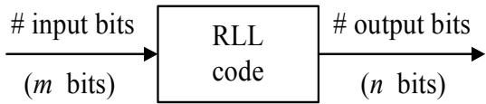
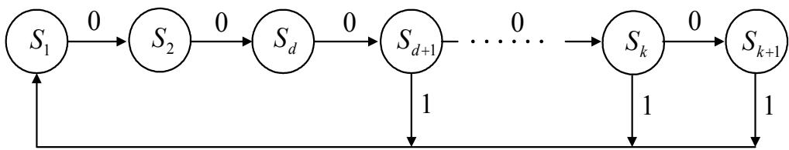
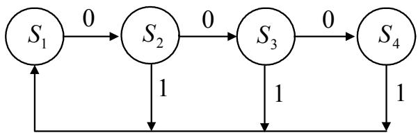
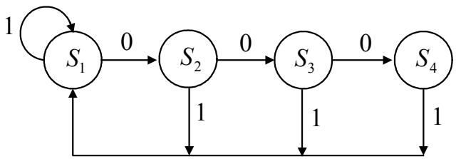
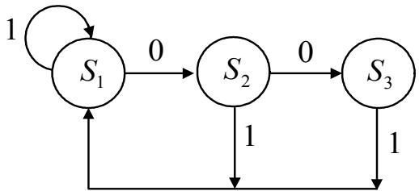

## บทที่ 8

## การออกแบบรหัส RLL

ในบทนี้จะอธิบายถึงหน้าที่และหลักการทำงานของรหัส RLL (run-length limited) [9] ซึ่งเป็นที่นิยม 8.1 ซิงานมากในระบบการประมวลผลสัญญาณของฮาร์ดดิสก์ไดรฟ์ พร้อมทั้งแสดงขั้นตอนการออกแบบ รหัส RLL อย่างง่าย เพื่อใช้ในการเข้าและถอดรหัสข้อมูล

## 8.1 บทนำ

รหัส RLL คือ รหัสมอดูเลชัน (modนโation code) ประเภทหนึ่งที่นิยมใช้มากในอุปกรณ์ ฮาร์ดดิสก์ ไดรฟ์ โดยจะทำหน้าที่ในการกำหนดจำนวนของบิต "0" และบิต "1" (ตามรูปแบบของ NRZ1) ที่เรียง ติดกันในลำดับข้อมูลที่ต้องการจะเขียนลงไปในสื่อ บันทึก โดยทั่วไป รหัส RLL จะ ถูกกำหนดด้วย พารามิเตอร์ 4 ตัว คือ m, n, d, และ k โดยจะอยูในรูปของรหัส m/n (d, k) เมื่อ

1) m คือ จำนวนข้อมูลบิตอินพุต (ต่อการเข้ารหัสหนึ่งครั้ง) ที่จะทำการเข้ารหัส RLL

2) n คือ จำนวนข้อมูลบิตเอาต์พุต (ต่อการเข้ารหัสหนึ่งครั้ง) ที่ได้จากการเข้ารหัส RLL โดยทั่วไป $n \geq m$ เสมอ

3) d คือ เลขจำนวนเต็มที่กำหนดจำนวนที่น้อยที่สุดของบิด 0 ที่อยู่ระหว่างบิต 1

4) k คือ เลขจำนวนเต็มที่กำหนดจำนวนที่มากที่สุดของบิต 0 ที่อยู่ระหว่างบิต 1 เมื่อ ข้อมูลบิต 1 จะสอดคล้องกับการเปลี่ยนสถานะ (traทรtion) ของกระแสไฟฟ้าเขียน (พrite current) ที่จะป้อนเข้าไปในหัวเขียน (พrite head) เพื่อทำให้สื่อบันทึก ณ บริเวณที่ต้องการจะเขียนข้อมูล ลงไปมีสภาพความเป็นแม่เหล็ก (magnetization) ตามที่ต้องการ ส่วนข้อมูลบิต 0 หมายถึง ไม่มีการ เปลี่ยนสถานะของกระแสไฟฟ้าเขียน เพราะฉะนั้น พารามิเตอร์ d จะช่วยทำให้บิต 1 สองบิตอยู่ห่าง กัน ซึ่งจะช่วยลดผลกระทบของการแทรกสอดระหว่างสัญลักษณ์ (IS1: interรymbo1 interference) ส่วนพารามิเตอร์ k จะช่วยรับประกันว่า ลำดับข้อมูลที่จะเขียนลงไปในสื่อบันทึกจะมีบิตเปลี่ยนสถานะ เกิดขึ้นสม่ำเสมอเพียงพอ เพื่อที่จะทำให้ระบบไทมม่งริดัฟเวอะรี (timing recovery) สามารถทำงานได้ อย่างมีประสิทธิภาพ ตัวอย่างเช่น ถ้าลำดับข้อมูลที่จะเขียนลงไปในสื่อบันทึก คือ

  
รูปที่ 8.1: แบบจำลองการเข้ารหัส RLL

$$
\cdots 1 1 1 1 1 \cdots 1 1 1 1 1 \cdots
$$

ลำดับข้อมูลนี้ถือว่าเป็นลำดับข้อมูลที่ไม่ดี เนื่องจาก จะทำให้เกิดปัญหา IS1 อย่างรุนแรง ในทาง ตรงกันข้าม ถ้าลำดับข้อมูลที่จะเขียนลงไปในสื่อบันทึก คือ

$$
\dots \dots 0 0 0 0 0 \dots 0 0 0 0 0 0 \dots
$$

ก็จะถือว่า เป็นลำดับข้อมูลที่ไม่ดีเช่นกัน เนื่องจาก จะทำให้เกิดปัญหาเรื่องการเข้าจังหวะ (sรynchronization) ของระบบไทมมิ่งริคัฟเวอะรี เพราะฉะนั้น เพื่อหลีกเลี่ยงลำดับข้อมูลทั้ง 2 แบบนี้จึงมี ความจำเป็นที่จะ ต้องเข้ารหัส ลำดับข้อมูลด้วยรหัส RLL ซึ่งในทางปฏิบัติแล้ว การเข้าและ ถอดรหัส ด้วยรหัส RLL สามารถทำได้ง่ายโดยการใช้"ตารางค้นหา (1ook-up table)" ในการเข้าและถอดรหัส ข้อมูล

รูปที่ 8.1 แสดงแบบจำลองการเข้ารหัส RLL โดยที่ "อัตรารหัส (code rate)" จะนิยามโดย จำนวน บิตอินพุตm หารด้วยจำนวนบิตเอาต์พุตn นั้นคือ

$$
R = \frac { m } { n } \leq 1\tag{8.1}
$$

เนื่องจาก จำนวนบิตเอาด์พุต ท ที่ได้จากการเข้ารหัสจะมีจำนวนมากกว่าหรือเท่ากับจำนวนบิตอินพุต m เสมอ ดังนั้น ข้อเสียของการเข้ารหัส RLL ที่เห็นได้ชัดเจนก็คือ จะทำให้เกิด "บิตส่วนเกิน (redundant bit)" ซึ่งจะทำให้สูญเสียเนื้อที่การจัดเก็บข้อมูลที่ต้องการในฮาร์ดดิสก์ไดรฟ์ไปบางส่วน ดังนั้น ในการเลือกรหัส RLL ไดมาใช้งาน ก็ควรที่จะเลือกใช้รหัส RLL ที่มีอัตรารหัส R เข้าใกล้ค่า 1 ให้มากที่สุด เพื่อลดการสูญเสียเนื้อที่การจัดเก็บข้อมูลที่ต้องการ สำหรับเนื้อหาในบทนี้จะอธิบายถึง ขั้นตอนการออกแบบรหัส RLL อย่างง่าย เมื่อกำหนดพารามิเตอร์ m, n, d, และ k มาให้

## 8.2 จำนวนลำดับข้อมูลทั้งหมดที่สอดคล้องกับเงื่อนไขบังคับ (d, k)

กำหนดให้ลำดับข้อมูลมีความยาวทั้งสิ้น L บิต จำนวนลำดับข้อมูลทั้งหมดที่สอดคล้องกับเงื่อนไข บังคับ (constraint) $( d , k )$ สามารถหาได้จากสมการต่อไปนี้ [9]

$$
N ( L ) ~ = ~ L + 1 , ~ 1 \leq L \leq d + 1\tag{8.2}
$$

$$
\begin{array} { r c l } { N ( L ) } & { = } & { N ( L - 1 ) + N ( L - d - 1 ) , \ d + 1 \leq L \leq k } \end{array}\tag{8.3}
$$

$$
N ( L ) ~ = ~ d + k + 1 - L + \sum _ { i = d } ^ { k } N ( L - i - 1 ) , ~ k < L \leq d + k\tag{8.4}
$$

$$
N ( L ) ~ = ~ \sum _ { i = d } ^ { k } N ( L - i - 1 ) , ~ L > d + k\tag{8.5}
$$

เมื่อ $N ( L ) = 0$ สำหรับ $L < 0$ และ $N ( 0 ) = 1$

ในกรณีที่พารามิเตอร์ $k = \infty$ จำนวนลำดับข้อมลทั้งหมดที่สอดคล้องกับเงื่อนไขบังคับ $( d , \infty )$ จะสามารถหาได้จากสมการต่อไปนี้

$$
N _ { d } ( L ) ~ = ~ L + 1 , ~ 1 \leq L \leq d + 1\tag{8.6}
$$

$$
\begin{array} { r c l } { { N _ { d } ( L ) } } & { { = } } & { { N _ { d } ( L - 1 ) + N _ { d } ( L - d - 1 ) , L > d + 1 } } \end{array}\tag{8.7}
$$

เมื่อ $N _ { d } ( L ) = 0$ สำหรับ $L < 0$ และ $N _ { d } ( 0 ) = 1$ ตารางที่ 8.1 แสดงตัวอ ย่างจำนวนลำดับข้อมูล ทั้งหมด $N _ { d } ( L )$ ที่มีความยาว L ที่สอดคล้องกับเงื่อนไขบังคับ $( d , \infty )$

ตารางที่ 8.1: ตัวอย่างจำนวนลำดับข้อมูล ทั้งหมด $N _ { d } ( L )$ ที่มีความยาว L ที่สอดคล้องกับเงื่อนไข บังคับ $( d , \infty )$
<table><tr><td rowspan=1 colspan=1> $d$ </td><td rowspan=1 colspan=1> $L = 4$ </td><td rowspan=1 colspan=1> $L = 5$ </td><td rowspan=1 colspan=1> $L = 6$ </td><td rowspan=1 colspan=1> $L = 7$ </td><td rowspan=1 colspan=1> $L = 8$ </td><td rowspan=1 colspan=1> $L = 9$ </td><td rowspan=1 colspan=1> $L = 1 0$ </td></tr><tr><td rowspan=1 colspan=1>1</td><td rowspan=1 colspan=1>8</td><td rowspan=1 colspan=1>13</td><td rowspan=1 colspan=1>21</td><td rowspan=1 colspan=1>34</td><td rowspan=1 colspan=1>55</td><td rowspan=1 colspan=1>89</td><td rowspan=1 colspan=1>144</td></tr><tr><td rowspan=1 colspan=1></td><td rowspan=1 colspan=1>o</td><td rowspan=1 colspan=1>9</td><td rowspan=1 colspan=1>13</td><td rowspan=1 colspan=1>19</td><td rowspan=1 colspan=1>28</td><td rowspan=1 colspan=1>41</td><td rowspan=1 colspan=1>60</td></tr><tr><td rowspan=1 colspan=1></td><td rowspan=1 colspan=1>s</td><td rowspan=1 colspan=1>7</td><td rowspan=1 colspan=1>10</td><td rowspan=1 colspan=1>14</td><td rowspan=1 colspan=1>19</td><td rowspan=1 colspan=1>26</td><td rowspan=1 colspan=1>36</td></tr><tr><td rowspan=1 colspan=1></td><td rowspan=1 colspan=1>s</td><td rowspan=1 colspan=1>6</td><td rowspan=1 colspan=1>8</td><td rowspan=1 colspan=1>11</td><td rowspan=1 colspan=1>15</td><td rowspan=1 colspan=1>20</td><td rowspan=1 colspan=1>26</td></tr><tr><td rowspan=1 colspan=1>5</td><td rowspan=1 colspan=1>5</td><td rowspan=1 colspan=1>6</td><td rowspan=1 colspan=1>7</td><td rowspan=1 colspan=1>9</td><td rowspan=1 colspan=1>12</td><td rowspan=1 colspan=1>16</td><td rowspan=1 colspan=1>21</td></tr></table>

เมื่อทราบจำนวนลำดับข้อมูลทั้งหมด $N ( L )$ ที่สอดคล้องกับเงื่อนไขบังคับ (d, k) แล้ว จำนวนบิต ทั้งหมด K ที่สามารถนำมาใช้แทนลำดับข้อมูลแต่ละลำดับจะมีค่าเท่ากับ

$$
K = \left\lceil \log _ { 2 } \left\{ N ( L ) \right\} \right\rceil \quad ( { \mathrm { b i t s } } )\tag{8.8}
$$

เมื่อ $\lceil x \rceil$ แทนจำนวนเต็มบวกทีน้อยทีสุด ที่มีค่ามากกว่าหรือเท่ากับค่า x เช่น ถ้า $N _ { 4 } ( 6 ) = 8$ ก็ สามารถใช้ข้อ มูลบิตจำนวน 3 บิต {000, 001, 010, 011, 100, 101, 110, 111} ในการแทนลำดับ ข้อมูลแต่ละแบบ

## 8.3 ความจุของรหัส RLL แบบ (d, k)

ในทฤษฎีของระบบสื่อสาร “"ความจุ (capลc์ty)" หมายถึง ค่าสูงสุดของอัตรารหัส R ที่สามารถทำให้ สัมฤทธิผลได้ ซึ่งจะนิยามโดย [9]

$$
C ( d , k ) = \operatorname* { l i m } _ { L \to \infty } \frac { 1 } { n } \log _ { 2 } \{ N ( L ) \}\tag{8.9}
$$

เมื่อ $N ( L )$ คือ จำนวนลำดับข้อมูลทั้งหมดที่สอดคล้องกับเงือนไขบังคับ $( d , k )$ นอกจากนี้ ค่าความจุ $C ( d , k )$ ยังเป็นพารามิเตอร์ที่บ่งบอกถึง ความสามารถในการจัดเก็บข้อมูลข่าวสารของผู้ใช้ที่ต้องการ จะเขียนลงไปในสื่อบันทึก(ไม่นับบิตส่วนเกิน) นั่นคือ ถ้าค่า $C ( d , k )$ ยิงมาก ก็แสดงว่า ระบบ สามารถจัดเก็บข้อมูลข่าวสารของผู้ใช้ได้มากเช่นกัน

นอกจากนี้ในการเปรียบเทียบประสิทธิ ภาพของรหัส RLL แบบต่างๆ สามารถทำได้โดยการพิจารณา ที่ค่า "ประสิทธิผลของรหัส (code efficiency)" ซึ่งนิยามโดย

$$
\eta = \frac { R } { C ( d , k ) }\tag{8.10}
$$

กล่าวคือ รหัส RLL ที่มีค่าประสิทธิผลของรหัสมาก ก็แสดงว่ามีประสิทธิภาพในการใช้งานสูง

## 8.3.1 อัตราข่าวสารเชิงเส้นกำกับของรหัส RLL แบบ (d, k)

เนื่องจาก การคำนวณหาค่าความจุ $C ( d , k )$ ในสมการ (8.9) เมื่อ $L  \infty$ ทำได้ค่อนข้างลำบาก ดังนั้น โดยทั่วไป จึงนิยมคำนวณหาค่า $C ( d , k )$ จาก"อัตราข่าวสารเชิงเส้นกำกับ (asymptotic information rate)" ซึ่งนิยามโดย [58]

$$
C ( d , k ) = \log _ { 2 } \{ \lambda _ { \operatorname* { m a x } } \}\tag{8.11}
$$

เมิ่อ $\lambda _ { \mathrm { m a x } }$ คือ รากจำนวนจริง (real root) ที่มีค่ามากสุด ของสมการ

$$
x ^ { k + 2 } - x ^ { k + 1 } - x ^ { k - d + 1 } + 1 = 0 , k < \infty\tag{8.12}
$$

$$
x ^ { d + 1 } - x ^ { d } - 1 = 0 , k = \infty\tag{8.13}
$$

ตารางที่ 8.2 แสดงอัตราข่าวสารเชิงเส้นกำกับ $C ( d , k )$ ของรหัส RLL แบบ (d, k) ต่างๆ ที่ได้จาก การแก้สมการ (8.11) – (8.13) และ เมือ พิจารณาค่า $C ( d , k )$ ในตารางที่ 8.2 จะพบว่า รหัส RLL ที่ ใช้ทั่วไปจะมีค่าพารามิเตอร์ $d \leq 2$ เสมอ เพื่อที่จะรับประกันได้ว่าอัตรารหัส $R \ge 1 / 2$

## 8.3.2 อัตราความหนาแน่น

อัตราความหนาแน่น DR (denรity ratio) หรือ ความหนาแน่นการบรรจุ(packing density)เป็น พารามิเตอร์ที่บ่งบอกถึงระยะทางทางกายภาพ (phyรical distaทce)ระหว่างตำแหน่งของการเปลี่ยน สถานะทีติดกัน 2 ตำแหน่ง ของลำดับข้อมลทีเข้ารหัส RLL ซึงนิยามโดย

$$
{ \mathrm { D R } } = ( 1 + d ) R\tag{8.14}
$$

ตารางที่ 8.2: อัตราข่าวสารเชิงเส้นกำกับของรหัส RLL แบบ (d, k) ต่างๆ
<table><tr><td rowspan=1 colspan=1>k</td><td rowspan=1 colspan=1> $d = 0$ </td><td rowspan=1 colspan=1> $d = 1$ </td><td rowspan=1 colspan=1> $d = 2$ </td><td rowspan=1 colspan=1> $d = 3$ </td><td rowspan=1 colspan=1> $d = 4$ </td><td rowspan=1 colspan=1> $d = 5$ </td></tr><tr><td rowspan=2 colspan=1>123</td><td rowspan=2 colspan=1>0.69420.87920.9468</td><td rowspan=1 colspan=1>0.4057</td><td rowspan=2 colspan=1>0.2878</td><td rowspan=2 colspan=1></td><td rowspan=2 colspan=1></td><td rowspan=6 colspan=1>0.31580.3513</td></tr><tr><td rowspan=1 colspan=1>0.5515</td></tr><tr><td rowspan=1 colspan=1>4</td><td rowspan=1 colspan=1>0.9752</td><td rowspan=1 colspan=1>0.6174</td><td rowspan=1 colspan=1>0.4057</td><td rowspan=1 colspan=1>0.2232</td><td rowspan=1 colspan=1></td></tr><tr><td rowspan=1 colspan=1>5</td><td rowspan=1 colspan=1>0.9881</td><td rowspan=1 colspan=1>0.6509</td><td rowspan=1 colspan=1>0.4650</td><td rowspan=1 colspan=1>0.3218</td><td rowspan=1 colspan=1>0.1823</td></tr><tr><td rowspan=1 colspan=1>10</td><td rowspan=1 colspan=1>0.9997</td><td rowspan=1 colspan=1>0.6909</td><td rowspan=1 colspan=1>0.5418</td><td rowspan=1 colspan=1>0.4460</td><td rowspan=1 colspan=1>0.3746</td></tr><tr><td rowspan=1 colspan=1>15</td><td rowspan=1 colspan=1>0.9999</td><td rowspan=1 colspan=1>0.6939</td><td rowspan=1 colspan=1>0.5501</td><td rowspan=1 colspan=1>0.4615</td><td rowspan=1 colspan=1>0.3991</td></tr><tr><td rowspan=1 colspan=1>∞</td><td rowspan=1 colspan=1>1.0000</td><td rowspan=1 colspan=1>0.6942</td><td rowspan=1 colspan=1>0.5515</td><td rowspan=1 colspan=1>0.4650</td><td rowspan=1 colspan=1>0.4057</td><td rowspan=1 colspan=1>0.3620</td></tr></table>

ตารางที่ 8.3 แสดงความสัมพันธ์ระหว่างความจุ $C ( d , k )$ และอัตราความหนาแน่น DR จะเห็นได้ว่า   
เมื่อความจุ $C ( d , k )$ Q   
ดังต่อไปนี้ จากสมการ (8.14) เมื่อพารามิเตอร์ d เพิ่มขึ้น ค่า DR ก็จะเพิ่มขึ้น แต่พารามิเตอร์ d ที่เพิ่ม   
ขึ้นนี้ มีความหมายว่า ข้อมูลที่ถูกเข้ารหัสจะมีบิตส่วนเกินเพิ่มมากขึ้น (เพราะว่า พารามิเตอร์ d คือ   
จำนวนบิด 0 น้อยสุดที่อยู่ระหว่างบิด 1) ถ้าพิจารณาว่าสื่อบันทึกมีเนื้อที่ในการจัดเก็บข้อมูลที่จำกัด   
ดังนั้น ระบบสามารถที่จะจัดเก็บข้อมูลข่าวสารของผู้ใช้ได้น้อยลง เนื่องจาก ต้องเหลือเนื้อที่บางส่วนไว้   
สำหรับจัดเก็บบิตส่วนเกิน เพราะฉะนั้น จึงส่งผลทำให้ค่าความจุ $C ( d , k )$ ที่คำนวณได้มีค่าน้อยลง

## 8.4 เครื่องสถานะจำกัดของรหัส RLL

เครืองสถานะจำกัด (FรM: finite state machine) ของรหัส RLL จะแสดงให้เห็นถึง การเปลี่ยนแปลง ของสถานะในรหัส RLL ตามเงื่อนไขบังคับของพารามิเตอร์ (d, k) ตัวอย่างเช่น รหัส RLL แบบ $( d , k )$ จะมีเครื่องสถานะจำกัดตามรูปที่ 8.2 เมื่อ $S _ { i }$ คือ สถานะ i และตัวเลขที่แสดงอยู่ตามเส้นลูกศร คือ ข้อมูลบิตเอาต์พุตที่สอดคล้องกับเงื่อนไขบังคับของพารามิเตอร์ $( d , k )$ จากรูปที่ 8.2 สถานะเริ่มต้น จะอยู่ที่สถานะ $S _ { 1 }$ ซึ่งให้ถือว่าเป็นเหตุการณ์ที่เจอบิด 1 ตัวแรกในลำดับข้อมูล เพราะฉะนั้น บิตต่อไป จะต้องเป็นบิต 0 เป็นจำนวนอย่างน้อย d ตัวติดต่อกัน (นั้นคือ สถานะ $S _ { 1 }$ ก็จะเดินทางเป็นเส้นตรง ไปยังสถานะ $S _ { d + 1 } )$ พอลำดับข้อมูลมีบิต 0 ครบ d ตัวแล้ว จากเงื่อนไขบังคับ $( d , k )$ แสดงว่า บิต ตัวถัดไปสามารถเป็นได้ทั้งบิต 0 หรือบิต 1 ซึ่งถ้าเป็นบิต 1 เมื่อใด ระบบก็จะต้องวิ่งกลับไปเริ่มต้นที่ สถานะ $S _ { 1 }$ ใหม่ แต่ถ้าเป็นบิต 0 ก็จะมีบิต 0 ได้อีกไม่เกิน $k - d$ ตัว และเมื่อมีบิต 0 ติดต่อกันครบ k ตัวแล้ว บิตตัวถัดไปจะต้องเป็นบิด 1 เท่านั้น นั่นคือ ระบบจะถูกบังคับให้กลับไปเริ่มต้นที่สถานะ $S _ { 1 }$ ใหม่โดยอัตโนมัติ

ตารางที่ 8.3: ความสัมพันธ์ระหว่างความจุ $C ( d , k )$ และอัตราความหนาแน่น DR
<table><tr><td> $d$ </td><td> $C ( d , \infty )$ </td><td> $\mathrm { D R } = ( 1 + d ) C ( d , \infty )$ </td></tr><tr><td>1</td><td>0.6942</td><td>1.3884</td></tr><tr><td></td><td>0.5515</td><td>1.6545</td></tr><tr><td></td><td>0.4650</td><td>1.8600</td></tr><tr><td>2๓ 4 ท</td><td>0.4057</td><td>2.0285</td></tr><tr><td></td><td>0.3620</td><td>2.1720</td></tr></table>

  
รูปที่ 8.2: เครื่องสถานะจำกัดของรหัส RLL แบบ (d, k)

ตัวอย่างที่ 8.1 จงแสดงแผนภาพเครื่องสถานะจำกัดของรหัส RLL ตามเถื่อนไขบังคับของพารามิเตอร์ $( d , k ) = ( 1 , 3 )$

วิธีทำ พารามิเตอร์ (1, 3) หมายถึง ลำดับข้อมูลจะมีบิด 0 อย่างน้อยหนึ่งตัว หรืออย่างมากสามตัว

  
รูปที่ 8.3: เครื่องสถานะจำกัดของรหัส RLL แบบ (1, 3)  
ติดต่อกัน ที่อยูระหว่างบิด 1 ซึ่งสามารถเขียนเป็นเครื่องสถานะจำกัดได้ ตามรูปที่ 8.3

## 8.5 เมทริกซ์การเปลี่ยนสถานะ

เครืองสถานะจำกัดของรหัส RLL แบบ $( d , k )$ สามารถเขียนให้อยูในรูปของ "เมทริกซ์การเปลียน สถานะ (state transition matrix)" ได้ ซึ่งนิยามโดย เมทริกซ์ D ที่มีขนาด (k + 1) แถว และ (k + 1) แนวตั้ง โดยที่ สมาชิกของเมทริกซ์ $\mathbf { D } ( i , j )$ นันคือ แถวที่ i และแนวตั้งที่j จะถูกกำหนดโดย

$$
\begin{array} { r c l } { \mathbf { D } ( i , 1 ) } & { = } & { 1 , ~ i \geq d + 1 } \\ & & { } & { } \\ { \mathbf { D } ( i , j ) } & { = } & { \left\{ \begin{array} { l l } { 1 , } & { j = i + 1 } \\ { 0 , } & { \mathrm { e l s e } } \end{array} \right. } \end{array}\tag{8.15}
$$

ตัวอย่างเช่น เครื่องสถานะจำกัดของรหัส RLL แบบ (1, 3) ตามรูปที่ 8.3 สามารถเขียนเป็นเมทริกซ์ การเปลี่ยนสถานะได้ดังนี้

$$
\mathbf { D } = { \left[ \begin{array} { l l l l } { 0 } & { 1 } & { 0 } & { 0 } \\ { 1 } & { 0 } & { 1 } & { 0 } \\ { 1 } & { 0 } & { 0 } & { 1 } \\ { 1 } & { 0 } & { 0 } & { 0 } \end{array} \right] }\tag{8.16}
$$

เมทริกซ์ D ในสมการ (8.16) สามารถสร้างได้ดังต่อไปนี้ ถ้ากำหนดให้แต่ละแถวแทนสถานะ ด น แต่ละสถานะ กล่าวคือ แถวที่หนึงใช้แทนสถานะ $S _ { 1 }$ และ แถวที่สองใช้แทนสถานะ $S _ { 2 }$ เป็นต้น เช่นเดียวกันให้แต่ละแนวตั้งแทนสถานะแต่ละสถานะ กล่าวคือ แนวตั้งที่หนึ่งใช้แทนสถานะ s $S _ { 1 }$ และ

แนวตั้งที่สองใช้แทนสถานะ $S _ { 2 }$ เป็นต้น ดังนั้น ในการสร้างเมทริกซ์การเปลี่ยนสถานะ จาก เครื่อง ตั้เที่งที่ สถานะจำกัดของรหัส RLL แบบ (1, 3) ตามรูปที่ 8.3 ให้พิจารณาทีละแนวตั้ง เช่น ในแนวตั้งที่หนึ่ง (สถานะ $S _ { 1 } )$ ให้ดูว่า มีเส้นลูกศรจากสถานะ $S _ { i }$ ใดบ้างที่วิ่งเข้ามาที่สถานะ $S _ { 1 }$ จากรูปที่ 8.3 จะพบ ว่า มีเส้นลูกศรจากสถานะ $S _ { 2 } , S _ { 3 }$ , และ $S _ { 4 }$ ดังนั้น ในแนวตั้งที่หนึ่งนี้ ค่า 1 จะถูกใส่เข้าไปในแถวที่ สอง, แถวที่สาม, และแถวที่สี่ส่วนแถวที่หนึ่งจะให้เป็นค่า 0 ในทำนองเดียวกัน ถ้าพิจารณาที่แนวตั้ง ที่สอง (สถานะ $S _ { 2 } )$ ให้ดูว่ามีเส้นลูกศรจากสถานะ $S _ { i }$ ใดบ้างที่วิ่งเข้ามาที่สถานะ $S _ { 2 }$ จากรูปที่ 8.3 จะ พบว่า มีเส้นลูกศรจากสถานะ $S _ { 1 }$ เส้นเดียวทีวิงมาทีสถานะ $S _ { 2 }$ ดังนั้น ค่า 1 จะถูกใส่เข้าไปในแถวที หนึ่ง ส่วนแถวอื่นๆ จะมีค่าเป็นค่า 0 เป็นต้น

สำหรับในกรณีที่พารามิเตอร์ $k = \infty$ เครื่องสถานะจำกัดของรหัส RLL แบบ $( d , \infty )$ สามารถ เขียนให้อยู่ในรูปของเมทริกซ์การเปลี่ยนสถานะ D ที่มีขนาด (d+ 1) แถว และ (d+ 1) แนวตั้ง โดย ที่ สมาชิกของเมทริกซ์ $\mathbf { D } ( i , j )$ จะถูกกำหนดโดย

$$
\begin{array} { r c l } { { { \bf D } ( i , j ) } } & { { = } } & { { 1 , j = i + 1 } } \\ { { } } & { { } } & { { } } \\ { { { \bf D } ( d + 1 , 1 ) } } & { { = } } & { { { \bf D } ( d + 1 , d + 1 ) = 1 } } \\ { { } } & { { } } & { { } } \\ { { { \bf D } ( i , j ) } } & { { = } } & { { 0 , \mathrm { e l s e } } } \end{array}\tag{8.17}
$$

ตัวอย่างที่ 8.2 จงแสดงแผนภาพเครื่องสถานะจำกัด และเมทริกซ์การเปลี่ยนสถานะ ของรหัส RLL ซ   
ตามเงื่อนไขบังคับของพารามิเตอร์ $( d , k ) = ( 0 , 3 )$

วิธีทำ พารามิเตอร์ (0, 3) หมายถึง ลำดับข้อมูลจะมีบิด 0 อย่าง น้อยหนึ่งตัวหรืออย่างมากสาม ตัวติดต่อกัน ที่อยู่ระหว่างบิต 1 ซึ่งสามารถเขียนเป็นเครื่องสถานะจำกัดได้ ตามรูปที่ 8.4 โดยที่ เมทริกซ์การเปลี่ยนสถานะที่สอดคล้องกับเครื่องสถานะจำกัดนี้ คือ

$$
\mathbf { D } = { \left[ \begin{array} { l l l l } { 1 } & { 1 } & { 0 } & { 0 } \\ { 1 } & { 0 } & { 1 } & { 0 } \\ { 1 } & { 0 } & { 0 } & { 1 } \\ { 1 } & { 0 } & { 0 } & { 0 } \end{array} \right] }
$$

  
รูปที่ 8.4: เครื่องสถานะจำกัดของรหัส RLL แบบ (0,3)

## 8.5.1 การหาอัตราข่าวสารเชิงเส้นกำกับ

เมทริกซ์การเปลี่ยนสถานะ D สามารถนำมาใช้ในการคำนวณหาอัตราข่าวสารเชิงเส้นกำกับ $C ( d , k )$ จากสูตรในสมการ (8.11) นั่นคือ

$$
C ( d , k ) = \log _ { 2 } \left\{ \lambda _ { \operatorname* { m a x } } ^ { D } \right\}\tag{8.18}
$$

โดยที่ $\lambda _ { \mathrm { m a x } } ^ { D }$ คือ ค่าลักษณะเฉ พาะจำนวนจริง (real eigeกvalนe) ที่มีค่ามากสุดของเมทริกซ์การเปลี่ยน สถานะ D ซึ่งหาได้จากการแก้สมการ

$$
\operatorname* { d e t } ( \mathbf { D } - \lambda \mathbf { I } ) = 0\tag{8.19}
$$

เมื่อ det() คือ การหาค่าดีเทอร์มิแนนต์ (determinant), I คือ เมทริกซ์เอกลักษณ์ (identity matrix) ที่มีขนาดเท่ากับเมทริกซ์ D, และ I คือ ค่าลักษณะเฉพาะ

## 8.5.2 ลำดับข้อมูลที่สอดคล้องกับเครื่องสถานะจำกัดของรหัส RLL แบบ (d, k)

จากเครื่องสถานะจำกัดของรหัส RLL แบบ (d, k) ที่แสดงในรูปที่ 8.2 เมื่อ $S _ { i }$ คือ สถานะ i ดังนั้น จำนวนลำดับข้อมูลที่เป็นไปได้ทั้งหมดที่มีความยาว L บิต ที่ออกจากสถานะ $S _ { i }$ แล้วไปสิ้นสุดที่สถานะ $S _ { j }$ จะมีค่าเท่ากับ ค่าของสมาชิกแถวที่ i และแนวตั้งที่j ของเมทริกซ์ $\mathbf { D } ^ { L }$ นั่นคือ $\mathbf { D } ^ { L } ( i , j )$

  
รูปที่ 8.5: เครื่องสถานะจำกัดของรหัส RLL แบบ (0, 2)

$$
0 \leq i , j \leq 3
$$

วิธีทำ เครื่องสถานะจำกัดของรหัส RLL แบบ (0, 2) ในรูปที่ 8.5 สามารถเขียนให้อยู่ในรูปของ เมทริกซ์การเปลี่ยนสถานะ D ได้ คือ

$$
\mathbf { D } = { \left[ \begin{array} { l l l } { 1 } & { 1 } & { 0 } \\ { 1 } & { 0 } & { 1 } \\ { 1 } & { 0 } & { 0 } \end{array} \right] }\tag{8.20}
$$

ดังนั้น จำนวนลำดับข้อมูที่เป็นไปได้ทั้งหมดที่มีความยาว 2 บิต หาได้จาก $\mathbf { D } ^ { 2 }$ ซึ่งมีค่าเท่ากับ

$$
\mathbf { D } ^ { 2 } = { \left[ \begin{array} { l l l } { 2 } & { 1 } & { 1 } \\ { 2 } & { 1 } & { 0 } \\ { 1 } & { 1 } & { 0 } \end{array} \right] }\tag{8.21}
$$

สมการ (8.21) บอกให้ทราบว่า

ลำดับข้อมูลที่ออกจากสถานะ $S _ { 1 }  S _ { 1 }$ มีจำนวนเท่ากับ D(1, 1) = 2 ตัว คือ {01, 11}

ลำดับข้อมูลที่ออกจากสถานะ $S _ { 2 }  S _ { 1 }$ มีจำนวนเท่ากับ D(2, 1) = 2 ตัว คือ {01, 11}

ลำดับข้อมูลที่ออกจากสถานะ $S _ { 3 }  S _ { 1 }$ มีจำนวนเท่ากับ D(3, 1) = 1 ตัว คือ {11}

ลำดับข้อมูลที่ออกจากสถานะ $S _ { 1 }  S _ { 2 }$ มีจำนวนเท่ากับ D(1, 2) = 2 ตัว คือ {10}

## 8.6 ขั้นตอนการออกแบบรหัส RLL

ในส่วนนี้จะ แสดงขั้นตอนการออกแบบตารางค้นหา เพื่อใช้ในการเข้าและถอดรหัส RLL โดยใช้ตัวอย่าง ดังต่อไปนี้

ตัวอย่างที่ 8.4 จงสร้างตารางค้นหาสำหรับการเข้าและถอดรหัส RLL แบบ (0, 2) โดยที่ข้อมูลแต่ละ ครั้งที่ผ่านการเข้ารหัสแล้วจะมีความยาวเท่ากับ ท = 3 พร้อมทั้งหาประสิทธิผลของรหัส ๆ

วิธีทำ การสร้างตารางค้นหาสำหรับการเข้าและถอดรหัส RLL สามารถแบ่งออกเป็น 4 ขั้นตอน ดังนี้

ขั้นตอนที่ 1: ให้พิจารณาดูว่า ข้อมูล 3 บิดมีทั้งหมดกี่แบบ ซึ่งจะได้ว่า มีทั้งหมด 8 แบบ คือ

{000, 001, 010, 011, 100, 101, 110, 111}

ขั้นตอนที่ 2: ให้พิจารณาดูว่า มีข้อมูลชุดไหนบ้างที่ไม่สอดคล้องกับเงื่อนไขบังคับ (0, 2) ซึ่งจะ พบ o ว่า มีข้อมูลทั้งหมด 7 แบบที่ผ่านเงื่อนไขบังคับ (0,2) นั่นคือ

{001, 010, 011, 100, 101, 110, 111}

ขั้นตอนที่ 3: ให้ลองนำข้อมูลที่ได้จากขั้นตอนที่ 2 แต่ละตัว มาทำการต่อกันทั้งทางซ้ายและทางขวา แล้วดูว่า มีข้อมูลตัวไหนบ้างท่เมื่อนำมาต่อกันแล้ว จะไม่สอดคล้องกับเงื่อนไขบังคับ (0, 2) ในที่นีจะ พบว่า ข้อมูล 001 และ 100 เมื่อนำไปต่อกับข้อมูลตัวอื่นจะทำให้เงื่อนไขบังคับ (0, 2) ผิดไป ดังนั้น ข้อมูล 001 และ 100 จะต้องถูกตัดทิ้งไป ทำให้ข้อมูลที่หลงเหลืออยู่มีเพียง 5 แบบ ที่ผ่านเงื่อนไข บังคับ (0, 2) นั่นคือ

{010, 011, 101, 110, 111}

ซึ่งข้อมูลเหล่านี้ก็คือ ข้อมูลที่สามารถนำมาใช้เป็นข้อมูลที่ผ่านการเข้ารหัส RLL แล้ว

ขั้นตอนที่ 4: จากข้อมูลทั้ง 5 แบบทีได้ในขั้นตอนที่ 3 ให้เลือกมา 4 แบบ (แบบไใดก็ได้) เพื่อใช้ใน การสร้างตารางค้นหา สำหรับการเข้าและ ถอดรหัสข้อมูลอินพุตทีละ 2 บิต นั้นคือ {00, 01, 10, 11} ซึ่งจะได้ ตามตารางที่ 8.4 และจะได้ว่า อัตรารหัส คือ

ตารางที่ 8.4: ตารางค้นหาสำหรับการเข้าและถอดรหัส RLL แบบ (0, 2)
<table><tr><td>ข้อมูลอินพุต</td><td>ข้อมูลเอาต์พุต 6</td></tr><tr><td>00</td><td>010</td></tr><tr><td>01</td><td>011</td></tr><tr><td>10</td><td>101</td></tr><tr><td>11</td><td>110</td></tr></table>

$$
R = \frac { 2 } { 3 }
$$

\- ในทำนองเดียวกัน การหาประสิทธิผลของรหัส RLL สามารถหาได้ตามขั้นตอนต่อไปนี้ เริ่มต้น การเปลี่ยนสถานะที่สอดคล้องกับเครื่องสถานะจำกัดในรูปที่ 8.5 ซึ่งจะได้ผลลัพธ์ตามสมการ (8.20) นั่นคือ

$$
\mathbf { D } = { \left[ \begin{array} { l l l } { 1 } & { 1 } & { 0 } \\ { 1 } & { 0 } & { 1 } \\ { 1 } & { 0 } & { 0 } \end{array} \right] }
$$

ขั้นตอนต่อมา คือ การหาค่าลักษณะ เฉพาะ ของเมทริกซ์ D ซึ่งสามารถหาได้จากแก้สมการ (8.19) นั่นคือ

$$
\begin{array} { r l r } { \operatorname* { d e t } \left( \left[ \begin{array} { l l l } { 1 } & { 1 } & { 0 } \\ { 1 } & { 0 } & { 1 } \\ { 1 } & { 0 } & { 0 } \end{array} \right] - \lambda \left[ \begin{array} { l l l } { 1 } & { 0 } & { 0 } \\ { 0 } & { 1 } & { 0 } \\ { 0 } & { 0 } & { 1 } \end{array} \right] \right) } & { = } & { 0 } \\ { \operatorname* { d e t } \left( \left[ \begin{array} { l l l } { 1 - \lambda } & { 1 } & { 0 } \\ { 1 } & { - \lambda } & { 1 } \\ { 1 } & { 0 } & { - \lambda } \end{array} \right] \right) } & { = } & { 0 } \\ { \medskip } & { } & { - \lambda ^ { 3 } + \lambda ^ { 2 } + \lambda + 1 \ = \ 0 } \end{array}\tag{8.22}
$$

โดยการแก้สมการ (8.22) เราจะได้ว่า

$$
\lambda = 1 . 8 3 9 3 , - 0 . 4 1 9 6 + 0 . 6 0 6 3 i , - 0 . 4 1 9 6 - 0 . 6 0 6 3 i
$$

ดังนั้น $\lambda _ { \operatorname* { m a x } } ^ { D } = 1 . 8 3 9 3$ จะถูกนำมาใช้ในการคำนวณหาความจุ $C ( d , k )$ ตามสมการ (8.18) นั้นคือ

$$
C ( d , k ) = \log _ { 2 } \{ \lambda _ { \operatorname* { m a x } } \} = \log _ { 2 } \{ 1 . 8 3 9 3 \} = 0 . 8 7 9 1 6
$$

และประสิทธิผลของรหัส ท หาได้จากสมการ (8.10) ซึ่งจะได้ว่า

$$
\eta = \frac { R } { C ( d , k ) } = \frac { 2 / 3 } { 0 . 8 7 9 1 6 } = 0 . 7 5 8 3
$$

## 8.7 ตัวอย่างรหัส RLL แบบต่างๆ

รหัส RLL มีหลายแบบขึ้นอยู่กับพารามิเตอร์ $( d , k )$ และอัตรารหัส R ที่ใช้ ในยุคเริ่มต้นของอุปกรณ์ ฮาร์ดดิสก์ไดรฟ์ รหัส RLL ที่ใช้จะมีชื่อว่า “รหัส FM (frequency modulation)" โดยมีตาราง ค้นหา สำหรับการเข้าและถอดรหัส ตามรูปที่ 8.6(a) โดยรหัส FM นี้จะใช้งานร่วมกับวงจรตรวจหาจุดสูงสุด (peak detector) และ มีอัตรารหัส $R = 1 / 2$ ซึ่งจะทำให้ต้องสูญเสียพื้นที่ในฮาร์ดดิสก์ไดรฟ์ไปประมาณ 50% เพื่อเก็บข้อมูลบิตส่วนเกิน ตัวอย่างการเข้ารหัสเช่น ถ้าลำดับข้อมูลอินพุต คือ {110000} ลำดับ ข้อมูลที่ได้จากการเข้ารหัส FM คือ {11 11 01 010101}

สังเกตจะพบว่า รหัส FM ยอมให้ลำดับข้อมูลที่เข้ารหัสแล้วมีบิต 1 ติดกันได้ ซึ่งจะก่อให้เกิดปัญหา เรื่อง ISI ดังนั้น จึงมีการพัฒนารหัสใหม่ที่เรียกว่า "รหัส MFM (modified frequency modulation)" หรือบางครั้งเรียกว่า “รหัสมิลเลอร์ (Miler cอde)" ซึ่งมีตารางค้นหาสำหรับการเข้าและถอดรหัส ตาม รูปที่8.6(b) โดยที่ $x = 0$ ถ้าบิตก่อนหน้าบิต x มีค่าเป็นบิด 1 นอกนั้น x = 1 รหัส MFM $\ddot { \ P }$ ถือว่าเป็นรหัส RLL แบบ (1,3) และมีอัตรารหัส $R = 1 / 2$ โดยจะ มีประสิทธิผลของรหัส $\eta =$ $0 . 5 / 0 . 5 5 1 5 = 0 . 9 0 6 6$ ตัวอย่างการเข้ารหัส เช่น ถ้าลำดับข้อมูลอินพุต คือ {1100011} ลำดับข้อมูล ที่ได้จากการเข้ารหัส MFM คือ {01 01 00 10 10 01 01} เป็นต้น นอกจากนี้รูปที่ 8.6C) และ 8.6(d) แสดงตัวอย่างรหัส RLL แบบต่างๆ ที่ใช้ในฮาร์ดดิสก์ไดรฟ์ จากวิวัฒนาการของการพัฒนารหัส RLL จะพบว่า พารามิเตอร์ d ที่ใช้ในรหัส RLL จะค่อยๆ ลดลง เพื่อลดจำนวนบิตส่วนเกิน ทำให้สามารถ จัดเก็บข้อมูลที่ต้องการในฮาร์ดดิสก์ไดรฟ์ได้มากขึ้น

<table><tr><td>user bits</td><td>coded bits</td></tr><tr><td>0 1</td><td>01 11</td></tr></table>

(a) FM code

<table><tr><td>user bits</td><td>coded bits</td></tr><tr><td>0</td><td>x0</td></tr><tr><td>1</td><td>01</td></tr></table>

(b) MFM code

<table><tr><td rowspan=1 colspan=1>user bits</td><td rowspan=1 colspan=1>coded bits</td></tr><tr><td rowspan=1 colspan=1>0001</td><td rowspan=4 colspan=1>101100001010101000</td></tr><tr><td rowspan=1 colspan=1>10</td></tr><tr><td rowspan=1 colspan=1>11</td></tr><tr><td rowspan=1 colspan=1>0000</td></tr><tr><td rowspan=1 colspan=1>0001</td><td rowspan=1 colspan=1>100000</td></tr><tr><td rowspan=1 colspan=1>10001001</td><td rowspan=1 colspan=1>001000010000</td></tr></table>

(c) 2/3 (1,7) RLL code

<table><tr><td rowspan=1 colspan=1>user bits</td><td rowspan=1 colspan=1>coded bits</td></tr><tr><td rowspan=1 colspan=1>1011</td><td rowspan=2 colspan=1>01001000000100</td></tr><tr><td rowspan=1 colspan=1>000</td></tr><tr><td rowspan=1 colspan=1>010</td><td rowspan=1 colspan=1>100100</td></tr><tr><td rowspan=1 colspan=1>011</td><td rowspan=1 colspan=1>001000</td></tr><tr><td rowspan=1 colspan=1>0010</td><td rowspan=2 colspan=1>0010010000001000</td></tr><tr><td rowspan=1 colspan=1>0011</td></tr></table>

(d) 1/2 (1,7) RLL code  
รูปที่ 8.6: ตัวอย่างรหัส RLL แบบต่างๆ ที่ใช้ในฮาร์ดดิสก์ไดรฟ์

ในการตัดสินใจว่าจะเอารหัส RLL ใดมาใช้งานในระบบจะขึ้นอยู่กับปัจจัยหลายๆ อย่าง ดังนี้

1) พารามิเตอร์ (d, k)

2) อัตรารหัส $R = m / n$

3) ความจุ $C ( d , k )$

4) ประสิทธิผลของรหัส ท

5) อัตราความหนาแน่น DR

ซึ่งโดยทั่วไปแล้ว จำเป็นต้องประนีประนอมปัจจัยทั้งหมดให้เหมาะสมกับสภาพแวดล้อมในการทำงาน ของระบบ รหัส RLL ที่เคยใช้ในฮาร์ดดิสก์ไดรฟ์ เช่น รหัส RLL แบบ $1 / 2 \left( 2 , 7 \right)$ ,รหัส RLLแบบ $4 / 5 \left( 0 , 2 \right)$ ,และรหัส RLL แบบ $8 / 9 \left( 0 , 3 \right)$ เป็นต้น สังเกตจะพบว่า รหัส RLL ที่ใช้จะมีอัตรารหัสเข้า ใกล้ค่า 1 เรื่อยๆ เพื่อลดจำนวนบิตส่วนเกิน และพารามิเตอร์ d ที่ใช้ก็จะมีค่าเป็นค่า 0 นั่นคือ ยอมให้ มีบิตด 1 ติดกันได้ ซึ่งถึงแม้ว่าจะก่อให้เกิดปัญหาเรื่อง ISI แต่ระบบก็สามารถจัดการกับ IS1 นี้ได้ด้วย เทคนิด PRML ตามที่อธิบายในบทที่ 4

## 8.8 รหัส $( 0 , G / I )$ สำหรับช่องสัญญาณ PRML

สำหรับช่องสัญญาณ PRML ที่ใช้ทาร์เก็ตแบบ PR4, $H ( D ) = 1 - D ^ { 2 }$ , ข้อมูลเอาต์พุตช่องสัญญาณ (ที่ไม่มีสัญญาณรบกวน) ณ เวลา k มีค่าเท่ากับผลต่างระหว่างข้อมูลอินพุต 2 ตัว ณ เวลา k และ $k { - } 2$ ดังนั้น ช่องสัญญาณนี้จะ มีคุณสมบัติ พิเศษที่ว่า ลำดับข้อมูลย่อยเลขคี (odd รubsequence) จะ เป็น อิสระจากลำดับข้อมูลย่อยเลขคู (even รubรequence) ดังนั้น เพื่อที่จะลดหน่วยความจำเส้นทาง (path memory) ของวงจรตรวจหาวีเทอร์บิ จำนวนของบิต 0 ที่เรียงติดต่อกันของแต่ละลำดับข้อมูลย่อยจะ ต้องมีได้ไม่เกิน I ตัว และเพื่อช่วยทำให้ระบบไทมมิ่งริคัฟเวอะรีสามารถทำงานได้อย่างมีประสิทธิภาพ และจำนวนของบิต 0 ที่เรียงติดต่อกันในลำดับข้อมูลรวม (ลำดับข้อมูลย่อยเลขคี่มารวมกับลำดับข้อมูล ย่อยเลขคู่) จะต้องมีได้ไม่เกิน $G$ ตัว เหมือนกับพารามิเตอร์ k ในรหัส RLL แบบ (d, k) สำหรับค่า 0 ในรหัส $( 0 , G / I )$ นั้นจะหมายถึง ระบบอนุญาตให้ลำดับข้อมูลรวมสามารถมีบิด 1 เรียงติดต่อกัน ได้เหมือนกับพารามิเตอร์ d ในรหัส RLL แบบ (d, k) [9, 59, 60] เพราะว่า วงจรตรวจหา PRML มีความสามารถในจัดการกับ ISI ที่เกิดขึ้นได้

ถ้ากำหนดให้ $\gamma = \{ \gamma _ { 1 } , \gamma _ { 2 } , . . . , \gamma _ { n } \}$ เป็นลำดับข้อมูลแบบไบนารีที่มีความยาว ท บิต เพราะฉะนั้น ลำดับข้อมูลย่อยเลขคี $\gamma ^ { o }$ และลำดับข้อมูลย่อยเลขคู่ $\gamma ^ { e }$ จะนิยามโดย [60]

$$
\begin{array} { r c l } { { \gamma ^ { o } } } & { { = } } & { { \left\{ \gamma _ { 1 } , \gamma _ { 3 } , \gamma _ { 5 } , \ldots , \gamma _ { 2 \lceil n / 2 \rceil - 1 } \right\} } } \\ { { } } & { { } } & { { } } \\ { { \gamma ^ { e } } } & { { = } } & { { \left\{ \gamma _ { 2 } , \gamma _ { 4 } , \gamma _ { 6 } , \ldots , \gamma _ { 2 \lfloor n / 2 \rfloor } \right\} } } \end{array}
$$

เมื่อ $\lfloor x \rfloor$ แทนจำนวนเต็มบวกที่มากที่สุด ที่มีค่าน้อยกว่าหรือเท่ากับค่า x ดังนั้น จะได้ว่า ลำดับข้อมูล ย่อยเลขคี่ $\gamma ^ { o }$ และลำดับข้อมูลย่อยเลขคู่ $\gamma ^ { e }$ จะมีความยาวเท่ากับ $\lceil n / 2 \rceil$ และ $\lfloor n / 2 \rfloor$ ตามลำดับ ลำดับ

ข้อมูล  จะ ถูกเรียกว่าเป็นลำดับข้อมูลที่สอดคล้องกับเงือนไขบังคับ $( 0 , G / I )$ ก็ต่อเมื่อ ลำดับข้อมูล รวม γ มีบิต 0 เรียงติดต่อกันได้ไม่เกิน G ตัว และลำดับข้อมูลย่อย $\gamma ^ { o }$ และ $\gamma ^ { e }$ มีบิต 0 เรียงติดต่อ กันได้ไม่เกิน I ตัว เมื่อ G และ I เป็นเลขจำนวนเต็มบวก

ตัวอย่างที่8.5 กำหนดให้γ = {110100101000110011} คือ ลำดับข้อมูลที่ถูกเข้ารหัสด้วยรหัส RLL แบบ $( 0 , G / I )$ จงหาค่าพารามิเตอร์ G และ I ของ γ

วิธีทำ จากลำดับข้อมูล γ ที่กำหนดให้มา จะได้ว่า $\gamma ^ { o } = \{ 1 0 0 1 1 0 1 0 1 \}$ และ $\gamma ^ { e } = \{ 1 1 0 0 0 0 1 0 1 \}$ เพราะฉะนั้น จำนวนบิต 0 ที่เรียงติดกันมากที่สุดของ $\gamma , \gamma ^ { o } ,$ และ $\gamma ^ { e }$ คือ 3, 2, และ 4 ตามลำดับ ดังนั้น จะพบว่า $G = 3$ และ I = 4 นันคือ ลำดับข้อมูล γ ถูกเข้ารหัสด้วยรหัส RLL แบบ $( 0 , 3 / 4 )$

จากตัวอย่างที่ 8.5 จะสังเกตเห็นได้ว่า ลำดับข้อมูลที่ถูกเข้ารหัสด้วยรหัส RLL แบบ $( 0 , G / I )$ ที่ถูกต้องนั้น ค่าพารามิเตอร์ $G \leq 2 I$ เสมอ ตัวอย่างรหัส $( 0 , G / I )$ ที่ใช้ในระบบการประมวลผล สัญญาณของฮาร์ดดิสก์ไดรฟ์ เช่น รหัส $8 / 9 \left( 0 , 4 / 4 \right)$ และรหัส $1 6 / 1 7 \left( 0 , 6 / 6 \right)$ เป็นต้น

## 8.9 สรุปท้ายบท

โดยทั่วไป รหัส RLL มีหลายรูปแบบ ในบทนีได้อธิบายถึงหลักการทำงานและขั้นตอนการออกแบบ รหัส RLL (run-length limited) ตามเงื่อนไขบังคับ (d, k) โดยที่ พารามิเตอร์ d จะเป็นตัวกำหนด จำนวนที่น้อยที่สุดของบิต 0 ที่อยู่ระหว่างบิต 1 (ตามรูปแบบ NRข1) และ พารามิเตอร์ k จะ เป็น ตัวกำหนดมากที่สุดของบิด 0 ที่อยู่ระหว่างบิต 1 เนื่องจาก บิต 1 แทนการเปลี่ยนสถานะของกระแส ไฟฟ้าเขียน ดังนั้น พารามิเตอร์ d จึงช่วยลดผลกระทบที่เกิดจาก ISI ในขณะที่ พารามิเตอร์ k จะ รับประกันว่า ลำดับข้อมูลที่เขียนลงในสื่อบันทึกจะมีการเปลี่ยนสถานะเป็นระยะๆ เพื่อช่วยทำให้ระบบ ไทมมิ่งริคัฟเวอะรีสามารถทำงานได้อย่างมีประสิทธิภาพ อย่างไรก็ตาม ในปัจจุบันนี้ รหัส RLL ที่นิยม ใช้มักจะอยู่ในรูปของรหัส $( 0 , G / I )$ ซึ่งเป็นรหัสที่ถูกออกแบบมาให้ใช้งานกับระบบ PRML ของฮาร์ด ดิสก์ไดรฟ์

ในการเลือกรหัส RLL มาใช้งานจะต้องคำนึงถึงปัจจัยต่างๆ ได้แก่ พารามิเตอร์ (d, k), อัตรารหัส R, ความจุ C(d, k), ประสิทธิผลของรหัส ท, และ อัตราความหนาแน่น DR เป็นต้น เพือให้ได้รหัส RLL ที่ดีสุดสำหรับงานประยุกต์นั้นๆ ข้อสังเกตที่พบของรหัส RLL ที่นำมาใช้งานในฮาร์ดดิสก์ไดรฟ์ ในปัจจุบัน คือ พารามิเตอร์ d จะค่อยๆ ลดลงมาเป็นค่า 0 และอัตรารหัส R ของรหัส RLL ที่ใช้ ก็มี ค่าเข้าใกล้ค่า 1 มากขึ้นเรื่อยๆ ทั้งนี้เพื่อเป็นการลดจำนวนบิตส่วนเกินที่เกิดขึ้นในระบบ ทำให้สามารถ จัดเก็บข้อมูลข่าวสารของผู้ใช้ได้มากขึ้น

## 8.10 แบบฝึกหัดท้ายบท

1. จงคำนวณหาจำนวนลำดับข้อมูลทั้งหมดที่มีความยาวทั้งสิ้น L บิต ที่สอดคล้องกับเงื่อนไขบังคับ (d, k) เมื่อ

1.3) d = 1, k = 7, และ L = 10

1.4) d = 2, k = 7, และ L = 10

2. จงแสดงแผนภาพเครื่องสถานะจำกัด และคำนวณหาเมทริกซ์การเปลี่ยนสถานะ ของรหัส RLL ตามเงื่อนไขบังคับของพารามิเตอร์ (d, k) เมื่อ

$$
2 . 1 ) \ d = 1 \ \mathsf { { u } } \mathsf { { u } } \mathsf { { u } } \ u = 5
$$

$$
2 . 2 ) \ d = 1 \ \mathsf { { u } } \mathsf { { u } } \mathsf { { e } } ^ { \circ } \ k = 7
$$

$$
2 . 3 ) \ d = 2 \ \mathsf { { u } } 6 \mathsf { { u } } ^ { \circ } \ k = 5
$$

3. จากโจทย์ในข้อที่ 2 จงคำนวณหาความจุ $C ( d , k )$ โดยใช้สมการ (8.12) พร้อมทั้งเปรียบเทียบ ผลลัพธ์ที่ได้กับ C(d, k) ที่คำนวณได้จากสมการ (8.18)

4. จงหาจำนวนลำดับข้อมูลที่เป็นไปได้ทั้งหมดที่มีความยาว L บิด ที่ออกจากสถานะ $S _ { i }$ แล้วไป สิ้นสุดที่สถานะ $S _ { j }$ ของรหัส RLL ตามเงื่อนไขบังคับของพารามิเตอร์ (d, k) เมื่อ

4.1) d = 0, k = 2, และ L = 5

4.2) d = 1, k = 3, และ L = 5

4.3) d = 1, k = 7, และ L = 10

4.4) d = 2, k = 7, และ L = 10

5. กำหนดให้ลำดับข้อมูลที่ถูกเข้ารหัสด้วยรหัส RLL แบบ (0, G/I) จงหาค่าพารามิเตอร์ G และ I ของ γ ดังต่อไปนี้

5.1) γ = {10101000101001100101}

5.2) γ = {10010100001101001100111101}

5.3) γ = {11100011001010001001100101}

6. จงสร้างตารางค้นหาสำหรับการเข้าและ ถอดรหัส RLL แบบ (0, 1) โดยที่ ข้อมูล แต่ละ ครั้งที่ ผ่านการเข้ารหัสแล้วจะมีความยาวเท่ากับ L = 2 พร้อมทั่งหาประสิทธิผลของรหัส

7. จงสร้างตารางค้นหาสำหรับการเข้า และถอดรหัส RLL แบบ (1, 2) โดยที่ ข้อมูล แต่ละ ครั้งที่ ผ่านการเข้ารหัสแล้วจะมีความยาวเท่ากับ L =3 พร้อมทังหาประสิทธิผลของรหัส

8. จงสร้างตารางค้นหาสำหรับการเข้าและ ถอดรหัส RLL แบบ (1, 3) โดยที่ ข้อมูล แต่ละ ครั้งที่ ผ่านการเข้ารหัสแล้วจะมีความยาวเท่ากับ L = 4 พร้อมทั้งหาประสิทธิผลของรหัส