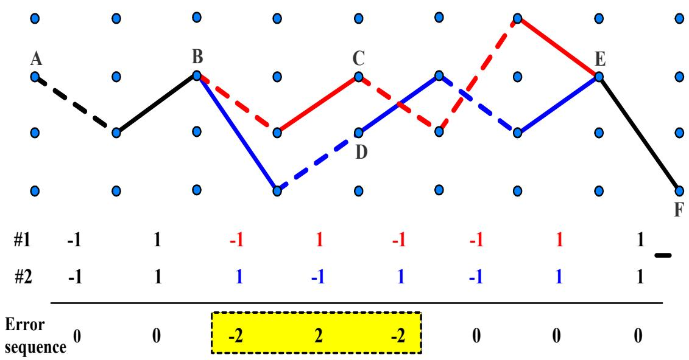
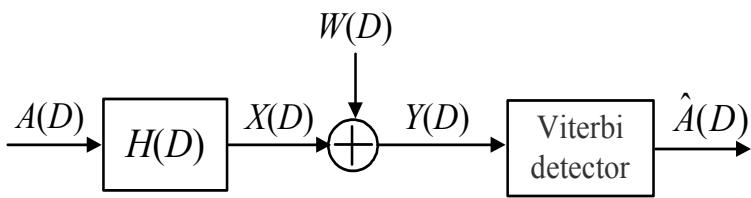
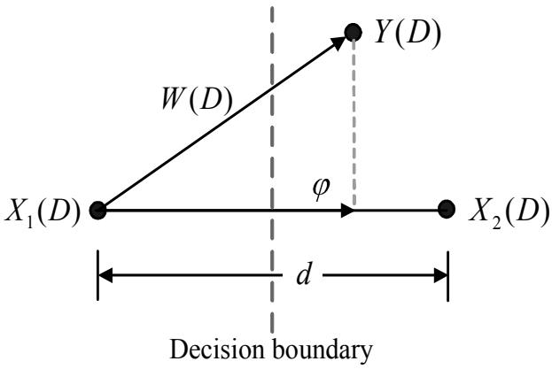
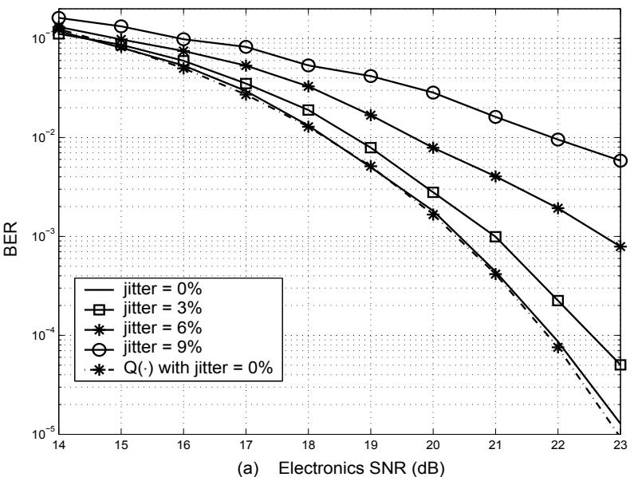
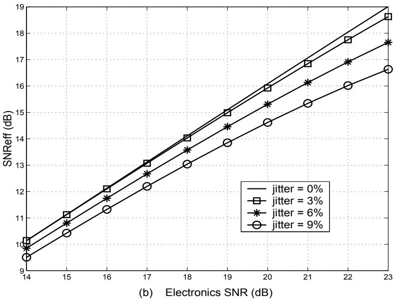
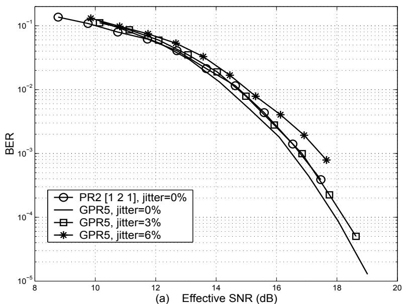
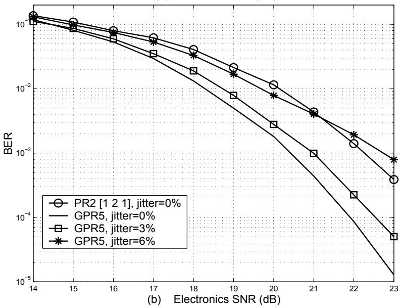

# 第5章 错误事件分析

本章将阐述错误事件（error event）分析的原理，即找出Viterbi检测器在数据译码过程中频繁发生的错误模式。当能够识别频繁发生的错误模式时，系统设计者就可以设计RLL（游程长度受限）码[9]或预编码器（precoder）[47]，用于在将信息数据写入记录介质之前对数据进行编码，以避免在Viterbi检测器译码过程中出现这些错误，从而显著降低系统的误比特率（BER）。此外，如果知道系统中哪些错误模式频繁发生，还可以利用这些信息通过一种称为有效SNR（effective SNR）[48]的参数来分析和比较不同target的性能，其效果等同于使用BER参数进行比较，但计算有效SNR所需的时间要少得多，详见本章接下来的说明。

## 5.1 引言

如4.3节所述，Viterbi检测器基于网格图（trellis diagram）工作。在数据译码过程中，有时可能会发生图5.1所示的情况。即在通过网格图对接收到的数据序列进行译码直至结束时，最佳幸存路径（survivor path）如图5.1所示。也就是说，在计算E点处的路径度量（path metric）以选择到达E点的最佳路径时，发现有两条路径——路径#1（路径ABCEF）和路径#2（路径ABDEF）——在E点处的路径度量值相等（两条路径被Viterbi算法选中的可能性相同）。因此，在这种情况下，Viterbi检测器可以选择其中任意一条路径作为最佳幸存路径的一部分用于数据译码。例如，如果Viterbi检测器选择路径#1，则译码结果为{−1, 1, −1, 1, −1, −1, 1, 1}；但如果选择路径#2，则结果为{−1, 1, 1, −1, 1, −1, 1, 1}。因此，假设实际输入数据序列为{−1, 1, −1, 1, −1, −1, 1, 1}，这意味着Viterbi检测器译码为{−1, 1, 1, −1, 1, −1, 1, 1}的可能性很高（反之亦然）。因此，如果将这两个数据序列（序列#1和#2）相减，例如数据序列#1减去数据序列#2，则结果为{0, 0, −2, 2, −2, 0, 0, 0}；或者如果将数据序列#2减去数据序列#1，则结果为{0, 0, 2, −2, 2, 0, 0, 0}。因此，所得结果$\{ - 2 , 2 , - 2 \}$或{2, −2, 2}被称为"错误序列（error sequence）"[15, 49, 50]，用于计算系统的错误事件。

  
图5.1: Viterbi检测器网格内部工作示例

  
图5.2: 等效GPR信道模型

系统的错误事件分析有助于了解哪种输入数据序列会导致Viterbi检测器在译码过程中发生混淆（出现图5.1所示的现象）。因此，如果能够避免将这些形式的输入数据序列送入系统，就可以减少Viterbi检测器的译码错误，从而提高系统的整体性能[49, 50]。

## 5.2 错误事件的定义

图3.2中的target设计模型可以整理为如图5.2所示的等效GPR（广义部分响应）信道模型形式。此时，图3.2中的误差序列$w_{k}$可以被视为图5.2中Viterbi检测器输入端的噪声W(D)。在实践中（特别是在硬盘驱动器ND较高的条件下），这种$w_{k}$噪声通常表现为有色噪声（colored noise），其均值为零，方差为$\sigma_{w}^{2}$。

根据图5.2的模型，Viterbi检测器输入端的输入信号可以用D域的数学方程表示为

$$
\begin{array} { l c l } { { Y ( D ) } } & { { = } } & { { A ( D ) H ( D ) + W ( D ) } } \\ { { } } & { { } } & { { } } \\ { { } } & { { = } } & { { X ( D ) + W ( D ) } } \end{array}\tag{5.1}
$$

其中$A ( D )$是输入数据序列，$\begin{array} { r } { H ( D ) = \sum _ { k = 0 } ^ { L - 1 } h _ { k } D ^ { k } } \end{array}$是target，L是target的总抽头数，$X ( D ) = A ( D ) H ( D )$是信道输出数据，W(D)是均值为零、方差为$\sigma_{w}^{2}$的有色噪声。

考虑两种输入数据序列$A_{1}(D)$和$A_{2}(D)$，它们是在译码过程中最易使Viterbi检测器发生混淆的数据序列，其中输入数据序列的每个元素可能的取值为{−1, 1}。因此，与错误事件相对应的输入错误序列定义为

$$
\varepsilon_{a}(D)=A_{1}(D)-A_{2}(D)\tag{5.2}
$$

其中$\varepsilon_{a}(D)$中的每个元素属于{−2, 0, 2}。如果规定输入错误序列的多项式（polynomial）形式为

$$
\varepsilon_{a}(D)=\sum_{k=0}^{p-1}\varepsilon_{a,k}D^{k}\tag{5.3}
$$

则有效的输入错误序列（valid input error sequence）必须满足以下两个性质：

1) $\varepsilon_{a}(D)$的首项系数和末项系数不能为零，即$\varepsilon_{a,0}\neq 0$且$\varepsilon_{a,p-1}\neq 0$

2) 有效的输入错误序列$\varepsilon_{a}(D)$中不能有连续L − 1个或更多个零系数，否则得到的结果将导致相同的错误事件[49]

$$
\begin{array} { r l } & { A _ { 1 } ( D ) = \{ \mathrm { ~ 1 ~ 1 ~ 1 ~ - 1 ~ 1 ~ - 1 ~ 1 ~ 1 ~ 1 ~ - 1 ~ - 1 ~ 1 ~ 1 ~ 1 ~ - 1 ~ 1 ~ - 1 ~ 1 ~ - 1 ~ 1 ~ 1 ~ 1 ~ - 1 ~ 1 ~ - 1 ~ 1 ~ - 1 ~ 1 ~ - 1 ~ 1 ~ 1 ~ } \} } \\ & { A _ { 2 } ( D ) = \{ \mathrm { ~ 1 ~ 1 ~ - 1 ~ 1 ~ - 1 ~ - 1 ~ 1 ~ 1 ~ - 1 ~ 1 ~ - 1 ~ - 1 ~ 1 ~ - 1 ~ 1 ~ - 1 ~ 1 ~ 1 ~ 1 ~ 1 ~ 1 ~ - 1 ~ 1 ~ 1 ~ 1 ~ 1 ~ } \} } \\ & { \varepsilon _ { a } ( D ) = \{ \mathrm { ~ 0 ~ } _ { 1 } ^ { \Gamma = -- } , \ \mathrm { ~ 2 ~ 2 ~ 2 ~ } \} 0 \mathrm { ~ 0 ~ } _ { 1 } ^ { \Gamma = \mathrm { ~ 2 ~ 2 ~ } } , \ 0 \mathrm { ~ 2 ~ } _ { 1 } ^ { \mathrm { \tiny ~ 1 ~ 2 ~ } } 0 \mathrm { ~ 0 ~ } _ { 1 } ^ { \Gamma = \mathrm { ~ 2 ~ } } , \ 0 _ { 1 } ^ { \mathrm { \tiny ~ 1 ~ 2 ~ } } 0 \mathrm { ~ 0 ~ } _ { 1 } ^ { \mathrm { \tiny ~ 1 ~ 2 ~ } } , \ \mathrm { ~ 2 ~ 2 ~ } _ { 2 } ^ { \mathrm { \tiny ~ 2 ~ 2 ~ } } \mathrm { ~ 2 ~ 2 ~ } _ { 1 } ^ { \mathrm { \tiny ~ 1 ~ 0 ~ } } \} } \end{array}
$$

图5.3: 错误序列计算示例

当获得有效的输入错误序列后，系统的"错误事件（error event）"定义为

$$
\varepsilon_{x}(D)=\varepsilon_{a}(D)H(D)\tag{5.4}
$$

**例5.1** 考虑PR4信道模型，$H(D)=1-D^{2}$，假设输入数据序列长度为20比特，其中第一输入数据序列$A_{1}(D)$为{1, 1, 1, 1, −1, 1, 1, $- 1 , \ - 1 , \ 1 , \ 1 , \ - 1 , \ 1 , \ - 1 , \ 1 , \ 1 , \ - 1 , \ 1 , \ - 1 , \ 1 \}$，第二输入数据序列$A_{2}(D)$为{1, $- 1 , \ 1 , \ - 1 , \ - 1 , \ 1 , \ - 1 , \ 1 , \ - 1 , \ - 1 , \ 1 , \ - 1 , \ - 1 , \ 1 , \ 1 , \ 1 , \ 1 , \ - 1 , \ 1 , \ 1 \}$，求该系统中所有有效的输入错误序列。

**解:** 首先根据方程(5.2)计算错误序列$\varepsilon_{a}(D)$，结果如图5.3所示。然后找出有效的输入错误序列，由图5.3可知，有效的输入错误序列共有4个：

$$
\{ 2 , - 2 , 2 \} , \quad \{ 2 , - 2 , 0 , 2 \} , \quad \{ 2 , - 2 \} , \quad \{ - 2 , 2 , - 2 \}
$$

但错误序列{2, −2, 2}和{−2, 2, −2}被视为同一序列，因为它们取决于从$A_{1}(D)-A_{2}(D)$还是$A_{2}(D)-A_{1}(D)$来考虑。因此，系统中有效的输入错误序列共有3种：

$$
\{ 2 , - 2 , 2 \} , \quad \{ 2 , - 2 , 0 , 2 \} , \quad \{ 2 , - 2 \}
$$

或者可以写成D域数学方程的形式，分别为$2-2D+2D^{2}$、$2-2D+2D^{3}$和$2-2D$。

**注:** 可以看出，有效的输入错误序列$\varepsilon_{a}(D)$的结果等于$-\varepsilon_{a}(D)$，这取决于从$A_{1}(D)-A_{2}(D)$还是$A_{2}(D)-A_{1}(D)$来考虑。

**例5.2** 假设输入数据序列每个元素的可能取值为$\{ - 1 , 1 \}$。已知在纵向记录（longitudinal recording）系统中，Viterbi检测器译码过程中频繁发生的输入错误序列为{2, –2, 2}[19]。当系统采用PR4 target，$H(D)=1-D^{2}$时，计算该系统的错误事件。

**解:** 由题意可得$\varepsilon_{a}(D)=2-2D+2D^{2}$，因此错误事件$\varepsilon_{x}(D)$可由方程(5.4)求得，即

$$
\begin{array} { l c l } { { \varepsilon _ { x } ( D ) } } & { { = } } & { { \varepsilon _ { a } ( D ) H ( D ) } } \\ { { } } & { { } } & { { } } \\ { { } } & { { = } } & { { ( 2 - 2 D + 2 D ^ { 2 } ) ( 1 - D ^ { 2 } ) } } \\ { { } } & { { } } & { { } } \\ { { } } & { { = } } & { { 2 - 2 D + 2 D ^ { 3 } - 2 D ^ { 4 } } } \end{array}
$$

因此，采用PR4 target的纵向记录系统的错误事件为$\varepsilon_{x}(D)=2-2D+2D^{3}-2D^{4}$。

**例5.3** 假设输入数据序列每个元素的可能取值为$\{ - 1 , 1 \}$。已知在垂直记录（perpendicular recording）系统中，Viterbi检测器译码过程中频繁发生的输入错误序列为{2, –2}[18]。当系统采用PR2 target，$H(D)=1+2D+D^{2}$时，计算该系统的错误事件。

**解:** 由题意可得$\varepsilon_{a}(D)=2-2D$，因此错误事件$\varepsilon_{x}(D)$可由方程(5.4)求得，即

$$
\begin{array} { l c l } { { \varepsilon _ { x } ( D ) } } & { { = } } & { { \varepsilon _ { a } ( D ) H ( D ) } } \\ { { } } & { { } } & { { } } \\ { { } } & { { = } } & { { ( 2 - 2 D ) ( 1 + 2 D + D ^ { 2 } ) } } \\ { { } } & { { } } & { { } } \\ { { } } & { { = } } & { { 2 + 2 D - 2 D ^ { 2 } - 2 D ^ { 3 } } } \end{array}
$$

因此，采用PR2 target的垂直记录系统的错误事件为$\varepsilon_{x}(D)=2-2D+2D^{3}-2D^{4}$。

## 5.3 欧几里得距离

由图5.2，Viterbi检测器输入端的信号错误序列，或者称为系统的"错误事件（error event）"，即

$$
\begin{array} { l c l } { { \varepsilon _ { x } ( D ) } } & { { = } } & { { \left[ A _ { 1 } ( D ) - A _ { 2 } ( D ) \right] H ( D ) } } \\ { { } } & { { } } & { { } } \\ { { } } & { { = } } & { { X _ { 1 } ( D ) - X _ { 2 } ( D ) } } \end{array}\tag{5.5}
$$

使用Viterbi检测器的数据译码过程可以用图5.4所示的二维图像来描述，其中$X_{1}(D)$是正确的信号，$X_{2}(D)$是错误的信号。如果噪声$W(D)$（即$\varphi$）在从$X_{1}(D)$到$X_{2}(D)$方向上的幅度大于$d/2$，则Viterbi检测器将做出错误判决，其中d是在$X_{1}(D)$和$X_{2}(D)$之间测得的$\varepsilon_{x}(D)$的"欧几里得距离（Euclidean distance）"。

如果规定系统的错误事件序列的多项式形式为

$$
\begin{array} { l l l } { \displaystyle \varepsilon _ { x } ( D ) } & { = } & { \displaystyle \sum _ { k = 0 } ^ { n } \varepsilon _ { x , k } D ^ { k } } \\ & { = } & { \displaystyle \varepsilon _ { x , 0 } + \varepsilon _ { x , 1 } D + \cdot \cdot \cdot + \varepsilon _ { x , n } D ^ { n } } \end{array}\tag{5.6}
$$

则错误事件的欧几里得距离平方（squared Euclidean distance）$d^{2}\{\varepsilon_{a}(D)\}$

  
图5.4: 使用Viterbi检测器进行数据译码过程的二维示意图

被定义为等于$\varepsilon_{x}(D)$的能量[15]，即

$$
\begin{array} { l l l } { { \displaystyle d ^ { 2 } \{ \varepsilon _ { a } ( D ) \} } } & { { = } } & { { \displaystyle \| \varepsilon _ { x } ( D ) \| ^ { 2 } } } \\ { { } } & { { = } } & { { \displaystyle \sum _ { k = 0 } ^ { n } \varepsilon _ { x , k } ^ { 2 } } } \\ { { } } & { { = } } & { { \varepsilon ^ { \mathrm { T } } \varepsilon } } \end{array}\tag{5.7}
$$

其中$\| \cdot \|$表示求范数（norm），$\varepsilon$是错误事件$\varepsilon_{x}(D)$的列向量，包含$n+1$个元素。例如，如果$\varepsilon_{x}(D)=2-3D+4D^{3}-5D^{4}$，则$\pmb{\varepsilon}=[2,-3,0,4,-5]^{\mathrm{T}}$。

**例5.4** 根据例5.3中的数据，计算系统错误事件的欧几里得距离平方。

**解:** 由例5.3可得$\varepsilon_{a}(D)=2-2D$，$H(D)=1+2D+D^{2}$，且$\varepsilon_{x}(D)=2-2D+2D^{3}-2D^{4}$。因此，错误事件的欧几里得距离平方$d^{2}\{\varepsilon_{a}(D)\}$可由方程(5.7)求得如下：

$$
d^{2}\{\varepsilon_{a}(D)\}=\sum_{i=0}^{n}\varepsilon_{x,i}^{2}=(2)^{2}+(-2)^{2}+(0)^{2}+(2)^{2}+(-2)^{2}=16
$$

## 5.4 有效距离

或者也可以由下式求得：

$$
d^{2}\{\varepsilon_{a}(D)\}=\varepsilon^{\mathrm{T}}\varepsilon=[2,-2,0,2,-2]\cdot[2,-2,0,2,-2]^{\mathrm{T}}=16
$$

因此，错误事件$\varepsilon_{x}(D)=2-2D+2D^{3}-2D^{4}$的欧几里得距离平方等于16。

假设噪声$W(D)$是加性高斯白噪声（AWGN），则$W(D)$的方差在所有方向上大小相等。因此，Viterbi检测器以误比特率（BER）表示的性能取决于产生具有最小欧几里得距离平方的错误序列$\varepsilon_{x}(D)$的输入错误序列$\varepsilon_{a}(D)$[15]，定义为

$$
d_{\operatorname*{min}}^{2}=\operatorname*{min}_{\substack{\mathrm{valid}\varepsilon_{a}(D)}}\left[d^{2}\{\varepsilon_{a}(D)\}\right]\tag{5.8}
$$

因此，Viterbi检测器输出端的错误概率（probability of error）或BER可近似估计如下[15]：

$$
P_{e}\approx K_{1}Q\left({\frac{d_{\mathrm{min}}}{2\sigma_{w}}}\right)\tag{5.9}
$$

其中$K_{1}$是与$\sigma_{w}$无关的常数，$\begin{array} { r } { Q ( x ) = \frac { 1 } { \sqrt { 2 \pi } } \int _ { x } ^ { \infty } e ^ { - \frac { u ^ { 2 } } { 2 } } d u } \end{array}$。因此，当Viterbi检测器输入端的噪声分量为AWGN时，最小欧几里得距离$d_{\mathrm{min}}$可用于估计系统的错误概率。如果系统中只有一个"主导错误事件（dominant error event）"，即其$d^{2}\{\varepsilon_{a}(D)\}$远小于系统中其他错误序列的$d^{2}\{\varepsilon_{a}(D)\}$，则估计结果会更加可靠。

如果Viterbi检测器输入端的噪声$W(D)$是有色噪声（在实践中往往如此，特别是在ND较高时），错误概率将同时取决于欧几里得距离和$\varepsilon_{x}(D)$方向上的噪声方差$\varphi$。因此，在这种情况下，$d_{\mathrm{min}}$无法用于估计系统中发生的错误概率。于是引入"有效距离（effective distance）"$d_{\mathrm{eff}}\{\varepsilon_{a}(D)\}$[48, 49]来代替$d_{\mathrm{min}}$用于估计系统的错误概率。由图5.4，$\varphi$等于噪声$W(D)$在从$X_{1}(D)$到$X_{2}(D)$方向的单位向量（unit vector）上的投影（projection），即

$$
\varphi=\frac{\mathbf{w}^{\mathrm{T}}\pmb\varepsilon}{\Vert\pmb\varepsilon\Vert}\tag{5.10}
$$

其中$\varepsilon$是错误事件$\varepsilon_{x}(D)$的列向量，包含$n+1$个元素，而$\mathbf{w}$是噪声$W(D)$的列向量，包含$n+1$个元素。例如，如果${ \cal W } ( D ) = 0 . 8 2 - 1 . 3 D + 0 . 2 D ^ { 3 }$，则$\mathbf{w}=[0.82,-1.3,0,0.2]^{\mathrm{T}}$。

因此，$\varphi$的方差可由下式求得[48]：

$$
\begin{array} { r l r } { \sigma _ { \varphi } ^ { 2 } } & { = } & { E [ \varphi ^ { 2 } ] } \\ & { = } & { E \left[ { \frac { \left( \mathbf { w } ^ { \mathrm { T } } { \boldsymbol \varepsilon } \right) ^ { \mathrm { T } } \left( \mathbf { w } ^ { \mathrm { T } } { \boldsymbol \varepsilon } \right) } { \| \boldsymbol \varepsilon \| ^ { 2 } } } \right] } \\ & { = } & { { \frac { \varepsilon ^ { \mathrm { T } } E \left[ \mathbf { w } \mathbf { w } ^ { \mathrm { T } } \right] \varepsilon } { \varepsilon ^ { \mathrm { T } } \varepsilon } } } \\ & { = } & { { \frac { \varepsilon ^ { \mathrm { T } } \mathbf { R } _ { \mathrm { w w } } \varepsilon } { \varepsilon ^ { \mathrm { T } } \varepsilon } } } \end{array}\tag{5.11}
$$

其中$E[\cdot]$是期望算子（expectation operator），${\mathbf{R}}_{\mathrm{ww}}$是$W(D)$的自相关矩阵（auto-correlation matrix），矩阵${\mathbf{R}}_{\mathrm{ww}}$的第i行第j列元素由下式求得：

$$
\mathbf{R}_{\mathrm{ww}}(i,j)=E\left[\sum_{k=0}^{S-1}w_{k-i}w_{k-j}\right],\quad 0\leq i,j\leq n+1\tag{5.12}
$$

其中S是输入数据序列$\{a_{k}\}$的长度。在[49]中，错误事件的SNR值$\mathrm{SNR}_{\mathrm{event}}\{\varepsilon_{a}(D)\}$定义为

$$
\mathrm{SNR}_{\mathrm{event}}\{\varepsilon_{a}(D)\}=\frac{d^{2}\{\varepsilon_{a}(D)\}}{\sigma_{w}^{2}}\tag{5.13}
$$

而错误事件的有效SNR $\mathrm{SNR}_{\mathrm{eff}}$为

$$
\mathrm{SNR}_{\mathrm{eff}}\{\varepsilon_{a}(D)\}=\frac{d^{2}\{\varepsilon_{a}(D)\}}{\sigma_{\varphi}^{2}}\tag{5.14}
$$

为了能比使用方程(5.9)中的参数$d_{\mathrm{min}}$更可靠地估计系统中发生的错误概率，定义了一种新的距离值称为"有效距离（effective distance）"$d_{\mathrm{eff}}\{\varepsilon_{a}(D)\}$，它将方差$\sigma_{\varphi}^{2}$的影响也一并考虑在内。因此，当用$d_{\mathrm{eff}}^{2}\{\varepsilon_{a}(D)\}$替代方程(5.13)中的$d^{2}\{\varepsilon_{a}(D)\}$后，将使得$\mathrm{SNR}_{\mathrm{event}}\{\varepsilon_{a}(D)\}$等于$\mathrm{SNR}_{\mathrm{eff}}\{\varepsilon_{a}(D)\}$，即

$$
\mathrm{SNR}_{\mathrm{eff}}\{\varepsilon_{a}(D)\}=\frac{d_{\mathrm{eff}}^{2}\{\varepsilon_{a}(D)\}}{\sigma_{w}^{2}}=\frac{d^{2}\{\varepsilon_{a}(D)\}}{\sigma_{\varphi}^{2}}\tag{5.15}
$$

由方程(5.15)可得，有效距离平方（squared effective distance）等于

$$
\begin{array} { r c l } { { d _ { \mathrm { e f f } } ^ { 2 } \{ \varepsilon _ { a } ( D ) \} } } & { { = } } & { { \sigma _ { w } ^ { 2 } { \frac { d ^ { 2 } \{ \varepsilon _ { a } ( D ) \} } { \sigma _ { \varphi } ^ { 2 } } } } } \\ { { } } & { { = } } & { { \sigma _ { w } ^ { 2 } { \frac { ( \varepsilon ^ { \mathrm { T } } \varepsilon ) ^ { 2 } } { \varepsilon ^ { \mathrm { T } } { \bf R } _ { \mathrm { w w } } \varepsilon } } } } \end{array}\tag{5.16}
$$

同样，最小有效距离平方定义为

$$
d_{\mathrm{effmin}}^{2}=\operatorname*{min}_{\mathrm{valid}~\varepsilon_{a}(D)}\left[d_{\mathrm{eff}}^{2}\{\varepsilon_{a}(D)\}\right]\tag{5.17}
$$

而(5.9)中的错误概率变为[15]

$$
P_{e}\approx K_{2}Q\left({\frac{d_{\mathrm{effmin}}}{2\sigma_{w}}}\right)\tag{5.18}
$$

其中$K_{2}$是与$\sigma_{w}$无关的常数。实验发现，$d_{\mathrm{effmin}}$可以比$d_{\mathrm{min}}$更可靠地用于估计系统的错误概率，这是因为$d_{\mathrm{effmin}}$已经包含了有色噪声的影响。

**例5.5** 考虑图3.2中的target设计模型，用于垂直记录系统，ND = 2，SNR = 22 dB，输入数据序列$a_{k}\in\{-1,1\}$，得到的误差序列$\{w_{k}\}=\{-3.64,-4.34,2.96,-1.56,-3.70,0.80,8.52,-3.76,6.10,-12.72\}$。如果系统中频繁发生的输入错误序列$\varepsilon_{a}(D)$为[2, −2]，系统采用PR2 target，$H(D)=1+2D+D^{2}$，计算该输入错误序列的有效距离平方$d_{\mathrm{eff}}^{2}\{\varepsilon_{a}(D)\}$。

**解:** 由题意，该系统的错误事件$\varepsilon_{x}(D)$可由下式求得：

$$
\begin{array} { l c l } { { \varepsilon _ { x } ( D ) } } & { { = } } & { { \varepsilon _ { a } ( D ) H ( D ) } } \\ { { } } & { { } } & { { } } \\ { { } } & { { = } } & { { ( 2 - 2 D ) ( 1 + 2 D + D ^ { 2 } ) } } \\ { { } } & { { } } & { { } } \\ { { } } & { { = } } & { { 2 + 2 D - 2 D ^ { 2 } - 2 D ^ { 3 } } } \end{array}
$$

即$\pmb{\varepsilon}=[2,2,-2,-2]^{\mathrm{T}}$。

根据给定的误差序列$\{w_{k}\}$，自相关矩阵${\mathbf{R}}_{\mathrm{ww}}$可由方程(5.12)求得，其值为

$$
\mathbf{R}_{\mathrm{ww}}=\left[\begin{array} { c c c c } { 3 4 . 3 3 } & { - 1 3 . 8 4 } & { 6 . 1 3 } & { - 1 1 . 2 5 } \\ { - 1 3 . 8 4 } & { 3 4 . 3 3 } & { - 1 3 . 8 4 } & { 6 . 1 3 } \\ { 6 . 1 3 } & { - 1 3 . 8 4 } & { 3 4 . 3 3 } & { - 1 3 . 8 4 } \\ { - 1 1 . 2 5 } & { 6 . 1 3 } & { - 1 3 . 8 4 } & { 3 4 . 3 3 } \end{array}\right]
$$

且$\sigma_{w}^{2}=\mathbf{R}_{\mathrm{ww}}(0,0)=34.33$。因此，有效距离平方$d_{\mathrm{eff}}^{2}\{\varepsilon_{a}(D)\}$可由方程(5.16)求得，即

$$
\begin{array} { l c l } { { d _ { \mathrm { e f f } } ^ { 2 } \{ \varepsilon _ { a } ( D ) \} } } & { { = } } & { { \sigma _ { w } ^ { 2 } { \frac { ( \varepsilon ^ { \mathrm { T } } \varepsilon ) ^ { 2 } } { \varepsilon ^ { \mathrm { T } } { \bf R } _ { \mathrm { w w } } \varepsilon } } } } \\ { { } } & { { } } & { { } } \\ { { } } & { { = } } & { { 3 4 . 3 3 \left( { \frac { 2 5 6 } { 4 3 0 . 4 8 } } \right) } } \\ { { } } & { { } } & { { } } \\ { { } } & { { = } } & { { 2 0 . 4 1 } } \end{array}\tag{5.19}
$$

因此，在采用PR2 target的垂直记录系统中，输入错误序列$\varepsilon_{a}(D)=\{2,-2\}$的有效距离平方等于20.41单位。

在计算出$d_{\mathrm{effmin}}$之后，与$d_{\mathrm{effmin}}$相对应的有效SNR值$\mathrm{SNR}_{\mathrm{eff}}$定义为

$$
\mathrm{SNR}_{\mathrm{eff}}=\frac{d_{\mathrm{effmin}}^{2}}{\sigma_{w}^{2}}=\frac{(\varepsilon^{\mathrm{T}}\pmb{\varepsilon})^{2}}{\varepsilon^{\mathrm{T}}\mathbf{R}_{\mathrm{ww}}\pmb{\varepsilon}}\tag{5.20}
$$

将在5.5节中展示的实验结果表明，$\mathrm{SNR_{eff}}$可以像使用BER参数一样用于可靠地比较采用不同target的系统的性能。如果系统中只有一个主导错误事件，即当系统工作在足够高的SNR水平时（例如当系统BER < 10⁻⁴），结果会更加可靠。

## 5.5 实验结果

在进行错误事件分析的实验中，仅考虑垂直记录（perpendicular recording）系统。关于纵向记录（longitudinal recording）系统的错误事件分析，可参见[49]。考虑图3.2中的系统模型，其中读回信号（read-back）满足方程(3.26)，即

$$
p(t)=\sum_{k=0}^{S-1}b_{k}g(t-kT+\Delta t_{k})+n(t)\tag{5.21}
$$

其中$b_{k}=(a_{k}-a_{k-1})/2$是状态变化比特（当$b_{k}=\pm 1$对应正或负的状态变化，$b_{k}=0$表示无状态变化），$a_{k}\in\pm 1$是第k个输入数据比特，总数为$S=4096$比特（1个扇区），$g(t)$是根据方程(1.2)的垂直记录系统的状态变化脉冲信号，$n(t)$是双边功率谱密度为$N_{0}/2$的加性高斯白噪声（AWGN），$\Delta t$是介质抖动噪声（media jitter noise），模拟为"随机状态变化位置偏移"，其概率密度函数为均值为零、方差为$|b_{k}|\sigma_{j}^{2}$的高斯分布，并被限制不超过$T/2$，其中$\sigma_{j}$以比特单元$T$的百分比表示，$|b_{k}|$是$b_{k}$的绝对值。

读回信号经过7阶巴特沃斯低通滤波器后，以$1/T$的频率进行采样，假设采样电路具有完美的同步（perfect synchronization）。然后，得到的序列$\{s_{k}\}$被送至均衡器（equalizer）以将信号波形调整为所需的target形状，即均衡器力求使输出数据序列$\{y_{k}\}$尽可能接近所需的数据序列$\{d_{k}\}$。之后，Viterbi检测器对$\{y_{k}\}$进行译码，以找出最可能的输入数据序列$\{a_{k}\}$。在实验中，SNR按照方程(3.27)定义，即

$$
\mathrm{SNR}=10\log_{10}\left({\frac{V_{p}^{2}}{\sigma^{2}}}\right)\tag{dB}
$$

其中$V_{p}=g(\infty)=1$是孤立状态变化脉冲（isolated transition pulse）在$t=\infty$时刻的幅度，$\sigma^{2}=N_{0}/(2T)$是噪声$n(t)$的功率。

在本实验中，target和均衡器在$\mathrm{ND}=2.5$和$\mathrm{SNR}=22$ dB条件下进行设计，并在给定的介质抖动噪声强度$\sigma_{j}$下进行。各参数，如$d_{\mathrm{effmin}}^{2}$、$\sigma_{w}^{2}$和$\mathrm{SNR_{eff}}$等，使用每个SNR和ND仅1个扇区（4096比特）的数据计算。这里仅考虑由首项系数为1的约束条件（monic constraint）设计的target（详见3.2.1节）。为便于说明，符号"GPRn"用于表示具有n个抽头的首项系数为1的target。此外，在实验中，符号"_"用于表示数据$-2$，符号"+"用于表示数据$+2$，且所有输入错误序列$\varepsilon_{a}(D)$都具有对称性质，即$\varepsilon_{a}(D)=-\varepsilon_{a}(D)$。

### 5.5.1 最小距离分析

根据给定的模型和条件，为垂直记录系统设计的GPR3 target（ND = 2.5，$\sigma_{j}=0\%$）为$H(D)=1+1.3022D+0.6623D^{2}$。然后使用该target进行系统仿真（system simulation），计算在SNR = 22 dB条件下系统中出现的各种欧几里得距离平方$d^{2}\{\varepsilon_{a}(D)\}$、有效距离平方$d_{\mathrm{eff}}^{2}\{\varepsilon_{a}(D)\}$以及输入错误序列$\varepsilon_{a}(D)$（在Viterbi检测器输出端），结果如下：

表5.1: GPR3 target系统（ND = 2.5，SNR = 22 dB）的欧几里得距离平方$d^{2}\{\varepsilon_{a}(D)\}$、有效距离平方$d_{\mathrm{eff}}^{2}\{\varepsilon_{a}(D)\}$和输入错误序列$\varepsilon_{a}(D)$

<table><tr><td rowspan=2 colspan=1>错误长度(比特)</td><td rowspan=1 colspan=3>欧几里得距离(Euclidean distance)</td><td rowspan=1 colspan=3>有效距离(Effective distance)</td></tr><tr><td rowspan=1 colspan=1>$d^{2}$</td><td rowspan=1 colspan=1>错误序列$\varepsilon_{a}(D)$</td><td rowspan=1 colspan=1>出现次数</td><td rowspan=1 colspan=1>$d_{\mathrm{eff}}^{2}$</td><td rowspan=1 colspan=1>错误序列$\varepsilon_{a}(D)$</td><td rowspan=1 colspan=1>出现次数</td></tr><tr><td rowspan=1 colspan=1>1</td><td rowspan=1 colspan=1>12.5375</td><td rowspan=1 colspan=1>−</td><td rowspan=1 colspan=1>0</td><td rowspan=1 colspan=1>17.0522</td><td rowspan=1 colspan=1>−</td><td rowspan=1 colspan=1>0</td></tr><tr><td rowspan=1 colspan=1>2</td><td rowspan=1 colspan=1>7.7579</td><td rowspan=1 colspan=1>−+</td><td rowspan=1 colspan=1>127</td><td rowspan=1 colspan=1>6.7243</td><td rowspan=1 colspan=1>−+</td><td rowspan=1 colspan=1>127</td></tr><tr><td rowspan=1 colspan=1>3</td><td rowspan=1 colspan=1>8.2764</td><td rowspan=1 colspan=1>− + −</td><td rowspan=1 colspan=1>2</td><td rowspan=1 colspan=1>10.0266</td><td rowspan=1 colspan=1>− + −</td><td rowspan=1 colspan=1>2</td></tr><tr><td rowspan=1 colspan=1>4</td><td rowspan=1 colspan=1>8.7950</td><td rowspan=1 colspan=1>− + − +</td><td rowspan=1 colspan=1>1</td><td rowspan=1 colspan=1>11.2688</td><td rowspan=1 colspan=1>− + − +</td><td rowspan=1 colspan=1>1</td></tr><tr><td rowspan=1 colspan=1>5</td><td rowspan=1 colspan=1>9.3135</td><td rowspan=1 colspan=1>− + − + −</td><td rowspan=1 colspan=1>0</td><td rowspan=1 colspan=1>7.0754</td><td rowspan=1 colspan=1>− + 0 − +</td><td rowspan=1 colspan=1>37</td></tr><tr><td rowspan=1 colspan=1>6</td><td rowspan=1 colspan=1>9.8321</td><td rowspan=1 colspan=1>− + − + − +</td><td rowspan=1 colspan=1>0</td><td rowspan=1 colspan=1>9.5535</td><td rowspan=1 colspan=1>− + 0 − + −</td><td rowspan=1 colspan=1>1</td></tr>
<tr><td rowspan=1 colspan=1>7</td><td rowspan=1 colspan=1>10.3507</td><td rowspan=1 colspan=1>− + − + − + −</td><td rowspan=1 colspan=1>0</td><td rowspan=1 colspan=1>7.8234</td><td rowspan=1 colspan=1>− + 0 − + 0 − +</td><td rowspan=1 colspan=1>21</td></tr>
<tr><td rowspan=1 colspan=1>8</td><td rowspan=1 colspan=1>10.8693</td><td rowspan=1 colspan=1>− + − + − + − +</td><td rowspan=1 colspan=1>0</td><td rowspan=1 colspan=1>10.7373</td><td rowspan=1 colspan=1>− + 0 − + 0 − + −</td><td rowspan=1 colspan=1>1</td></tr></table>

如表5.1所示。

根据"距离最小的输入错误序列出现最频繁"这一原则，从表5.1来看，如果以欧几里得距离平方$d^{2}\{\varepsilon_{a}(D)\}$为判断准则，则频繁发生的输入错误序列为{−+}、{−+−}和{−+−+}，因为它们的$d^{2}\{\varepsilon_{a}(D)\}$值分别为7.7579、8.2764和8.7950。但如果以有效距离平方$d_{\mathrm{eff}}^{2}\{\varepsilon_{a}(D)\}$为判断准则，则频繁发生的输入错误序列为{−+}、{−+0−+}和{−+0−+0−+}，因为它们的$d_{\mathrm{eff}}^{2}\{\varepsilon_{a}(D)\}$值分别为6.7243、7.0754和7.8234。

为了验证哪种准则（欧几里得距离还是有效距离）在预测系统中频繁发生的输入错误序列方面更可靠，再次进行了系统仿真，将多个扇区的数据送入系统（按照图3.2的模型），在SNR = 22 dB条件下进行，直至累积的总错误（error）达到500比特。然后分析每种输入错误序列总共出现的次数。实验结束时，系统的BER = $5.1945\times10^{-4}$，错误比特数为500比特，输入错误序列总数为180个（每种输入错误序列可能多次出现或多个实例）。从表5.1可以看出，频繁发生的输入错误序列依次为{−+}、{−+0−+}和{−+0−+0−+}，这与使用$d_{\mathrm{eff}}^{2}\{\varepsilon_{a}(D)\}$准则的预测结果一致。因此，$d_{\mathrm{eff}}^{2}\{\varepsilon_{a}(D)\}$可以比$d^{2}\{\varepsilon_{a}(D)\}$更准确地用于预测系统中哪些输入错误序列频繁发生。然而，只有当系统中只有一个主导错误序列时，即系统工作在较高SNR水平（或BER $<10^{-4}$）时，这一结论才更加可靠。

类似地，表5.2给出了采用PR2 target，$H(D)=1+2D+D^{2}$，ND = 2.5，SNR = 22 dB的系统的错误事件分析。在这种情况下，将多个扇区的数据送入系统，直至得到BER = $1.4251\times10^{-3}$，错误比特数为502比特，输入错误序列总数为179个。可以看出，该系统中频繁发生的输入错误序列依次为{−+}和{−+0−+}，这与使用$d_{\mathrm{eff}}^{2}\{\varepsilon_{a}(D)\}$准则的预测结果一致。因此，从实验结果可以得出结论：频繁发生的输入错误序列是具有最小$d_{\mathrm{eff}}^{2}\{\varepsilon_{a}(D)\}$值的输入错误序列（而不是具有最小$d^{2}\{\varepsilon_{a}(D)\}$值的输入错误序列）。此外，与$d_{\mathrm{eff}}^{2}\{\varepsilon_{a}(D)\}$相对应的输入错误序列不一定与$d^{2}\{\varepsilon_{a}(D)\}$相对应的输入错误序列相同。

接下来将分析介质抖动噪声对系统中输入错误序列产生的影响。考虑采用GPR5 target的垂直记录系统，ND = 2.5（每个$\sigma_{j}/T$对应的target各抽头系数可从图3.7(b)中的数据获得）。表5.3给出了当系统BER = $10^{-4}$时的输入错误序列$\varepsilon_{a}(D)$及其出现频率。从表5.3可以看出，当$\sigma_{j}/T$的强度较小时（0%–3%），垂直记录系统中主导的输入错误序列为{2, −2}。此外，随着$\sigma_{j}/T$强度的增加，主导错误序列的数量也会增加。对于纵向记录系统的错误事件分析，主导的输入错误序列为{2, –2, 2}[19]。

表5.2: PR2 target系统（ND=2.5，SNR=22 dB）的欧几里得距离平方$d^{2}\{\varepsilon_{a}(D)\}$、有效距离平方$d_{\mathrm{eff}}^{2}\{\varepsilon_{a}(D)\}$和输入错误序列$\varepsilon_{a}(D)$

<table><tr><td rowspan=2 colspan=1>错误长度(比特)</td><td rowspan=1 colspan=3>欧几里得距离(Euclidean distance)</td><td rowspan=1 colspan=3>有效距离(Effective distance)</td></tr><tr><td rowspan=1 colspan=1>$d^{2}\{\varepsilon_{a}(D)\}$</td><td rowspan=1 colspan=1>错误序列$\varepsilon_{a}(D)$</td><td rowspan=1 colspan=1>出现次数</td><td rowspan=1 colspan=1>$d_{\mathrm{eff}}^{2}\{\varepsilon_{a}(D)\}$</td><td rowspan=1 colspan=1>错误序列$\varepsilon_{a}(D)$</td><td rowspan=1 colspan=1>出现次数</td></tr><tr><td rowspan=1 colspan=1>1</td><td rowspan=1 colspan=1>24</td><td rowspan=1 colspan=1>−</td><td rowspan=1 colspan=1>0</td><td rowspan=1 colspan=1>34.0001</td><td rowspan=1 colspan=1>−</td><td rowspan=1 colspan=1>0</td></tr><tr><td rowspan=1 colspan=1>2</td><td rowspan=1 colspan=1>16</td><td rowspan=1 colspan=1>−+</td><td rowspan=1 colspan=1>127</td><td rowspan=1 colspan=1>12.7191</td><td rowspan=1 colspan=1>−+</td><td rowspan=1 colspan=1>127</td></tr><tr><td rowspan=1 colspan=1>3</td><td rowspan=1 colspan=1>16</td><td rowspan=1 colspan=1>−+−</td><td rowspan=1 colspan=1>9</td><td rowspan=1 colspan=1>16.1802</td><td rowspan=1 colspan=1>−+−</td><td rowspan=1 colspan=1>9</td></tr><tr><td rowspan=1 colspan=1>4</td><td rowspan=1 colspan=1>16</td><td rowspan=1 colspan=1>−+−+</td><td rowspan=1 colspan=1>0</td><td rowspan=1 colspan=1>19.3624</td><td rowspan=1 colspan=1>−+−+</td><td rowspan=1 colspan=1>0</td></tr><tr><td rowspan=1 colspan=1>5</td><td rowspan=1 colspan=1>16</td><td rowspan=1 colspan=1>−+−+−</td><td rowspan=1 colspan=1>2</td><td rowspan=1 colspan=1>13.6519</td><td rowspan=1 colspan=1>−+0−+</td><td rowspan=1 colspan=1>26</td></tr><tr><td rowspan=1 colspan=1>6</td><td rowspan=1 colspan=1>16</td><td rowspan=1 colspan=1>−+−+−+</td><td rowspan=1 colspan=1>1</td><td rowspan=1 colspan=1>15.1953</td><td rowspan=1 colspan=1>−+0−+−</td><td rowspan=1 colspan=1>2</td></tr>
<tr><td rowspan=1 colspan=1>7</td><td rowspan=1 colspan=1>16</td><td rowspan=1 colspan=1>−+−+−+−</td><td rowspan=1 colspan=1>0</td><td rowspan=1 colspan=1>15.3804</td><td rowspan=1 colspan=1>−+0−+0−+</td><td rowspan=1 colspan=1>13</td></tr>
<tr><td rowspan=1 colspan=1>8</td><td rowspan=1 colspan=1>16</td><td rowspan=1 colspan=1>−+−+−+−+</td><td rowspan=1 colspan=1>1</td><td rowspan=1 colspan=1>16.4639</td><td rowspan=1 colspan=1>−+0−+0−+−</td><td rowspan=1 colspan=1>1</td></tr></table>

通过对错误事件分析进行研究的好处是，当了解系统中所使用的主要输入错误序列类型后，研究人员可以通过设计RLL（游程长度受限）码[9]或预编码器（precoder）[47]来对写入记录介质之前的信息数据进行编码，从而避免在Viterbi检测器译码过程中出现这些主导的输入错误序列，进而提高系统的整体性能。

### 5.5.2 $\mathrm{SNR_{eff}}$与BER的关系

本节将说明$\mathrm{SNR_{eff}}$和BER之间存在很强的相关性，特别是在介质抖动噪声强度$\sigma_{j}/T$较小且系统工作在足够高的SNR水平时（即系统中只有一个主导错误事件时）。

表5.3: 采用不同target和$\sigma_{j}/T$的系统在BER = $10^{-4}$时的输入错误序列$\varepsilon_{a}(D)$

<table><tr><td rowspan=1 colspan=1>输入错误序列</td><td rowspan=1 colspan=1>PR2 $\sigma_{j}/T=0\%$</td><td rowspan=1 colspan=1>GPR5 $\sigma_{j}/T=0\%$</td><td rowspan=1 colspan=1>GPR5 $\sigma_{j}/T=3\%$</td><td rowspan=1 colspan=1>GPR5 $\sigma_{j}/T=6\%$</td><td rowspan=1 colspan=1>GPR5 $\sigma_{j}/T=9\%$</td></tr><tr><td rowspan=1 colspan=1>+</td><td rowspan=1 colspan=1>4.90%</td><td rowspan=1 colspan=1>3.19%</td><td rowspan=1 colspan=1>3.36%</td><td rowspan=1 colspan=1>5.84%</td><td rowspan=1 colspan=1>41.53%</td></tr><tr><td rowspan=1 colspan=1>+−</td><td rowspan=1 colspan=1>67.54%</td><td rowspan=1 colspan=1>83.25%</td><td rowspan=1 colspan=1>79.66%</td><td rowspan=1 colspan=1>35.21%</td><td rowspan=1 colspan=1>9.62%</td></tr><tr><td rowspan=1 colspan=1>+−+</td><td rowspan=1 colspan=1>5.79%</td><td rowspan=1 colspan=1>0.35%</td><td rowspan=1 colspan=1>1.98%</td><td rowspan=1 colspan=1>38.31%</td><td rowspan=1 colspan=1>21.53%</td></tr><tr><td rowspan=1 colspan=1>+−+−</td><td rowspan=1 colspan=1>0.51%</td><td rowspan=1 colspan=1>0.58%</td><td rowspan=1 colspan=1>1.14%</td><td rowspan=1 colspan=1>6.66%</td><td rowspan=1 colspan=1>15.73%</td></tr><tr><td rowspan=1 colspan=1>+−+−+</td><td rowspan=1 colspan=1>0.13%</td><td rowspan=1 colspan=1>0.23%</td><td rowspan=1 colspan=1>0.48%</td><td rowspan=1 colspan=1>2.66%</td><td rowspan=1 colspan=1>6.31%</td></tr><tr><td rowspan=1 colspan=1>+−0+−</td><td rowspan=1 colspan=1>15.53%</td><td rowspan=1 colspan=1>8.75%</td><td rowspan=1 colspan=1>8.94%</td><td rowspan=1 colspan=1>3.03%</td><td rowspan=1 colspan=1>0.00%</td></tr><tr><td rowspan=1 colspan=1>+−0+−0+−</td><td rowspan=1 colspan=1>1.34%</td><td rowspan=1 colspan=1>0.73%</td><td rowspan=1 colspan=1>0.84%</td><td rowspan=1 colspan=1>0.22%</td><td rowspan=1 colspan=1>0.00%</td></tr><tr><td rowspan=1 colspan=1>其他</td><td rowspan=1 colspan=1>4.26%</td><td rowspan=1 colspan=1>3.42%</td><td rowspan=1 colspan=1>3.60%</td><td rowspan=1 colspan=1>8.07%</td><td rowspan=1 colspan=1>5.28%</td></tr></table>

图5.5比较了在ND = 2.5条件下，采用GPR5 target的系统在不同$\sigma_{j}/T$水平下的BER和$\mathrm{SNR_{eff}}$性能。可以看出，BER和$\mathrm{SNR_{eff}}$的性能符合预期，即随着$\sigma_{j}/T$的增加，系统的BER升高，而$\mathrm{SNR_{eff}}$降低。此外，图5.5(a)表明，在介质抖动噪声强度较低时，$\mathrm{SNR_{eff}}$可用于预测BER值。由方程(5.18)和(5.20)可得[19]：

$$
{ \mathrm{BER} } \approx K_{2}Q\left({\frac{1}{2}}{\sqrt{{\mathrm{SNR}}_{\mathrm{eff}}}}\right)\tag{5.22}
$$

其中$K_{2}$是与$\sigma_{w}^{2}$无关的常数。例如，当$\sigma_{j}/T=0\%$时，预测的BER值在图中以"$Q(\cdot)$"曲线表示，当$K_{2}=2.3$时与系统仿真得到的实际BER值一致。

图5.6(a)显示了BER和$\mathrm{SNR_{eff}}$之间的关系。可以看出，无论系统采用哪种target，只要系统具有相同的$\mathrm{SNR_{eff}}$值，其BER值就相近，特别是在$\sigma_{j}/T$较小的情况下。因此，$\mathrm{SNR_{eff}}$可以像BER一样用于比较不同target的性能。然而，需要认识到，不同系统需要使用不同的SNR量才能达到相同的BER和$\mathrm{SNR_{eff}}$值，如图5.6(b)所示。

  
图5.5: GPR5 target在(a) BER和(b) $\mathrm{SNR_{eff}}$下的系统性能  
系统需要不同的SNR量才能达到相同的BER和$\mathrm{SNR_{eff}}$值，如图5.6(b)所示。

  
图5.6: (a) BER与$\mathrm{SNR_{eff}}$的关系图，(b) 在ND = 2.5条件下，不同target系统在不同介质抖动噪声（标注为"jitter"）强度下的BER与SNR关系图

## 5.6 本章小结

在使用图3.2所示的模型按照首项系数为1的约束（monic constraint）设计target时，误差序列$w_{k}$可以被视为等效GPR信道模型（如图5.2所示）中的噪声。如果噪声$w_{k}$是加性高斯白噪声，则系统的性能取决于具有最小欧几里得距离$d_{\mathrm{min}}$的输入错误序列。然而，在实践中$w_{k}$往往表现为有色噪声，特别是在硬盘驱动器数据容量较高的情况下。因此，在这种情况下，系统的性能取决于具有最小有效距离$d_{\mathrm{effmin}}$的错误序列。

实验结果表明，频繁发生的输入错误序列是具有最小$d_{\mathrm{eff}}^{2}\{\varepsilon_{a}(D)\}$的输入错误序列（而不是具有最小$d^{2}\{\varepsilon_{a}(D)\}$的输入错误序列）。此外，随着介质抖动噪声$\sigma_{j}/T$强度的增加，主导输入错误序列的数量也会增加。当系统中只有一个主导输入错误序列时（当系统$\sigma_{j}/T$较小且工作在足够高的SNR水平时），研究人员可以利用这些错误事件分析信息来设计RLL码或预编码器，用于在将信息数据写入记录介质之前进行编码，以避免在Viterbi检测器译码过程中出现这些主导的输入错误序列，从而提高系统的整体性能。最后，实验证明$\mathrm{SNR_{eff}}$可以像BER一样用于衡量系统性能，即$\mathrm{SNR_{eff}}$高的系统BER低，并且即使不同系统使用不同的target，只要它们的$\mathrm{SNR_{eff}}$相同，其BER也会相近。

## 5.7 课后习题

1. 考虑PR2信道模型，$H(D)=1+2D+D^{2}$，假设输入数据序列长度为25比特，其中第一输入数据序列$A_{1}(D)$为{1, −1, 1, 1, $- 1 , 1 , 1 , - 1 , - 1 , 1 , 1 , - 1 , 1 , - 1 , 1 , 1 , - 1 , 1 , - 1 , 1 , - 1 , 1 , 1 , - 1 , 1 , 1 , - 1 \}$，第二输入数据序列$A_{2}(D)$为{1, 1, −1, 1, −1, 1, −1, 1, −1, 1, 1, −1, −1, 1, −1, $\left. 1 , \ 1 , \ - 1 , \ 1 , \ 1 , \ - 1 , \ - 1 , \ 1 , \ 1 , \ - 1 \right\}$，求该系统中所有有效的输入错误序列。

2. 假设输入数据序列每个元素的可能取值为{–1, 1}。在纵向记录（longitudinal recording）系统中，Viterbi检测器译码过程中频繁发生的输入错误序列为{2, −2, 2}。计算该系统在采用以下target时的错误事件：

2.1) $H(D)=1-D$

2.2) $H(D)=1+D-D^{2}-D^{3}$

2.3) $H(D)=1+2D-2D^{3}-D^{4}$

2.4) $H(D)=1-0.04D-0.64D^{2}$

2.5) $H(D)=1+0.22D-0.65D^{2}-0.36D^{3}$

2.6) $H(D)=1+0.24D-0.50D^{2}-0.40D^{3}-0.21D^{4}$

3. 假设输入数据序列每个元素的可能取值为{−1, 1}。在垂直记录（perpendicular recording）系统中，Viterbi检测器译码过程中频繁发生的输入错误序列为{2, −2}。计算该系统在采用以下target时的错误事件：

3.1) $H(D)=1+D$

3.2) $H(D)=1+3D+3D^{2}+D^{3}$

3.3) $H(D)=1+4D+6D^{2}+4D^{3}+D^{4}$

3.4) $H(D)=1+1.30D+0.66D^{2}$

3.5) $H(D)=1+1.19D+0.60D^{2}+0.12D^{3}$

3.6) $H(D)=1+1.21D+0.62D^{2}+0.16D^{3}+0.01D^{4}$

4. 证明表5.1中所示的欧几里得距离平方$d^{2}\{\varepsilon_{a}(D)\}$的值。

5. 证明表5.2中所示的欧几里得距离平方$d^{2}\{\varepsilon_{a}(D)\}$的值。

6. 考虑图3.2中的target设计模型，用于纵向记录系统，ND = 2，SNR = 22 dB，输入数据序列$a_{k}\in\{-1,1\}$。如果误差序列$\{w_{k}\}=\{-1.95,1.66,0.36,-0.63,1.90,0.10,2.12\}$，且系统中频繁发生的输入错误序列$\varepsilon_{a}(D)$为{2, –2, 2}，计算该输入错误序列在采用以下target H(D)时的有效距离平方$d_{\mathrm{eff}}^{2}\{\varepsilon_{a}(D)\}$：

6.1) $H(D)=1-D$

6.2) $H(D)=1-D^{2}$

6.3) $H(D)=1+D-D^{2}-D^{3}$

7. 考虑图3.2中的target设计模型，用于垂直记录系统，ND = 2，SNR = 22 dB，输入数据序列$a_{k}\in\{-1,1\}$。如果误差序列$\{w_{k}\}=\{-5.37,-4.65,0.56,5.60,-2.40,-8.26,4.85\}$，且系统中频繁发生的输入错误序列$\varepsilon_{a}(D)$为{2, −2}，求该输入错误序列在采用以下target H(D)时的有效距离平方$d_{\mathrm{eff}}^{2}\{\varepsilon_{a}(D)\}$：

7.1) $H(D)=1+D$

7.2) $H(D)=1+2D+D^{2}$

7.3) $H(D)=1+3D+3D^{2}+D^{3}$
